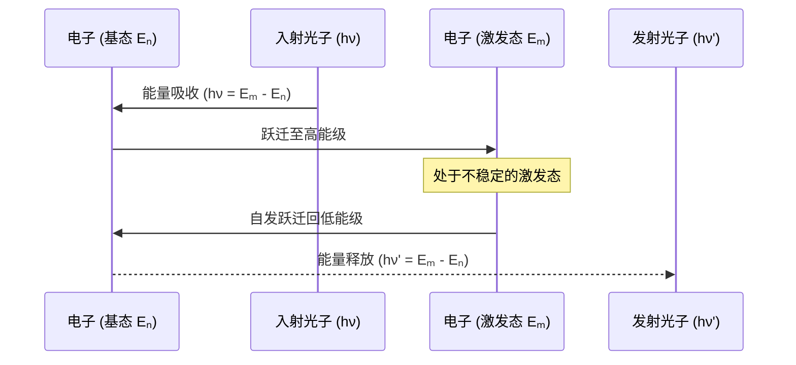

好的，作为一位资深的教育作者，我将为您撰写这段关于用量子力学构建氢原子的教学内容。

---

### 3.3 工具三：原子蓝图 —— 如何用量子力学构建氢原子？

在我们掌握了描述微观粒子行为的薛定谔方程这一强大工具后，是时候挑战一个奠基性的问题了：宇宙中最基本的结构单元——原子，究竟是如何稳定存在的？经典物理对此束手无策，而量子力学将在这里展现其惊人的解释力，为我们绘制出第一张精确的原子蓝图。

#### 案例分析：经典物理的“原子危机”

让我们先回到20世纪初。卢瑟福通过α粒子散射实验，提出了经典的原子“行星模型”：一个带正电的、致密的原子核位于中心，带负电的电子像行星一样围绕它旋转。这个模型直观易懂，但却隐藏着一个致命的缺陷。

> **经典电磁理论预言：** 一个做加速运动的带电粒子（比如绕核旋转的电子）会持续地向外辐射电磁波，从而损失能量。
>
> **推论：** 这意味着，电子的轨道半径会不断收缩，最终在不到一纳秒的时间内，以一条螺旋线坠入原子核。
>
> **结论：** 如果经典物理是正确的，那么宇宙中所有的原子都应该在瞬间湮灭。我们所知的一切物质，包括我们自己，都将不复存在。

这便是物理学史上著名的**“经典原子坍缩”**困境。现实世界是稳定的，这说明行星模型及其背后的经典物理定律，在原子尺度上必然是错误的。

#### 量子力学的“创世”之解：求解薛定谔方程

量子力学如何解决这个危机？答案是，它摒弃了电子“轨道”的概念，转而用薛定谔方程来描述电子的状态。对于氢原子（一个质子和一个电子），我们将描述质子与电子之间库仑引力的势能函数 $V(r) = -\frac{e^2}{4\pi\epsilon_0 r}$ 代入定态薛定谔方程中：

$$
-\frac{\hbar^2}{2m}\nabla^2\psi + V(r)\psi = E\psi
$$

解这个方程的数学过程相当复杂，但其结果却无比深刻和优美。方程的解（波函数 $\psi$）不再是连续的、任意的，而是**一系列离散的、稳定的、能量量子化的解**。

这意味着：

1.  **原子的稳定性：** 只有特定能量（**本征能量**）的状态才是被允许存在的。电子只能处于这些稳定的能级上，不会像经典电子那样持续辐射能量而导致坍缩。其中能量最低的状态被称为**基态**，原子在不受外界干扰时会稳定地处于此状态。
2.  **能量的量子化：** 这些允许存在的能量值不是连续的，而是像阶梯一样一级一级分开的，这就是**能级**。这些能级由一个关键的参数——**主量子数 n** (n=1, 2, 3, ...) 决定。n 越大，能量越高。

#### 告别行星轨道：原子轨道与电子云

那么，这些稳定的解在空间中是什么样子的呢？波函数的绝对值平方 $|\psi|^2$ 描述了在原子核周围某个位置找到电子的**概率密度**。它不再是一条线性的“轨道”，而是一片立体的“云”——我们称之为**原子轨道 (Atomic Orbital)** 或**电子云**。

每一个稳定的解都由一组三个量子数来唯一确定，它们共同描绘了电子云的特征：

| 量子数 | 名称 | 决定了... | 取值 |
| :--- | :--- | :--- | :--- |
| **n** | 主量子数 | 电子云的**主要能量**和**尺寸** | 1, 2, 3, ... (正整数) |
| **l** | 角量子数 | 电子云的**形状** | 0, 1, 2, ..., (n-1) |
| **m** | 磁量子数 | 电子云在空间中的**取向** | -l, -l+1, ..., 0, ..., l-1, l |

根据角量子数 `l` 的不同取值（通常用字母 s, p, d, f 代替 0, 1, 2, 3），我们得到了不同形状的原子轨道：

*   **s 轨道 (l=0):** 呈完美的**球形**对称。无论在哪个方向，找到电子的概率都一样。
*   **p 轨道 (l=1):** 呈**哑铃形**。电子主要分布在原子核两侧的两个瓣中。根据磁量子数 `m` 的不同（-1, 0, 1），p 轨道有三个相互垂直的取向（$p_x, p_y, p_z$）。
*   **d 轨道 (l=2):** 形状更为复杂，通常是**花瓣形**，有五个不同的空间取向。

这套由量子力学构建的原子模型，完美地解释了元素周期表中元素化学性质的周期性，为整个现代化学奠定了坚实的理论基础。

#### 光谱的“指纹”：理论与现实的握手

这套美丽的理论是否只是空中楼阁？不，它有坚实的实验证据——**原子光谱**。

当氢原子中的电子吸收一个特定能量的光子时，它会从一个低能级“跃迁”到一个高能级（激发态）。反之，当电子从高能级跃迁回低能级时，它会释放一个光子，光子的能量恰好等于这两个能级之间的能量差 $\Delta E = E_{高} - E_{低}$。

由于能级是量子化的、不连续的，因此原子吸收或释放的光子的能量也是不连续的，从而形成了**离散的、明暗相间的线状光谱**，而非连续的彩虹。每一条谱线都精确对应着一次电子在特定能级间的跃迁。

下面是原子吸收和发射光子的过程示意图：

氢原子光谱实验测得的谱线位置，与薛定谔方程计算出的能级差惊人地吻合。这是量子力学取得的第一次巨大成功，它不仅解决了经典物理的危机，更以前所未有的精度预测并解释了客观世界的现象。

---

#### **本节回顾**

*   **经典困境：** 经典物理的行星模型无法解释原子的稳定性，预言电子会因辐射能量而坠入原子核。
*   **量子方案：** 氢原子的薛定谔方程给出了一系列稳定、能量量子化的解，从根本上保证了原子的稳定存在。
*   **原子轨道：** 量子力学用概率分布的“电子云”（原子轨道）取代了经典的确定性轨道。原子轨道的能量、形状和空间取向由主量子数（n）、角量子数（l）和磁量子数（m）共同决定。
*   **实验证据：** 原子光谱中离散的谱线是电子在量子化能级之间跃迁的直接证据，完美验证了量子力学对原子结构的描述。