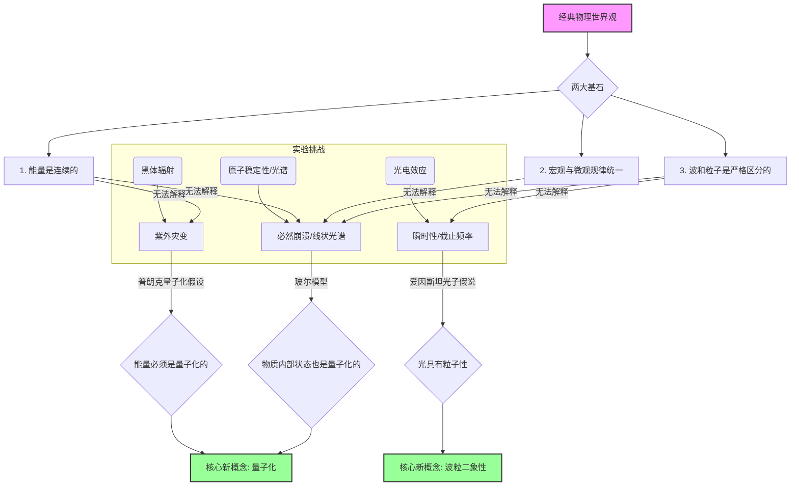

好的，我们承接上文，深入探讨经典物理大厦崩塌前的三大“乌云”。

---

### 1.1.1 案例研究：三朵无法驱散的“乌云”

我们已经知道，19世纪末的物理学晴空万里，但也飘浮着几朵令人不安的“乌云”。这并非无足轻重的小问题，而是直接挑战了经典物理学两大支柱——牛顿力学和麦克斯韦电磁学——的根本性难题。让我们逐一审视，看看经典物理的大厦是如何在其最坚固的基石上，开始出现深刻裂痕的。

#### **案例一：黑体辐射与“紫外灾变” (The Ultraviolet Catastrophe)**

想象一个完美的吸热和放热体，物理学家称之为“黑体”。当你加热它时，它会发光，从暗红到橙黄再到耀眼的蓝白，其发出的电磁波（光）的能量如何按频率（或颜色）分布呢？

- **经典物理的预言**：
  基于经典热力学和电磁学，瑞利（Rayleigh）和金斯（Jeans）推导出了一个公式，即**瑞利-金斯定律**。该定律认为，一个热平衡状态下的空腔，其内部电磁波的能量应该在所有可能的振动模式中“平均分配”。这个理论在低频区域与实验数据吻合得相当好。

- **灾难性的失败**：
  然而，当频率升高到紫外区域时，这个公式的预言变得荒谬绝伦。它预测，随着频率的无限增高，辐射的能量密度也将无限增大。
  $$
  u(\nu, T) \propto \nu^2 T
  $$
  这意味着，任何有温度的物体——你的身体、一个茶杯、燃烧的壁炉——都应该释放出无穷大的能量，主要集中在紫外线、X射线甚至伽马射线波段。这显然与事实完全不符，我们并没有被日常物品的辐射摧毁。这个理论与实验的尖锐矛盾，被埃伦费斯特（Paul Ehrenfest）形象地称为**“紫外灾变”**。

- **普朗克的革命性“补丁”**：
  1900年，马克斯·普朗克（Max Planck）提出了一个大胆到近乎“离经叛道”的假设来解决这个难题。他主张，能量的交换并不是连续不断的，而是一份一份地进行的，每一份能量被称为一个“量子”（quantum）。能量的最小单位与辐射频率成正比：
  $$
  E = h\nu
  $$
  其中，$h$ 是一个极小的常数，后来被称为普朗克常数。

  **核心思想**：高频率的光子能量“价格”太高（$E$ 很大），在特定温度下，系统“买不起”太多这样的高能光子，因此高频区域的能量辐射被自然抑制了。这个看似简单的能量量子化假设，完美地解释了整个黑体辐射谱，宣告了量子概念的诞生。

---

#### **案例二：光电效应与光的“人格分裂”**

当特定频率的光照射到金属表面时，会激发出电子，这种现象称为光电效应。这听起来很简单，但实验结果却让经典电磁理论束手无策。

- **经典电磁理论的困惑**：
  经典理论将光看作一种连续的电磁波。能量均匀地分布在波阵面上。基于此，它会做出如下预测，而这些预测与实验事实完全相悖。

| 实验现象 | 经典波动理论的预测 | 实际观测结果 |
| :--- | :--- | :--- |
| **瞬时性** | 光的能量需要时间累积，弱光照射下，电子逸出应有明显延迟。 | 无论光多弱，只要频率合适，电子几乎是瞬间（< $10^{-9}$s）就被激发出来。 |
| **截止频率** | 任何频率的光，只要强度足够大、照射时间足够长，都能让电子获得足够能量逸出。 | 存在一个“截止频率” $\nu_0$。低于此频率的光，无论多强，都无法打出电子。 |
| **动能与强度** | 光的强度越强，传递给电子的能量越多，逸出电子的动能应该越大。 | 电子的最大动能只与光的**频率**有关，与强度无关。强度只影响逸出电子的数量。 |

- **爱因斯坦的光子假说**：
  1905年，爱因斯坦（Albert Einstein）在普朗克工作的基础上更进一步，他提出：光的量子化不仅发生在能量交换过程中，光本身就是由一个个不连续的、集中的能量粒子组成的，这些粒子后来被称为**“光子”（photon）**。

  每个光子的能量为 $E = h\nu$。当一个光子与金属中的一个电子发生“一对一”的碰撞时，它会把全部能量交给这个电子。由此，所有难题迎刃而解：
  1.  **解释瞬时性**：碰撞是瞬间的，不需要能量累积。
  2.  **解释截止频率**：电子逸出需要克服金属的“逸出功” $W$。只有当光子的能量 $h\nu$ 大于或等于 $W$ 时，电子才能被打出。$h\nu_0 = W$ 定义了截止频率。
  3.  **解释动能关系**：电子获得能量后，一部分用于克服逸出功，剩下的就成为它的动能。这完美地解释了光电效应方程：$K_{max} = h\nu - W$。

光的波动性（如干涉、衍射）早已被证实，而光电效应则无可辩驳地揭示了它的粒子性。光，究竟是波还是粒子？这个“波粒二象性”的幽灵，是经典物理世界观中从未有过的概念。

---

#### **案例三：原子光谱与“必然崩溃”的原子**

到了20世纪初，卢瑟福（Ernest Rutherford）通过α粒子散射实验，建立了原子的“行星模型”：一个带正电的、致密的原子核位于中心，电子像行星一样围绕它旋转。这个模型取得了巨大成功，但也埋下了一个致命的隐患。

- **经典模型的“死亡螺旋”**：
  根据麦克斯韦电磁理论，一个做加速运动的带电粒子（比如绕核旋转的电子）必须向外辐射电磁波，从而损失能量。
  
  这意味着：
  1.  **原子不应该稳定**：电子会因为能量损失，沿着一条螺旋线轨道，在极短的时间内（约 $10^{-11}$ 秒）坠入原子核。现实世界中的原子却是异常稳定的。
  2.  **光谱不应该是线状的**：随着电子螺旋式坠落，其轨道频率连续变化，它辐射出的光的频率也应该是连续的，形成一片连续的光谱。而实验观测到的原子光谱，是由一系列明锐的、分立的**谱线**组成的。

- **玻尔的“不讲理”量子化条件**：
  1913年，尼尔斯·玻尔（Niels Bohr）将量子思想引入原子模型。他提出了几条革命性的假设，直接与经典理论对抗：
  1.  电子只能在某些特定的“定态轨道”上运动，在这些轨道上，电子不辐射能量，因此原子是稳定的。
  2.  这些轨道的角动量 $L$ 必须是 $\hbar$（$h/2\pi$）的整数倍，即 $L = n\hbar$。这是一个纯粹的量子化条件。
  3.  当电子从一个高能级轨道 $E_n$ 跃迁到低能级轨道 $E_m$ 时，会辐射出一个光子，光子的能量等于两个能级的能量差：$h\nu = E_n - E_m$。

玻尔的模型虽然仍有缺陷（它无法解释更复杂的原子光谱，且其假设本身缺乏更深层的理论基础），但它成功地解释了氢原子光谱的规律，并首次将**能量量子化**的概念引入了物质结构本身，暗示着微观粒子的运动规律需要一套全新的物理学来描述。

### **核心矛盾总结：新旧世界的根本分歧**

通过以上三个案例，我们可以看到经典物理的失效并非偶然，而是源于其底层世界观与微观现实的根本冲突。我们可以用一个流程图来归纳这场思想革命的起点：

**要点回顾**

*   **经典物理的失败**：并非是计算上的不精确，而是在基本概念上的彻底失败。它无法解释黑体辐射的能量分布、光电效应的瞬时行为以及原子的稳定性和线状光谱。
*   **两大革命性概念的萌芽**：
    1.  **能量量子化**：能量的吸收和释放不是连续的，而是以 $h\nu$ 为单位一份一份地进行。这一概念是解决黑体辐射和原子光谱问题的关键。
    2.  **波粒二象性**：微观客体（如此处的光）同时展现出波动和粒子的双重属性，这是经典物理框架完全无法容纳的。
*   **学习的必要性**：面对这些无法调和的矛盾，物理学家们意识到，必须放弃或修正那些在宏观世界里看似天经地义的物理直觉，构建一套全新的、能够描述微观世界奇异行为的理论体系。这，就是我们即将踏上的量子力学之旅。