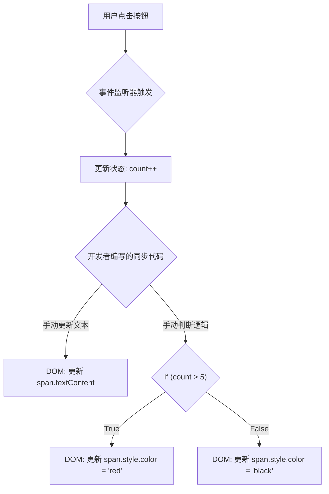

好的，我们紧接 “1.1.1 起点：传统UI开发的困境” 这一主题，开始我们的探索。

---

为了更具体地理解这个困境，让我们抛开任何现代框架，用最原始的 JavaScript (Vanilla JS) 来实现一个我们日常开发中随处可见的功能：一个简单的计数器。

### 一个具体的例子：手动实现计数器

假设我们的需求非常简单：

1.  页面上显示一个数字，初始值为 0。
2.  有一个“+1”按钮，每次点击，数字加一。
3.  为了增加一点复杂度，当数字大于 5 时，数字的颜色变为红色以示警示。

听起来很简单，对吗？让我们用传统的方式来实现它。

#### Code Example: Vanilla JS 计数器

首先，是我们的 HTML 结构：

```html
<!-- index.html -->
<div id="app">
  <h1>传统DOM操作实例</h1>
  <p>
    当前计数：<span id="counter-display">0</span>
  </p>
  <button id="add-btn">+1</button>
</div>
```

接着，是控制这一切的 JavaScript 逻辑：

```javascript
// script.js

// 1. 初始化状态（State）
let count = 0;

// 2. 获取所有需要操作的DOM节点
const counterDisplay = document.getElementById('counter-display');
const addButton = document.getElementById('add-btn');

// 3. 设置初始UI状态
// 确保UI一加载就和我们的状态是同步的
counterDisplay.textContent = count;
counterDisplay.style.color = 'black'; // 初始颜色

// 4. 监听用户事件，并在事件回调中处理所有逻辑
addButton.addEventListener('click', () => {
  // 4.1 更新数据状态
  count++;

  // 4.2 手动将状态同步到UI -> 命令浏览器“怎么做”
  // 更新文本内容
  counterDisplay.textContent = count;

  // 4.3 根据新状态，计算并应用新的UI样式
  if (count > 5) {
    counterDisplay.style.color = 'red';
  } else {
    // 注意：我们必须处理所有分支！如果数字降回5以下，颜色要变回来
    counterDisplay.style.color = 'black';
  }
});
```

这个例子完美地运行着，但恰恰是它这种“完美运行”的表象下，隐藏着传统UI开发的根本性难题。

### 困境浮现：当“怎么做”盖过“是什么”

上面的代码虽然简短，却暴露了几个核心问题，当应用规模扩大时，这些问题会被指数级放大。

#### 1. 手动DOM操作：命令式的“配方”

在 `addEventListener` 的回调函数中，我们编写了一系列指令：

*   “找到 `counter-display` 元素。”
*   “把它的 `textContent` 设置为新的 `count` 值。”
*   “检查 `count` 是否大于 5。”
*   “如果是，把它的颜色设置为红色。”
*   “如果不是，把它的颜色设置回黑色。”

这种编码方式被称为**命令式编程 (Imperative Programming)**。我们像一个厨师在写菜谱，鉅细靡遗地告诉浏览器**如何一步一步地**（How）去更新UI。我们关心的是“怎么做”。

#### 2. 状态与视图的纠缠

我们的核心数据 `count` 是一个纯粹的 JavaScript 变量，我们称之为**状态 (State)**。而页面上展示给用户的界面，我们称之为**视图 (View)**。在上面的例子里，`State` 和 `View` 被我们的代码紧紧地“粘”在了一起。

每当状态 `count` 发生变化，我们都必须作为开发者，**手动编写**代码去维护视图的正确性。这导致了状态逻辑与视图操作逻辑的深度耦合。

我们可以用一个流程图来描绘这个过程：



这张图清晰地揭示了，从状态变更（C）到视图更新（E, G, H），中间必须经过一个由开发者全权负责的、手动的、过程式的“同步代码”（D, F）环节。这是整个流程中最脆弱、最容易出错的部分。

#### 3. 不可预测的复杂性

现在，让我们稍微扩展一下需求：

*   增加一个“-1”按钮。
*   增加一个“重置”按钮。
*   当数字为负数时，颜色变为蓝色。
*   当另一个不相关的操作完成时（例如，一个异步请求成功），也需要将计数器重置为0。

每增加一个功能，我们就需要回到所有可能影响 `count` 的地方，小心翼翼地增加或修改对应的DOM操作代码，并确保覆盖所有 `if/else` 分支。万一忘记在“重置”逻辑里把颜色改回黑色，一个微小但恼人的 Bug 就诞生了。

随着应用逻辑的增加，开发者需要维护的“状态-视图”同步路径会呈爆炸式增长，心智负担急剧加重，代码变得难以维护和预测。我们最终会把大量精力耗费在追踪状态和手动操作DOM上，而不是业务逻辑本身。

### 小结：我们真正面临的问题

通过这个简单的计数器，我们触及了传统UI开发的痛点，它们并非由JavaScript语言本身造成，而是源于一种开发范式：

*   **过程导向**：我们被迫详细描述“如何”更新UI的每一步，而不是声明式地描述“在某个状态下，UI应该是什么样”。
*   **状态与视图的强耦合**：数据状态与UI操作逻辑混杂在一起，牵一发而动全身。
*   **高昂的维护成本**：随着功能的迭代，保持状态与视图的同步变得越来越复杂和不可靠。

这正是 React 试图解决的核心问题。它将引导我们从繁琐的“怎么做”，转向优雅的“是什么”。在下一节中，我们将初步领略 React 是如何实现这一思维转变的。