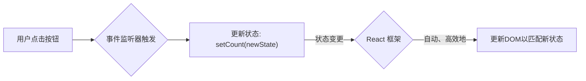

好的，我们已经深入剖析了传统UI开发的困境，问题的核心直指**命令式**的思维方式。现在，让我们翻开新的一页，看看React是如何通过**声明式编程**，将我们从繁琐的DOM操作中解放出来的。

---

### 1.1.2 范式转移：React的声明式编程思想

上一节，我们亲身体会了命令式编程带来的心智负担。我们必须像一个微观管理者，精确地指挥浏览器更新UI的每一个步骤。现在，让我们看看 React 是如何用一种截然不同的哲学——声明式编程——来解决这个问题的。

#### 什么是声明式编程？

如果说命令式编程是提供一份详尽的“操作说明书”（**How**），那么声明式编程就是提交一份清晰的“最终蓝图”（**What**）。

让我们用一个生活中的例子来类比：

*   **命令式 (Imperative)**：你想喝一杯拿铁。你走进咖啡店，对咖啡师说：“请拿起咖啡豆，研磨18克，用92度的水萃取25秒得到浓缩咖啡，然后将牛奶打发至65度，最后将奶泡以某种方式倒入浓缩咖啡中。” 你在描述**制作过程**。

*   **声明式 (Declarative)**：你走进同一家咖啡店，对咖啡师说：“请给我来一杯拿-铁。” 你只描述了你**想要的结果**。至于咖啡师内部如何研磨、萃取、打发，你完全不关心。

React 就扮演着这位专业“咖啡师”的角色。作为开发者，我们只需要告诉 React：“嘿，基于当前的数据状态，我的界面**应该长成这个样子**。” 当数据变化时，我们再次告诉它：“哦，现在数据变了，我的界面**应该更新成那个样子**。”

至于如何从“这个样子”最高效地转变为“那个样子”——那些繁琐的DOM查找、属性设置、样式修改——全部由 React 在幕后为我们处理。

#### Comparison: 用 React 重写计数器

让我们用 React 的方式，重新实现上一节那个完全相同的计数器功能。这将是最直观的对比。

> **前置说明**：你现在可能还不熟悉下面的所有语法（例如 `useState`, `=>` 后的括号），请暂时不必担心。这里的核心是让你感受思维模式的差异，所有语法细节我们都会在后续章节中详细拆解。

##### Code Example: React 计数器

```jsx
import React, { useState } from 'react';

function Counter() {
  // 1. 使用 useState Hook 来声明一个状态变量 `count`
  //    React 会自动“记住”它的值
  const [count, setCount] = useState(0);

  // 2. 编写事件处理函数，它的唯一职责是“更新状态”
  const handleAddClick = () => {
    // 我们只告诉React：“请把count更新为 count + 1”
    // 我们完全不关心DOM要怎么变
    setCount(count + 1);
  };

  // 3. 声明UI的“蓝图” (JSX)
  //    这是一个描述：UI “是什么”，而不是“怎么做”
  return (
    <div>
      <h1>React 声明式实例</h1>
      <p>
        当前计数：
        {/*
          直接将状态和UI展现绑定。
          当 count > 5 时，颜色就是 'red'，否则就是 'black'。
          这是一个“描述”，不是一个“操作步骤”。
        */}
        <span style={{ color: count > 5 ? 'red' : 'black' }}>
          {count}
        </span>
      </p>
      <button onClick={handleAddClick}>+1</button>
    </div>
  );
}
```

#### 思维的转变：从“过程”到“状态驱动”

让我们将这两段代码并排比较，看看发生了什么根本性的变化：

1.  **不再有手动DOM操作**：在 React 的代码中，你找不到任何 `document.getElementById` 或 `textContent = ...`、`style.color = ...` 这样的语句。我们彻底告别了直接操作 DOM。

2.  **关注点分离**：
    *   **事件处理器 (`handleAddClick`)** 的职责变得极其单一：它只负责**更新状态** (`setCount(count + 1)`)。它不关心UI，也不应该关心。
    *   **视图 (`return` 的部分)** 的职责同样单一：它只负责**描述UI**。它像一个模板或一个函数，输入是当前的状态（`count`），输出是UI的结构。`count` 是多少，文本就是多少；`count` 是否大于5，颜色就相应地是什么。

3.  **从“同步”到“响应”**：在 Vanilla JS 的例子里，我们是在事件回调中**主动去同步**UI。而在 React 中，我们只是更新了状态，UI 会**被动地响应**这个变化。React 监测到状态变更后，会自动、高效地为我们重新渲染界面，并计算出最小的DOM改动。

我们可以用一个新的流程图来描绘 React 的工作模式：



对比上一节的流程图，你会发现那个最脆弱、最需要开发者手动维护的“同步代码”环节消失了，取而代之的是一个强大而可靠的 **React 框架**。我们从UI更新的“执行者”变成了“决策者”，只负责定义规则，不参与具体执行。

### 本节小结

通过 React 的声明式编程思想，我们实现了关键的范式转移：

1.  **关注点分离**：我们将“如何更新UI”的复杂过程，简化为“UI应该是什么样”的清晰描述。
2.  **状态驱动视图**：UI 成为了状态的直接映射（`UI = f(State)`)。我们不再需要编写脆弱的“胶水代码”来手动同步它们。只要状态是正确的，UI就一定是正确的。
3.  **可预测性增强**：代码逻辑变得更加简单和集中。当出现问题时，我们只需关注状态的管理和UI的声明是否正确，而无需去追踪一系列复杂的DOM操作调用链。

这种“只关心是什么，不关心怎么做”的思维模式，是 React 送给开发者的第一份，也是最宝贵的一份礼物。它将是我们后续学习所有 React 概念和模式的基石。