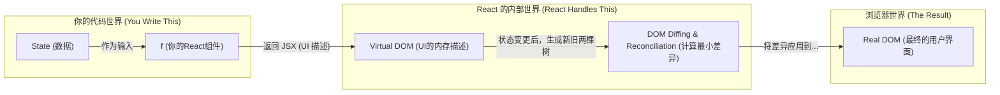

好的，我们已经将传统命令式编程与 React 的声明式编程进行了直观的对比。现在，让我们将这种强大的新思维模式提炼、升华为一个简洁而深刻的公式，它将成为你整个 React 学习旅程中的指路明灯。

---

### 1.1.3 核心公式：UI = f(State)

在上一节的结尾，我们得出了一个关键结论：在 React 中，UI 成为了状态的直接映射。这个关系可以被一个极其优美的公式所概括：

**`UI = f(State)`**

这个公式看似简单，却蕴含了 React 设计哲学的核心。它不是一句口号，而是我们构建 React 应用时必须时刻遵守的根本法则。让我们来逐一拆解这个公式的每一个部分，理解其背后的深意。

#### State：万物之源，唯一真相

这里的 **State**，正如我们之前所见，代表了驱动应用运行的所有数据。它可以是：

*   计数器中的数字 `count`。
*   一个表单中用户输入的文字。
*   一个待办事项列表的数组。
*   一个表示加载状态的布尔值 `isLoading`。
*   从服务器获取的用户信息对象。

在 React 的世界里，**State 是“唯一真相之源” (Single Source of Truth)**。任何时刻，你的应用界面应该是什么样子，都**唯一**地由当前的 State 决定。你不需要再关心界面之前是什么状态，也不需要关心它是如何从旧状态变过来的。你只需要关心一件事：**现在的 State 是什么？**

#### f：从数据到视图的“渲染函数”

这里的 **f** 代表一个**函数 (Function)**，一个纯粹的转换过程。它的作用是接收 `State` 作为输入，然后输出对应的 `UI` 描述。

在 React 中，这个 `f` 就是你的**组件 (Component)**。

无论是我们后面会学到的函数组件还是类组件，其核心职责都是扮演这个 `f` 的角色。它像一个精密的“渲染机器”：

*   **输入 (Input)**：当前的状态 `State` (以及从父组件传入的 `props`，我们稍后会讲)。
*   **处理 (Process)**：组件内部的逻辑，最终返回一段描述 UI 结构的 JSX 代码。
*   **输出 (Output)**：一个 UI 的“蓝图”或“声明”。

这个函数 `f` 具有一个至关重要的特性，我们称之为**幂等性 (Idempotence)**，或者更通俗地讲，就是**可预测性**：只要输入的 `State` 不变，无论你调用这个函数多少次，它返回的 UI 描述永远是相同的。

#### UI：状态的可视化快照

这里的 **UI**，即用户界面，是 `f(State)` 计算的结果。它不是指真实的、已经被渲染到浏览器中的 DOM 元素，而是一个**对 DOM 的轻量级描述**。在 React 的语境下，这通常就是我们编写的 JSX。

React 会根据你返回的这份 UI “蓝图”，智能地将其转换为真实的 DOM 节点，并呈现在用户面前。

#### 流程图：数据如何“流动”成视图

这个公式本质上定义了一个清晰的、单向的数据流。



这张图清晰地展示了你的职责范围：你只需要**定义好 State**，并**实现好组件这个 `f` 函数**，将 State 映射为 UI 描述。剩下的从“描述”到“真实DOM”的繁琐、复杂的转换工作，React 会帮你处理得又快又好。

---

> #### 常见误区：在 React 中“走回头路”
>
> ⚠️ **警告：** 初学者，尤其是之前有 jQuery 或原生 JS 开发经验的开发者，最容易犯的错误就是试图绕过 `UI = f(State)` 的模式，在 React 组件内部直接操作 DOM。
>
> **错误示例：**
> ```jsx
> function MyComponent() {
>   const [count, setCount] = useState(0);
> 
>   const handleClick = () => {
>     const newCount = count + 1;
>     setCount(newCount);
>     // 错误！试图手动同步UI
>     document.getElementById('my-text').innerText = `手动更新：${newCount}`;
>   };
> 
>   return (
>     <div>
>       <p id="my-text">计数：{count}</p>
>       <button onClick={handleClick}>点击</button>
>     </div>
>   );
> }
> ```
>
> **为什么这是错误的？**
>
> 1.  **破坏了唯一真相之源**：现在 UI 的来源有两个了，一个是 React 根据 `state` 渲染的结果，另一个是你手动修改的结果。这会导致状态与视图不一致，产生各种诡异的 Bug。
> 2.  **React 会覆盖你的修改**：当组件因为其他原因（例如父组件更新）需要重新渲染时，React 会再次执行 `f(State)`，用 `state` 中存储的 `count` 值重新生成 `<p>` 标签，你手动的修改会瞬间消失。
>
> **正确的心智模型**：永远不要直接操作由 React 渲染的 DOM。你应该**只通过更新 State**，然后信任 React 会根据新的 State 高效地更新 UI。

---

### 本节小结

`UI = f(State)` 不仅仅是一个公式，它是一种思维方式的革命，是 React 心法的核心。

1.  **确定性与可预测性**：它保证了只要 State 确定，UI 就唯一确定。这让应用的逻辑变得清晰，调试也变得异常简单——UI 显示不正确？那一定是你的 State 错了，或者你的 `f` 函数逻辑有问题，而不是去大海捞针般地追踪某个 DOM 操作。
2.  **数据驱动**：我们的工作重心从“如何一步步修改界面”转变成了“如何管理好应用的状态”。我们不再是界面的“建筑工人”，而是蓝图的“设计师”。
3.  **基石**：后续我们将学习的所有 React 概念，如 `props`、生命周期、Hooks、Context 等，都是为了更好地组织和管理我们的 `State` 和 `f`，从而更优雅、更高效地践行 `UI = f(State)` 这一核心法则。

理解并内化这个公式，是学好 React 的第一步，也是最重要的一步。从现在开始，请在编写每一行 React 代码时，都问问自己：我的 State 设计好了吗？我的组件 `f` 是否正确地将 State 映射为了 UI？