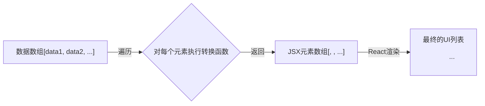

好的，作为一位资深的技术教育作者，我将为你撰写这篇关于React中数组方法的教学段落。

---

### 1.2.4 工具三：map/filter等数组方法——从数据到UI的桥梁

在上一节，我们掌握了使用JSX声明式地描述UI结构。但静态的UI远不能满足应用需求，我们更常遇到的场景是根据一组动态数据来渲染一个列表，例如商品列表、新闻提要或用户评论区。如果手动为每一个数据项编写JSX，代码会变得冗长、重复且难以维护。

```jsx
// 想象一下，如果我们有100条评论，难道要手动写100个<li>吗？
<ul>
  <li>评论一：React真棒！</li>
  <li>评论二：JSX让代码更直观了。</li>
  <li>评论三：函数式组件是趋势。</li>
  {/* ... 还有97条 ... */}
</ul>
```

这显然是不可行的。幸运的是，现代JavaScript为我们提供了强大的数组方法，它们正是连接“数据”与“UI”的完美桥梁。在React开发中，`map()` 方法尤其扮演着核心角色。

#### `map()`：数据到视图的映射魔法

`Array.prototype.map()` 方法的核心思想是：**对数组中的每一个元素执行一个函数，然后将每次函数调用的返回结果汇集起来，创建一个全新的数组**。

它不会改变原始数组，这与React推崇的“不可变性（Immutability）”原则不谋而合。

在React中，这个“函数”通常返回一个JSX元素。因此，`map` 的转换流程就变成了：



**code_example: 基础用法**

让我们来看一个最简单的例子。假设我们有一个包含用户名的数组，需要将它们渲染成一个无序列表。

```jsx
// 我们的数据源
const users = ['Alice', 'Bob', 'Charlie'];

function UserList() {
  return (
    <ul>
      {/* 
        在JSX中，花括号 {} 内可以嵌入JavaScript表达式。
        users.map(...) 就是一个返回JSX元素数组的表达式。
      */}
      {users.map(user => (
        // 对于数组中的每个user，我们都返回一个<li>元素
        // React会接收这个<li>数组并将其渲染到DOM中
        <li>{user}</li>
      ))}
    </ul>
  );
}

// 最终渲染出的HTML:
// <ul>
//   <li>Alice</li>
//   <li>Bob</li>
//   <li>Charlie</li>
// </ul>
```

**关键知识点：`key` 属性**

你会注意到，当在控制台中运行类似上面的代码时，React会给出一个警告，提示“Each child in a list should have a unique 'key' prop.”。

`key` 是一个特殊的字符串或数字属性，你需要将其添加到由 `map` 生成的元素上。

*   **为什么需要 `key`？** React使用 `key` 来识别列表中的哪些项发生了变化、被添加或被删除。这使得React在更新UI时能更高效地重用和重新排序现有元素，而不是完全重新渲染它们。
*   **如何选择 `key`？** `key` 在其兄弟节点中必须是**唯一且稳定**的。
    *   **最佳选择**：使用数据项中独一无二的ID，例如数据库中的 `post.id`。
    *   **应避免的选择**：使用数组的索引 `index` 作为 `key`。当列表的顺序会发生改变（如新增、删除、排序）时，使用 `index` 会导致严重的性能问题和潜在的UI状态混乱。

**case_study: 渲染一个产品列表组件**

现在，让我们看一个更贴近实践的例子。我们有一个产品对象数组，需要渲染一个包含产品名称和价格的列表。

```jsx
import React from 'react';

// 数据通常来自API，这里我们先硬编码
const products = [
  { id: 'p001', name: 'React入门指南', price: 99 },
  { id: 'p002', name: 'JavaScript高级程序设计', price: 128 },
  { id: 'p003', name: 'CSS世界', price: 89 },
];

function ProductList() {
  return (
    <div>
      <h2>热门商品</h2>
      <ul>
        {products.map(product => (
          <li key={product.id}> {/* 使用稳定的 product.id 作为 key */}
            <span>{product.name}</span> - <span>¥{product.price}</span>
          </li>
        ))}
      </ul>
    </div>
  );
}

export default ProductList;
```

在这个案例中，`products.map(...)` 将一个产品对象数组 `[{...}, {...}]` 转换为了一个JSX `<li>` 元素数组 `[<li key="...">...</li>, <li key="...">...</li>]`。React随后高效地将这个JSX数组渲染为最终的HTML列表。这就是React中“数据驱动视图”思想的经典体现。

#### `filter()`：在渲染前筛选数据

有时我们并不需要渲染全部数据，而是只展示符合特定条件的部分。这时，`filter()` 方法就派上用场了。`filter()` 会创建一个新数组，其中包含所有通过了由提供的函数实现的测试的元素。

最常见的模式是**先 `filter()` 筛选，再 `map()` 渲染**。

**code_example: 渲染价格低于100元的商品**

延续上面的例子，如果我们只想显示价格低于100元的商品：

```jsx
// ... ProductList 组件内部 ...
function ProductList() {
  // 假设 products 数据和之前一样
  const affordableProducts = products.filter(product => product.price < 100);

  return (
    <div>
      <h2>特价商品 (低于¥100)</h2>
      <ul>
        {affordableProducts.map(product => (
          <li key={product.id}>
            <span>{product.name}</span> - <span>¥{product.price}</span>
          </li>
        ))}
      </ul>
    </div>
  );
}

// 或者更简洁的链式调用
function ProductListConcise() {
  return (
    <div>
      <h2>特价商品 (低于¥100)</h2>
      <ul>
        {products
          .filter(product => product.price < 100) // 第一步：筛选出符合条件的商品
          .map(product => ( // 第二步：将筛选后的结果映射为JSX元素
            <li key={product.id}>
              <span>{product.name}</span> - <span>¥{product.price}</span>
            </li>
          ))
        }
      </ul>
    </div>
  );
}
```

链式调用 `filter().map()` 是一个极其强大且常用的模式，它清晰地表达了“先筛选数据，再转换成UI”的意图。

---

#### 本节要点回顾

*   **数据驱动UI**：在React中，UI是数据状态的直接反映。数组方法是实现这一理念的关键工具。
*   **`map()` 是核心**：`map()` 方法是将数据数组转换为JSX元素数组（UI列表）的标准做法。
*   **`key` 至关重要**：为 `map()` 生成的每个列表项提供一个唯一且稳定的 `key` 属性，是保证React高效更新和避免渲染问题的必要条件。请优先使用数据自身的ID。
*   **组合使用**：通过链式调用 `filter().map()` 等方法，可以优雅地实现复杂的逻辑，如筛选、排序后再进行渲染，让代码保持声明式和高可读性。

掌握了这些数组方法，你就掌握了在React中动态生成内容的“点金术”，能够自如地将任何数据结构转化为丰富的用户界面。