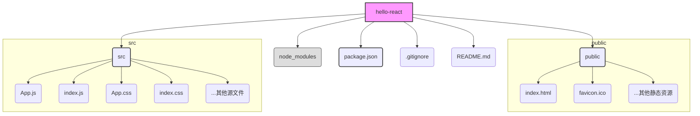

好的，我将紧接之前的上下文，续写 **1.3.3 项目结构导览** 的内容。我会保持风格和叙事的连贯性，并采纳建议，使用 Mermaid 图表来增强理解。

---

### 1.3.3 项目结构导览

我们已经成功启动了项目，看到了那个令人激动的旋转Logo。但这个页面究竟是如何被渲染出来的？Create React App (CRA) 自动生成的那些文件和文件夹，它们各自又扮演着什么角色呢？

现在，让我们像侦探一样，打开 `hello-react` 文件夹，一探究竟。理解项目结构是至关重要的第一步，它就像是拿到了一张城市地图，能让你在后续的开发中清晰地知道该去哪里修改、哪里添加新功能。

#### 整体结构概览

首先，让我们用代码编辑器（推荐使用 Visual Studio Code）打开 `hello-react` 文件夹。你会看到一个类似这样的结构。为了更直观，我们用一张图来展示核心的目录和文件：



看起来文件不少，但别担心，我们只需要重点关注其中几个“关键人物”。我们将它们分为三大部分来逐一介绍：**项目配置**、**公共资源区 (`public`)** 和 **核心代码区 (`src`)**。

#### 1. 项目的“身份证”与“仓库”

这些是位于项目根目录下的核心配置文件。

*   **`package.json`**: **（极其重要）**
    这可以说是项目的“身份证”或“项目清单”。它是一个JSON格式的文件，记录了项目的各种元信息：
    *   `name`: 项目名称。
    *   `version`: 项目版本号。
    *   `dependencies`: **项目运行依赖**。这里列出了你的应用在生产环境中正常工作所必需的包，比如 `react` 和 `react-dom`。当你运行 `npm install <package-name>` 时，这个包就会被添加到这里。
    *   `devDependencies`: **项目开发依赖**。这里列出的是只在开发过程中需要的包，比如测试工具、代码格式化工具等。它们不会被打包到最终的线上代码中。
    *   `scripts`: **可执行脚本命令**。还记得我们运行的 `npm start` 吗？这个命令就定义在这里。它告诉`npm`，当执行`start`时，实际上是去运行 `react-scripts start`。我们后续的构建、测试等命令也都定义于此。

*   **`node_modules/`**: **（自动管理，切勿手动修改）**
    这是项目的“本地仓库”。所有在 `package.json` 中声明的依赖（无论是 `dependencies` 还是 `devDependencies`），通过`npm install`命令下载后，都会被存放在这个文件夹里。这个文件夹通常非常庞大，但你完全不需要关心它的内部结构。**请记住两条黄金法则：永远不要手动修改 `node_modules` 里的任何内容，也永远不要将它提交到Git等版本控制系统中。**

*   **`.gitignore`**:
    这是一个专门给版本控制工具Git看的文件，它告诉Git哪些文件或文件夹是不需要被追踪和提交的。打开它，你会发现 `node_modules` 就在第一行，这正是我们不提交它的原因。

#### 2. 公共资源区：`public` 文件夹

这个文件夹是应用的“静态资源展厅”。存放在这里的文件不会被Webpack进行复杂的编译处理，它们会几乎原封不动地被复制到最终的构建产物中。

*   **`index.html`**: **（应用的入口外壳）**
    这是我们整个单页面应用（SPA）的**唯一**的HTML页面，可以把它想象成一个“空壳子”或“舞台”。打开这个文件，你会发现它的 `<body>` 标签里几乎是空的，只有一个关键的 `<div>`：
    ```html
    <div id="root"></div>
    ```
    这个 `<div id="root"></div>` 就是我们整个React应用的“挂载点”。之后，React会通过JavaScript动态地将我们写的所有组件内容，全部渲染到这个div内部。

*   `favicon.ico`, `logo192.png` 等:
    这些是网站的图标文件，显示在浏览器的标签页上。你可以用自己设计的图标替换它们。

#### 3. 核心代码区：`src` (Source) 文件夹

**这里是你的主战场，99%的开发工作都将在这里进行。** `src` 文件夹存放着项目的所有JavaScript代码、CSS样式、图片等源文件。

*   **`index.js`**: **（React的“点火器”）**
    这是整个React应用的**JavaScript入口文件**。它的职责非常专一且关键：找到 `public/index.html` 中的那个 `<div id="root"></div>` 挂载点，然后告诉React：“把我们的主组件渲染到那个地方去！”
    它的核心代码看起来像这样（新版CRA）：
    ```javascript
    import React from 'react';
    import ReactDOM from 'react-dom/client';
    import './index.css';
    import App from './App';

    const root = ReactDOM.createRoot(document.getElementById('root'));
    root.render(
      <React.StrictMode>
        <App />
      </React.StrictMode>
    );
    ```
    这段代码的逻辑很清晰：`document.getElementById('root')` 找到了HTML里的挂载点，然后 `root.render(<App />)` 将我们最顶层的 `App` 组件渲染了进去。

*   **`App.js`**: **（你的第一个React组件）**
    这是项目的**根组件**。我们在浏览器里看到的旋转Logo、文字和链接，其内容就是在这个文件里定义的。它是一个标准的React组件，也是我们接下来要开始动手修改的第一个文件。

*   `App.css` 和 `index.css`:
    这两个是CSS样式文件，分别对应 `App.js` 组件的样式和一些全局样式。

#### 核心流程回顾

现在，让我们把所有线索串联起来，理清应用的启动流程：
1.  你运行 `npm start`，开发服务器启动。
2.  浏览器访问 `http://localhost:3000`，服务器首先返回 `public/index.html` 文件。
3.  浏览器解析 `index.html`，发现它需要加载一个JavaScript文件（由CRA自动注入）。
4.  JavaScript开始执行，入口是 `src/index.js`。
5.  `src/index.js` 中的代码找到 `index.html` 里的 `<div id="root"></div>`。
6.  `src/index.js` 将 `src/App.js` 中定义的 `<App />` 组件渲染到这个 `div` 中。
7.  最终，用户在浏览器上看到了 `App.js` 所描绘的界面。

---

#### 小结与准备清单

通过这次“侦查”，我们已经成功绘制出了项目的地图。这张地图将指引我们未来的开发之旅。

*   [x] **理解**：掌握了 `package.json` 是项目配置中心，`node_modules` 是依赖仓库。
*   [x] **区分**：明确了 `public` 文件夹用于存放 `index.html` 等静态资源，而 `src` 文件夹是我们编写React代码的核心区域。
*   [x] **掌握核心关联**：知道了 `src/index.js` 是连接 `public/index.html`（通过`id="root"`）和 `src/App.js`（我们的根组件）的桥梁。

现在，你不再是一个门外汉了。你清楚地知道代码的组织方式和应用的启动原理。有了这份清晰的地图，下一节，我们将拿起“画笔”，在 `src/App.js` 这张画板上，绘制出属于我们自己的第一个React组件！