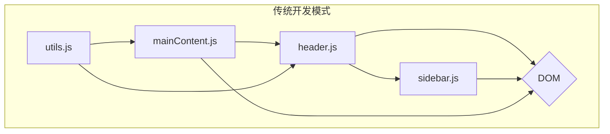
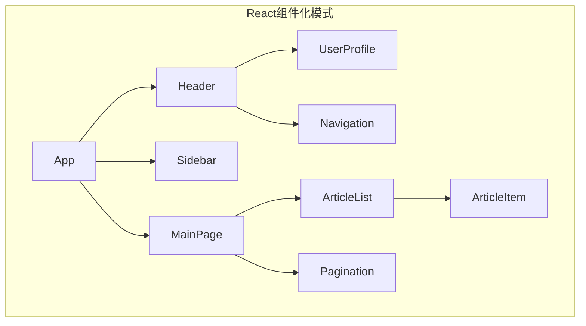

好的，作为一位资深的技术教育作者，我将紧接“引出组件化作为一种组织UI代码的更优范式”这一思路，自然地续写 **2.1.1 告别“意大利面条”：为何需要组件化** 的后续内容。

---

### 2.1.1 告别“意大利面条”：为何需要组件化

既然我们已经目睹了传统开发模式在复杂场景下的窘境，那么，React是如何优雅地解决这个问题的呢？答案很简单，却威力巨大——**组件化（Componentization）**。

#### 组件：UI世界的“乐高积木”

想象一下，你面对的不再是一团乱麻的线，而是一盒整齐的乐高积木。每一块积木都有自己特定的形状、颜色和功能。你可以独立地审视、把玩任何一块积木，也可以将它们以各种方式拼装起来，创造出从简单的小房子到宏伟的宇宙飞船等各式各样的模型。

在React的世界里，**组件（Component）** 就是这样的“乐高积木”。

> **一个组件，就是一个独立的、可复用的UI单元。它将自身的结构（HTML）、样式（CSS）和逻辑（JavaScript）封装在一起，形成一个功能完备的“黑盒”。**

这个“黑盒”只关心自己的内部实现，并通过一个明确的接口（我们稍后会学到的`props`和`state`）与外部世界通信。你无需关心一个 `UserProfileCard` 组件内部是如何渲染用户头像和姓名的，你只需把它放到页面的任何需要的位置，并告诉它要展示哪个用户的信息即可。

#### 思维转变：从“命令式”到“声明式”

组件化不仅仅是一种代码组织方式，更是一种根本性的思维转变。它推动我们从**命令式（Imperative）**编程转向**声明式（Declarative）**编程。

让我们用一个简单的“点赞”功能来对比这两种思维：

| 命令式 (jQuery) | 声明式 (React) |
| :--- | :--- |
| 我需要一步步地告诉浏览器**“如何做”**。 | 我只需要告诉React**“我想要什么”**。 |
| ```javascript
// 1. 找到那个红心按钮
const heartIcon = $('#like-button .icon');
// 2. 找到计数的span
const countSpan = $('#like-button .count');
// 3. 读取当前的计数值并加一
let currentCount = parseInt(countSpan.text(), 10);
const newCount = currentCount + 1;
// 4. 更新计数值的文本
countSpan.text(newCount);
// 5. 如果按钮之前是未选中状态，给它加上'active'类
if (!heartIcon.hasClass('active')) {
  heartIcon.addClass('active');
}
``` | ```jsx
// 我只关心两个状态：是否已点赞(isLiked)和点赞数(likeCount)
// React会根据这些状态自动更新UI

function LikeButton() {
  const [isLiked, setIsLiked] = useState(false);
  const [likeCount, setLikeCount] = useState(100);

  const handleClick = () => {
    setIsLiked(!isLiked);
    setLikeCount(isLiked ? likeCount - 1 : likeCount + 1);
  };

  return (
    <button onClick={handleClick}>
      <Icon className={isLiked ? 'active' : ''} />
      <span>{likeCount}</span>
    </button>
  );
}
``` |
| 整个过程充满了对DOM的直接、繁琐的操作。代码逻辑与DOM结构紧密耦合，难以维护。 | 我们只描述了UI在不同状态下应该呈现的样子，而将复杂的DOM操作完全交给了React。逻辑清晰，且与具体实现解耦。 |

这种声明式的理念，让你能更专注于应用的业务逻辑，而不是繁琐的UI操作细节。

#### 可视化对比：混乱的依赖 vs. 清晰的结构

让我们用图表来直观地感受一下组件化前后的天壤之别。

**传统开发模式下的依赖关系**

在传统模式下，各个模块的JavaScript文件可能随意地相互调用，共同操作同一个全局DOM，形成一张错综复杂的关系网。


*图2-1: 传统开发中混乱的依赖关系图*

**React组件化开发模式下的结构**

而在React中，应用被组织成一个清晰的、自上而下的组件树。数据和事件的流动通常是单向的，使得整个应用的结构一目了然。


*图2-2: React中清晰的组件树结构*

这种树状结构不仅易于理解，而且极大地简化了调试和维护工作。当出现问题时，你可以迅速定位到出问题的那个“积木块”，而不是在整个“意大利面条”中寻找线头。

---

#### 本节小结

通过本节的探讨，我们理解了为何需要组件化。它不是一个可有可无的“语法糖”，而是应对日益增长的Web应用复杂度的必然选择。组件化将我们从繁琐、易错的DOM操作中解放出来，引领我们进入一个更结构化、更可预测的前端开发新时代。

**要点回顾：**

*   **问题所在**：传统UI开发在复杂应用中容易导致代码结构混乱、难以维护，形成“意大利面条”式的代码。
*   **解决方案**：组件化。将UI拆分为独立的、可复用的单元。
*   **核心思想**：每个组件像一块“乐高积木”，封装了自己的结构、样式和逻辑。
*   **思维转变**：从关心“如何做”（命令式）转变为关心“看到什么”（声明式）。
*   **结构优势**：应用从一张混乱的依赖网，变成一棵清晰的、自上而下的组件树。

现在，你已经知道了“为什么”要用组件。在接下来的章节中，我们将亲手创建并使用我们的第一个React组件，真正踏入这个激动人心的世界。