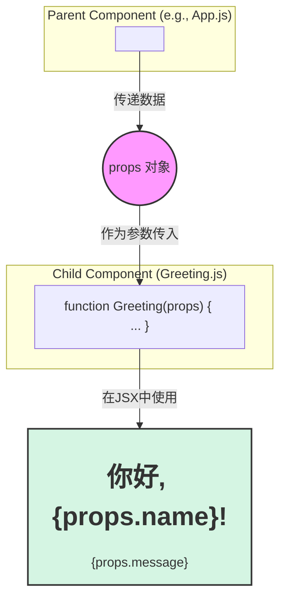

好的，我们继续。

---

### 2.3.2 第二步：通过Props接收外部数据

在上一步中，我们成功创建并渲染了第一个组件 `Greeting`。这很棒，但它有一个明显的局限性：它的内容是“硬编码”的。无论我们在哪里使用 `<Greeting />`，它永远只会显示“你好，React！”。

如果想让它向不同的人打招呼，比如“你好，Alice！”或“你好，Bob！”，该怎么办呢？难道要为每个人都创建一个新组件吗？当然不是。我们真正需要的是一种方法，让组件在被使用时能够接收外部传入的数据，并根据这些数据来调整自己的显示内容。

这就引出了我们构建可复用组件的第一个强大工具：**Props**。

#### 什么是Props？

**Props** 是 “properties” 的缩写，中文通常译为“属性”。它是一个从父组件传递到子组件的**数据对象**。你可以把它想象成函数调用时的参数。

如果说组件是一个UI“蓝图”，那么`props`就是你在使用这张蓝图建造时，为它提供的具体配置参数（例如墙壁的颜色、窗户的大小）。通过`props`，我们的组件就能从一个静态的、固定的模板，转变为一个动态的、可配置的“UI工厂”。

数据的流动方向是**单向的**，即**从父组件流向子组件**。这就像一条向下流动的水流，确保了应用的结构清晰和数据可预测。



#### 1. 在父组件中传递Props

传递`props`的语法与HTML标签的属性非常相似。我们在使用子组件的JSX标签上，像添加 `id` 或 `className` 一样添加自定义属性即可。

让我们回到项目的入口文件 `src/index.js`，修改它来为 `Greeting` 组件传递一些数据。

```javascript
// src/index.js

import React from 'react';
import ReactDOM from 'react-dom/client';
import Greeting from './Greeting'; 
import './index.css'; 

const rootElement = document.getElementById('root');
const root = ReactDOM.createRoot(rootElement);

root.render(
  <React.StrictMode>
    {/* 像HTML属性一样，将数据传递给Greeting组件 */}
    <Greeting name="Alice" message="欢迎来到React的世界！" />
    <Greeting name="Bob" message="组件复用真是太棒了！" />
  </React.StrictMode>
);
```

**代码解析**：
*   我们现在渲染了**两个** `<Greeting />` 组件实例。
*   第一个实例，我们传递了两个`props`：`name` 的值是字符串 `"Alice"`，`message` 的值是 `"欢迎来到React的世界！"`。
*   第二个实例，我们传递了不同的值：`name="Bob"` 和 `message="组件复用真是太棒了！"`。

React会将这些“属性”收集起来，打包成一个对象，然后传递给 `Greeting` 组件。

#### 2. 在子组件中接收和使用Props

现在，`Greeting` 组件需要做好接收这个数据包的准备。React会将这个`props`对象作为**函数式组件的第一个参数**传入。

让我们修改 `src/Greeting.js` 文件，让它能够使用这些传入的数据。

### `code_example`：改造 `Greeting` 组件以使用Props

```javascript
// src/Greeting.js

// 1. 在函数参数中接收 props 对象
function Greeting(props) {
  // console.log(props); // 你可以在浏览器控制台打印它，看看它的结构
  // 对于第一个实例，它会是 { name: "Alice", message: "欢迎来到React的世界！" }

  // 2. 在JSX中使用 { } 语法来嵌入JavaScript表达式
  return (
    <div className="greeting-card">
      {/* 使用 props.name 和 props.message 动态地显示内容 */}
      <h1>你好，{props.name}！</h1>
      <p>{props.message}</p>
    </div>
  );
}

export default Greeting;
```

**代码解析**：
1.  **`function Greeting(props)`**：我们将函数签名从 `()` 改为了 `(props)`。`props` 这个参数名是约定俗成的，你也可以叫它别的名字，但强烈建议遵循社区规范。
2.  **`{props.name}` 和 `{props.message}`**：这是JSX中嵌入动态内容的关键语法。通过将JavaScript表达式放在花括号 `{}` 中，React会计算这个表达式的值，并将其渲染到DOM中。在这里，我们通过 `props.name` 和 `props.message` 访问了从父组件传递过来的数据。

现在刷新浏览器，你会看到两个并排的欢迎卡片，分别向Alice和Bob打招呼，并显示了不同的消息。我们成功地让一个组件蓝图，根据不同的输入，渲染出了不同的UI！

#### Props是只读的：一个重要的原则

在React中，有一个非常重要的规则：**无论组件是函数式的还是类式的，它都决不能修改自己的`props`**。

`props`对象对于接收它的组件来说是**只读（Read-Only）**的。组件应该像一个“纯函数”一样对待它的`props`，即对于相同的输入（props），总是产生相同的输出（JSX），并且不产生任何“副作用”（比如修改输入值）。

```
// 错误的做法！不要在组件内部修改props！
function Greeting(props) {
  props.name = 'Charlie'; // ❌ 这是不被允许的，React会报错或导致不可预测的行为
  return <h1>你好, {props.name}!</h1>;
}
```

这种设计保证了UI的稳定性和可预测性。如果一个组件可以随意修改从父组件传来的数据，那么整个应用的数据流向就会变得混乱不堪，极难调试。

#### 技巧：使用解构赋值简化Props的使用

每次都写 `props.` 有点繁琐。在现代JavaScript中，我们通常使用**解构赋值（Destructuring Assignment）**来让代码更简洁。

你可以在函数体内部解构：
```javascript
function Greeting(props) {
  const { name, message } = props; // 从props对象中提取name和message
  return (
    <div className="greeting-card">
      <h1>你好，{name}！</h1>
      <p>{message}</p>
    </div>
  );
}
```

更常见、更推荐的做法是直接在函数参数列表中进行解构：
```javascript
// 直接在参数位置解构，代码更清晰
function Greeting({ name, message }) {
  return (
    <div className="greeting-card">
      <h1>你好，{name}！</h1>
      <p>{message}</p>
    </div>
  );
}
```
这两种方式效果完全一样，但第二种显然更加简洁明了。

### 要点回顾

现在，你的组件不再是一个孤立的、静态的UI片段。它拥有了接收外部信息、并据此改变自身行为的能力。

*   **Props是桥梁**：`props`是连接父子组件、传递数据的核心机制。
*   **单向数据流**：数据总是从父组件“向下”流向子组件。
*   **传递语法**：在父组件中，使用类似HTML属性的语法 `<MyComponent propName="value" />` 来传递`props`。
*   **接收语法**：在子组件中，通过函数参数 `function MyComponent(props)` 或 `function MyComponent({ propName })` 来接收`props`。
*   **只读原则**：子组件永远不应该修改它接收到的`props`。

掌握了`props`，你就掌握了在React中构建可复用、动态组件的基础。接下来，我们将探讨如何将多个组件像乐高积木一样组合起来，构建出更复杂的应用界面。