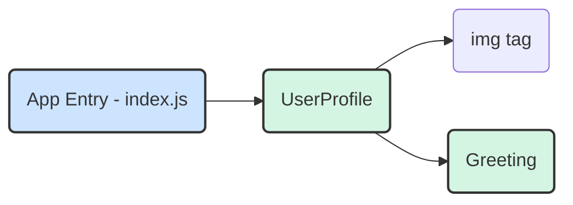

好的，我们已经掌握了如何创建独立的、可接收数据的组件。这就像我们拥有了一堆功能各异的乐高积木。现在，是时候学习如何将这些积木**拼装**起来，搭建出更宏伟的结构了。

---

### 2.3.3 第三步：组件的组合与嵌套

单一组件的力量是有限的。React的真正威力在于其**组合模型**：将简单的小组件像积木一样拼装，构建出复杂的、层次分明的用户界面。这就像用原子构成自分子，再由分子构成世间万物。

如果说 `Greeting` 组件是一个独立的欢迎卡片，那么一个完整的用户个人资料板块（`UserProfile`）可能就由一个头像（`Avatar`）、一个欢迎卡片（`Greeting`）和一些用户信息（`UserInfo`）组合而成。这种在一个组件内部渲染其他组件的做法，就叫做**组件的组合与嵌套**。

#### 从“并排”到“父子”

在上一节中，我们在 `index.js` 文件里渲染了两个 `<Greeting />` 组件。从结构上看，它们是“兄弟”关系，并排存在：

```
// 伪代码结构
<root>
  <Greeting />
  <Greeting />
</root>
```

现在，我们将创建一个新的“父”组件，比如 `UserProfile`，然后将 `Greeting` 作为它的“子”组件**嵌套**在内部。

```
// 伪代码结构
<root>
  <UserProfile>
    {/* UserProfile 内部渲染了 Greeting */}
    <Greeting /> 
  </UserProfile>
</root>
```

让我们通过一个具体的例子来实践这个过程。我们将创建一个 `UserProfile` 组件，它用来展示用户的头像和欢迎信息。

---

### `code_example`：创建并组合 `UserProfile` 组件

**1. 创建 `UserProfile` 组件文件**

在 `src` 目录下新建一个文件 `UserProfile.js`。

**2. 编写 `UserProfile` 组件代码**

这个组件将接收一个 `user` 对象作为 `props`，然后渲染用户的头像和一个定制化的 `Greeting`。

```javascript
// src/UserProfile.js

import React from 'react';
// 1. 导入你想要嵌套的子组件
import Greeting from './Greeting'; 

// 这是一个“容器”或“父”组件
function UserProfile(props) {
  const { user } = props; // 从 props 中解构出 user 对象

  return (
    <div className="user-profile">
      {/* a. 渲染一个普通的 HTML 标签 */}
      

      {/* b. 渲染另一个我们自定义的 React 组件 */}
      {/* 2. 像使用 HTML 标签一样使用它 */}
      <Greeting 
        name={user.name} 
        message="感谢你的访问！" 
      />
    </div>
  );
}

export default UserProfile;
```

**代码解析**：
1.  **`import Greeting from './Greeting';`**：这是关键的第一步。要在 `UserProfile` 中使用 `Greeting`，你必须先把它导入进来。
2.  **数据传递**：`UserProfile` 组件自己接收一个 `user` prop。然后，它将 `user` 对象中的 `name` 属性，连同一个新的 `message`，作为 `props` **向下传递**给了 `<Greeting />` 子组件。这就是数据在组件树中逐层流动的典型模式。
3.  **组合**：在 `UserProfile` 的 `return` 语句中，我们混合使用了普通的HTML标签（`<div>`, ``）和自定义的React组件（`<Greeting />`）。React对此一视同仁，最终都会将它们转换成浏览器可识别的DOM元素。

**3. 更新应用入口文件**

现在，我们不再直接渲染 `Greeting`，而是渲染更高层级的 `UserProfile` 组件。

打开 `src/index.js`，修改代码如下：

```javascript
// src/index.js

import React from 'react';
import ReactDOM from 'react-dom/client';
// 导入我们新的父组件
import UserProfile from './UserProfile'; 
import './index.css'; 

const rootElement = document.getElementById('root');
const root = ReactDOM.createRoot(rootElement);

// 准备一个模拟的用户数据对象
const someUser = {
  name: 'Chris',
  avatarUrl: 'https://i.imgur.com/yXOvdOSs.jpg' // 一个示例图片URL
};

root.render(
  <React.StrictMode>
    {/* 渲染 UserProfile 组件，并把用户数据通过 prop 传给它 */}
    <UserProfile user={someUser} />
  </React.StrictMode>
);
```
现在运行你的应用，你会看到一个包含头像和个性化欢迎语的用户资料卡。我们成功地将 `Greeting` 组件**组合**进了 `UserProfile` 组件中！

#### 可视化组件树

我们刚刚构建的结构可以用一个树状图来表示，这就是所谓的**组件树（Component Tree）**。


*   `UserProfile` 是 `Greeting` 的**父组件**。
*   `Greeting` 是 `UserProfile` 的**子组件**。
*   数据（`props`）从树的上方（父组件）流向下方（子组件）。

### `common_mistake_warning`：常见错误警示

1.  **忘记导入子组件**：如果你在 `UserProfile.js` 中使用了 `<Greeting />` 却忘记写 `import Greeting from './Greeting';`，React会抛出错误，通常是 `ReferenceError: Greeting is not defined`。这是最常见的错误之一。
2.  **组件名使用小写字母开头**：我们再次强调这个规则。如果你将一个组件命名为 `greeting` 并在JSX中写成 `<greeting />`，React会把它当作一个普通的、未知的HTML标签来处理，而不是渲染你的组件。这通常不会报错，但你的组件内容将不会显示。**始终用大写字母开头命名你的组件**。

### 要点回顾

通过组合与嵌套，我们打开了构建复杂应用的大门。

*   **组合是核心**：React应用是通过将小而专一的组件组合在一起来构建的。
*   **父子关系**：当一个组件A在其JSX中渲染了组件B，我们称A为父组件，B为子组件。
*   **组件树**：这种父子关系形成了一个层次化的组件树，它是整个React应用的骨架。
*   **数据向下流动**：`Props` 是数据沿着组件树从父组件传递到子组件的管道。
*   **导入/导出**：`import` 和 `export` 是连接这些独立组件文件的胶水。

现在你已经掌握了创建、配置（通过`props`）和组合组件这三大基本技能。你已经具备了构建任何静态React应用界面的所有基础知识。在接下来的章节中，我们将为这些静态的界面注入生命，让它们能够响应用户的操作。