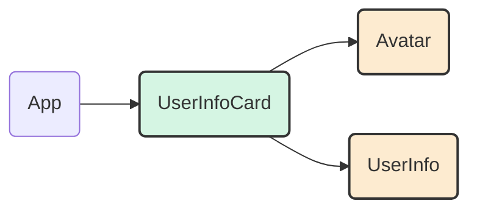

好的，我们已经掌握了如何创建、配置（通过`props`）和组合组件这三大基本技能。这就像我们拥有了一整套乐高积木和拼装说明。现在，是时候将这些技能融会贯通，完成一个更完整、更贴近真实应用的最终实战，来为本章画上一个圆满的句号。

---

### 2.3.4 实战收官：搭建一个静态“用户信息卡”

在本节中，我们的目标是集中运用前面学到的所有知识——定义组件、使用JSX、传递Props、组合嵌套——来从零开始构建一个常见的UI元素：一个用户信息卡（User Info Card）。这个过程将完美模拟你在真实项目开发中的思考和操作流程：**先拆解UI，再分别实现，最后组合成型**。

### `case_study`：我们的目标：构建一个用户信息卡

想象一下，在社交媒体、博客或者任何需要展示用户身份的地方，你都会看到类似下面的卡片：

```
+-------------------------------------------+
|                                           |
|        [  ]   <-- 用户头像 (Avatar)       |
|                                           |
|        用户名 (Username)                  |
|        用户简介 (Bio)                     |
|                                           |
+-------------------------------------------+
```

这个看似简单的UI，正是检验我们组件化思维的绝佳案例。

#### UI拆解：从整体到部分

一个经验丰富的React开发者看到这个设计图时，不会立刻开始写一个巨大的组件。相反，他们会首先进行**组件拆解**：

1.  **`Avatar` 组件**：用于显示圆形的用户头像。它是一个独立的、可复用的视觉元素。它只需要知道图片的URL和替代文本。
2.  **`UserInfo` 组件**：用于显示用户的文本信息，比如姓名和简介。它负责信息的格式化和展示。
3.  **`UserInfoCard` 组件**：作为最外层的容器组件。它不关心头像怎么画、信息怎么排版，它的职责是**组织** `Avatar` 和 `UserInfo` 这两个子组件，将它们放在正确的位置，并为它们提供所需的数据。

通过这样的拆解，我们的组件树结构也变得清晰起来：



现在，让我们按照从内到外、从简单到复杂的顺序，逐一实现这些组件。

#### 步骤一：创建原子组件 `Avatar`

最基础的单元是头像。在 `src` 目录下新建 `Avatar.js`。

### `code_example`：编写 `Avatar.js`

```javascript
// src/Avatar.js

import React from 'react';

// Avatar组件接收一个user对象作为prop
function Avatar({ user }) {
  return (
    
  );
}

export default Avatar;
```
**代码解析**：
*   我们创建了一个非常专一的 `Avatar` 组件。它的唯一职责就是根据传入的 `user` prop 来渲染一个 `` 标签。
*   我们使用了参数解构 `{ user }` 来直接获取 `user` 对象。
*   `style={{...}}`：在JSX中，我们可以使用内联样式。注意它是一个JavaScript对象，属性名需要使用驼峰命名法（如 `borderRadius` 而不是 `border-radius`）。

#### 步骤二：创建信息组件 `UserInfo`

接下来是用户信息部分。在 `src` 目录下新建 `UserInfo.js`。

### `code_example`：编写 `UserInfo.js`

```javascript
// src/UserInfo.js

import React from 'react';

// UserInfo组件也接收user对象
function UserInfo({ user }) {
  return (
    <div className="user-info">
      <h2 className="user-info-name">{user.name}</h2>
      <p className="user-info-bio">{user.bio}</p>
    </div>
  );
}

export default UserInfo;
```
**代码解析**：
*   与 `Avatar` 类似，`UserInfo` 组件也只关心如何展示文本信息，它从 `user` prop 中获取 `name` 和 `bio` 并渲染它们。

#### 步骤三：组合成 `UserInfoCard`

现在我们有了积木块，是时候把它们拼起来了。在 `src` 目录下新建 `UserInfoCard.js`。

### `code_example`：编写 `UserInfoCard.js`

```javascript
// src/UserInfoCard.js

import React from 'react';
// 1. 导入子组件
import Avatar from './Avatar';
import UserInfo from './UserInfo';

// 这是一个容器组件
function UserInfoCard({ user }) {
  return (
    <div className="card" style={{
      padding: '20px',
      borderRadius: '10px',
      boxShadow: '0 4px 8px rgba(0,0,0,0.1)',
      textAlign: 'center',
      maxWidth: '300px'
    }}>
      {/* 2. 使用子组件，并将数据传递下去 */}
      <Avatar user={user} />
      <UserInfo user={user} />
    </div>
  );
}

export default UserInfoCard;
```
**代码解析**：
*   **组合的核心**：这个组件本身没有太多复杂的渲染逻辑。它的主要工作就是导入 `Avatar` 和 `UserInfo`，并将它们渲染在自己的 `div` 容器中。
*   **数据流转**：`UserInfoCard` 接收一个 `user` prop。它并没有直接消费这个 `user` 对象的所有信息，而是将其**原封不动地向下传递**给了需要这些数据的子组件。`Avatar` 和 `UserInfo` 各自从这个 `user` 对象中选取自己需要的部分来渲染。这就是React中典型的自顶向下的数据流。

#### 步骤四：在应用中渲染最终成品

最后一步，让我们在应用入口处使用我们精心打造的 `UserInfoCard` 组件。

修改 `src/index.js` (或你的应用主入口文件如 `App.js`)。

```javascript
// src/index.js

import React from 'react';
import ReactDOM from 'react-dom/client';
// 只需要导入最顶层的容器组件
import UserInfoCard from './UserInfoCard';
import './index.css'; // 假设有一些全局样式

const rootElement = document.getElementById('root');
const root = ReactDOM.createRoot(rootElement);

// 准备我们的数据源
const userData = {
  name: 'Hedy Lamarr',
  avatarUrl: 'https://i.imgur.com/yXOvdOSs.jpg',
  bio: 'An Austrian-born American film actress and inventor.'
};

root.render(
  <React.StrictMode>
    <h1>My Awesome App</h1>
    <UserInfoCard user={userData} />
  </React.StrictMode>
);
```

现在，运行你的应用。你会看到一个结构清晰、内容丰富的用户信息卡片。我们通过拆分、实现、组合的方式，优雅地完成了这个任务！

### `checklist`：成果检验清单

通过这个实战，我们巩固了本章的核心知识点。回顾一下，你是否已经掌握了：

-   [x] **UI分析与拆解**：将一个视觉设计稿拆分为多个独立的组件（`UserInfoCard`, `Avatar`, `UserInfo`）。
-   [x] **创建函数式组件**：为每个拆分出的部分编写了对应的JavaScript函数。
-   [x] **使用Props传递数据**：定义了一个统一的数据源 (`userData`)，并通过 `props` 将其逐层传递给需要它的子组件。
-   [x] **组件组合与嵌套**：在 `UserInfoCard` 中导入并使用了 `Avatar` 和 `UserInfo`，构建了父子组件关系。
-   [x] **JSX语法实践**：熟练运用了JSX来描述UI结构，包括 `className` 和内联 `style` 对象。

### 总结与展望

恭喜你！你已经成功地运用React的核心思想构建了一个完整的、虽然是静态的UI单元。你不再是简单地堆砌HTML标签，而是像一位工程师一样，设计并搭建了一个由可复用组件构成的系统。这是从页面开发者转向应用开发者的关键一步。

你可能已经注意到了，我们目前构建的一切都是**静态的**。数据 `userData` 是硬编码在代码里的，卡片也无法与用户进行任何交互（比如点击点赞、修改简介等）。如何让我们的应用“活”起来，响应用户的操作，并管理那些会随时间变化的数据呢？

这正是我们下一章要深入探讨的主题：**状态（State）**——React中与`props`并驾齐驱的另一个核心概念。准备好，我们将为我们的静态蓝图注入灵魂！