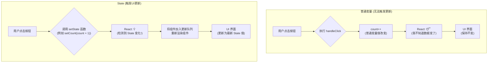

好的，作为一位资深的技术教育作者，我将紧接课程脉络，为你续写 **“3.1.1 为什么需要状态(State)？从静态到动态的跨越”** 这一节的内容。

---

### 3.1.1 为什么需要状态(State)？从静态到动态的跨越

在上一章中，我们已经熟练掌握了如何使用 `Props` 来构建组件，实现了数据的自顶向下传递。通过 `Props`，我们的组件变得灵活且可复用，就像一个个根据设计图纸精确组装的乐高积木。

然而，这些“积木”目前还只是静态的展品。用户可以欣赏它们，但无法与之互动并改变它们。想象一下，一个点赞按钮，无论你点击多少次，上面的数字都不会增加；一个输入框，无论你输入什么，内容都无法显示。这就是纯 `Props` 组件的局限性：**组件无法响应用户的操作来改变自身的外观和行为**。

`Props` 是组件的“外部基因”，由父组件决定，组件自身只能读取，不能修改。这保证了数据流的单向和可预测性，但要让应用“活”起来，我们需要一种机制来管理组件**内部的、随时间变化的数据**。

这，就是 `State` 存在的意义。

#### 当普通变量“失灵”时

在学习 `State` 之前，让我们先思考一个问题：为什么不能直接在组件内部用一个普通的 JavaScript 变量来存储会变化的数据呢？

让我们尝试用一个常规变量来实现一个简单的计数器：

```jsx
// 一个错误的尝试 ❌
function Counter() {
  let count = 0;

  function handleClick() {
    count = count + 1;
    console.log(count); // 控制台会正确打印 1, 2, 3...
  }

  return (
    <button onClick={handleClick}>
      你点击了 {count} 次
    </button>
  );
}
```

当你运行这段代码并点击按钮时，你会惊奇地发现：
1.  **控制台（Console）** 中会正确地打印出 `1`, `2`, `3`……证明 `count` 变量的值确实在增加。
2.  **浏览器界面** 上的按钮文本 "你点击了 0 次" 却**始终没有改变**。

这是为什么呢？因为 React 并不知道这个普通的 `count` 变量与你的界面UI有任何关联。对于 React 来说，一个组件就像一个函数，只有在被调用（渲染）时，才会根据当时的 `props` 和内部逻辑计算出一次性的UI快照。`count` 变量的后续变化，是在 React 的渲染体系之外发生的，React 对此一无所知，因此它没有理由去重新渲染组件，更新界面。

**`State` 正是那个能通知 React “嘿，数据变了，你需要重新渲染一下！”的关键信使。**

#### State：组件的内在记忆

如果说 `Props` 是组件从父辈那里继承的、不可改变的“天赋”，那么 `State` 则是组件在自身生命周期中通过经历（如用户交互、网络请求等）形成的、可以改变的“记忆”。

`State` 具备两个核心特质：
1.  **私有性（Private）**：`State` 是组件内部的数据，完全由组件自己控制，外部组件无法直接访问或修改。
2.  **响应性（Reactive）**：当组件的 `State` 通过 React 提供的方式（我们稍后会学的 `useState` Hook）更新时，React 会自动、高效地**重新渲染**该组件及其子组件，从而将最新的数据显示在界面上。

让我们通过一个流程图来直观对比普通变量与 `State` 在响应用户交互时的区别。



这个图清晰地展示了 `State` 的“魔力”所在：它充当了数据变化与UI更新之间的桥梁。

#### Props 与 State 的核心区别

为了更深刻地理解，我们将 `Props` 和 `State` 的核心特性进行对比：

| 特性 | Props (属性) | State (状态) |
| :--- | :--- | :--- |
| **数据来源** | 由父组件传入 | 组件内部自己管理和初始化 |
| **可变性** | **只读 (Read-Only)**，组件自身不可修改 | **可变 (Mutable)**，组件可以通过特定函数修改 |
| **作用** | 用于从外部向组件传递数据，配置组件外观和行为 | 用于管理组件内部随时间变化的数据，驱动UI更新 |
| **生命周期** | 在组件的整个生命周期中，只要父组件不重新传递，它就是稳定的 | 会在组件的生命周期中因交互等原因而频繁改变 |
| **数据流** | 单向数据流，自顶向下 | 封装在组件内部，是组件响应性的来源 |

---

#### 总结与回顾

现在，我们应该已经明白了为什么需要 `State`。

- **`Props` 的局限**：它解决了组件复用和数据传递的问题，但无法处理组件内部因用户交互而产生的数据变化。
- **`State` 的引入**：`State` 是组件的“内部记忆”，专门用来管理那些会随时间推移而改变的数据。
- **核心价值**：`State` 的最大价值在于其**响应性**。一旦 `State` 发生变化，React 就会自动重新渲染UI，将静态的组件变成了能够与用户动态交互的“活”组件。

简单来说，当一个组件需要“记住”某些信息并在用户操作下改变这些信息时，你就需要使用 `State`。它完成了从静态展示到动态交互的关键跨越。

在下一节中，我们将正式学习如何使用 React 提供的 `useState` Hook，亲手为我们的组件添加第一个 `State`，让那个静止的计数器真正地动起来！