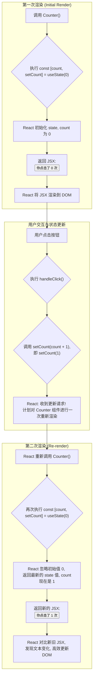

好的，我将以资深技术教育作者的身份，紧密衔接上下文，为你续写 **“3.1.2 核心钩子：useState的语法与工作机制”** 这一节的内容。

---

### 3.1.2 核心钩子：useState的语法与工作机制

在上一节中，我们已经深刻理解了 `State` 对于构建动态交互应用不可或缺的价值。我们知道，需要一种特殊的机制来告知 React “数据变了，请更新界面！”。现在，我们将正式揭晓并掌握这个机制的钥匙——`useState` Hook。

`useState` 是 React Hooks 中最基础也是最重要的一个。所谓 **Hook**，你可以理解为一些特殊的函数，它们可以让你在函数组件中“钩入” React 的核心特性，比如状态管理、生命周期等，而无需编写 class 组件。

让我们直接用 `useState` 来修复上一节中那个无法工作的计数器，直观感受它的威力。

```jsx
// 一个正确的计数器 ✅
import { useState } from 'react'; // 步骤1: 从 'react' 中导入 useState

function Counter() {
  // 步骤2: 在组件函数顶部调用 useState
  const [count, setCount] = useState(0); // 声明一个名为 "count" 的 state 变量

  function handleClick() {
    // 步骤3: 使用更新函数来改变 state
    setCount(count + 1); 
    // 注意：不再是 count = count + 1;
  }

  return (
    <button onClick={handleClick}>
      你点击了 {count} 次
    </button>
  );
}
```

现在，当你点击按钮时，界面上的数字会如你所愿地增加！`useState` 到底施了什么魔法？让我们逐行拆解这段看似简单的代码。

#### 剖析 `useState` 的语法

`const [count, setCount] = useState(0);`

这短短的一行代码，蕴含了 `useState` 的全部核心语法，我们可以将其分解为三个部分来理解：

**1. 调用 `useState(initialState)`：初始化状态**

*   `useState(0)`：我们调用 `useState` 函数，并向其传递一个参数 `0`。这个参数是该状态的**初始值（Initial State）**。
*   React 会“记住”这个初始值。这个初始化过程**只在组件的第一次渲染时发生**。在后续的重新渲染中，`useState` 会直接返回该状态的当前最新值，而忽略这个初始值参数。
*   初始值可以是任何 JavaScript 数据类型，如数字、字符串、布尔值、数组，甚至是对象。

**2. 返回值：一个包含两个元素的数组**

`useState` 函数的返回值是一个数组，其中总是包含两个元素：

*   **第一个元素**：当前的状态值。在我们的例子中，它被命名为 `count`。在第一次渲染时，`count` 的值就是我们传入的初始值 `0`。
*   **第二个元素**：一个专门用来更新这个状态值的**更新函数（Updater Function）**。在我们的例子中，它被命名为 `setCount`。

**3. 数组解构（Array Destructuring）：优雅的语法糖**

`const [count, setCount] = ...` 这种语法是 JavaScript ES6 的**数组解构**。它允许我们从数组中方便地提取值并赋给变量。

这行代码等同于下面这种更冗长的写法：

```jsx
// 不使用解构的等价写法
const stateArray = useState(0); // stateArray 是 [0, function]
const count = stateArray[0];      // 第一个元素是当前 state
const setCount = stateArray[1];    // 第二个元素是更新函数
```

显然，数组解构让代码更加简洁和易读。按照社区约定，更新函数通常被命名为 `set` + `状态名`（驼峰式），例如 `[user, setUser]`、`[isLoading, setIsLoading]`。这种命名方式极大地提高了代码的可读性。

#### 工作机制：`setCount` 如何触发重新渲染

现在我们来到了最关键的部分：为什么调用 `setCount(count + 1)` 就能更新UI，而 `count = count + 1` 却不行？

调用更新函数（如 `setCount`）时，你实际上在做两件事：

1.  **告知 React 新的状态值**：你告诉 React，“我希望 `count` 的下一个值是 `count + 1`”。
2.  **请求一次重新渲染**：这是最重要的一步。这个函数调用会向 React 发出一个信号，将该组件添加到一个待更新的队列中。

React 接收到这个信号后，会执行以下工作流程：



这个流程揭示了 `State` 的“响应性”本质：

*   **状态的持久化**：React 在组件的多次渲染之间“记住”了 `count` 的值。它并不像普通函数变量那样在函数执行完毕后就被销毁。
*   **更新是异步的**：调用 `setCount` 并不会立即改变 `count` 的值。它只是“预定”了一次更新。在 `handleClick` 函数内部，即使你调用了 `setCount(count + 1)`，紧接着打印 `console.log(count)`，你看到的仍然是旧的值。React 会在当前事件处理函数执行完毕后，再批量处理状态更新和重新渲染。
*   **渲染驱动UI**：React 的核心理念就是“UI 是状态的映射”。你只管通过更新函数来改变状态，React 会自动、可靠地完成后续的UI同步工作。

<br/>

> **[common_mistake_warning] 常见错误：直接修改 State 变量**
> 
> 初学者最容易犯的错误就是忘记使用更新函数，而是像操作普通变量一样直接修改 state。
> 
> ```jsx
> // ❌ 错误的做法
> function handleClick() {
>   count = count + 1; // 这是无效的！
>   // React 不知道 state 发生了变化，因此不会触发重新渲染。
>   // UI 上的数字将永远停留在初始值。
> }
> 
> // ✅ 正确的做法
> function handleClick() {
>   setCount(count + 1); // 必须通过更新函数来修改 state
> }
> ```
> 
> **请牢记：永远不要直接修改 state 变量。** 这样做会破坏 React 的响应式机制，导致 UI 与数据状态不一致，引发难以调试的 bug。

---

#### 总结与回顾

在本节中，我们迈出了从静态组件到动态交互组件的关键一步，学习了核心的 `useState` Hook。

- **`useState` 语法**：通过 `const [state, setState] = useState(initialState);` 来声明一个状态。
- **数组解构**：这是一种方便我们为状态值和其更新函数命名的 JavaScript 语法。
- **初始值**：`useState` 的参数只在组件首次渲染时用于初始化状态。
- **更新函数**：改变状态的**唯一正确方式**是调用 `useState` 返回的第二个元素，即更新函数（如 `setCount`）。
- **重新渲染机制**：调用更新函数会向 React 预约一次组件的重新渲染。在新的渲染中，`useState` 会返回更新后的状态值，从而生成新的UI，最终由 React 高效地更新到屏幕上。

现在，你已经掌握了让组件“活”起来的基本工具。在接下来的小节中，我们将探索如何在一个组件中使用多个 state 变量，以及处理更复杂的 state 数据结构。