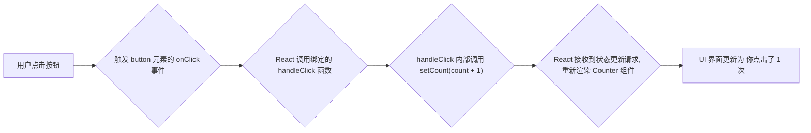

好的，我将以资深技术教育作者的身份，紧密衔接上下文，为你续写 **“3.1.3 连接用户：在JSX中处理事件”** 这一节的内容。

---

### 3.1.3 连接用户：在JSX中处理事件

在前面的小节中，我们已经掌握了使用 `useState` 为组件植入“记忆”的强大能力。我们的 `Counter` 组件现在拥有了 `count` 状态和 `setCount` 这个更新武器。但整个流程还缺少一个至关重要的环节：**扳机**。

用户是如何扣动这个扳机，从而触发 `setCount` 的呢？答案就在我们之前代码中已经悄然使用的 `onClick={handleClick}` 语法里。这一节，我们将正式深入探讨 React 中连接用户操作与组件逻辑的桥梁——事件处理。

#### JSX中的事件绑定语法

如果你熟悉原生 HTML，你可能写过这样的代码：`<button onclick="alert('Hello!')">Click me</button>`。在 React 中，事件处理的理念相似，但语法上遵循了 JSX 的规范，有几个关键区别：

1.  **命名约定：驼峰式（camelCase）**
    React 的事件属性名采用驼峰式命名法，而不是 HTML 的全小写。例如，HTML 的 `onclick` 在 JSX 中是 `onClick`，`onmouseover` 变成 `onMouseOver`。

2.  **绑定内容：传递函数引用**
    在 HTML 中，你通常传递一个字符串形式的代码。但在 JSX 中，你需要传递一个**函数**本身。我们使用大括号 `{}` 将函数作为 prop 传递给事件处理器。

让我们通过一个表格直观对比一下：

| 特性 | 传统 HTML | React JSX |
| :--- | :--- | :--- |
| **事件命名** | `onclick`, `onchange` | `onClick`, `onChange` |
| **传递内容** | 字符串 `"myFunction()"` | 函数引用 `{myFunction}` |
| **示例** | `<button onclick="handleClick()">` | `<button onClick={handleClick}>` |

我们 `Counter` 组件中的 `onClick={handleClick}` 正是遵循了这个规则。它告诉 React：“当这个按钮被点击时，请执行我传递给你的 `handleClick` 函数”。

#### 定义事件处理函数

事件处理函数（Event Handler）就是那些响应用户交互（如点击、输入、悬停等）的函数。它们应该定义在组件内部，这样才能访问和操作组件的 `props` 和 `state`。

```jsx
import { useState } from 'react';

function Counter() {
  const [count, setCount] = useState(0);

  // 👇 事件处理函数，定义在组件内部
  function handleClick() {
    console.log('按钮被点击了！');
    setCount(count + 1);
  }

  return (
    // 👇 将函数引用绑定到 onClick 事件
    <button onClick={handleClick}>
      你点击了 {count} 次
    </button>
  );
}
```

现在，我们可以完整地描绘出“用户操作 -> 状态变更 -> UI更新”的闭环了：


这个闭环是 React 动态交互的核心。你作为开发者，只需要关注两件事：
1.  在 JSX 中正确绑定事件。
2.  在事件处理函数中正确地更新状态。
剩下的重新渲染和 UI 同步工作，React 会帮你完美处理。

#### 向事件处理函数传递参数

有时，我们希望事件处理函数能更灵活，可以接收参数。比如，我们想创建一个按钮能让计数器加 5，另一个按钮加 10。

一个常见的**错误**尝试是直接在 JSX 中调用函数并传入参数：

```jsx
// ❌ 错误的做法
function handleIncrement(amount) {
  setCount(count + amount);
}

// 这会导致无限循环！
return <button onClick={handleIncrement(5)}>+5</button>; 
```

**为什么这是错误的？** 因为 JSX 中的 `{handleIncrement(5)}` 会在组件**渲染时立即执行** `handleIncrement(5)` 函数，而不是等待点击。函数执行后会调用 `setCount`，这会触发一次新的渲染，然后在新渲染中再次执行 `handleIncrement(5)`……如此往复，造成无限循环。

**正确的做法**是使用一个**内联的箭头函数**来包裹你的函数调用：

```jsx
// ✅ 正确的做法
function handleIncrement(amount) {
  setCount(count + amount);
}

return (
  <>
    <button onClick={() => handleIncrement(1)}>+1</button>
    <button onClick={() => handleIncrement(5)}>+5</button>
  </>
);
```
这里的 `onClick={() => handleIncrement(5)}` 传递的是一个**新的、小型的匿名函数**。React 会在按钮被点击时才执行这个匿名函数，而这个匿名函数再去调用我们真正的 `handleIncrement` 并传入参数 `5`。这样就完美解决了问题。

#### `case_study`：使用 `onChange` 构建受控输入框

除了 `onClick`，`onChange` 是另一个极其常用的事件，尤其适用于表单元素如 `<input>`, `<textarea>`, 和 `<select>`。让我们通过一个案例来学习它：创建一个能实时显示用户输入的文本框。

```jsx
import { useState } from 'react';

function NameInput() {
  const [name, setName] = useState('');

  // 事件处理函数会自动接收一个 "event" 对象
  function handleChange(event) {
    // event.target 指向触发事件的 DOM 元素，即 <input>
    // event.target.value 包含了输入框中最新的文本
    setName(event.target.value);
  }

  return (
    <>
      <label>
        名字:
        <input value={name} onChange={handleChange} />
      </label>
      <p>你好, {name}!</p>
    </>
  );
}
```

在这个例子中：
1.  我们用 `useState('')` 初始化了一个名为 `name` 的 state，用于存储输入框的值。
2.  我们将 `name` state 绑定到 `<input>` 的 `value` 属性上。这确保了输入框显示的内容永远与我们的 state 同步。
3.  我们将 `handleChange` 函数绑定到 `<input>` 的 `onChange` 事件上。
4.  每当用户在输入框中键入或删除字符，`onChange` 事件就会触发，`handleChange` 函数被调用。
5.  函数内部，我们通过 `event.target.value` 获取到输入框的最新内容，并调用 `setName` 来更新 state。
6.  state 的更新触发组件重新渲染，`<p>` 标签和 `<input>` 的 `value` 都显示出最新的 `name` 值。

这种将表单元素的值与 React state 绑定起来的模式，被称为**“受控组件”（Controlled Component）**。这是 React 中处理表单的标准方式，因为它保证了数据源的唯一性和可预测性——UI 完全由 state 驱动。

---

#### `checklist`：事件处理要点回顾

现在，你已经掌握了让组件响应用户操作的关键技能。在编写事件处理逻辑时，请核对以下清单：

- [ ] **事件属性是否使用了驼峰式命名？** (`onClick`, `onChange`, 而不是 `onclick`)
- [ ] **是否传递了一个函数引用给事件属性？** (`{myFunction}`, 而不是 `"myFunction()"`)
- [ ] **事件处理函数是否定义在组件内部？** (以便访问 state 和 props)
- [ ] **如果需要传递参数，是否使用了内联箭头函数？** (`onClick={() => doSomething(arg)}`)
- [ ] **在处理输入框时，是否使用了 `event.target.value` 来获取用户输入？**

通过将事件处理与 `useState` 结合，我们已经成功打通了从用户交互到UI更新的完整链路。你的 React 应用不再是静态的展示品，而是一个能够与用户进行实时、动态对话的生命体。