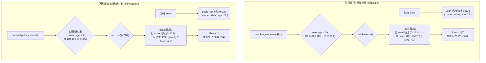

好的，我将以资深技术教育作者的身份，紧密衔接上下文，为你续写 **“3.1.4 状态更新的铁律：不可变性(Immutability)”** 这一节的内容。

---

### 3.1.4 状态更新的铁律：不可变性(Immutability)

在前面的小节中，我们已经学会了如何使用 `useState` 和事件处理来更新简单的状态值，比如数字（`count`）和字符串（`name`）。对于这些**原始数据类型（Primitive Types）**，`setCount(count + 1)` 这样的操作天然地会产生一个全新的值，符合 React 的更新机制。

然而，现实世界的应用远比计数器复杂。我们经常需要处理更复杂的数据结构，比如**对象（Object）**和**数组（Array）**。当 state 是一个对象或数组时，如果我们沿用操作普通 JavaScript 变量的习惯，就会掉入一个极其隐蔽且常见的陷阱。这引出了 React 状态管理中最重要的原则之一：**不可变性（Immutability）**。

简单来说，**不可变性意味着：不要直接修改（mutate）状态变量，而是始终用一个新的状态值来替换它。**

#### 当直接修改对象时：React 的“视而不见”

让我们想象一个场景：你需要管理一个用户的个人信息，包括姓名和年龄。

```jsx
import { useState } from 'react';

function UserProfile() {
  const [user, setUser] = useState({ name: 'Alice', age: 28 });

  function handleAgeIncrease() {
    // ❌ 这是一个非常典型的错误尝试
    user.age = user.age + 1; // 直接修改了 user 对象的 age 属性
    setUser(user); // 传入了同一个对象的引用
    console.log(user); // 控制台会显示 age 确实增加了
  }

  return (
    <div>
      <p>姓名: {user.name}</p>
      <p>年龄: {user.age}</p>
      <button onClick={handleAgeIncrease}>年龄增加</button>
    </div>
  );
}
```

当你点击按钮时，你会发现，虽然控制台打印出的 `user` 对象中 `age` 已经变成了 29、30……但界面上的年龄却始终停留在 28。

**为什么会这样？**

这背后是 JavaScript 的引用类型和 React 的更新检测机制在作祟。

1.  **引用 vs. 值**：JavaScript 的对象和数组是**引用类型**。变量 `user` 存储的不是对象本身，而是指向该对象在内存中地址的“指针”或“引用”。
2.  **React 的浅比较**：当你调用 `setUser(newUser)` 时，React 为了性能优化，会进行一次**浅比较（Shallow Comparison）**，即检查 `newUser` 和旧的 `user` 是否是**同一个对象**（`Object.is(previousState, nextState)`）。
3.  **“视而不见”的发生**：在错误的代码中，我们修改了 `user` 对象内部的属性，但 `user` 变量本身的引用（内存地址）**从未改变**。因此，当我们调用 `setUser(user)` 时，React 比较发现新旧 state 指向的是同一个对象，便认为“哦，状态没有变化”，于是**跳过了这次重新渲染**。



#### 正确之道：创建新的对象和数组

要解决这个问题，我们必须遵守不可变性原则：**创建一个新的对象或数组**，包含你想要的修改。ES6 的**展开语法（Spread Syntax）`...`** 是我们实现这一目标的绝佳工具。

**正确更新对象：**

```jsx
// ✅ 正确的做法
function handleAgeIncrease() {
  // 创建一个全新的对象
  const newUser = {
    ...user, // 1. 复制 user 对象的所有属性
    age: user.age + 1 // 2. 覆盖你想要修改的属性
  };
  setUser(newUser);
}
```
通过 `{ ...user, age: user.age + 1 }`，我们创建了一个全新的对象，它继承了旧 `user` 的所有属性，同时 `age` 属性被赋予了新值。这个新对象拥有一个全新的内存地址，React 在比较时能够立刻发现差异，从而触发界面更新。

---

#### 数组的不可变更新

同样的原则也适用于数组。直接对数组使用 `push`, `pop`, `splice` 等会**修改原数组**的方法，都会导致同样的问题。

`common_mistake_warning`
> **警告：避免使用会修改原数组的方法**
>
> 以下是一些常见的会直接修改（mutate）原数组的 JavaScript 方法，在 React state 更新中应当避免使用：
> - `push()`
> - `pop()`
> - `splice()`
> - `sort()`
> - `reverse()`
>
> 相反，你应该优先选择那些返回一个**新数组**的方法，例如：
> - `map()`
> - `filter()`
> - `concat()`
> - `slice()`

`code_example`
> **实践案例：一个简单的待办事项列表**

假设我们有一个待办事项列表应用，需要实现添加、删除和标记完成的功能。

```jsx
import { useState } from 'react';

let nextId = 3;
const initialTodos = [
  { id: 0, text: '学习 React', done: true },
  { id: 1, text: '编写课程内容', done: false },
  { id: 2, text: '喝杯咖啡', done: false },
];

function TodoList() {
  const [todos, setTodos] = useState(initialTodos);

  // ✅ 添加一项 (使用展开语法)
  function handleAddTodo(text) {
    const newTodo = { id: nextId++, text: text, done: false };
    setTodos([...todos, newTodo]); // 创建新数组，将新项附加到末尾
  }

  // ✅ 删除一项 (使用 filter)
  function handleDeleteTodo(todoId) {
    const newTodos = todos.filter(todo => todo.id !== todoId);
    setTodos(newTodos); // filter 返回一个全新的、符合条件的数组
  }

  // ✅ 更新一项 (使用 map)
  function handleToggleTodo(todoId) {
    const newTodos = todos.map(todo => {
      if (todo.id === todoId) {
        // 对于要修改的项，也创建一个新对象
        return { ...todo, done: !todo.done };
      } else {
        return todo; // 其他项保持不变
      }
    });
    setTodos(newTodos); // map 总是返回一个全新的数组
  }

  // ... JSX to render the list and buttons
}
```

在上面的例子中，每一次状态更新都遵循了不可变性原则：
- **添加**：通过 `[...todos, newTodo]` 创建了一个包含所有旧项和新项的新数组。
- **删除**：`filter` 方法遍历原数组，返回一个不包含被删除项的新数组。
- **更新**：`map` 方法遍历原数组，为每一项创建一个映射。对于需要修改的项，我们创建了一个新的对象来替换它；对于不需要修改的项，我们直接返回原项。最终，`map` 返回一个包含所有更新后项的新数组。

#### `comparison`：可变 vs. 不可变操作对比

| 操作 | 错误的可变操作 (Mutation) ❌ | 正确的不可变操作 (Immutability) ✅ |
| :--- | :--- | :--- |
| **更新对象属性** | `obj.prop = value; setObj(obj);` | `setObj({ ...obj, prop: value });` |
| **向数组添加** | `arr.push(item); setArr(arr);` | `setArr([...arr, item]);` |
| **从数组删除** | `arr.splice(index, 1); setArr(arr);` | `setArr(arr.filter(i => i.id !== id));`|
| **替换数组某项**| `arr[index] = newItem; setArr(arr);` | `setArr(arr.map(i => i.id === id ? newItem : i));`|

---

#### 总结与回顾

遵守状态的不可变性原则是编写健壮、可预测的 React 应用的基石。它不仅仅是一个“推荐做法”，而是确保 React 核心机制正常工作的“铁律”。

- **核心原则**：将 state 视为只读的。不要直接修改 state 中的对象或数组。
- **更新方法**：当你需要更新对象或数组时，总是创建一个**新的**副本，并在副本上进行修改。
- **常用工具**：善用 ES6 的展开语法 `...`，以及数组的 `map()`, `filter()` 等返回新数组的方法。
- **背后原因**：React 通过浅比较来检测 state 变化。只有当 state 的引用发生改变时，React 才能高效地识别更新并触发重新渲染。

牢记这条铁律，你将能避免许多因状态更新而导致的“UI不刷新”的诡异 bug，为构建更复杂、更可靠的 React 应用打下坚实的基础。