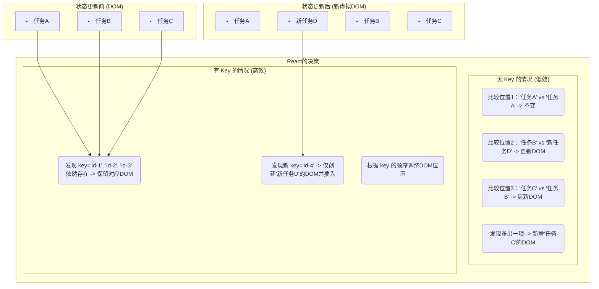

好的，作为一位资深的技术教育作者，我将为你撰写这篇关于React列表渲染的教学段落。

---

### 3.2.2 工具二：列表渲染 (List Rendering)

在上一节中，我们了解了如何将单一的数据（如一个数字或字符串）通过 State 绑定到视图上，实现了数据驱动UI的基础。然而，在真实的Web应用中，我们更常面对的是数据集合，例如：一个待办事项列表、一组成员名单、或者一个商品目录。这时，我们需要一种方法，能根据一个数组动态地生成一串UI元素。React为此提供了强大而直观的工具：**列表渲染**。

其核心思想，就是借助 JavaScript 中我们熟悉的原生数组方法 `.map()`。

#### 从数据数组到元素列表：`.map()` 的魔力

你可以将 `.map()` 方法想象成一个“UI元素生产线”。它接收一个数据数组作为“原材料”，然后对每个原材料（数组中的每个项）执行一个加工函数，最终产出一个全新的、由React元素组成的“产品”数组。

让我们来看一个简单的例子。假设我们有一个表示任务清单的数组：

```javascript
const tasks = [
  '学习 React 核心概念',
  '完成“状态与事件”章节的练习',
  '准备项目需求评审'
];
```

如果我们想把这个数组渲染成一个无序列表 (`<ul>`)，我们可以这样做：

```jsx
function TaskList() {
  const tasks = [
    '学习 React 核心概念',
    '完成“状态与事件”章节的练习',
    '准备项目需求评审'
  ];

  // 使用 .map() 将字符串数组转换为 <li> 元素数组
  const listItems = tasks.map((task, index) => 
    <li key={index}>{task}</li>
  );

  return (
    <div>
      <h2>我的任务清单</h2>
      <ul>
        {listItems}
      </ul>
    </div>
  );
}
```

在上面的代码中，`tasks.map(...)` 遍历了 `tasks` 数组。对于数组中的每一个 `task` 字符串，它都返回一个 `<li>{task}</li>` JSX 元素。最终，`listItems` 变量就变成了一个包含三个 `<li>` 元素的数组。当我们在 `<ul>` 中用 `{}` 包裹 `listItems` 时，React 会聪明地将这个元素数组展开并渲染到DOM中。

> **提示**：你也可以直接在JSX中内联调用 `.map()`，这在实践中更为常见，代码也更简洁：
>
> ```jsx
> <ul>
>   {tasks.map((task, index) => (
>     <li key={index}>{task}</li>
>   ))}
> </ul>
> ```

#### `key`: 列表项的“身份证”

你可能已经注意到了每个 `<li>` 元素上都有一个特殊的 prop：`key`。当你运行上面的代码时，一切正常。但如果你忘记写 `key`，React 会在浏览器的开发者控制台中给你一个警告：`Warning: Each child in a list should have a unique "key" prop.`

**为什么 `key` 如此重要？**

`key` 是React用来识别列表中各个元素的“身份证”。当列表数据发生变化时（例如，添加、删除或重新排序），React 需要一种高效的方式来确定哪些元素是新的、哪些被移除了、哪些只是改变了位置。这个过程被称为“协调”（Reconciliation）。

如果没有 `key`，React 只能按照顺序逐个比较新旧列表。如果我们在列表的开头添加一个新项，React 可能会认为*所有*后续的元素都发生了改变，从而导致不必要的DOM重建，影响性能。

有了稳定且唯一的 `key`，React 就能精准地识别出每个元素。

**`key` 的作用过程可视化：**

我们可以用一个简化的流程图来理解 `key` 的作用。



这个图示表明，`key` 帮助 React 从“盲目地按顺序对比”转变为“精准地按身份识别”，极大地优化了更新效率。

#### 如何选择一个好的 `key`？

选择 `key` 的最佳实践遵循两个原则：**唯一性**和**稳定性**。

1.  **最佳选择：使用数据中自带的唯一ID**
    绝大多数情况下，你的数据（例如从数据库获取的）都会有一个唯一的标识符，如 `id`, `uuid`, `sku` 等。这正是 `key` 的完美来源，因为它在数据的整个生命周期中都是稳定且唯一的。

    ```jsx
    // code_example
    function UserList() {
      const [users, setUsers] = React.useState([
        { id: 'u001', name: 'Alice' },
        { id: 'u002', name: 'Bob' },
        { id: 'u003', name: 'Charlie' }
      ]);

      return (
        <ul>
          {users.map(user => (
            <li key={user.id}> 
              {user.name}
            </li>
          ))}
        </ul>
      );
    }
    ```

2.  **次优选择：当没有ID时，自己生成**
    如果数据源没有提供唯一ID，你可以在加载数据时为每一项生成一个。但要确保这个ID在组件的生命周期内保持不变。

3.  **最后的选择（且需谨慎）：使用数组索引 `index`**

    > ⚠️ **常见陷阱**
    >
    > 使用数组的索引 `index` 作为 `key` (`<li key={index}>...</li>`) 是一个非常常见的错误。**只有在满足以下所有条件时，才可以安全地使用索引作为 `key`：**
    >
    > 1.  列表和项目是静态的——它们不会被计算或改变。
    > 2.  列表中的项目没有自己的ID。
    > 3.  列表永远不会被重新排序或过滤。
    >
    > 如果你的列表项可以被重新排序、添加或删除（例如一个待办事项列表），使用 `index` 作为 `key` 会导致严重的性能问题和与组件状态相关的难以察觉的bug。因为当列表顺序改变时，项的 `index` 会变，React 会错误地匹配新旧元素，可能导致组件状态错乱。

**记住**：`key` 只需要在兄弟节点之间唯一，不需要全局唯一。

---

#### 本节要点

*   **核心工具**：使用 JavaScript 的 `.map()` 方法将数据数组转换为一个 React 元素数组，以实现动态列表的渲染。
*   **关键Prop `key`**：在渲染列表时，必须为每个列表项提供一个稳定且唯一的 `key` prop。
*   **`key` 的作用**：`key` 是 React 高效更新UI的“身份证”，帮助 React 在列表变化时精确识别元素的增、删、改、移。
*   **最佳实践**：优先使用数据项自身携带的唯一ID（如 `item.id`）作为 `key`。应极力避免在动态列表中使用数组索引 `index` 作为 `key`。