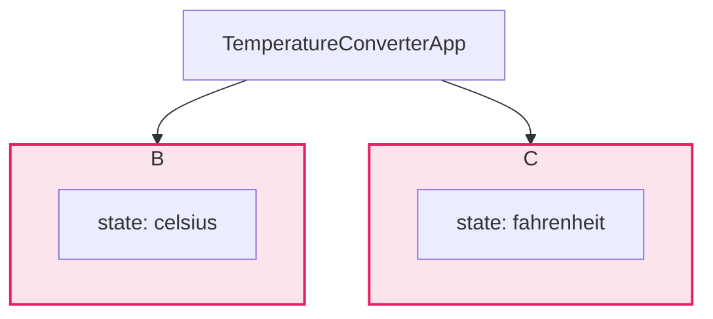

好的，我们承接上一章关于组件内部状态的讨论，自然地过渡到多个组件间共享状态时遇到的挑战。

***

### 4.2.1 问题的出现：当多个组件需要共享状态

在第三章中，我们已经熟练掌握了如何使用 `useState` 来管理组件自身的内部状态。这对于构建独立的、自包含的组件来说非常有效。然而，当应用变得复杂，组件间的协作变得必不可少时，一个棘手的问题便浮出水面：**如果多个“兄弟”组件需要读取并响应同一个状态，我们该怎么办？**

让我们通过一个具体的案例来剖析这个问题。

#### Case Study: 一个温度转换器

想象一下，我们需要构建一个简单的温度转换器应用。这个应用包含两个输入框：

1.  **摄氏度输入框 (`CelsiusInput`)**: 用户可以在这里输入摄氏温度。
2.  **华氏度输入框 (`FahrenheitInput`)**: 用户可以在这里输入华氏温度。

我们期望的交互效果是：当用户在任意一个输入框中输入数值时，另一个输入框能立即根据转换公式，自动计算并显示对应的温度。例如，在摄氏度输入框输入 `0`，华氏度输入框应自动显示 `32`。

##### 初步尝试：各自为政的状态

根据我们目前学到的知识，一个自然而然的想法是让每个输入框组件都拥有自己的 state，用来管理其输入值。

让我们来搭建这个场景的初始（但有问题的）代码结构：

```jsx
// CelsiusInput.js
import React, { useState } from 'react';

function CelsiusInput() {
  const [celsius, setCelsius] = useState('');

  const handleChange = (e) => {
    setCelsius(e.target.value);
    // 问题：如何在这里更新 FahrenheitInput 的值？
  };

  return (
    <fieldset>
      <legend>输入摄氏温度:</legend>
      <input value={celsius} onChange={handleChange} />
    </fieldset>
  );
}
```

```jsx
// FahrenheitInput.js
import React, { useState } from 'react';

function FahrenheitInput() {
  const [fahrenheit, setFahrenheit] = useState('');

  const handleChange = (e) => {
    setFahrenheit(e.target.value);
    // 问题：如何在这里更新 CelsiusInput 的值？
  };

  return (
    <fieldset>
      <legend>输入华氏温度:</legend>
      <input value={fahrenheit} onChange={handleChange} />
    </fieldset>
  );
}
```

```jsx
// TemperatureConverterApp.js (父组件)
import React from 'react';
import CelsiusInput from './CelsiusInput';
import FahrenheitInput from './FahrenheitInput';

function TemperatureConverterApp() {
  return (
    <div>
      <CelsiusInput />
      <FahrenheitInput />
    </div>
  );
}
```

##### 问题的根源：孤立的状态

当我们运行这个应用时，会发现这两个输入框完全独立工作，互不影响。`CelsiusInput` 的状态更新时，`FahrenheitInput` 对此一无所知，反之亦然。这与我们的需求背道而驰。

问题的根源在于：**状态被孤立在了各自的组件内部**。React 的数据流是自上而下单向的（通过 props 传递），兄弟组件之间并没有直接通信的标准渠道。`CelsiusInput` 无法直接“伸手”去修改 `FahrenheitInput` 的内部状态。

我们可以用一张图来清晰地展示当前这种不理想的结构：


*图 4-1：孤立的状态模型。状态被“囚禁”在各自的组件内部，无法在兄弟组件间同步。*

为了实现数据同步，我们需要找到一个共同的地方来存储这个“唯一”的温度值，这个地方必须是两个输入框组件都能访问到的。换句话说，我们需要一个**单一数据源 (Single Source of Truth)**。

---

#### 本节小结：识别共享状态的需求

*   **核心困境**：当多个组件需要依赖和修改同一份数据时，将这份数据作为各自的内部状态会导致数据不一致和同步困难。
*   **数据流限制**：React 的单向数据流原则上不允许兄弟组件之间直接通信，这使得状态同步问题更加突出。
*   **待解决的问题**：我们必须寻找一种机制，将这份需要共享的状态放置在一个“更高”的层级，让所有相关的子组件都能访问和更新它。

这个看似无解的困局，正是“状态提升”模式将要优雅解决的核心问题。在下一节中，我们将学习如何通过将状态“提升”到它们共同的父组件中，来实现数据的同步与共享。