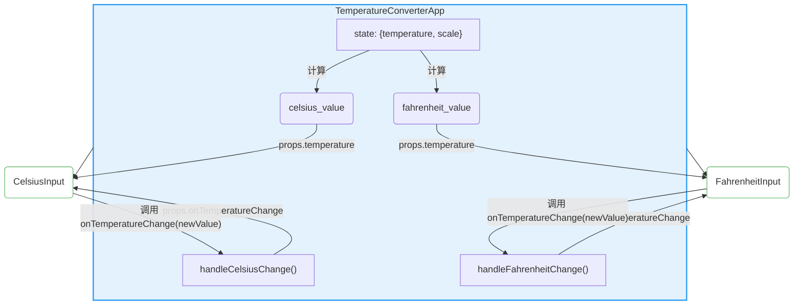

好的，我们继续。

***

### 4.2.2 解决方案：“状态提升” (Lifting State Up)

上一节我们遇到了状态孤立的困境，而“状态提升”（Lifting State Up）正是 React 社区为解决此类问题提供的官方核心模式。它的思想非常直观且强大：

> **当多个组件需要反映相同的变化数据时，我们应该将共享状态提升到它们最近的共同父组件中。**

换言之，我们不再让子组件“各自为政”，而是由一个共同的“管理者”（父组件）来统一持有和更新这份状态。然后，父组件通过 props 将状态分发给需要它的子组件，同时，也通过 props 将“更新状态的权力”（以回调函数的形式）授予需要修改状态的子组件。

这个过程形成了一个清晰、可预测的数据流闭环，我们称之为**“数据下传，事件上传”**（Data down, events up）。

#### 实施步骤：重构温度转换器

让我们将这个理论应用到之前的温度转换器案例上，一步步进行重构。

**第一步：识别共享状态并找到共同父组件**

-   **共享状态**：是“当前的温度值”。无论是摄氏度还是华氏度，它们本质上都指向同一个物理量。我们需要一个单一的、权威的数据源来表示它。
-   **共同父组件**：`CelsiusInput` 和 `FahrenheitInput` 的最近共同父组件是 `TemperatureConverterApp`。因此，`TemperatureConverterApp` 就是我们提升状态的目标位置。

**第二步：将状态和逻辑从子组件移至父组件**

我们将在 `TemperatureConverterApp` 中创建 state。为了实现“单一数据源”，我们只存储一个基准值。一个明智的选择是始终以摄氏度为单位存储温度，或者，更灵活地，存储当前输入的值和其单位。我们选择后者。

同时，我们需要一些辅助函数来进行温度单位的转换。

```javascript
// utils/temperatureConverter.js (可以单独创建工具函数)
function toCelsius(fahrenheit) {
  return ((fahrenheit - 32) * 5) / 9;
}

function toFahrenheit(celsius) {
  return (celsius * 9) / 5 + 32;
}

// 尝试转换，如果输入无效则返回空字符串
function tryConvert(temperature, convert) {
  const input = parseFloat(temperature);
  if (Number.isNaN(input)) {
    return '';
  }
  const output = convert(input);
  const rounded = Math.round(output * 1000) / 1000;
  return rounded.toString();
}
```

现在，我们来改造 `TemperatureConverterApp`：

```jsx
// TemperatureConverterApp.js (重构后)
import React, { useState } from 'react';
import CelsiusInput from './CelsiusInput';
import FahrenheitInput from './FahrenheitInput';
// 假设转换函数在同一个文件或已导入

function TemperatureConverterApp() {
  // 状态被提升到父组件！
  // 我们需要两个状态：当前输入的温度值和其单位（'c' 或 'f'）
  const [temperature, setTemperature] = useState('');
  const [scale, setScale] = useState('c'); // 'c' for Celsius, 'f' for Fahrenheit

  const handleCelsiusChange = (temperature) => {
    setScale('c');
    setTemperature(temperature);
  };

  const handleFahrenheitChange = (temperature) => {
    setScale('f');
    setTemperature(temperature);
  };

  // 根据单一数据源计算出两个输入框应该显示的值
  const celsius = scale === 'f' ? tryConvert(temperature, toCelsius) : temperature;
  const fahrenheit = scale === 'c' ? tryConvert(temperature, toFahrenheit) : temperature;

  return (
    <div>
      {/* 
        数据下传：将计算后的值和更新函数作为 props 传递给子组件 
      */}
      <CelsiusInput 
        temperature={celsius} 
        onTemperatureChange={handleCelsiusChange} />
      <FahrenheitInput 
        temperature={fahrenheit} 
        onTemperatureChange={handleFahrenheitChange} />
    </div>
  );
}
```

**第三步：改造子组件为“受控组件”**

原来的 `CelsiusInput` 和 `FahrenheitInput` 内部是有状态的，我们称之为“非受控”的（相对于父组件而言）。现在，它们将不再维护自己的状态，而是完全由父组件通过 props 传入的数据和回调函数来驱动。这种由父组件完全控制的子组件，我们称之为**受控组件 (Controlled Component)**。

```jsx
// CelsiusInput.js (重构后 - 变为受控组件)
import React from 'react';

function CelsiusInput(props) {
  const handleChange = (e) => {
    // 事件上传：调用从 props 接收的函数，将更新意图“上报”给父组件
    props.onTemperatureChange(e.target.value);
  };

  return (
    <fieldset>
      <legend>输入摄氏温度:</legend>
      {/* 数据下传：显示的值完全由 props.temperature 决定 */}
      <input value={props.temperature} onChange={handleChange} />
    </fieldset>
  );
}
```

`FahrenheitInput` 的改造与 `CelsiusInput` 完全类似：

```jsx
// FahrenheitInput.js (重构后 - 变为受控组件)
import React from 'react';

function FahrenheitInput(props) {
  const handleChange = (e) => {
    // 事件上传
    props.onTemperatureChange(e.target.value);
  };

  return (
    <fieldset>
      <legend>输入华氏温度:</legend>
      {/* 数据下传 */}
      <input value={props.temperature} onChange={handleChange} />
    </fieldset>
  );
}
```

#### 数据流的可视化

现在，我们的应用结构和数据流已经发生了根本性的变化。状态不再被“囚禁”于子组件中，而是集中在父组件，并形成了一个清晰的循环。


*图 4-2：“状态提升”后的数据流模型。状态集中在父组件 `TemperatureConverterApp`，通过 props (`temperature`) 将数据**下传**给子组件，子组件通过调用 props 传递的回调函数 (`onTemperatureChange`) 将更新事件**上传**给父组件，形成一个完整的、单向的数据流闭环。*

现在，当用户在任何一个输入框中输入时：
1.  子组件的 `onChange` 事件被触发。
2.  它调用从 props 接收的 `onTemperatureChange` 函数，并将新的输入值作为参数传入。
3.  父组件中对应的处理函数（如 `handleCelsiusChange`）被执行。
4.  父组件调用 `setTemperature` 和 `setScale` 来更新自己的 state。
5.  state 的更新触发父组件 `TemperatureConverterApp` 的重新渲染。
6.  在重新渲染期间，`celsius` 和 `fahrenheit` 变量会根据最新的 state 被重新计算。
7.  这些新计算出的值通过 props 再次传递给两个子组件。
8.  子组件接收到新的 props 并重新渲染，从而在界面上显示出同步更新后的值。

至此，我们完美地实现了两个输入框的数据同步。

---

#### 本节小结：状态提升的核心原则

“状态提升”模式是 React 中管理跨组件状态的基础，也是更高级状态管理方案（如 Context API, Redux）的思想源头。理解并掌握它至关重要。

*   **单一数据源 (Single Source of Truth)**：对于任何在应用中变化的数据，都应该有唯一一个“可信”的来源。通过状态提升，我们将这个来源确定为共同的父组件。这消除了数据冲突和不一致的风险。
*   **状态归属**：状态不应该默认属于某个组件，而应该属于**需要该状态的所有组件的最近共同祖先**。
*   **数据流向**：形成了清晰的“自上而下”的数据流（通过 props）和“自下而上”的事件流（通过回调函数），使得应用的逻辑更易于理解和调试。
*   **组件职责分离**：父组件（如 `TemperatureConverterApp`）变成了“智能”的容器组件，负责状态管理和业务逻辑。子组件（如 `CelsiusInput`）变成了“笨拙”的展示组件，只负责渲染 UI 和派发事件，使其更具复用性。