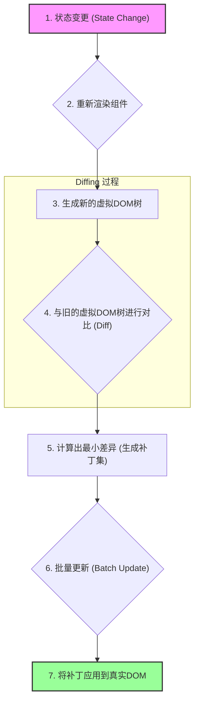

好的，作为一位资深的技术教育作者，我将紧接“阐述直接操作真实DOM的高昂成本，引出虚拟DOM”这一背景，为您续写 **4.3.1 性能基石：为何需要虚拟DOM (Virtual DOM)** 的后续内容。

---

### 4.3.1 性能基石：为何需要虚拟DOM (Virtual DOM)

我们已经了解到，频繁且直接地操作真实DOM会引发浏览器昂贵的“重排”（Reflow）与“重绘”（Repaint），是前端应用性能的主要瓶颈。为了绕开这个“重型武器”，React引入了一层巧妙的抽象——虚拟DOM（Virtual DOM）。那么，这个存在于内存中的“虚拟”结构，究竟是如何化解性能难题的呢？

#### 虚拟DOM：内存中的UI“蓝图”

虚拟DOM，顾名思义，它并不是真实的DOM。**它本质上是一个轻量级的、纯粹的JavaScript对象，用来描述UI的结构、属性和状态**。可以把它想象成一张建筑蓝图，它详细规划了房屋的结构（哪个房间在哪里），但它本身并不是那栋沉重的实体建筑。

让我们来看一个简单的对比：

```jsx
// 我们在React中这样写JSX (这会被编译)
const element = (
  <div id="app" className="container">
    <p>Hello, React!</p>
  </div>
);

// 它在内存中对应的虚拟DOM对象 (简化表示)
const virtualDOM = {
  type: 'div',
  props: {
    id: 'app',
    className: 'container',
    children: [
      {
        type: 'p',
        props: {
          children: 'Hello, React!'
        }
      }
    ]
  }
};
```

操作这样一个JavaScript对象的速度是极快的，因为它不涉及任何浏览器API调用，仅仅是内存中的数据读写。这为React进行高效的性能优化奠定了基础。React的策略是：**每当UI状态发生变化时，不是直接去操作真实DOM，而是在内存中构建一棵新的虚拟DOM树。**

#### “找不同”游戏：Diffing算法的核心思想

现在，我们有了两个版本的“UI蓝图”：一个是状态更新前的旧虚拟DOM树，另一个是根据新状态生成的新虚拟DOM树。React接下来要做的，就是一个高效的“找不同”（Diffing）游戏。

这个过程被称为**协调（Reconciliation）**。React会运用其高效的Diffing算法，逐层对比新旧两棵虚拟DOM树，找出它们之间的最小差异。

**核心对比策略：**
1.  **同层比较**：React的Diffing算法是一个启发式算法，它假设不同类型的节点会生成不同的树，因此它只会对同一层级的节点进行比较。如果一个`<div>`变成了`<p>`，React会直接销毁旧的`<div>`及其所有子节点，然后创建一个新的`<p>`。
2.  **属性（Props）更新**：如果节点类型相同，React会检查它们的属性（`props`）。例如，`className`从`'before'`变成了`'after'`，React会记录下这个变化。
3.  **子节点处理与`key`的重要性**：这是最复杂也最关键的部分。在对比子节点列表时，React会遍历列表，找出需要新增、删除或移动的节点。此时，`key`属性就显得至关重要。它为每个子节点提供了一个稳定的身份标识，使得React能够精准识别哪个节点是移动了，而不是简单地删除旧节点再创建新节点。

**一个实践示例：**

假设我们有一个列表，状态更新后，列表项的顺序和内容发生了变化。

*   **更新前 VDOM:**
    ```js
    [
      { type: 'li', key: 'A', props: { children: 'Apple' } },
      { type: 'li', key: 'B', props: { children: 'Banana' } }
    ]
    ```
*   **更新后 VDOM:**
    ```js
    [
      { type: 'li', key: 'B', props: { children: 'Banana' } },
      { type: 'li', key: 'C', props: { children: 'Cherry' } }
    ]
    ```
*   **Diffing结果 (差异集):**
    1.  **移除** `key`为`'A'`的`<li>`节点。
    2.  **保留并移动** `key`为`'B'`的`<li>`节点到新的位置。
    3.  **新增** `key`为`'C'`的`<li>`节点。

React通过这个对比过程，最终得到一个包含所有必要变更的“补丁集”（Patches）。

#### 流程总览：从状态变更到真实DOM更新

整个过程可以由下面的流程图清晰地展示：



最关键的一步是**批量更新（Batch Update）**。React会将一次事件循环中（例如一次点击事件）的所有状态更新所产生的DOM操作收集起来，再一次性地、以最优的方式应用到真实DOM上。这就好比装修房子，与其让工人来一次就敲一锤子、刷一层漆，不如让他们把所有要做的改动都计划好，然后集中一天高效完成。这种机制极大地减少了对真实DOM的访问次数，从而避免了性能损耗。

#### 本节小结

虚拟DOM并非直接提升性能的“银弹”，它真正的价值在于提供了一种可能性：

*   **性能下限的保证**：通过在内存中计算差异，虚拟DOM确保了即使在不写任何原生DOM优化代码的情况下，应用性能也不会太差。它将复杂的DOM操作逻辑封装起来，让开发者可以专注于业务逻辑。
*   **批量更新与最小化操作**：Diffing算法找出的最小变更集，结合批量更新机制，是React高性能的根本原因。它避免了不必要的DOM重排与重绘。
*   **跨平台能力**：由于虚拟DOM是纯JavaScript对象，它脱离了对特定渲染环境（如浏览器DOM）的依赖。这使得React不仅能用于Web开发（React DOM），还能驱动移动端原生应用（React Native）甚至其他平台，实现了“一次学习，随处编写”的理念。

理解了虚拟DOM的工作原理，我们才能更深入地 comprehend React 的渲染机制，并为后续学习更高级的性能优化技巧打下坚实的基础。