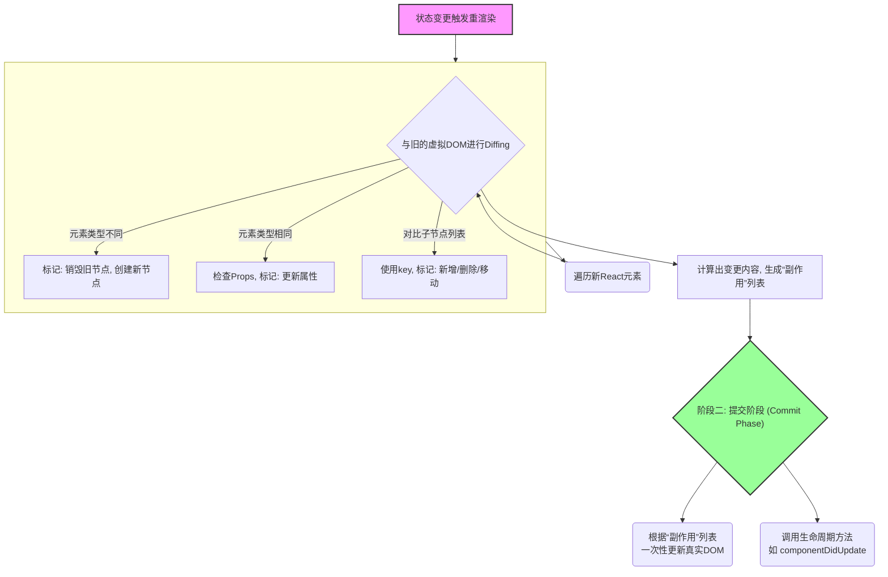

好的，作为一位资深的技术教育作者，我将紧接上一节“性能基石：为何需要虚拟DOM”的内容，为您续写 **4.3.2 高效更新：协调过程 (Reconciliation) 简介**。

---

### 4.3.2 高效更新：协调过程 (Reconciliation) 简介

上一节，我们理解了虚拟DOM作为性能基石的“为什么”，它通过在内存中进行“找不同”来避免直接操作真实DOM。现在，我们将揭开幕后英雄——**协调（Reconciliation）过程**的神秘面纱，深入探究React是如何具体、且高效地执行这个“找不同”游戏的。

我们所说的“协调”，就是React将新的虚拟DOM树与旧的虚拟DOM树进行对比，并计算出最小化更新到真实DOM所需步骤的整个过程。其核心就是我们之前提到的**Diffing（差异对比）算法**。

#### 权衡之下的启发式算法

要完整对比两棵树的最小差异，传统算法的复杂度高达O(n³)，这对于需要频繁更新的UI界面来说是无法接受的。因此，React的工程师们做出了一个关键的权衡：他们放弃了寻找绝对最小差异的完美算法，转而实现了一个基于**启发式（Heuristics）**的、复杂度仅为O(n)的高效算法。这个算法建立在两个核心假设之上：

1.  **不同类型的组件会产生截然不同的DOM树**。例如，一个`<div>`几乎不可能在一次更新中变成一个`<p>`。如果类型不同，React不会尝试去对比它们的具体内容，而是直接销毁旧的节点，创建并插入全新的节点。
2.  **开发者可以通过 `key` 属性来标识在多次渲染之间保持稳定的元素**。在处理一个元素列表时，`key`就像是每个元素的身份证，帮助React精准地识别出移动、新增或删除的项。

正是这两个务实的假设，让React的Diffing算法变得异常迅捷。

#### 协调的两大阶段

React的协调过程在现代版本（React 16+，引入了Fiber架构）中，被清晰地划分为两个阶段。理解这两个阶段对于深入掌握React的渲染机制至关重要。



1.  **阶段一：渲染/计算阶段 (Render Phase)**
    这个阶段是**异步、可中断的**。React会从根节点开始，遍历新的React元素树，并将每个元素与旧的虚拟DOM（在Fiber架构中称为Fiber树）中的对应节点进行比较。

    *   **当节点类型不同时**：如前所述，React会认为这是一次彻底的替换。它会销毁旧节点（及其所有子孙节点）对应的DOM，然后创建并插入新的DOM。
        ```jsx
        // 更新前
        <div className="card">...</div>
        // 更新后
        <section className="card">...</section>
        // React的操作：移除整个div，插入一个新的section。
        ```
    *   **当节点类型相同时**：React会保留对应的真实DOM节点，然后只对比和更新变化的属性。
        ```jsx
        // 更新前
        <div className="card before" style={{ color: 'blue' }}>...</div>
        // 更新后
        <div className="card after" style={{ color: 'red' }}>...</div>
        // React的操作：仅修改真实DOM节点的className和style属性。
        ```
    *   **当处理子节点列表时**：这是`key`发挥巨大作用的地方。
        *   **有`key`的情况**：React会使用`key`来匹配新旧列表中的元素。它能高效地识别出哪些元素是移动了位置，哪些是新增的，哪些是被删除了。
        *   **无`key`的情况**：React只能逐个按顺序（index）对比。如果在一个列表的开头插入一个新元素，React会误以为所有后续的元素都发生了内容更新，导致大量的非必要DOM操作，性能急剧下降，甚至可能引发组件状态混乱的bug。**因此，为列表中的每一项提供一个稳定且唯一的`key`，是React开发中最重要的性能优化实践之一。**

    在这个阶段，所有的计算都发生在内存中，它会生成一个“副作用”（Side Effects）列表，记录了所有需要对真实DOM进行的操作（如“新增”、“删除”、“更新”）。

2.  **阶段二：提交阶段 (Commit Phase)**
    这个阶段是**同步、不可中断的**。一旦渲染阶段完成，React就会进入提交阶段。它会一次性地、以一个原子操作将渲染阶段计算出的所有“副作用”应用到真实DOM上。这个批量执行的过程，正是我们之前提到的**批量更新（Batch Update）**，它确保了UI的更新是高效且一致的。

    完成DOM更新后，React还会同步调用相应的生命周期方法，如 `componentDidMount` 和 `componentDidUpdate`，以及函数组件中的 `useLayoutEffect` 和 `useEffect` 的清理函数与执行函数。

#### 本节小结

通过本节的学习，我们深入了解了React的协调过程：

*   **核心是启发式Diffing算法**：它通过两个务实的假设，实现了O(n)的高效性能，在速度与精确性之间取得了绝佳平衡。
*   **划分为两大阶段**：
    *   **渲染阶段**：在内存中异步、可中断地进行计算，找出新旧虚拟DOM的差异。
    *   **提交阶段**：同步、不可中断地将所有变更一次性应用到真实DOM，保证更新的原子性。
*   **`key`的至关重要性**：在处理列表时，`key`是React能够高效、准确地进行Diffing的关键。它为列表项提供了稳定的身份标识，是避免不必要DOM操作和潜在错误的“金钥匙”。

理解协调过程，不仅能帮助我们写出性能更优的React代码，也为我们后续学习React的并发特性（Concurrent Mode）等高级主题奠定了坚实的基础。