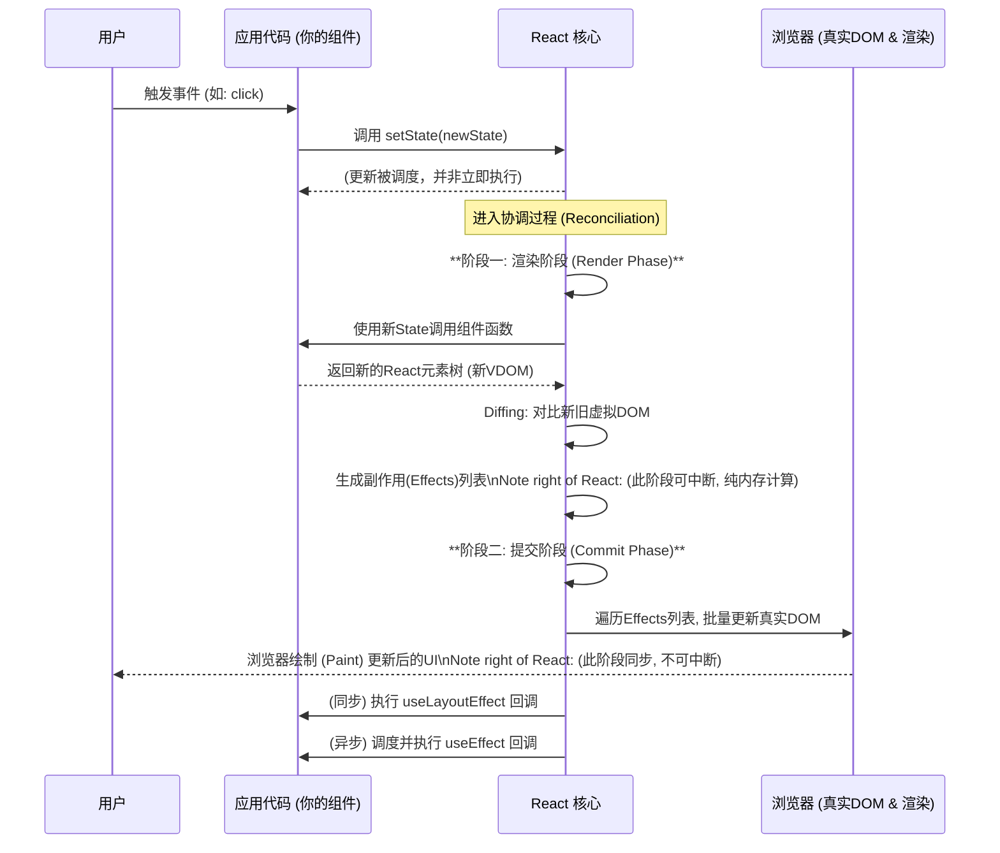

好的，作为一位资深的技术教育作者，我将紧接“协调过程的两大阶段”这一内容，为您续写 **4.3.3 流程总览：从State变更到UI更新**，将所有知识点融会贯通，描绘一幅完整的React更新画卷。

---

### 4.3.3 流程总览：从State变更到UI更新

在分别探讨了虚拟DOM的“为何”（4.3.1）与协调过程的“如何”（4.3.2）之后，现在是时候将这些珍珠串成一条完整的项链了。让我们以一次最常见的用户交互为例，完整地走一遍从用户点击按钮、状态（State）变更，到最终屏幕上UI更新的全过程。这个过程是React响应式魔法的核心所在。

#### 一次更新的完整生命周期

想象我们有一个简单的计数器应用：

```jsx
import React, { useState, useEffect } from 'react';

function Counter() {
  const [count, setCount] = useState(0);

  useEffect(() => {
    document.title = `You clicked ${count} times`;
  }, [count]);

  return (
    <div>
      <p>You clicked {count} times</p>
      <button onClick={() => setCount(count + 1)}>
        Click me
      </button>
    </div>
  );
}
```

当用户点击 "Click me" 按钮时，React内部会发生什么？

#### 步骤一：事件触发与状态更新调度

1.  **用户交互**：用户点击按钮，触发了`onClick`事件。
2.  **调用`setState`**：`onClick`事件处理器被执行，调用了`setCount(count + 1)`。
3.  **调度更新**：**关键点在于，React并不会立即同步地重新渲染组件**。它会将这个状态更新请求“调度”（Schedule）起来。React内部有一个调度器，它会根据更新的优先级（例如，用户输入产生的更新优先级高于数据请求回来的更新）和当前的工作负载，来决定何时执行这个更新任务。这种异步处理机制是React并发特性的基础，能确保高优先级任务（如用户输入）的流畅响应。

#### 步骤二：协调过程启动（渲染阶段）

当调度器决定执行更新时，协调过程正式开始，首先进入**渲染阶段（Render Phase）**。

1.  **重新执行组件**：React会重新调用`Counter`函数组件，此时，`useState`会返回新的状态值 `1`。
2.  **生成新虚拟DOM**：`Counter`函数返回一个新的React元素树（即新的虚拟DOM）。在这个例子中，新的虚拟DOM树中`<p>`标签的子节点将是文本 "You clicked 1 times"。
3.  **Diffing算法介入**：React会在内存中，将这次新生成的虚拟DOM树与上一次渲染时保留的旧虚拟DOM树（在Fiber架构中是旧的Fiber树）进行对比（Diffing）。
    *   `<div>` vs `<div>`：类型相同，保留。
    *   `<p>` vs `<p>`：类型相同，保留。检查其子节点，发现文本内容从 "0" 变成了 "1"。React会记录下这个差异，标记这个DOM节点需要更新。
    *   `<button>` vs `<button>`：类型相同，属性和子节点均未变化，无操作。
4.  **生成副作用列表**：整个渲染阶段的产出，是一个“副作用”（Side Effects）列表。这个列表精确地描述了需要对真实DOM做的所有改动。在我们的例子中，这个列表可能只有一条记录：`{ type: 'UPDATE', domNode: <p>, payload: { children: '1' } }`。

**请记住，到目前为止，所有操作都发生在内存中，真实的浏览器DOM还没有被触碰一分一毫。** 这个阶段是可中断的，如果此时有更高优先级的任务进来，React可以暂停当前的计算，去响应更重要的事。

#### 步骤三：应用变更（提交阶段）

渲染阶段完成后，React会进入**提交阶段（Commit Phase）**。

1.  **执行DOM操作**：React会遍历渲染阶段生成的副作用列表，并一次性地、同步地将所有变更应用到真实DOM上。对于我们的计数器，React会找到对应的真实`<p>`元素，并将其文本内容更新为 "You clicked 1 times"。
2.  **浏览器绘制**：浏览器检测到DOM结构发生变化，触发重绘（Repaint），将更新后的内容显示在屏幕上。由于我们的改动仅涉及文本，通常不会触发成本高昂的重排（Reflow）。

这个阶段是**同步且不可中断的**，以确保UI的最终状态是一致的，避免用户看到更新到一半的奇怪界面。

#### 步骤四：运行副作用钩子

在DOM更新被成功“提交”到屏幕之后，React会处理相应的副作用钩子。

1.  **同步执行`useLayoutEffect`**：如果在组件中使用了`useLayoutEffect`，它的回调函数会在此刻同步执行。这通常用于需要同步读取DOM布局并触发更新的场景。
2.  **异步执行`useEffect`**：React会调度`useEffect`的回调函数，在浏览器完成绘制之后**异步执行**。在我们的例子中，`useEffect`的回调函数`document.title = 'You clicked 1 times'`会被执行，更新浏览器标签页的标题。这种异步执行的策略确保了副作用操作不会阻塞浏览器的渲染流程。

#### 流程图总览

下面这个序列图清晰地展示了从用户交互到UI更新的完整旅程：



#### 一次完整更新旅程清单

为了巩固记忆，你可以使用下面的清单来回顾一次状态更新的全过程：

-   [✅] **1. 触发源头**：用户交互或副作用（如API返回）调用 `setState`。
-   [✅] **2. 调度更新**：React 将更新任务放入队列，等待合适的时机执行。
-   [✅] **3. 计算差异 (渲染阶段)**：React 在内存中重新渲染组件，通过 Diffing 算法找出新旧虚拟DOM的最小差异集。
-   [✅] **4. 应用变更 (提交阶段)**：React 将所有DOM操作一次性、同步地应用到真实DOM上。
-   [✅] **5. 清理与副作用**：DOM更新后，React同步执行`useLayoutEffect`，并异步调度执行`useEffect`。

#### 本节小结

通过本节的梳理，我们终于将React的渲染机制串联成了一个完整的故事。这个故事的核心思想是**分离关注点**：

*   **开发者（我们）的关注点**：通过`state`和`props`，以一种声明式的方式描述UI“应该是什么样子”。我们只需关心数据，无需关心繁琐的DOM操作。
*   **React的关注点**：接收到状态变更的信号后，在幕后高效地完成从计算差异到更新UI的所有脏活累活。它通过虚拟DOM、协调过程和批量更新等一系列机制，来保证这个过程的性能和可靠性。

深刻理解这一流程，不仅能让你对React的工作原理了如指掌，更能帮助你在遇到性能问题或复杂的组件行为时，能够精准地定位和解决问题。这是从“会用React”到“精通React”的关键一步。