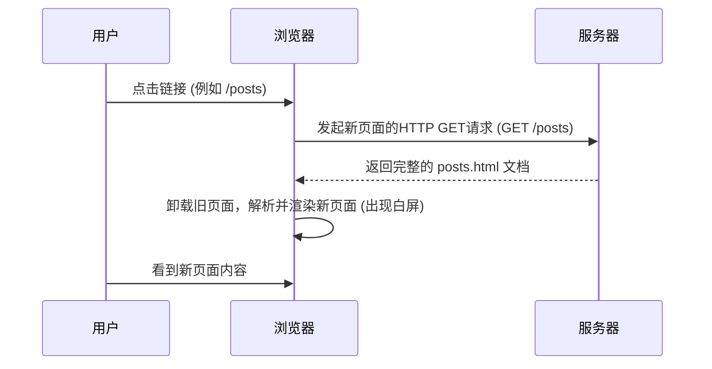
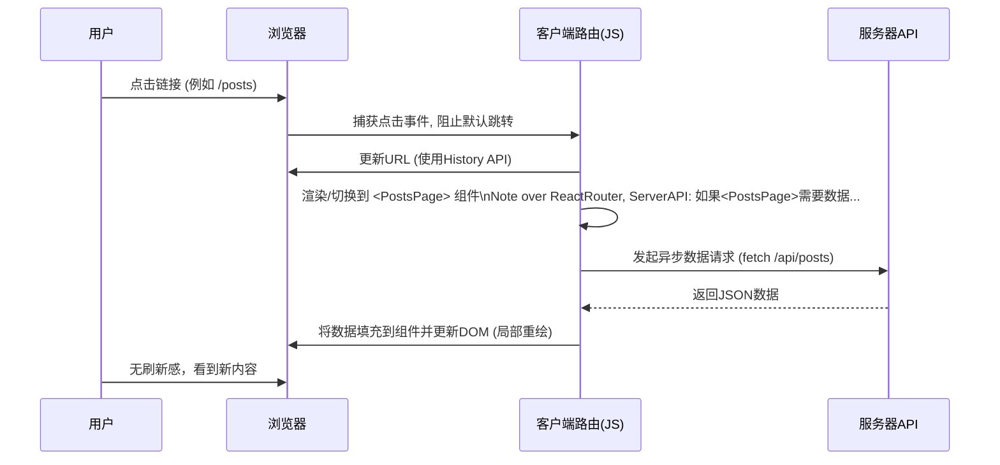

好的，我们紧接课程主题，从解释为何需要客户端路由开始，深入剖MET传统与现代Web应用的差异。

---

### 5.1.1 核心理念：为何需要客户端路由(SPA)

为了更深刻地理解单页应用（SPA）的价值，我们不妨回到Web应用的起点，通过对比传统**多页应用（Multi-Page Application, MPA）**与现代**单页应用（Single-Page Application, SPA）**在用户进行页面跳转时的底层工作流程，来揭示客户端路由的革命性所在。

#### 传统多页应用（MPA）的工作模式：请求与重载

在React这类框架普及之前，绝大多数网站都采用MPA模式。想象一下你正在访问一个传统的博客网站，包含首页、文章列表和关于我们三个页面。

当你点击导航栏的“文章列表”时，会发生以下一系列事件：

1.  **发起请求**：浏览器向服务器发送一个新的HTTP请求，目标地址是 `your-blog.com/posts`。
2.  **后端处理**：服务器接收到请求，从数据库查询文章数据，然后将数据渲染进一个HTML模板中。
3.  **返回完整页面**：服务器将生成好的、包含完整 `<html>`, `<head>`, `<body>` 标签的HTML文档返回给浏览器。
4.  **浏览器卸载与重载**：浏览器接收到新的HTML后，会**丢弃**当前的整个页面（包括HTML, CSS, JavaScript状态），然后开始解析和渲染这个全新的HTML文档。这个过程通常伴随着短暂的**页面白屏**。

这个流程可以用下面的序列图来表示：

这种模式的优点是简单直观，每个URL对应一个独立的HTML文件，对SEO（搜索引擎优化）友好。但其核心痛点在于**用户体验的中断感**和**资源的浪费**。每次页面切换都意味着一次完整的“推倒重来”，即便新旧页面的页头、页脚完全一样，也需要重新加载和渲染。

#### 单页应用（SPA）的革新：拦截与重绘

现在，让我们看看React构建的SPA是如何处理同样场景的。在一个SPA中，首次加载时，服务器会返回一个基本的HTML“空壳”和一个庞大的JavaScript包（也就是我们的React应用）。此后，所有的页面导航都由前端的JavaScript接管。

当你同样点击“文章列表”链接时：

1.  **拦截事件**：**客户端路由库（Client-Side Router，例如React Router）**会捕获这个点击事件，**阻止**浏览器向服务器发送新的页面请求（这是最关键的一步！）。
2.  **更新URL**：路由库会使用浏览器提供的 [History API](https://developer.mozilla.org/zh-CN/docs/Web/API/History_API) 在不刷新页面的前提下，悄悄地将浏览器地址栏的URL更新为 `your-app.com/posts`。这让用户感觉页面确实发生了跳转，并且可以直接通过这个URL访问或分享。
3.  **组件替换**：路由库根据新的URL，匹配到对应的页面组件（例如 `<PostsPage />`），然后通知React进行UI更新。React会高效地计算出新旧UI的差异（Diffing），并只**重绘**需要改变的那部分DOM（例如，将 `<HomePage />` 组件替换为 `<PostsPage />` 组件），而页头、页脚等公共部分保持不变。
4.  **数据获取（可选）**：如果新页面需要数据，它会通过 `fetch` 或 `axios` 向后端API发起一个异步请求，获取纯粹的JSON数据，然后用这些数据填充组件并渲染。

这个流程也可用序列图清晰地展示：

#### 核心差异：MPA vs. SPA 直观对比

| 特性 | 多页应用 (MPA) | 单页应用 (SPA) |
| :--- | :--- | :--- |
| **路由控制权** | **服务器端**：URL的解析和页面返回由服务器控制。 | **客户端**：URL的变化由前端JavaScript（路由库）监听和处理。 |
| **页面刷新** | **整页刷新**：每次导航都会导致浏览器白屏和完整的页面重载。 | **无刷新**：页面主体内容通过DOM操作进行局部更新，无白屏。 |
| **用户体验** | **中断、延迟感**：切换速度受网络和服务器响应影响较大。 | **流畅、“应用感”**：切换快速，体验接近原生桌面或移动应用。 |
| **首次加载** | 较快，仅加载当前页面所需资源。 | 可能较慢，需要加载整个应用的基础框架和JS代码。 |
| **后续导航** | 较慢，需要为每个页面发起完整请求。 | **极快**，因为仅切换组件和请求少量JSON数据。 |
| **服务器压力** | 较大，需要为每个请求渲染完整的HTML页面。 | 较小，主要作为静态文件和数据API服务，无需关心页面渲染。 |

---

### 要点回顾

通过以上对比，我们可以清晰地看到客户端路由的核心价值：

*   **接管导航**：它从浏览器手中夺过了页面跳转的控制权，将“请求新页面”的操作转变为“在当前页面内更新内容”。
*   **优化体验**：通过避免整页刷新，实现了流畅、快速的页面切换，为用户提供了无缝的“沉浸式”体验。
*   **前后端分离**：它促进了更彻底的前后端分离架构。前端专注于UI展示和交互逻辑，后端则专注于提供标准化的数据接口（API），两者职责更加清晰。

因此，**React Router这类客户端路由库，正是我们能够构建出现代、高效、体验优秀的单页应用（SPA）的技术基石。** 在接下来的章节中，我们将学习如何亲手将它集成到我们的React项目中。