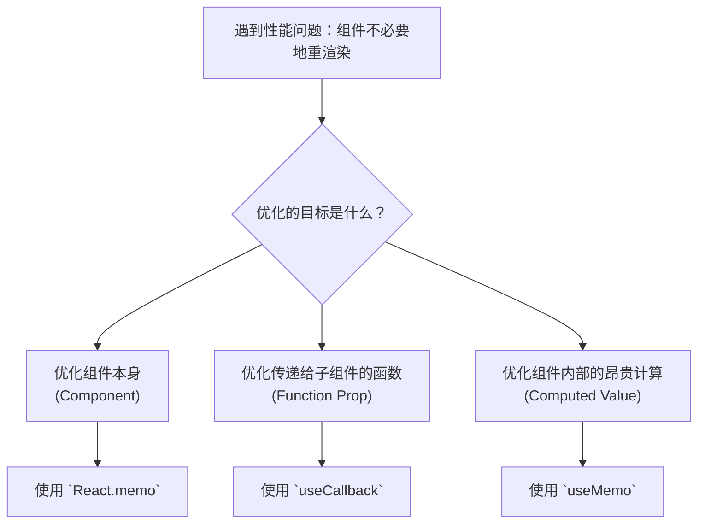

好的，作为一位资深技术教育作者，我将为你撰写这篇关于React性能优化入门的教学段落。

---

### 6.2.3 实践三：性能优化入门

在前一节中，我们探讨了如何编写可维护的代码，让应用逻辑清晰、易于扩展。然而，一个优秀的应用不仅要易于维护，还需要为用户提供流畅的体验。性能，尤其是渲染性能，是其中的关键。本节，我们将入门React性能优化的核心思想，并学习使用三个强大的API来解决最常见的性能问题。

#### 性能瓶颈的根源：不必要的重新渲染

在React的世界里，性能问题的最主要元凶通常是**不必要的重新渲染（Unnecessary Re-renders）**。

让我们回顾一下React的渲染机制：当一个组件的`state`或`props`发生变化时，React会重新调用该组件的`render`方法（或函数组件本身），并对其子组件进行“协调”（Reconciliation）过程。默认情况下，父组件的重新渲染会导致其**所有**子组件也跟着重新渲染，无论传递给子组件的`props`是否真的发生了变化。

想象一个仪表盘页面，其中一个实时图表（`RealtimeChart`）每秒更新一次，旁边有一个显示用户信息的静态卡片（`UserInfoCard`）。

```jsx
function Dashboard() {
  const [chartData, setChartData] = useState(generateInitialData());
  const userInfo = { name: 'Alice', role: 'Admin' };

  useEffect(() => {
    const intervalId = setInterval(() => {
      // 模拟数据更新
      setChartData(generateNewData());
    }, 1000);
    return () => clearInterval(intervalId);
  }, []);

  console.log('Dashboard re-rendered');

  return (
    <div>
      {/* 这个组件的props是静态的，理论上不应该随图表数据更新而重新渲染 */}
      <UserInfoCard user={userInfo} />
      <RealtimeChart data={chartData} />
    </div>
  );
}

function UserInfoCard({ user }) {
  console.log('UserInfoCard re-rendered... Oh no!');
  return (
    <div>
      <h4>{user.name}</h4>
      <p>{user.role}</p>
    </div>
  );
}
```

在上面的例子中，每当`Dashboard`组件的`chartData`状态更新时，`Dashboard`会重新渲染。这会连带导致`UserInfoCard`也重新渲染，尽管传递给它的`user` prop 从未改变。这就是一次“不必要的重新渲染”。当组件树变得复杂时，这种连锁反应会极大地拖慢应用性能。

我们的优化目标就是：**精确控制渲染，只在必要时更新组件**。React为此提供了三个核心工具：`React.memo`, `useCallback`, 和 `useMemo`。

#### 1. 使用 `React.memo` 优化组件

`React.memo` 是一个高阶组件（Higher-Order Component），它像一层“保护膜”包裹住你的组件。被包裹的组件只有在`props`发生**浅层比较（Shallow Comparison）**后发现有变化时，才会重新渲染。

**如何使用？** 只需用 `React.memo()` 包裹你的函数组件即可。

```jsx
// code_example: 使用 React.memo 优化 UserInfoCard

import React from 'react';

// UserInfoCard.js
function UserInfoCard({ user }) {
  console.log('UserInfoCard re-rendered.');
  return (
    <div>
      <h4>{user.name}</h4>
      <p>{user.role}</p>
    </div>
  );
}

// 只有当 user prop 变化时，这个组件才会重新渲染
export default React.memo(UserInfoCard);
```

现在，回到`Dashboard`组件，你会发现即使`chartData`不断变化，控制台也只会打印 "Dashboard re-rendered"，而 "UserInfoCard re-rendered..." 将不再出现。我们成功地阻止了它的不必要渲染！

> **浅层比较（Shallow Comparison）**
> `React.memo`默认比较的是props对象的第一层键值。对于原始类型（string, number, boolean），它比较值是否相等。对于引用类型（object, array, function），它比较的是它们的**内存地址**是否相同，而不是内容。这是理解后续两个Hook的关键。

#### 2. 新的挑战与 `useCallback`

`React.memo`非常有效，但当父组件传递函数作为`prop`时，问题又出现了。

```jsx
// code_example: 传递函数prop导致 memo 失效

function Parent() {
  const [count, setCount] = useState(0);

  // 每次 Parent 重新渲染时，这个函数都会被重新创建
  // 它的内存地址会改变
  const handleReset = () => {
    console.log('Resetting!');
  };

  return (
    <div>
      <button onClick={() => setCount(c => c + 1)}>Increment</button>
      <MemoizedButton onReset={handleReset} />
    </div>
  );
}

const MemoizedButton = React.memo(function Button({ onReset }) {
  console.log('Button re-rendered!');
  return <button onClick={onReset}>Reset</button>;
});
```

在这个例子中，即使我们用了`React.memo`，每次点击 "Increment" 按钮导致 `Parent` 重新渲染时，`handleReset` 函数都会被**重新创建**。这意味着传递给`MemoizedButton`的`onReset` prop 在每次渲染时都是一个新的函数引用，导致`React.memo`的浅层比较失败，`MemoizedButton`依然会重新渲染。

**解决方案：`useCallback`**

`useCallback` Hook 用于“记住”一个函数。它会返回一个 memoized（记忆化）版本的函数，该函数仅在它的依赖项数组中的某个值发生变化时才会更新。

```jsx
// code_example: 使用 useCallback 稳定函数引用

import { useState, useCallback } from 'react';

function Parent() {
  const [count, setCount] = useState(0);

  // 使用 useCallback 包裹函数
  // 空依赖数组 [] 意味着这个函数永远不会被重新创建
  const handleReset = useCallback(() => {
    console.log('Resetting!');
  }, []); // <--- 依赖数组

  return (
    <div>
      <button onClick={() => setCount(c => c + 1)}>Increment</button>
      <MemoizedButton onReset={handleReset} />
    </div>
  );
}
```

通过`useCallback(fn, [])`，我们确保了`handleReset`函数在`Parent`组件的整个生命周期内都保持相同的引用。这样，`MemoizedButton`接收到的`onReset` prop 就不再变化，`React.memo`便能成功地阻止不必要的渲染。

#### 3. 昂贵计算与 `useMemo`

与`useCallback`类似，`useMemo`用于优化性能，但它“记住”的不是函数，而是函数的**计算结果**。

想象一个场景，你需要根据一个巨大的列表和一个筛选条件来计算并显示一个过滤后的列表。这个计算可能非常耗时。

```jsx
// code_example: 未优化的昂贵计算

function TodoList({ todos, filter }) {
  const [unrelatedState, setUnrelatedState] = useState(0);

  // 每次组件渲染（即使是 unrelatedState 变化），这个昂贵的计算都会重新运行
  console.time('filtering');
  const visibleTodos = todos.filter(todo => {
    // 模拟复杂逻辑
    let i = 0;
    while (i < 10000000) i++;
    return todo.text.includes(filter);
  });
  console.timeEnd('filtering');

  return (
    <div>
      <button onClick={() => setUnrelatedState(c => c + 1)}>Re-render component</button>
      <ul>
        {visibleTodos.map(todo => <li key={todo.id}>{todo.text}</li>)}
      </ul>
    </div>
  );
}
```

在上面的代码中，每次点击 "Re-render component" 按钮，昂贵的`filter`操作都会被重新执行，即使`todos`和`filter`这两个关键数据根本没变。

**解决方案：`useMemo`**

`useMemo`接收一个“创建”函数和依赖项数组。它只会在某个依赖项改变时才重新计算 memoized 值。

```jsx
// code_example: 使用 useMemo 优化昂贵计算

import { useMemo, useState } from 'react';

function TodoList({ todos, filter }) {
  const [unrelatedState, setUnrelatedState] = useState(0);

  // 使用 useMemo 包裹计算过程
  const visibleTodos = useMemo(() => {
    console.time('filtering');
    const result = todos.filter(todo => {
      let i = 0;
      while (i < 10000000) i++;
      return todo.text.includes(filter);
    });
    console.timeEnd('filtering');
    return result;
  }, [todos, filter]); // <--- 依赖项：仅当 todos 或 filter 变化时才重新计算

  return (
    // ... JSX ...
  );
}
```

现在，`filtering`过程只会在`todos`或`filter` prop 发生变化时才执行。更新`unrelatedState`将不再触发这个昂贵的计算，从而极大地提升了组件的响应速度。

> **`useCallback` vs `useMemo`**
>
> - `useCallback(fn, deps)` 记忆的是**函数本身**。它等价于 `useMemo(() => fn, deps)`。
> - `useMemo(fn, deps)` 记忆的是**函数的返回值**。

#### 优化决策流程

面对性能问题时，你可以参考下面的决策树来选择合适的工具。



---

#### common_mistake_warning

**常见误区：过早优化与滥用**

虽然这些API很强大，但请记住“不要过早优化”。它们本身也有成本：`memo`需要进行props比较，`useMemo`/`useCallback`需要存储记忆化的值并检查依赖项。

1.  **何时优化？** 当你通过React DevTools Profiler等工具**实际测量**到性能瓶颈时，再进行针对性优化。
2.  **依赖数组陷阱**：`useCallback`和`useMemo`的依赖数组是它们正确工作的关键。错误的依赖数组会导致两种常见问题：
    *   **遗漏依赖**：导致函数/值没有及时更新，引用了过时（stale）的 state 或 props，引发难以调试的bug。
    *   **包含不必要的依赖**：导致 memoization 频繁失效，失去了优化的意义。

---

#### 本节小结

性能优化是前端工程化的重要一环。通过本节的学习，我们掌握了React性能优化的基本思路和工具：

-   **核心问题**：不必要的重新渲染是React应用性能下降的主要原因。
-   **`React.memo`**：通过对props进行浅层比较，跳过组件的不必要渲染，是组件优化的第一道防线。
-   **`useCallback`**：用于记忆化函数，确保传递给子组件的函数prop引用稳定，通常与`React.memo`配合使用。
-   **`useMemo`**：用于记忆化昂贵计算的结果，避免在每次渲染时都重复执行这些计算。

合理运用这三者，可以显著提升你的React应用的响应速度和用户体验，让你的代码不仅可维护，而且更高效。