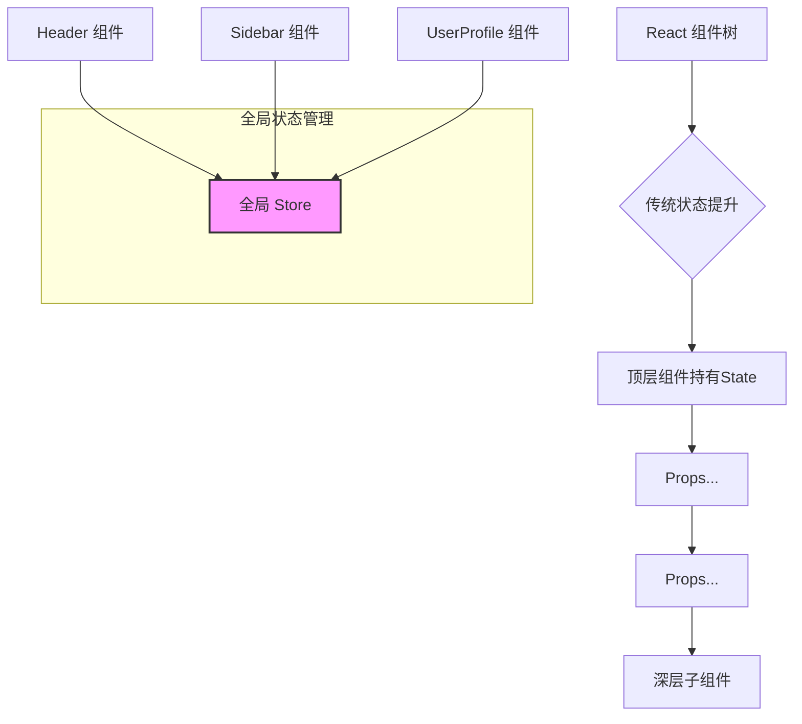

好的，作为一位资深的技术教育作者，我将为你撰写这篇关于全局状态管理的教学段落。

---

### 6.3.1 路线一：全局状态管理 (Zustand / Redux)

在前面的学习中，我们掌握了通过“状态提升”（Lifting State Up）来让多个组件共享和响应同一份数据。这在简单场景下非常有效，但随着应用规模的扩大，你可能会发现自己陷入了一种困境：为了让深层嵌套的组件获取顶层状态，你需要像“接力赛”一样，将 props 逐层向下传递。

#### 状态提升的尽头：为什么需要全局方案？

当应用变得复杂，单纯的状态提升会带来几个棘手的问题：

1.  **属性逐层传递 (Prop Drilling)**：状态可能需要穿透 5 层、10 层甚至更多的中间组件才能到达目标。这些中间组件本身并不需要这些数据，却被迫扮演了“快递员”的角色，这让组件的接口变得臃肿，代码也难以维护。
2.  **不必要的重渲染 (Performance Issues)**：位于顶层的状态一旦发生变化，可能会导致其下所有消费了相关 props 的子组件链都发生重渲染，即便某些中间组件的渲染结果并未改变，这也会造成性能损耗。
3.  **状态逻辑分散 (Scattered Logic)**：状态（state）和改变状态的逻辑（setter functions）被定义在顶层父组件中，而消费它们的组件却在组件树的深处。这种物理位置上的分离，使得追踪数据流和调试变得困难。

为了解决这些问题，社区发展出了**全局状态管理 (Global State Management)** 的思想。它的核心理念很简单：**将应用中最核心、需要被广泛共享的状态，从组件树中抽离出来，放入一个独立于所有组件的、全局唯一的“仓库”（Store）中进行统一管理。**

这样一来，任何组件，无论它在组件树的哪个角落，都可以直接从这个 Store 中“订阅”和“更新”状态，彻底告别了“属性逐层传递”的噩梦。



#### 两大主流思想：Redux Toolkit 与 Zustand

目前，社区中有许多优秀的全局状态管理库，它们虽然实现方式各异，但都遵循着上述核心思想。我们重点介绍两种分别代表了不同设计哲学的方案：**Redux Toolkit** 和 **Zustand**。

##### 1. Redux Toolkit (RTK): 严谨的学院派

Redux 是最早也是最富盛名的状态管理库，它基于 [Flux 架构](https://facebook.github.io/flux/docs/in-depth-overview)，强调**单向数据流**和**状态的不可变性 (Immutability)**。Redux Toolkit (RTK) 是 Redux 官方推荐的现代化开发工具集，它极大地简化了 Redux 的使用，并内置了最佳实践。

*   **设计思想**：结构化、可预测、可追溯。RTK 的世界里，所有状态变更都必须通过派发一个明确的 `action` 对象来触发，然后由一个纯函数 `reducer` 来计算出新的状态。这个过程是严格且可预测的。

*   **数据流图解**:
    ```mermaid
    sequenceDiagram
        participant Component as 组件
        participant Action as Action
        participant Reducer as Reducer
        participant Store as 全局 Store

        Component->>Action: dispatch("{ type: 'user/login', payload: ... }")
        Action->>Reducer: 将 Action 传递给 Reducer
        Reducer->>Store: 根据 Action 计算出新 State，更新 Store
        Store-->>Component: 通知组件状态已更新，触发重渲染
    ```

*   **适用场景**：
    *   大型、长期的复杂项目，团队成员众多。
    *   对状态变更的可追溯性、调试（如时间旅行调试）有强需求。
    *   需要严格遵循应用架构规范的团队。

##### 2. Zustand: 灵活的实用派

Zustand (德语中“状态”的意思) 是一个近年来备受青睐的轻量级状态管理库。它拥抱 React Hooks，提供了一种更简洁、更灵活的方式来管理全局状态。

*   **设计思想**：简约、无模板代码 (boilerplate-free)、非侵入式。Zustand 的核心就是一个 `create` 函数，你用它来创建自己的状态钩子 (custom hook)，然后就可以在任何组件中像使用 `useState` 一样方便地使用它。

*   **核心用法示例**：
    ```javascript
    import { create } from 'zustand';

    // 1. 创建一个 store hook
    const useUserStore = create((set) => ({
      user: null,
      theme: 'light',
      login: (userData) => set({ user: userData }),
      toggleTheme: () => set((state) => ({ theme: state.theme === 'light' ? 'dark' : 'light' })),
    }));

    // 2. 在组件中直接使用
    function UserProfile() {
      const { user, login } = useUserStore();
      // ...
    }

    function ThemeSwitcher() {
      const { theme, toggleTheme } = useUserStore();
      // ...
    }
    ```
    可以看到，定义和使用都非常直观，几乎没有额外的学习成本。

*   **适用场景**：
    *   中小型项目，或大型项目中相对独立的模块。
    *   追求快速开发、不喜欢繁琐配置的开发者。
    *   从 `useState` + `Context` 方案过渡的理想选择。

#### 对比与抉择

| 特性         | Redux Toolkit                                     | Zustand                                           |
| :----------- | :------------------------------------------------ | :------------------------------------------------ |
| **设计哲学** | 结构化、可预测、 opinionated (有主见的)             | 简约、灵活、un-opinionated (无主见的)             |
| **学习曲线** | 相对陡峭，需理解 Action, Reducer, Slice 等概念      | 非常平缓，熟悉 Hooks 即可上手                     |
| **代码量**   | 相对较多 (但 RTK 已大幅减少)，有一定模板代码       | 极少，非常精简                                    |
| **核心概念** | Store, Action, Reducer, Slice, Dispatch, Selector | Store (通过 Hook 体现), `create`, `set`, `get`      |
| **适用场景** | 大型企业级应用，需要严格数据流和高级调试功能        | 各种规模项目，尤其适合追求开发效率和简洁性的场景    |

#### 总结回顾

全局状态管理并非银弹，它不是 React 开发的“标配”，而是解决特定问题的“良药”。

*   **出发点**：当“状态提升”导致了严重的“属性逐层传递”和维护困难时，就应该考虑引入全局状态管理。
*   **核心思想**：将共享状态抽离到组件树之外的全局 Store 中，实现任何组件的直接访问。
*   **路线选择**：
    *   选择 **Redux Toolkit**，意味着你选择了一条严谨、规范但略显复杂的道路，适合构建大规模、高可维护性的应用。
    *   选择 **Zustand**，意味着你选择了一条轻快、灵活的道路，能以极低的成本解决问题，适合绝大多数项目。

掌握全局状态管理，是你从“能用 React 写页面”到“能架构复杂 React 应用”的关键一步。根据你的项目需求和团队偏好，选择合适的工具，将使你的开发工作如虎添翼。