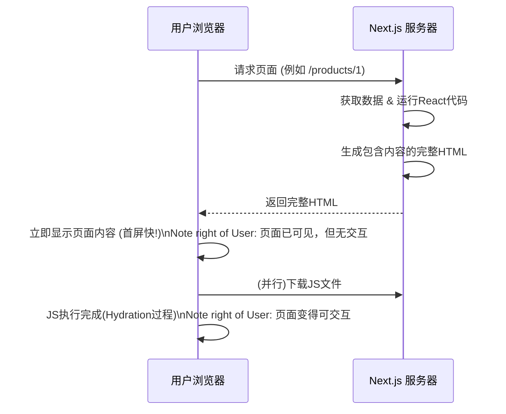
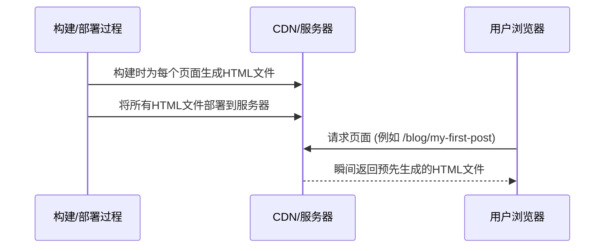

好的，作为一位资深的技术教育作者，我将为你撰写这篇关于 Next.js 全栈开发路线的教学段落。

---

### 6.3.3 路线三：全栈开发 (Next.js)

在我们已经探讨了如何通过精进状态管理和组件库来深化前端专业能力后，另一条激动人心的成长路径便是打破前端与后端的界限，迈向全栈开发。而 React 生态中的翘楚——Next.js，正是为你打开这扇大门的最佳钥匙。它不仅仅是一个库，更是一个功能完备、具备生产力思想的 **React 框架**。

#### 从客户端到全栈：为什么需要 Next.js？

标准的 React 应用（例如使用 Create React App 创建的）是一种**客户端渲染 (Client-Side Rendering, CSR)** 应用。它的工作模式是：浏览器首先下载一个近乎空白的 HTML 文件和一个庞大的 JavaScript 包，然后由浏览器执行 JavaScript 来渲染页面内容、绑定事件。

这种模式带来了极致的交互体验，但也暴露了两个核心痛点：

1.  **SEO 不友好**：搜索引擎爬虫可能只会看到一个空白的 HTML 框架，无法有效抓取页面内容，对搜索引擎优化（SEO）非常不利。
2.  **首屏加载慢**：用户在看到页面内容前，必须等待 JavaScript 下载并执行完毕，这期间会经历一段“白屏时间”，影响用户体验。

Next.js 的出现，正是为了解决这些问题，它将 React 的能力从浏览器扩展到了服务器，引入了更强大的渲染模式。

#### 核心概念：重新理解“渲染”

Next.js 的核心魔法在于它提供了多种渲染策略，让你可以根据页面特性做出最优选择。

##### 1. 服务端渲染 (Server-Side Rendering, SSR)

当用户请求一个页面时，服务器会先执行 React 代码，将页面组件渲染成完整的 HTML 字符串，然后将这个包含内容的 HTML 直接发送给浏览器。



-   **优点**：极佳的 SEO 表现，更快的首屏加载感知速度。
-   **适用场景**：内容高度动态、需要实时数据的页面，如用户个人中心、电商的商品详情页。

##### 2. 静态网站生成 (Static Site Generation, SSG)

在**构建时 (build time)**，Next.js 会预先为每个页面生成一个静态的 HTML 文件。当用户请求时，服务器（或 CDN）直接返回这个已经准备好的文件。



-   **优点**：极致的访问速度，安全性高，服务器成本低。
-   **适用场景**：内容不经常变动的页面，如博客文章、营销官网、产品文档。
-   **进阶**：Next.js 还提供了 **增量静态再生 (Incremental Static Regeneration, ISR)**，允许你在特定时间间隔后重新生成静态页面，实现了静态的速度与动态内容的完美结合。

Next.js 最强大的地方在于，你可以在**同一个应用中混合使用 SSR、SSG 和 CSR**，为每个页面选择最合适的渲染策略。

#### Case Study：用 Next.js 构建一个现代化博客网站

假设我们要构建一个博客平台，看看 Next.js 如何施展拳脚：

1.  **博客文章页 (`/posts/[slug]`)**：
    *   **策略**：SSG。文章内容不常变动，在构建时为每篇文章生成一个 HTML 文件是最佳选择，用户访问时可以秒开。
    *   **实现**：使用 `getStaticPaths` 来告诉 Next.js 有哪些文章路径需要预渲染，使用 `getStaticProps` 在构建时获取每篇文章的数据。

2.  **首页 (`/`)**：
    *   **策略**：SSG + ISR。我们希望首页有不错的加载速度，但又需要展示最新的文章列表。我们可以设置一个重新验证时间（如 `revalidate: 60`），这样每 60 秒最多重新生成一次首页，既保证了速度，又保证了内容的时效性。
    *   **实现**：在 `getStaticProps` 中返回 `revalidate` 字段。

3.  **作者后台管理页 (`/admin`)**：
    *   **策略**：SSR 或 CSR。这个页面需要登录验证，且内容是高度个性化和动态的。使用 SSR 可以在服务端验证用户身份并获取其草稿列表；或者，也可以提供一个静态的页面框架（CSR），然后在客户端通过 API 请求数据。
    *   **实现**：使用 `getServerSideProps` 进行服务端渲染，或在组件 `useEffect` 中发起客户端请求。

4.  **订阅邮件 API (`/api/subscribe`)**：
    *   **能力**：API 路由。Next.js 允许你在 `pages/api` 目录下创建文件，直接编写后端 API 逻辑。
    *   **实现**：创建一个 `pages/api/subscribe.js` 文件，导出一个处理函数，即可轻松处理前端发来的表单提交请求，将其存入数据库。这让你无需再单独部署一个 Node.js 服务。

```javascript
// pages/api/subscribe.js
// 这是一个完整的后端 API 端点

export default function handler(req, res) {
  if (req.method === 'POST') {
    const email = req.body.email;
    // ... 在这里添加将 email 存入数据库的逻辑 ...
    console.log(`Email received: ${email}`);
    res.status(200).json({ message: 'Subscription successful!' });
  } else {
    res.setHeader('Allow', ['POST']);
    res.status(405).end(`Method ${req.method} Not Allowed`);
  }
}
```

这个案例清晰地展示了 Next.js 如何将 React 从一个纯粹的 UI 库，提升为一个能够处理复杂渲染逻辑、提供后端 API 的全栈框架。

#### 总结：你的全栈之门

选择 Next.js 作为你的下一步成长路线，意味着你将：

-   **突破前端边界**：你不再只关注浏览器中的交互，而是开始思考数据如何在服务端获取、页面如何被渲染和分发。
-   **掌握生产级技能**：学习 SSR 和 SSG 不仅能解决实际的性能和 SEO 问题，也是现代化 Web 开发的核心技能。
-   **提升工程效率**：Next.js 内置了路由、代码分割、API 服务等功能，让你能以极高的效率构建功能完备的全栈应用。

学习 Next.js 是从一名“React 开发者”向“Web 应用架构师”转变的关键一步。它将赋予你以更全局的视角来构建更快、更强大、更健壮的应用程序。