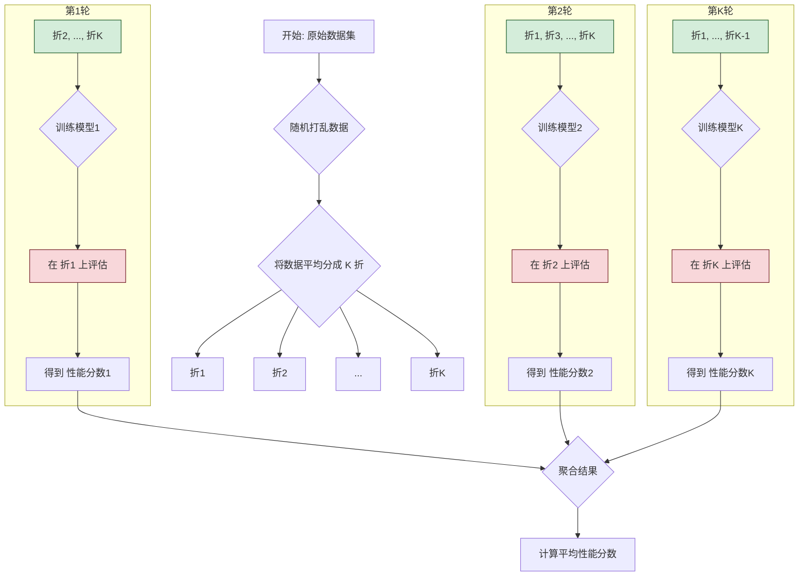

好的，请看这篇为您精心撰写的教学段落。

---

### **第三章：从业者工具箱 · 模型评估与正则化**

#### **3.1 核心问题：如何客观评估模型在未知数据上的表现？**

在我们之前的旅程中，我们已经学会了如何选择算法、准备数据，并最终构建起一个监督学习模型。这就像一位工匠精心打磨出了一件工具。然而，一件工具真正的价值，不在于它在工匠的工作台上看起来多么精致，而在于它在实际工作中能否高效、准确地解决问题。同样，一个机器学习模型的真正价值，也只有在面对它从未见过的新数据时，才能得到最终的检验。

这一节，我们将深入探讨机器学习实践中至关重要的一环：**模型评估**。这不仅仅是一个技术步骤，更是一种思维方式，一种确保我们不被虚假繁荣所蒙蔽的科学精神。我们将要回答那个核心问题：我们如何才能获得一份关于模型未来表现的、诚实可信的“体检报告”？

---

##### **根本原则：为何“开卷考试”的成绩毫无意义？**

让我们从一个极其熟悉的场景开始：**学生备考**。

想象一位学生，小明，他正在为一场重要的历史考试做准备。老师给了他一套包含了100道题的复习题库，并告诉他，期末考试的题目将**全部**从这套题库中抽取。小明非常勤奋，他没有去理解历史事件的因果关系，而是选择将这100道题的答案逐字逐句地背了下来。考试前，他进行了一次自我模拟测试，用的就是这套复习题库——结果自然是100分。他信心满满，认为自己已经完全掌握了这门课程。

然而，如果老师在期末考试时，哪怕只是稍微改变了一下题目的问法，或者考察了同一个历史事件的另一个角度，小明的成绩恐怕就会一落千丈。

这个故事完美地揭示了模型评估中的一个核心陷阱。

*   **复习题库**：这就是我们用来训练模型的**训练集 (Training Set)**。
*   **小明背诵答案的过程**：这就是模型的**训练 (Training)** 过程。模型在训练集上不断调整自己的内部参数，试图最小化它在这些数据上的错误。
*   **用复习题库进行的自测**：这就是在训练集上评估模型，得到的成绩叫做**训练误差 (Training Error)**。
*   **真正的期末考试**：这代表了模型在未来会遇到的**未知数据 (Unseen Data)**。
*   **期末考试的成绩**：这才是我们真正关心的，衡量模型在未知数据上表现的**泛化误差 (Generalization Error)**，我们通常用**测试误差 (Test Error)** 来近似它。

小明在自测中获得的100分，就是训练误差为0的体现。这个成绩具有极大的误导性。它没有反映小明真正的历史知识水平（即模型的泛化能力），只反映了他对特定题目的记忆能力（我们称之为**过拟合 Overfitting**）。

**问题-解决方案-影响 的逻辑链条：**

*   **问题**：我们如何知道模型是真的“学会”了数据中潜在的规律，还是仅仅“背会”了训练数据本身？直接使用训练误差来评估模型，会给我们一个过于乐观甚至完全错误的性能判断。
*   **解决方案（根本原则）**：**评估模型表现的黄金标准，是永远不要使用训练过模型的数据去评估它。** 我们必须划分出一块模型在训练过程中从未“见过”的数据，专门用来进行评估。这就像为小明准备一场他事先不知道题目的“模拟考试”。
*   **影响**：这一原则的确立，是机器学习从理论走向可靠应用的基石。它迫使我们正视模型的**泛化能力**，即模型对新输入做出正确预测的能力。所有现代机器学习的评估框架，都是建立在这一“训练/测试分离”的核心思想之上的。

---

##### **工具一：验证集方法 —— 第一次诚实的模拟考**

遵循我们的黄金原则，最直观、最简单的实现方法就是**验证集方法 (Validation Set Approach)**。

这个方法就像组织一场模拟考试一样简单直接：

1.  **分割数据**：我们将手头的全部数据随机地分成两部分。一部分较大，通常占70%或80%，我们称之为**训练集 (Training Set)**。
2.  **训练模型**：我们使用训练集来训练我们的模型。模型的所有学习过程，都只在这一部分数据上进行。
3.  **评估模型**：我们将训练好的模型，应用到剩下那部分从未“见过”的数据上，这部分数据我们称之为**验证集 (Validation Set)** 或**保持集 (Hold-out Set)**。模型在验证集上的表现（例如，错误率、准确率等），就是我们对它泛化能力的一次估算。

这个过程就像小明用70道复习题来学习，然后用剩下的30道他没背过的题来测试自己。这次的成绩，显然比他用全部100道题自测的成绩要诚实得多。

**验证集方法的缺点**

然而，这种简单的方法存在两个显著的缺点，让这次“模拟考”的结果不那么可靠：

1.  **结果的随机性太大（高方差）**：
    想象一下，如果那30道测试题碰巧都是小明特别擅长的部分，他可能会得到一个虚高的分数。反之，如果题目都恰好是他的知识盲区，分数又会过低。同样，我们随机划分数据时，如果验证集中的样本恰好都“比较简单”或“特别困难”，那么我们得到的评估结果就会有很大的偶然性。换一次随机划分，评估结果可能会有天壤之别。这个评估结果本身**不稳定**。

2.  **浪费数据，可能低估模型性能**：
    我们“牺牲”了一部分数据（例如30%）作为验证集，没有让它们参与到模型的训练中。对于数据量本就不大的情况，这是一种巨大的浪费。更重要的是，在更少数据上训练出来的模型，其性能通常会比在全部数据上训练出来的模型要差。因此，我们用一个在70%数据上训练的模型，去评估它的性能，这个性能评估结果很可能是对“在100%数据上训练的最终模型”的性能的**悲观估计**。

验证集方法虽然诚实，但它像一次偶然性很大的单次模拟考，成绩并不能完全令人信服。我们需要一种更系统、更稳健的评估策略。

---

##### **工具二：K折交叉验证 —— 精心组织的“轮流模考”**

为了解决验证集方法“不稳定”和“浪费数据”的问题，统计学家们设计出了一种更为精妙的评估流程——**K折交叉验证 (K-Fold Cross-Validation)**。

如果说验证集方法是一次性的模拟考，那么K折交叉验证就是一场组织严密的**“轮流模考”**。

让我们继续用备考的类比来理解。现在老师不再是简单地把100道题分成70/30。而是这样做：

1.  **分卷**：将100道题平均分成5份（这里 K=5），每份20道题，我们称之为“第一卷”到“第五卷”。
2.  **轮流模考**：进行5轮独立的考试。
    *   **第一轮**：用“第二、三、四、五卷”（共80题）来学习，然后用“第一卷”进行考试。记录成绩。
    *   **第二轮**：用“第一、三、四、五卷”来学习，然后用“第二卷”进行考试。记录成绩。
    *   **第三轮**：...以此类推...
    *   **第五轮**：用“第一、二、三、四卷”来学习，然后用“第五卷”进行考试。记录成绩。
3.  **计算总分**：将这5轮考试的成绩取一个平均值，作为对小明真实水平的最终评估。

这个过程就是K折交叉验证的精髓。下面是它的技术步骤：

1.  **数据分割 (Split)**：将整个数据集随机打乱，然后平均分割成 K 个互不相交的子集，我们称之为“折”(Fold)。通常 K 的取值为5或10。
2.  **迭代训练与验证 (Iterate)**：进行 K 次循环。在第 `i` 次循环中（从1到K）：
    *   将第 `i` 折作为**验证集**。
    *   将剩下 K-1 折的数据合并起来作为**训练集**。
    *   在这个训练集上训练模型，然后在第 `i` 折验证集上计算模型的性能指标（如准确率 `Accuracy_i`）。
3.  **性能聚合 (Aggregate)**：将 K 次循环得到的 K 个性能指标进行平均，得到最终的交叉验证评估结果。

`Final_Accuracy = (Accuracy_1 + Accuracy_2 + ... + Accuracy_K) / K`

我们可以用一个流程图来更清晰地展示这个过程：

**K折交叉验证的优势**

相比简单的验证集方法，K折交叉验证的优势是显而易见的：

1.  **更稳健、更可靠的结果**：通过对K个不同的验证集表现取平均，我们大大降低了因单次数据划分偶然性带来的评估误差。最终的结果方差更小，更能代表模型在一般情况下的表现。
2.  **更高的数据利用率**：在整个过程中，每一个数据点都有机会被用作一次验证数据，同时被用作 K-1 次训练数据。这使得评估结果对全体数据的代表性更强，尤其是在数据集规模不大时，这一优势至关重要。

K折交叉验证已经成为当今机器学习从业者的标准评估工具。它为我们提供了一把测量模型泛化能力的、刻度精准的“尺子”。

---

##### **常见误区：看不见的“信息泄露”**

掌握了交叉验证这一强大工具后，许多初学者会掉入一个极其隐蔽但后果严重的陷阱——**数据泄露 (Data Leakage)**。

> [!WARNING|常见误区：先预处理，再交叉验证]
> **错误的做法**：
> 1.  在**整个数据集**上进行数据预处理。例如，对所有特征进行标准化（减去均值，除以标准差），或者进行特征选择，挑出与目标最相关的10个特征。
> 2.  然后，将**预处理后**的数据进行K折交叉验证来评估模型。
>
> **为什么这是错误的？**
>
> 让我们回到备考的类比。这相当于在划分复习题和模拟考题**之前**，老师给了小明一份“考纲重点”，这份重点是**基于全部100道题**分析得出的。例如，老师告诉他：“这次考试主要考第三章和第五章的内容。”
>
> 当小明拿到他的训练题（例如，其中的80道）时，他已经携带了来自那20道“未知”考题的信息（即“重点在三、五章”）。他的学习过程已经受到了“未来”考题的污染。因此，当他用那20道题进行测试时，他的表现会好得不切实际，因为他早就知道了考试的重点范围。
>
> 在技术层面，当你在整个数据集上计算均值和标准差来做标准化时，这些统计量已经包含了验证集的信息。当模型在训练集上训练时，它间接“窥探”到了验证集的分布情况。同样，如果在整个数据集上进行特征选择，那么被选出的特征是同时对训练集和验证集都“最优”的，这使得验证集不再是真正的“未知”数据。
>
> **正确的做法**：
>
> **必须将数据预处理步骤（尤其是那些需要从数据中学习参数的步骤，如标准化、特征选择、降维等）作为模型训练流程的一部分，并将其置于交叉验证的循环之内。**
>
> 1.  将数据分成K折。
> 2.  在第 `i` 轮循环中：
>     a. **只在**当前的 K-1 折训练数据上进行预处理（例如，计算这部分数据的均值和标准差）。
>     b. 用**从训练数据中学到的参数**，去转换训练数据本身。
>     c. 用**同样从训练数据中学到的参数**，去转换第 `i` 折的验证数据。
>     d. 在转换后的训练集上训练模型，在转换后的验证集上评估。
> 3.  重复K次，然后平均结果。
>
> 这样才能确保在每一轮评估中，验证集对于整个训练流程（包括预处理）都是完全“新鲜”和“未知”的，从而得到一个公正的评估结果。

---

##### **总结与展望**

在这一节中，我们建立了一套客观评估模型泛化能力的核心框架：

*   **根本原则**：模型的评估必须在训练集之外的数据上进行。训练误差具有欺骗性，我们追求的是更低的测试误差（泛化误差）。
*   **基础工具**：验证集方法提供了一种简单直接的实现方式，但其结果随机性大且浪费数据。
*   **黄金标准**：K折交叉验证通过一种系统性的“轮流”评估机制，提供了更稳健、数据利用率更高的性能估计，是业界的标准实践。
*   **核心警示**：必须警惕数据泄露，确保预处理等步骤在交叉验证的循环内部进行，以保证评估的公正性。

现在，我们手中已经有了一把可靠的尺子。我们可以用它来衡量任何一个给定模型的未来表现。但这自然引出了下一个更令人兴奋的问题：如果我们有多个候选模型（比如，一个简单的线性回归，一个复杂的多项式回归，或一个决策树模型），我们该如何利用这把尺子，从中选出最优的那个？当我们发现一个模型在训练集上表现完美，但在交叉验证中表现糟糕时（即“过拟合”），我们又该如何系统地去“修正”和“约束”这个模型呢？

这些问题，将引导我们进入模型评估与正则化工具箱中更深邃、更强大的领域：**模型选择**、**超参数调优**，以及对抗过拟合的利器——**正则化**。我们的旅程，才刚刚开始。