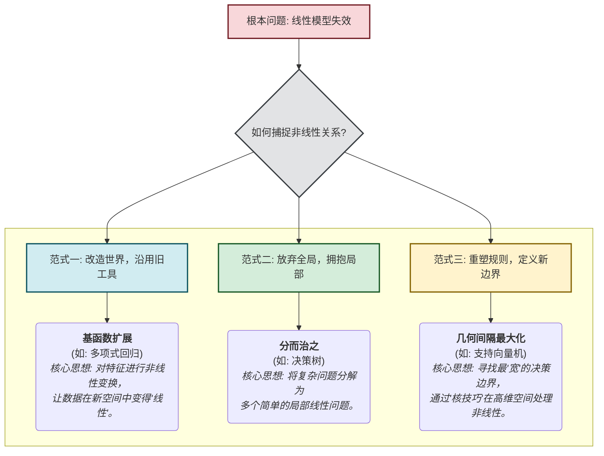

好的，作为一位世界级的教育家与作家，我将为您精心撰写这一节课程内容。我将以引人入胜的叙事方式，将抽象的理论与生动的类比相结合，带领读者踏上从线性世界到非线性世界的探索之旅。

---

### **第四章：突破线性 · 探索非线性世界**

在前面的章节中，我们花费了大量心血来理解和掌握线性模型。它们就像我们工具箱中那把值得信赖、结构精良的锤子。无论是线性回归还是逻辑回归，它们都基于一个简洁而优雅的核心假设：**世界是线性的**。它们相信，变量之间的关系可以用一条直线、一个平面或一个超平面来完美捕捉。在许多问题中，这把“锤子”表现出色，它为我们解决了无数“钉子”般的任务，其简洁性、可解释性和计算效率都令人称道。

但是，当我们走出理想化的教科书案例，步入真实世界的复杂丛林时，会发现并非所有问题都是“钉子”。我们很快就会遇到螺丝、铆钉，甚至是需要焊接的结构。这时，固执地挥舞锤子，不仅无法解决问题，反而可能造成破坏。本章的使命，就是为我们的工具箱增添一系列全新的、更强大的工具，让我们有能力应对现实世界中那些远比直线复杂的、蜿蜒曲折的非线性模式。

现在，让我们从一切的起点开始。

---

### **4.1 根本问题：当数据关系复杂，线性假设不成立时怎么办？**

#### **线性模型的“舒适区”与残酷的现实**

想象一下你是一位城市规划师，正在研究公共交通补贴与市民出行意愿之间的关系。你的初始假设非常直观：补贴越高，人们使用公共交通的意愿就越强。你收集了数据，散点图上的点大致呈现出一条上升的直线。此时，线性回归模型就像一位完美的顾问，为你画出了一条清晰的趋势线，告诉你每增加一元补贴，出行意愿大约会提升多少。一切都那么和谐、有序。这就是线性模型的“舒适区”：一个变量随着另一个变量稳定、持续地变化。

然而，你的研究深入下去，开始探索另一个问题：**施肥量与农作物产量之间的关系**。

常识告诉我们，在一定范围内，增加施肥量会显著提高产量。但如果无限制地增加，土壤盐碱化、养分失衡等问题会导致作物生长受到抑制，产量反而会急剧下降。这不再是一个简单的“越多越好”的线性关系。

让我们将这个场景数据化。假设我们收集了不同地块的施肥量（特征 `X`）和对应的作物产量（目标 `y`），并将它们绘制在散点图上：

*图4.1.1：施肥量与作物产量的非线性关系*

上图清晰地展示了一个“先增后降”的模式，数据点形成了一条优美的抛物线。现在，让我们固执地请出线性回归这位“直线专家”来解决这个问题。它会尽其所能，在这些散乱的点中寻找一条能够最小化整体误差的直线。结果会是怎样呢？

*图4.1.2：线性回归在非线性数据上的“无力挣扎”*

如图4.1.2所示，这条直线显得格格不入，甚至有些滑稽。
*   在施肥量很低和很高的区域，直线严重**低估**了真实产量。
*   在施肥量适中的区域，直线又严重**高估**了真实产量。

模型不仅预测不准，更糟糕的是，它给出了完全错误的洞察。根据这条直线，结论依然是“施肥量越多，产量越高”，这显然是荒谬且有害的。模型的残差（真实值与预测值之差）不再是随机分布的，而是呈现出明显的模式，这正是模型假设失效的强烈信号。

这就是我们面临的**根本问题**：当数据的内在关系是非线性时，强行使用线性模型，就像试图用一把直尺去测量一条蜿蜒的海岸线。你得到的将是一个粗糙、失真、甚至具有误导性的结果。我们对世界的线性假设，在此刻被现实无情地击碎了。

那么，当锤子失灵时，我们该怎么办？是时候打开工具箱，看看那些为复杂任务而生的精巧工具了。面对非线性这个“敌人”，机器学习领域的先驱者们开辟了三条截然不同的、充满智慧的道路。

#### **十字路口的选择：解决非线性问题的三大核心范式**

当直线无法描绘世界的真相时，我们站在了一个思想的十字路口。前方的三条道路，代表了三种截然不同的哲学思想。

##### **第一条路：改造世界，沿用旧工具 —— 基函数扩展 (Basis Expansion)**

**类比：戴上一副“哈哈镜”看世界**

想象一下，你手中只有一把直尺，但需要测量一个圆环的周长。直接测量显然是不可能的。但如果你足够聪明，你可以将圆环小心地剪开，并将其拉直成一条线段。现在，你的直尺又能派上用场了！你并没有改变你的工具（直尺），而是改变了你所要测量的对象（将圆环拉直）。

基函数扩展的哲学与此异曲同工。它提出：我们是否可以不抛弃强大而成熟的线性模型，而是对**数据本身**进行一次“非线性变换”，让它在新的“坐标系”下呈现出线性关系？

**问题-解决方案-影响**

*   **问题**：`y` 与 `x` 的关系是二次的（`y ≈ ax² + bx + c`），线性模型 `y = w₁x + b` 无法拟合。
*   **解决方案**：让我们创造一个新的特征！设 `x₁ = x`，`x₂ = x²`。现在，我们的模型变成了 `y = w₂x₂ + w₁x₁ + b`。请注意，这个模型对于新的特征 `x₁` 和 `x₂` 来说，是**完全线性的**！我们只是在求解最佳的权重 `w₁` 和 `w₂`。我们使用的求解器、正则化方法等，所有在线性回归中学到的知识都可以原封不动地拿来使用。
*   **影响**：这种被称为**多项式回归**的方法，是基函数扩展最经典的例子。它通过增加原始特征的多项式项（平方、立方等）来扩展特征空间。这是一种极为聪明的“升维”思想。它让我们意识到，模型的线性与否，取决于它对于**参数（权重）**是否是线性的，而非对于原始输入特征。这一思想极大地扩展了线性模型的应用边界，让我们能用熟悉的工具解决看似全新的问题。就好像我们给线性模型戴上了一副“哈哈镜”，通过这副镜子，原本弯曲的数据看起来变直了。

##### **第二条路：放弃全局，拥抱局部 —— 分而治之 (Divide and Conquer)**

**类比：经验丰富的老医生问诊**

想象一位经验丰富的老医生，他不会用一个单一的、万能的公式来诊断所有病人。相反，他会进行一系列的判断和提问，逐步缩小问题的范围。
*   “体温高于38度吗？”
    *   **是** -> “是否伴有咳嗽？”
        *   **是** -> “是干咳还是有痰？” -> ...
    *   **否** -> “是否感到腹部疼痛？” -> ...

医生通过一系列简单的问题，将复杂的病情空间划分成一个个小的、更容易处理的区域。在每个小区域内，他可能会给出一个非常简单的诊断结论。

决策树（Decision Tree）模型正是这种“分而治之”哲学的完美体现。它放弃了寻找一个能覆盖整个数据空间的、单一的、全局的复杂函数（比如一条高次多项式曲线）的念头。

**问题-解决方案-影响**

*   **问题**：一个复杂的、全局的函数难以寻找，且容易过拟合。
*   **解决方案**：我们不找这个复杂的函数。相反，我们用一系列简单的、基于单个特征的“规则”（例如 `施肥量 < 50kg?`）来递归地切割数据空间。每一次切割，都像医生问一个问题。直到最后，数据被切割成若干个小方块（称为“叶节点”）。在每个小方块里，数据的模式非常简单（例如，产量都差不多在某个值附近），我们就可以用一个极其简单的模型（比如该区域内所有数据点的平均值）来进行预测。
*   **影响**：决策树的出现，标志着一种与基于公式的全局模型完全不同的建模范式的兴起。它的决策过程非常直观，符合人类的思考习惯，因此具有极强的**可解释性**。将多个决策树组合起来（如随机森林、梯度提升树），更是在各种数据竞赛和工业应用中展现出无与伦-比的威力。它告诉我们，有时候，将一个大问题分解成无数个小问题来解决，比死磕那个大问题本身要有效得多。

##### **第三条路：重塑规则，定义新边界 —— 几何间隔最大化 (Geometric Margin Maximization)**

**类比：在两国之间划定最安全的“非军事区”**

假设你需要在地图上两个敌对国家（代表两类数据点）之间划定一条边界。你可以画无数条线将它们分开。但哪一条是最好的？一条紧贴着国家A的边界线是危险的，因为A国任何微小的领土扩张（数据点的扰动）都可能越过边界。同理，紧贴国家B的也不行。

最安全的边界，应该是那条位于两国正中间，并且使得边界线到两国最近的哨所（数据点）的距离之和最大化的那条线。这条边界创造了一个最宽的“非军事区”（Margin）。所有内陆城市离边界多远无关紧要，边界的位置完全由那些最靠近前线的“哨所”所决定。

支持向量机（Support Vector Machine, SVM）的核心思想，就是这种对“边界”的极致追求。

**问题-解决方案-影响**

*   **问题**：在分类问题中，有无数个决策边界可以将数据分开，如何选择一个最鲁棒、泛化能力最强的边界？
*   **解决方案**：SVM不再像逻辑回归那样关注所有点，而是只关注那些最靠近决策边界的“前线哨所”——即**支持向量（Support Vectors）**。它的目标是找到一个决策边界，使得这个由支持向量定义的“非军事区”（几何间隔）最宽。
*   **影响**：这种聚焦于边界和关键样本的思想，为机器学习带来了深刻的变革。更神奇的是，通过一个名为**“核技巧”（Kernel Trick）**的数学魔法，SVM可以在不实际进行高维计算的情况下，将数据映射到无穷维的空间中去寻找线性边界。这相当于在低维空间中划出了一条极其复杂的非线性边界。SVM在20世纪90年代至21世纪初成为机器学习领域的王者，其严谨的数学理论和优异的实际表现，为后来的许多算法（包括深度学习中的一些思想）铺平了道路。

#### **总结与展望**

我们从一个简单的问题出发：当线性假设失效时，我们该怎么办？这个问题将我们引向了一个思想的十字路口，并为我们揭示了机器学习中三条宏伟的道路：

1.  **基函数扩展**：不改变模型，而是通过**变换特征**来改变问题本身，使其适应我们的线性工具。这是一种“以不变应万变”的智慧。
2.  **决策树**：不寻求全局最优解，而是通过**分而治之**将复杂问题分解，在局部寻求简单解。这是一种化繁为简的工程思想。
3.  **支持向量机**：不满足于“能用”的解，而是通过**最大化几何间隔**来寻求最鲁棒的解，并借助核技巧优雅地处理非线性。这是一种追求极致和最优的数学哲学。

这三大范式并非相互排斥，有时甚至可以相互借鉴。它们是机器学习工具箱中，除了“锤子”之外，我们必须拥有的“螺丝刀”、“扳手”和“电焊机”。

在接下来的章节中，我们将沿着这三条道路继续前行，逐一深入探索每一种方法的内部构造、数学原理和实际应用。但在那之前，请思考以下问题：

*   这三种解决非线性问题的思路，哪一种你认为最直观？哪一种又让你觉得最“神奇”？
*   “改造数据”和“改造模型”这两种哲学，你认为在实际应用中各有什么优缺点？
*   一个极其复杂的模型（例如，一个非常深度的决策树）和一个通过复杂特征变换得到的简单线性模型，它们之间有什么本质的区别吗？

带着这些问题，让我们准备好，正式踏入这个精彩纷呈的非线性世界。