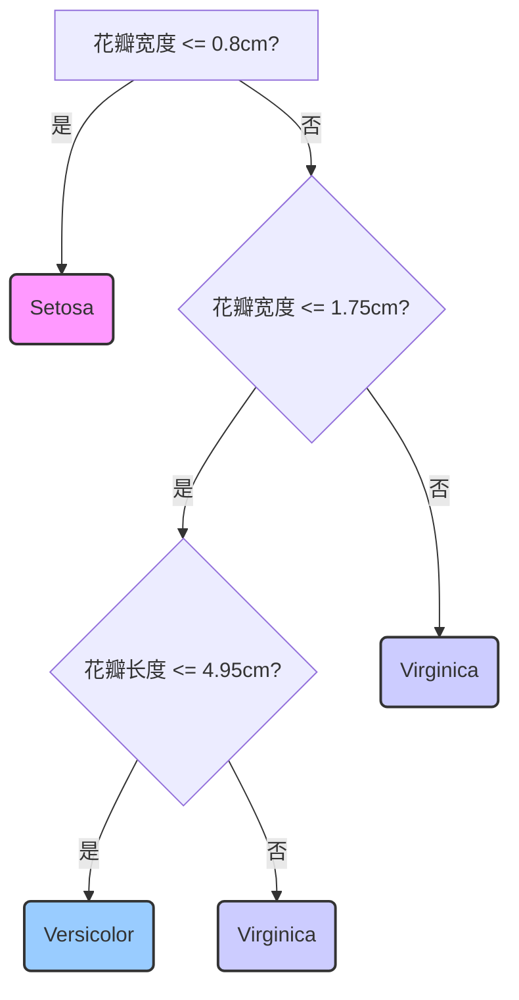

好的，我们现在正式进入第四章，开始探索令人兴奋的非线性世界。在线性模型为我们打下坚实的基础之后，你可能会好奇：当现实世界的数据关系并非一条直线或一个平面时，我们该如何应对？我们将要介绍的第一个强大工具，就是**决策树 (Decision Trees)**。它不仅直观、强大，其思考方式也与我们人类的决策过程惊人地相似。

---

### **第四章：突破线性 · 探索非线性世界**

#### **4.2 工具一：决策树 (Decision Trees)**

在我们深入技术细节之前，让我们先玩一个熟悉的游戏：**“二十个问题”**。

想象一下，我心里想了一个动物，你的任务是通过问不超过二十个“是”或“否”的问题来猜出它。你可能会这样开始：“它是哺乳动物吗？”如果我回答“是”，你就排除了鱼类、鸟类、昆虫等一大类可能。接着你可能会问：“它生活在陆地上吗？”“是。”范围又缩小了。然后是：“它是食肉动物吗？”“是。”“它身上有条纹吗？”“是。”……通过这样一系列层层递进的问题，你很可能最终锁定答案：“老虎”。

这个游戏的过程，就是决策树工作的核心思想。你所做的，正是通过一系列最优的问题，不断地将庞大、混杂的可能性空间（所有动物）分割成更小、更“纯净”的子集，直到每个子集都小到足以给出一个确定的答案。

##### **核心思想：万物皆可为流程图**

决策树，从本质上讲，就是一个模仿人类决策过程的流程图。它以一种“分而治之”（Divide and Conquer）的策略，递归地将数据集分割成更小的部分。让我们将“二十个问题”游戏中的元素与决策树的术语对应起来：

*   **你提出的每个问题**（例如，“它是哺乳动物吗？”），在决策树中被称为一个 **内部节点 (Internal Node)**。每个内部节点都代表对某个 **特征 (Feature)** 的一次 **测试 (Test)**。
*   **对问题的回答**（“是”或“否”），构成了决策树的 **分支 (Branch)**。每个分支代表测试的一个可能结果。
*   **你最终猜出的动物**（“老虎”），就是决策树的 **叶节点 (Leaf Node)**。叶节点代表最终的决策输出——在分类任务中，它是一个类别标签（如“老虎”、“猫”、“狗”）；在回归任务中，它是一个具体的数值（如预测房价为 50 万）。

让我们用一个经典的鸢尾花（Iris）分类任务来将这个概念具象化。假设我们的目标是根据花瓣的长度和宽度来区分三种鸢尾花。一个简单的决策树可能看起来是这样的：

这个流程图清晰地展示了决策过程：从根节点（Root Node）开始，我们检查一个样本的“花瓣宽度”。如果小于等于0.8cm，我们就直接判定它为 Setosa 类鸢尾花，决策结束。否则，我们进入下一个决策节点，继续检查“花瓣宽度”和“花瓣长度”，直到最终抵达一个叶节点，得到分类结果。

这种结构的美妙之处在于其无与伦比的 **可解释性 (Interpretability)**。与那些如同“黑箱”般的复杂模型不同，决策树的每一个决策路径都清晰明了，我们可以完整地复述出模型对任何一个样本的判断逻辑。这在许多领域（如医疗诊断、金融风控）是至关重要的。

##### **拆解关键机制：递归划分与“纯度”的艺术**

现在，一个核心问题浮出水面：在“二十个问题”游戏中，一个好的提问者会优先问那些能最大程度排除可能性的问题。同样，在构建决策树时，**算法如何在每一步选择“最佳”的特征和分割点呢？**

**问题背景：** 在决策树出现之前，统计学中的分类模型（如线性判别分析）大多依赖于数据的线性可分假设。但现实世界的数据往往是犬牙交错、非线性的。我们需要一种方法，能自动地、数据驱动地发现这些复杂的决策边界。决策树的构建算法，正是为了解决这个问题而生。它不预设任何数据分布，而是试图从数据本身中学习出一套决策规则。

**解决方案：追求“纯度”最大化**

决策树构建算法的核心目标是，在每一次分裂时，都选择一个能让分裂后的子集变得“最纯净”的划分方式。这里的“纯净”指的是子集中的样本尽可能属于同一个类别。想象一下，如果一个问题能让你把所有可能的“老虎”和“狮子”分到一边，所有“海豚”和“鲸鱼”分到另一边，这就是一个高质量的划分。

为了量化“纯度”，数学家和信息理论家们提出了几个关键指标。

**1. 信息熵 (Entropy) 与信息增益 (Information Gain)**

这个概念源于信息论之父克劳德·香农。**熵**，在信息论中，是用来度量一个系统的 **不确定性** 或 **混乱程度** 的指标。熵越高，系统越混乱，包含的信息越不确定；熵越低，系统越有序，信息越确定。

在一个分类问题的数据集中，如果所有样本都属于同一类别（例如，一个装满了红色球的盒子），那么它的不确定性为零，熵也为零。如果样本的类别均匀分布（例如，一个盒子里红球和蓝球各占一半），那么不确定性达到最大，熵也最大。

熵的计算公式为：
$$
\text{Entropy}(S) = - \sum_{i=1}^{c} p_i \log_2(p_i)
$$
其中，$S$ 是数据集，$c$ 是类别的数量，$p_i$ 是第 $i$ 个类别在数据集 $S$ 中所占的比例。

**信息增益 (Information Gain)** 则是衡量一次划分所带来的“不确定性减少量”。它的计算方式是：用划分前的父节点的熵，减去划分后所有子节点熵的加权平均值。
$$
\text{Gain}(S, A) = \text{Entropy}(S) - \sum_{v \in \text{Values}(A)} \frac{|S_v|}{|S|} \text{Entropy}(S_v)
$$
其中，$A$ 是用来划分的特征，$\text{Values}(A)$ 是特征 $A$ 的所有可能取值，$S_v$ 是 $S$ 中特征 $A$ 取值为 $v$ 的子集。

决策树的经典算法之一 **ID3**，在每个节点进行分裂时，会遍历所有可能的特征和分割点，计算每一个划分方案的信息增益，然后选择那个 **信息增益最大** 的方案。这就像在“二十个问题”中，你总是选择那个能提供最多信息、最大程度消除不确定性的问题。

**2. 基尼不纯度 (Gini Impurity)**

基尼不纯度是另一个衡量纯度的常用指标，被用于 **CART (Classification and Regression Trees)** 算法中。它的概念更直观：从一个数据集中随机抽取两个样本，其类别标签不一致的概率。如果数据集是纯净的（所有样本同属一类），这个概率就是0。

基尼不纯度的计算公式为：
$$
\text{Gini}(S) = 1 - \sum_{i=1}^{c} p_i^2
$$
与熵类似，$p_i$ 是第 $i$ 类样本的比例。基尼不纯度越小，代表数据集的纯度越高。

在选择分裂点时，CART算法会选择那个能让分裂后的基尼不纯度（同样是子节点的加权平均）**下降最多** 的划分。与基于熵的计算相比，基尼不纯度的计算不涉及对数，通常会更快一些。

**3. 对于回归树：残差平方和 (RSS)**

当我们的目标是预测一个连续值（如房价）时，类别“纯度”的概念就不再适用。取而代之，回归树的目标是让每个叶节点内的样本目标值尽可能地接近。衡量这种“接近程度”的指标就是 **残差平方和 (Residual Sum of Squares, RSS)**。
$$
\text{RSS} = \sum_{j=1}^{N} (y_j - \hat{y}_{\text{leaf}})^2
$$
其中，$\hat{y}_{\text{leaf}}$ 是该叶节点上所有样本目标值的均值。算法在选择分裂点时，会选择那个能使分裂后两个子节点的 RSS 总和最小化的划分。

**递归的本质**：一旦最佳分裂点被找到，数据集就被一分为二（或更多）。然后，算法将对每个新的子节点重复上述过程：计算所有可能分裂的纯度增益，选择最优的，再分裂……这个过程会一直持续下去，直到满足某个停止条件，比如：节点已经完全纯净、节点中的样本数少于某个阈值、树的深度达到了预设上限等。这就是“递归划分”的完整过程。

##### **关键技术：为大树“剪枝”以见森林 (Pruning)**

如果任由决策树自由生长，它会变得异常繁茂，直到每个叶节点都只包含一个或极少数几个样本。这样的树在训练集上的表现会趋近于完美，因为它相当于为训练集中的每一个样本都量身定制了一条独一无二的决策路径。

**问题背景：** 这种“完美”是极其危险的。这就像一个学生，把题库里的每一道题连同答案都背得滚瓜烂熟，但当考试遇到一道数字稍有变化的新题时，他就束手无策了。在机器学习中，这种现象被称为 **过拟合 (Overfitting)**。一棵过度生长的树，学习到的是训练数据中的噪声和偶然性，而不是普适的规律，导致其在未见过的新数据上表现糟糕。

**解决方案：剪枝 (Pruning)**

为了防止过拟合，我们需要对这棵大树进行“修剪”，砍掉那些不必要的、可能由噪声驱动的复杂分支。剪枝是控制决策树复杂度的核心技术，其主流方法是 **成本复杂度剪枝 (Cost-Complexity Pruning)**。

这个方法非常巧妙，它引入了一个权衡：我们既希望树的预测误差小，又希望树的结构简单。为此，我们定义一个带惩罚项的损失函数：
$$
C_{\alpha}(T) = \text{Err}(T) + \alpha |T|
$$
*   $T$ 代表一棵子树。
*   $\text{Err}(T)$ 是这棵子树在训练数据上的预测误差（对于分类树可以是错分样本数，对于回归树是RSS）。
*   $|T|$ 是这棵子树的叶节点数量，代表了树的 **复杂度**。
*   $\alpha$ ($\ge 0$) 是 **成本复杂度参数**，它扮演着一个“裁判”的角色，权衡着模型的误差与复杂度。

**剪枝过程的逻辑链条：**
1.  **$\alpha$ 的作用**：当 $\alpha = 0$ 时，我们不惩罚复杂度，模型的目标就是最小化误差，这会得到一棵完全生长的、最复杂的树。当 $\alpha$ 逐渐增大时，我们对复杂度的“容忍度”就越低，为了让总成本 $C_{\alpha}(T)$ 最小，模型会倾向于选择牺牲一点点拟合精度来换取更少的叶节点，即进行“剪枝”。
2.  **寻找最优子树序列**：算法会从一个非常小的 $\alpha$ 开始，逐渐增大它。对于每一个固定的 $\alpha$ 值，都存在一个唯一的最优子树 $T_{\alpha}$，它能使 $C_{\alpha}(T)$ 最小化。这样，通过连续改变 $\alpha$，我们可以得到一个从最复杂的树到最简单的树（只有一个根节点）的子树序列。
3.  **最终选择**：我们有了不同复杂度（由不同 $\alpha$ 产生）的候选树。那么，到底哪一棵是最好的呢？答案是通过 **交叉验证 (Cross-Validation)**。我们将这些候选树在一个独立的验证集上进行测试，选择那棵在验证集上表现最好的树作为我们最终的模型。

成本复杂度剪枝的出现，为决策树从一个容易过拟合的理论模型，转变为一个在实践中稳健、可靠的工具提供了关键性的技术保障。

##### **优势与局限性：一把双刃剑**

决策树作为非线性世界的入门工具，其特点非常鲜明。理解它的优缺点，是有效使用它的前提。

| 优势 (Advantages) | 局限性 (Limitations) |
| :--- | :--- |
| **高度可解释性 (White-box Model)**：决策逻辑直观，可以被人类轻松理解和解释。这是许多复杂模型无法比拟的巨大优点。 | **不稳定性 (High Variance)**：训练数据中的微小变动，可能导致生成一棵结构完全不同的树。这使得单个决策树的结果不够稳健。 |
| **能处理非线性关系**：通过矩形的、轴平行的划分，决策树可以拟合出非常复杂的非线性决策边界。 | **容易过拟合**：即使有剪枝，决策树依然有创建过于复杂的模型的倾向，需要仔细调优。 |
| **对特征缩放不敏感**：决策是基于“大于/小于”某个阈值，而非特征的绝对数值大小，因此不需要对特征进行标准化或归一化。 | **轴平行决策边界的局限**：决策树的分割线总是垂直于坐标轴。如果数据的真实边界是倾斜的（例如 `feature1 + feature2 > threshold`），决策树需要用很多阶梯状的分割来近似，效率不高。 |
| **能同时处理数值型和类别型特征**：算法本身可以很自然地处理混合数据类型，无需复杂的预处理。 | **对缺失值敏感**：在某些实现中，处理特征中的缺失值可能比较麻烦。 |

---

#### **总结与展望**

在这一节中，我们一同揭开了决策树的神秘面纱。我们从一个简单的“二十个问题”游戏出发，理解了它“分而治之”的核心思想。我们深入探讨了其构建的关键机制——如何通过**信息增益**或**基尼不纯度**等指标来追求“纯度”，进行递归划分。我们还认识到，一棵肆意生长的树是危险的，并学习了如何通过**成本复杂度剪枝**来驯服它，防止过拟合。最后，我们客观地评估了它的优缺点，认识到它是一把强大但需要谨慎使用的双刃剑。

现在，请你思考一个问题：决策树最大的弱点是它的“不稳定性”——一个“片面”的专家，其决策可能因为看到的数据稍有不同而剧烈摇摆。在现实生活中，当我们面对一个重大决策时，我们通常不会只咨询一位专家，而是会听取一个“专家委员会”的集体意见。

那么，在机器学习中，我们是否也能这样做呢？我们能否构建一个由许多不同决策树组成的“委员会”，让它们“集体投票”，从而得到一个比任何单棵树都更强大、更稳健的决策？

这个想法，正是我们即将踏入的下一个领域——**集成学习 (Ensemble Learning)** 的核心，它将直接引出机器学习中最强大、最流行的模型之一：**随机森林 (Random Forest)**。决策树，正是通往那片广袤森林的必经之路。