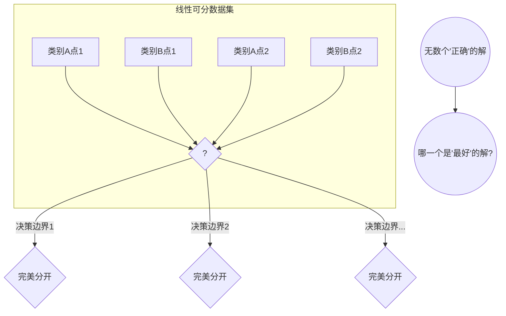

好的，作为一位世界级的教育家与作家，我将为您呈现这一节关于支持向量机（SVM）的深度教学内容。我将遵循您的要求，将复杂的理论编织成一个引人入胜的叙事，确保内容详尽、逻辑清晰且富有启发性。

---

### **4.3 工具二：支持向量机 (Support Vector Machines)**

在上一节中，我们可能已经领略了决策树如何通过一系列“是/否”的问题来划分世界，或是其他方法如何以不同的方式捕捉数据中的非线性关系。现在，让我们转换视角，进入一个由几何、优化和一点点“魔法”构成的全新领域。今天的主角——支持向量机（Support Vector Machine, SVM），将向我们展示一种截然不同的、极其优雅的分类哲学。它所追求的，不仅仅是“正确”，更是“最优”和“最稳健”的划分。

想象一下，我们不再是简单地在数据点中寻找一条分界线，而是扮演一位严谨的城市规划师，任务是在两个敌对的王国之间划定一条最安全的边界。这条边界不仅要能分开两个王国，更要尽可能地宽阔，留出最大的缓冲地带，以防任何一方的“边境居民”（数据点）引发冲突。这种对“最大缓冲带”的极致追求，正是SVM思想的精髓。

---

#### **核心思想：最大间隔分类器 (Maximum Margin Classifier)**

**问题背景：从“能分”到“善分”的追求**

在线性分类的世界里，我们已经见过了像逻辑回归这样的模型。对于一个线性可分的数据集——也就是说，存在一条直线（或更高维度的“超平面”）能完美地将两类数据点分开——逻辑回归可以成功地找到这样一条分界线。但问题也随之而来：这样的分界线有无数条。

 

 

上图揭示了一个根本性的困境：如果仅仅满足于“能分开”，那么每一条虚线都是一个合格的解。但是，它们在“质量”上却有天壤之别。有些线紧紧贴着某一类数据点，仿佛稍有风吹草动（比如一个新的数据点出现），这条线就会被轻易地跨越，导致分类错误。这种模型的**泛化能力**（generalization ability）是值得怀疑的。

**SVM的解决方案：寻找最宽的“街道”**

SVM的提出者，Vladimir Vapnik等人，在上世纪90年代给出了一个充满几何美感的答案：**最好的那条分界线，应该是离两边阵营中最近的士兵（数据点）都最远的那一条。**

让我们用一个更具体的类比来理解。

> **类比：规划“安全隔离带”**
>
> 想象你在一个平面上看到了两个村庄，分别属于蓝村和红村。你的任务是修建一条笔直的公路，将两个村庄隔开。
>
> - **一个普通的规划师**可能会直接在两个村庄之间画一条线，只要线的一边全是蓝村的房子，另一边全是红村的房子，任务就算完成。
> - **一位优秀的规划师（SVM）**则会考虑得更多。他会问：“为了确保最大的安全距离，这条公路应该修在哪里？” 他会找到离公路最近的几栋房子——蓝村最靠前的房子和红村最靠前的房子。然后，他会调整公路的位置，使得公路的中心线到这两边“前哨”房子的距离是相等的，并且这个距离是所有可能画法中最大的。
>
> 这条公路本身就是我们的**决策边界（超平面）**。公路两侧的路肩边缘，构成了我们所说的**“间隔”（Margin）**。而那几栋决定了公路位置的“前哨”房子，就是至关重要的**“支持向量”（Support Vectors）**。

从数学上讲，这个决策边界是一个超平面，由方程 $w^T x + b = 0$ 定义。SVM的目标，就是找到一组参数 $w$ 和 $b$，使得这个间隔最大化。这个间隔的宽度可以表示为 $\frac{2}{||w||}$。因此，最大化间隔就等价于最小化 $||w||^2$。

这个模型被称为**硬间隔支持向量机（Hard-margin SVM）**。它的决策过程极其“高冷”：一旦边界确定，只有那些位于间隔边界上的“支持向量”在发挥作用。你可以移动、甚至删除任何远离边界的数据点，决策边界都不会有丝毫改变。这体现了SVM的一个关键特性：它的解是由数据中最“困难”、最“模棱两可”的样本所决定的。

---

#### **从硬间隔到软间隔：拥抱不完美的世界**

硬间隔SVM的设想是美好的，但它对数据的要求也极为苛刻：数据必须是完全线性可分的。现实世界的数据充满了噪声和异常值，线性不可分才是常态。

**问题背景：当“前哨”越界时**

回到我们的城市规划类比。如果蓝村有个别村民不守规矩，把房子建到了红村的地盘上，或者两个村庄的边界本身就有些犬牙交错，硬间隔SVM这位“完美主义”规划师就会直接罢工——因为他找不到任何一条直线能完美地划分两个村庄。

这种“一票否决”的刚性显然是不可取的。我们需要一个更灵活、更具容错性的模型。

**SVM的解决方案：引入松弛与惩罚**

为了应对这个挑战，SVM引入了**软间隔（Soft-margin）**的概念。其核心思想是：**我们依然追求尽可能宽的间隔，但我们允许一些数据点“犯规”。**

> **类比：带有“违章罚单”的城市规划**
>
> 我们的规划师现在变得更加务实。他仍然希望修建一条尽可能宽的隔离带，但他承认，可能无法避免一些“违章建筑”（分类错误的点或在间隔内的点）。
>
> 他的新策略是：
> 1.  **目标一（主要）：** 尽可能让隔离带（间隔）更宽。
> 2.  **目标二（次要）：** 尽可能减少“违章建筑”的总量和“违章”的严重程度。
>
> 为了平衡这两个目标，他引入了一个**“城管”——惩罚参数C**。
>
> -   **如果C值很高（严厉的城管）**：每出现一个“违章建筑”，都会被处以高额罚款。为了避免罚款，规划师会宁愿牺牲隔离带的宽度，也要想办法把边界画得扭曲一些，以容纳这些异常点。这可能导致模型对训练数据过于敏感，即**过拟合**。
> -   **如果C值很低（宽容的城管）**：罚款很低，规划师就会更专注于实现他的主要目标——构建一个宽阔、平整的隔离带。他会选择性地忽略一些“违章建筑”，认为支付这点罚款是值得的，因为这换来了一个更稳定、更具普遍性的城市蓝图。这有助于提升模型的**泛化能力**。

在技术实现上，这种“容错”是通过为每个样本 $x_i$ 引入一个**松弛变量（slack variable）$\xi_i$** 来实现的。$\xi_i$ 度量了第 $i$ 个样本“犯规”的程度。软间隔SVM的优化目标就变成了：在最小化 $||w||^2$（最大化间隔）和最小化所有样本的松弛变量之和（最小化错误）之间取得平衡。而参数 $C$ 正是这个平衡的调节器。

---

#### **拆解关键机制：核技巧 (The Kernel Trick)**

至此，我们已经让SVM从一个理想主义者变成了一个现实主义者。但它仍然只能处理“大致”线性的问题。面对像同心圆或者棋盘格这样复杂的非线性数据，一条直线无论如何调整，都无能为力。

**问题背景：维度诅咒的阴影**

在之前的章节中，我们遇到非线性问题时，一个常见的思路是**特征变换**。比如，对于一个一维的非线性问题，我们可以通过增加一个 $x^2$ 的特征，将数据映射到二维空间，从而让它变得线性可分。

这个思路很棒，但有一个致命的缺陷。如果原始数据维度很高，或者需要的非线性关系很复杂（比如需要映射到百万、甚至无限维度的空间），那么：
1.  **计算灾难**：显式地计算每个数据点在新空间中的坐标，其计算量将大到无法承受。
2.  **存储灾难**：存储这些高维坐标也将耗尽我们的内存。
这就是所谓的“维度诅咒”（Curse of Dimensionality）。

**SVM的革命性方案：核技巧**

SVM的开发者们在研究其优化算法的数学形式（对偶问题）时，发现了一个惊人的事实：在整个计算过程中，算法**根本不需要知道每个数据点在高维空间中的确切坐标**！它唯一需要的信息是数据点对（pairs of data points）在那个高维空间中的**内积（dot product）**。

内积衡量了两个向量的相似度或相关性。这个发现是革命性的，它直接催生了机器学习中最优雅的“魔法”之一——**核技巧（The Kernel Trick）**。

> **类比：皮影戏的智慧**
>
> 想象你面前有一堆杂乱无章的木偶（低维、非线性可分的数据），你无法用一根棍子将它们分成两组。
>
> -   **传统方法（显式映射）**：你打开一盏灯，把每个木偶举到灯前，观察它在墙上投下的复杂影子（高维空间中的坐标）。你记录下每个影子的精确形状和位置，然后在影子的世界里找到一根棍子来划分它们。这个过程非常繁琐。
>
> -   **核技巧（隐式计算）**：现在，你得到了一台神奇的设备。你不需要去看墙上的影子，你只需要把任意两个木偶放进这个设备，它就能直接告诉你，**如果**把它们投影到墙上，它们的影子会有多相似（高维空间中的内积）。
>
> SVM的核技巧就是这台神奇的设备。它通过一个**核函数 (Kernel Function)** $K(x_i, x_j)$，直接在原始的低维空间中计算，却能得到与高维空间中内积 $\phi(x_i) \cdot \phi(x_j)$ 完全相同的结果。它让我们能够在“影子世界”（高维特征空间）里进行划分，而身体却始终停留在“木偶世界”（原始输入空间），从而完美地避开了维度诅咒。

**常见的核函数：**

1.  **多项式核 (Polynomial Kernel)**: $K(x_i, x_j) = (x_i \cdot x_j + c)^d$。它能有效地学习多项式决策边界，而无需真正计算所有多项式组合的特征。
2.  **径向基函数核 (Radial Basis Function, RBF Kernel)**: $K(x_i, x_j) = \exp(-\gamma ||x_i - x_j||^2)$。这是最常用也最强大的核函数之一。它的思想更加抽象：它将每个数据点映射到一个**无限维**的空间。你可以将其理解为，决策边界是由支持向量为中心的一系列“高斯山峰”叠加而成。参数 $\gamma$ 控制了单个样本的影响范围，$\gamma$ 越大，影响范围越小，决策边界越曲折，容易过拟合。

核技巧的出现，是SVM从一个巧妙的线性分类器，一跃成为强大的非线性学习工具的决定性一步。它是一种计算上的“免费午餐”，让我们以低廉的代价，获得了在高维空间中操作的惊人能力。

---

#### **案例分析：垃圾邮件过滤中的SVM**

为了让SVM的威力更加具体，我们来看一个经典应用：垃圾邮件过滤。

-   **问题**：如何自动识别一封邮件是正常邮件还是垃圾邮件？
-   **特征表示**：一个常用的方法是“词袋模型”（Bag-of-Words）。我们将建立一个包含数万个常用词的词典。然后，每一封邮件都可以被表示成一个数万维的向量，向量的每一维对应词典中的一个词，其值可以是该词在邮件中出现的频率。
-   **SVM为何在此大放异彩？**
    1.  **高维空间性能**：邮件向量的维度极高（通常 > 10000），这正是SVM的优势领域。最大间隔的原则在高维空间中能有效避免过拟合。
    2.  **非线性关系**：“垃圾邮件”的模式是复杂的、非线性的。单个词（如“免费”）可能不足以判断，但词的组合（如“免费”、“赢取”、“点击链接”）则构成了强烈的信号。RBF核能够很好地捕捉这些复杂的组合关系。
    3.  **依赖关键样本**：垃圾邮件和正常邮件的绝大部分内容可能都是相似的常用词。真正起决定性作用的，是那些最具区分度的“关键词”组合。这与SVM依赖支持向量进行决策的思想不谋而合。

在许多文本分类任务中，经过精心调参的SVM，其性能至今仍是许多更现代、更复杂模型（如深度学习）的有力基准。

---

#### **优势与局限性**

| 优势 (Pros)                                                  | 局限性 (Cons)                                                |
| ------------------------------------------------------------ | ------------------------------------------------------------ |
| **在高维空间中表现优异**：当特征维度远大于样本数量时，SVM依然有效。 | **计算复杂度高**：对于大规模数据集，训练时间会非常长（复杂度约在 O(n²) 到 O(n³) 之间）。 |
| **内存效率高**：由于决策函数仅由支持向量决定，因此模型在预测时仅需存储这些支持向量。 | **对参数和核函数选择敏感**：需要通过交叉验证等方式仔细选择惩罚参数C、核函数及其参数（如RBF核的γ）。 |
| **泛化能力强**：最大化间隔的优化目标本身就蕴含了对模型复杂度的控制，具有良好的抗过拟合能力。 | **模型解释性差**：与决策树不同，SVM生成的模型（尤其是使用非线性核时）像一个“黑箱”，难以直观解释其决策逻辑。 |
| **通用性强**：通过选择不同的核函数，可以灵活地应对各种线性和非线性问题。 | **对缺失数据敏感**：SVM的标准实现不支持数据中有缺失值。 |

---

#### **总结与展望**

我们从一个简单而深刻的几何直觉出发——寻找最宽的街道，踏上了支持向量机的探索之旅。

-   我们始于**硬间隔SVM**，它在理想世界中追求最完美的划分。
-   接着，通过引入松弛变量和惩罚参数C，我们进入了**软间隔SVM**的现实世界，学会在“最大化间隔”和“容忍错误”之间做出权衡。
-   最后，我们见证了**核技巧**这一“神来之笔”，它通过隐式的高维映射，让SVM拥有了驾驭复杂非线性问题的超能力，而无需承受维度诅咒的代价。

SVM不仅仅是一个强大的算法，它更是一种思想的胜利。它告诉我们，一个好的模型不仅要能拟合现有数据，更要为未知的数据留出最充足的“安全”空间。

**最后，留给你们一些思考：**

1.  RBF核函数将数据映射到了一个无限维度的空间。我们人类甚至无法想象四维空间，又该如何理解在一个无穷维空间里的“线性”分割面呢？这是否揭示了数学作为一种抽象工具，其力量远远超出了我们的直观想象？
2.  SVM的决策仅仅依赖于一小部分“最难搞定”的样本——支持向量。这与人类专家的决策过程有何异同？我们是否也是在处理了最棘手的边界案例后，才形成了对一个概念的稳固认知？
3.  “核技巧”的本质是在不进入高维空间的前提下，获得高维空间中的计算结果。这种“只问结果，不问过程”的计算捷径思想，在机器学习乃至计算机科学的其他领域，还有哪些令人惊叹的应用？

带着这些问题，我们将继续前行，探索更多突破线性、拥抱复杂的强大工具。而SVM所代表的这种基于优化和几何间隔的思维范式，将长久地为我们提供启发。