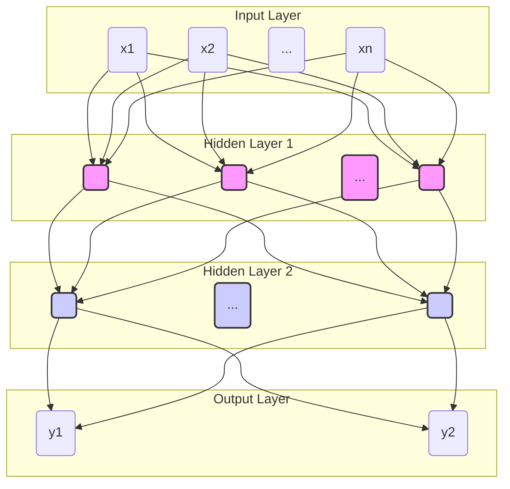

好的，我们现在正式开启监督学习之旅的全新篇章。在前几章中，我们已经建立了坚实的预测模型基础，从简洁的线性模型到强大的集成方法。现在，让我们站在这个知识的肩膀上，去探索一个更为宏大和根本性的问题。

---

# 第六章：初探现代架构 · 神经网络入门

## 6.1 根本问题：是否存在一种能自动学习特征并拟合任意复杂函数的“通用”模型？

在我们的探索旅程中，我们已经见证了模型复杂性的逐步演进。我们从第二章的线性模型开始，它们如同严谨的法官，根据我们提供的证据（特征）进行加权判决，但其思维方式是直线的，无法捕捉现实世界中普遍存在的“拐弯抹角”的非线性关系。

为了突破这一局限，我们在第四章引入了多项式回归、核方法等技巧，如同给法官配备了更复杂的工具，使其能够画出曲线，更好地拟合数据的真实轮廓。接着，在第五章，我们更进一步，采取了“群策群力”的策略。无论是通过Bagging和随机森林汇集众多“专家”的意见以求稳定，还是通过Boosting让模型“知错能改、持续精进”，集成学习都极大地提升了模型的性能上限。

然而，请静下来思考一个贯穿始终的潜在挑战：在上述所有方法中，**“特征”本身的重要性似乎是先验的、是被我们人类“钦定”的**。我们煞费苦心地进行特征工程（Feature Engineering），试图从原始数据中提取、组合出对模型最“友好”、信息量最丰富的特征。例如，在预测房价时，我们可能会手动创造一个“房间总面积/楼层数”的新特征。这个过程极度依赖领域知识、直觉，甚至是运气，往往成为整个机器学习项目中最为耗时且决定成败的关键瓶颈。

这就引出了一个革命性的问题：我们能否设计出一种模型，它不仅能学习输入与输出之间的映射关系，**更能在这个过程中自动地、从数据本身出发，学习到如何构建和组合有用的特征？**我们能否摆脱手工制作特征的桎梏，让模型自己去发现数据中潜藏的、从简单到复杂的层次化结构？

更进一步，我们对这个理想模型的期望是，它应该具有极大的灵活性和表达能力，能够逼近我们能想象到的任何复杂的函数关系，成为一种“通用”的函数拟合器。

这个宏大的设想，听起来近乎于奢望。它要求模型既要有强大的自动化能力，又要有近乎无限的拟合潜力。然而，正是对这个问题的追问，将我们引向了机器学习领域的一座璀璨的灯塔，一个深刻改变了人工智能面貌的架构——**神经网络（Neural Networks）**。它的灵感，源自宇宙中最复杂的学习机器：生物大脑。

### 从线性模型到神经元：一个优雅的跃迁

要理解神经网络的宏伟蓝图，我们无需从一个全新的、令人望而生畏的概念开始。相反，我们可以从最熟悉的老朋友——线性模型——出发，看看它如何通过一个微小而关键的改造，化身为神经网络最基本的构建单元。

回想一下线性回归的公式：

$$
\hat{y} = w_1x_1 + w_2x_2 + \dots + w_nx_n + b = \sum_{i=1}^{n} w_i x_i + b
$$

这个公式描述了一个非常简单的计算过程：将所有输入特征 $(x_1, \dots, x_n)$ 进行加权求和，最后加上一个偏置项 $b$。我们可以将这个过程想象成一个简单的决策单元。

**类比：一场简单的投票**

想象一个社区委员会正在投票决定是否要修建一座公园。每个委员（输入特征 $x_i$）都有自己的影响力（权重 $w_i$）。例如，规划委员的意见权重可能很高，而预算委员的意见可能是负权重（如果他更关心成本）。最终的决策分数 $(\hat{y})$ 就是所有委员意见的加权总和。如果这个分数超过某个阈值，项目就通过。

这个模型很直观，但它的问题在于其“线性”本质。无论输入如何变化，输出总是以一种固定的、线性的方式响应。如果我们将所有线性模型堆叠在一起，最终得到的仍然是一个线性模型，就像将多个齿轮串联起来，它们仍然只能进行简单的线性传动，无法实现复杂的变速功能。

现在，让我们引入一个点睛之笔。生物学研究告诉我们，大脑中的神经元并非简单地将接收到的电信号相加。当输入的总信号强度超过某个阈值时，神经元会被“激活”（fire），并向下游神经元传递一个强烈的信号；如果未达到阈值，它则保持静默或传递一个微弱的信号。这个“全或无”的触发机制是高度**非线性**的。

受到这个启发，我们在线性模型的加权求和之后，引入一个被称为**激活函数（Activation Function）**的非线性函数 $\sigma(\cdot)$。于是，这个计算单元的输出变成了：

$$
\text{output} = \sigma(\sum_{i=1}^{n} w_i x_i + b)
$$

这个结构，就是人工神经网络最基本的组成部分——**神经元（Neuron）**，在早期也被称为**感知器（Perceptron）**。

*图：一个神经元的结构。它接收多个输入，进行加权求和，然后通过一个非线性激活函数产生输出。*

激活函数的形式多种多样，例如：

*   **Sigmoid 函数**：将任意实数输入压缩到 (0, 1) 区间，可以模仿神经元“激活”的概率。
*   **ReLU (Rectified Linear Unit) 函数**：$\text{ReLU}(z) = \max(0, z)$。它更像一个开关：当输入信号为正时，原样输出；当输入为负时，则完全抑制（输出为0）。这是现代神经网络中最常用的激活函数之一。

**这个小小的非线性改造，其意义是颠覆性的。** 它如同给我们的投票决策单元赋予了“态度”。不再是简单的分数累加，而是当累加的分数（加权和）达到某个临界点后，单元会做出一个明确的、非线性的响应——或强烈赞同（输出1），或保持沉默（输出0），或给出介于两者之间的平滑过渡。正是这个非线性，打破了线性模型的桎梏，使得将多个神经元组合在一起时，能够产生远比它们各自独立时要复杂得多的行为。一个神经元的力量有限，但当成千上万个这样的非线性单元连接成网络时，奇迹便开始发生。

### 核心思想：分层特征学习

如果说单个神经元是从线性模型到非线性决策单元的“一小步”，那么将这些神经元组织成一个层次结构，则是迈向自动特征学习的“一大步”。这就是**多层感知机（Multi-Layer Perceptron, MLP）**的核心思想。

一个典型的MLP由三部分组成：

1.  **输入层（Input Layer）**: 接收最原始的数据。比如，如果要识别一张手写数字图片（假设为28x28像素），输入层就会有 $28 \times 28 = 784$ 个节点，每个节点对应一个像素点的灰度值。
2.  **隐藏层（Hidden Layers）**: 介于输入层和输出层之间。可以有一层或多层。这些层是模型真正的“学习引擎”所在，它们负责从前一层的信息中提取和组合出新的、更有意义的特征。
3.  **输出层（Output Layer）**: 产生最终的预测结果。对于手写数字识别（0-9），输出层可以有10个节点，每个节点对应一个数字的预测概率。

**类比：一个视觉识别的认知过程**

让我们用一个更具象的类比来理解这个分层学习的过程。想象一下我们的大脑是如何识别一只猫的：

*   **输入层 (视网膜)**: 接收到的是最原始的光学信号——成千上万个像素点。这些像素本身几乎没有意义。
*   **第一个隐藏层 (初级视觉皮层 V1)**: 这一层的神经元并不直接看“猫”，它们被训练得对非常简单的模式敏感。比如，某个神经元可能在看到“水平边缘”时被激活，另一个在看到“垂直边缘”时激活，还有的对特定的颜色块或45度斜线激活。它们从像素中学习到了最基础的**“视觉基元”**。
*   **第二个隐藏层 (更高级的视觉区域)**: 这一层的神经元接收来自第一隐藏层的信号。它们的工作是将那些简单的“边缘”、“角”、“颜色块”组合起来。例如，一个神经元可能会学习到，当它同时接收到两个“半圆形边缘”和一个“三角形边缘”的信号时（分别来自第一层的不同神经元），它就应该被激活——它实际上成了一个**“耳朵探测器”**。同理，其他神经元可能成为了“眼睛探测器”或“胡须探测器”。
*   **输出层**: 这一层的神经元接收来自第二隐藏层的“部件”信号。当它同时接收到强烈的“耳朵”、“眼睛”、“胡须”、“毛茸茸的轮廓”等信号时，它最终做出判断：“这是一只猫”。

这个过程最神奇的地方在于，我们从未明确地编程告诉模型要去寻找“边缘”或者“耳朵”。我们只是给它提供了大量的猫的图片（输入）和“这是猫”的标签（输出），然后通过一个称为**反向传播（Backpropagation）**的训练算法（我们将在后续章节深入探讨），网络会**自动调整**每一层神经元之间的连接权重，使得它自己发现，为了最终能正确识别出猫，学习检测边缘、再将边缘组合成部件，是一条最高效、最合理的路径。

这就是神经网络**自动学习特征**的精髓所在：它通过一个深度的、层次化的结构，将原始的、无意义的输入，逐层抽象和转化为越来越复杂、越来越有意义的内部表示（特征），最终服务于我们的预测任务。这彻底颠覆了传统机器学习中“模型学习”与“特征工程”相分离的范式，将两者完美地统一在了一个端到端的学习框架之内。

### 通用近似定理：一剂理论上的强心针

现在我们知道，神经网络的结构设计精巧，能够自动学习特征。但这引出了一个更深层次的理论问题：这种架构的表达能力究竟有多强？它是否真的能像我们期望的那样，成为一个“通用”的模型，拟合任意复杂的函数？

答案是肯定的，而为这份信心提供坚实理论基础的，就是著名的**通用近似定理（Universal Approximation Theorem）**。

该定理的核心结论可以通俗地表述为：

> **一个包含单层隐藏层、拥有足够多数量的神经元、并使用非线性激活函数的前馈神经网络，可以以任意指定的精度，逼近任意一个定义在实数空间中紧集上的连续函数。**

**类比：用乐高积木搭建万物**

让我们把这个抽象的定理具象化。想象你有一大箱无限量的、最基础的乐高积木块（比如2x2的标准块）。这些积木块就相当于我们隐藏层中的**神经元**。而你想搭建的目标，是世界上任何一个复杂的雕塑（一个**连续函数**），比如米开朗基罗的《大卫》像。

*   **单个神经元**：就像一块乐高积木，它本身很简单，形状固定，只能表达非常有限的形态。
*   **足够多的神经元**：通用近似定理告诉你，只要你有足够多的乐高积木块，你就可以通过巧妙地堆叠、组合它们，以像素化的方式，无限地逼近《大卫》像的平滑曲面。你的积木块越多，你搭建出的雕塑就越精细，与原作的误差就越小（**任意指定的精度**）。
*   **非线性激活函数**：这相当于乐高积木的“凸点”和“凹槽”，是它们能够相互连接、搭建出非水平、非垂直结构的关键。如果没有这个“非线性”的连接方式，你只能把积木排成一条直线或一个平面，永远无法构建出复杂的3D形态。

这个定理给了神经网络研究者和实践者巨大的信心。它在理论上保证了，我们所设计的这种模型架构，其表达能力是足够强大的，原则上可以应对任何复杂的学习任务。它告诉我们，只要网络“足够宽”（隐藏层神经元足够多），就不存在它“学不会”的连续函数。

**然而，理论的保证与实践的成功之间，还隔着巨大的鸿沟。**

*   **存在性 vs. 可寻性**：定理只证明了这样一组“完美”的权重是**存在**的，但它没有告诉我们**如何找到**它们。在拥有数百万甚至数十亿参数的现代神经网络中，找到这组合适的权重，是一个极其困难的优化问题。这正是梯度下降、反向传播等算法要解决的核心挑战。
*   **宽度 vs. 深度**：定理指出单层足够宽的网络就行，但实践证明，**深度网络（Deep Neural Networks）**，即拥有多个隐藏层的网络，在学习效率和效果上往往远胜于“又宽又浅”的网络。深层结构更擅长捕捉数据中那种层次化的、由简到繁的特征结构，用更少的参数实现更好的性能。这正是“深度学习”中“深度”二字的由来。
*   **逼近 vs. 泛化**：模型能在训练数据上完美拟合一个函数，不代表它在未见过的新数据上也能表现良好。防止过拟合，保证模型的**泛化能力**，是神经网络实践中永恒的主题。

### 总结与展望

在本节中，我们踏上了通往现代AI核心架构的征程。我们回答了那个根本性的问题：是否存在一种能自动学习特征并拟合任意复杂函数的“通用”模型？答案是肯定的，而神经网络正是这一愿景的杰出代表。

我们理解了三个核心观念：

1.  **神经元是“带非线性激活的线性模型”**：这是从我们熟悉的领域到新世界的第一座桥梁，它为网络赋予了表达复杂关系的基本能力。
2.  **分层结构实现自动特征学习**：通过将神经元组织成多层网络，模型能够自动地从数据中学习出一个从低级到高级的特征层次结构，将繁琐的特征工程内化于学习过程之中。
3.  **通用近似定理提供理论保障**：该定理向我们保证，只要网络规模足够，其潜在的表达能力是无限的，能够拟合任何连续函数。

我们似乎已经找到了那把开启智能之门的“万能钥匙”。然而，这把钥匙的设计图纸虽然有了，但如何铸造它、如何精准地使用它，却开启了一系列全新的、更具挑战性的问题：

*   既然理论上存在最优的权重，我们该如何设计一个高效的算法，在浩如烟海的参数空间中，**实际地找到**它们？
*   面对一个具体问题，我们该如何设计网络的**架构**？需要多少层？每层需要多少个神经元？不同的连接方式又意味着什么？
*   这个能力强大到可以拟合“任何”函数的模型，我们要如何**驾驭**它，防止它在训练数据上“走火入魔”，失去对未来的预测能力（即过拟合）？

这些问题，正是我们接下来要深入探讨的，包括反向传播算法的奥秘、梯度下降的优化技巧、不同网络架构的设计哲学以及五花八门的正则化技术。欢迎来到神经网络的世界，真正的冒险，现在才刚刚开始。