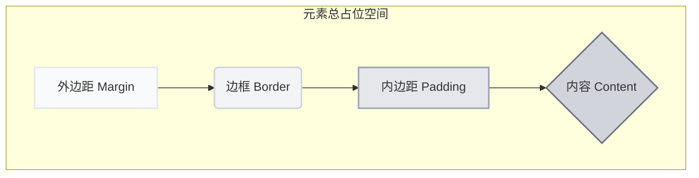

我们已经了解了 Tailwind CSS 的核心思想，现在正式进入其强大的“核心工具集”——样式原子。构建任何用户界面的第一步，都离不开对元素尺寸和它们之间距离的精确控制。本节，我们将深入探讨 Tailwind 中关于尺寸与间距的核心工具类。

### 🎯 核心目标 (Core Goal)

本节的核心目标是：**熟练掌握使用 Tailwind 的工具类来控制元素的宽度、高度、内边距（padding）和外边距（margin），为构建任何复杂的布局打下坚实的基础。**

### 🔑 核心语法与参数 (Core Syntax & Parameters)

Tailwind 通过一套简洁、一致的命名约定来控制尺寸与间距。其基本模式为：`{属性缩写}-{方向?}-{尺寸值}`。

| 属性 (Property)           | 语法 (Syntax)                               | 描述 (Description)                                                                   |
| ------------------------- | ------------------------------------------- | ------------------------------------------------------------------------------------ |
| 宽度 (Width)              | `w-{size}`                                  | 设置元素的宽度。例如 `w-32`。                                                        |
| 高度 (Height)             | `h-{size}`                                  | 设置元素的高度。例如 `h-32`。                                                        |
| 内边距 (Padding)          | `p-{size}` `px-{size}` `py-{size}` `pt-{size}` `pr-{size}` `pb-{size}` `pl-{size}` | `p-`：所有方向；`px-`：水平方向；`py-`：垂直方向；`pt-` `pr-` `pb-` `pl-`：上右下左。 |
| 外边距 (Margin)           | `m-{size}` `mx-{size}` `my-{size}` `mt-{size}` `mr-{size}` `mb-{size}` `ml-{size}` | `m-`：所有方向；`mx-`：水平方向；`my-`：垂直方向；`mt-` `mr-` `mb-` `ml-`：上右下左。 |
| 元素间距 (Space Between) | `space-x-{size}` `space-y-{size}`             | 在父元素上使用，为**直接子元素**之间添加水平或垂直间距。需要配合 `flex` 或 `grid`。    |

**关于 `{size}`**：`{size}` 通常是一个数字，它对应 Tailwind 预设的、符合设计系统规范的尺寸值。这个值是按比例缩放的，默认情况下 `1` 等于 `0.25rem`（即 `4px`），所以 `4` 就等于 `1rem`（`16px`）。此外，`{size}` 也可以是特殊的关键词，如 `full` (`100%`)、`screen` (`100vw` 或 `100vh`)、`auto` 等，分别用于 `w-full`、`h-screen`、`m-auto` 等常见场景。

### 💻 基础用法 (Basic Usage)

让我们通过几个直观的例子来感受这些工具类的威力。

**1. 设置固定的宽度和高度**

```html
<!-- 创建一个 128px * 128px 的方块 -->
<div class="w-32 h-32 bg-sky-500 rounded-lg"></div>
<!-- w-32 -> width: 8rem (128px) -->
<!-- h-32 -> height: 8rem (128px) -->
```

**2. 控制内边距**

内边距（Padding）是元素边框到其内容之间的空间。

```html
<!-- 一个带有不同方向内边距的按钮 -->
<button class="bg-violet-500 text-white font-bold py-2 px-4 rounded">
  <!-- py-2: 垂直内边距 0.5rem (8px) -->
  <!-- px-4: 水平内边距 1rem (16px) -->
  Click Me
</button>
```

**3. 控制外边距**

外边距（Margin）是元素边框之外，与其他元素之间的空间。

```html
<!-- 两个方块，通过外边距隔开 -->
<div class="flex">
  <!-- mr-8: 右外边距 2rem (32px) -->
  <div class="w-16 h-16 bg-emerald-500 mr-8"></div> 
  <div class="w-16 h-16 bg-emerald-500"></div>
</div>
```

**4. 使用 `space-*` 优雅地处理元素间距**

当有一组元素需要均匀间隔时，`space-*` 是比单独设置 `margin` 更优越的方案。

```html
<!-- 在 flex 容器上使用 space-x-4，所有子元素将自动获得 1rem 的水平间距 -->
<div class="flex space-x-4">
  <div class="w-16 h-16 bg-rose-500"></div>
  <div class="w-16 h-16 bg-rose-500"></div>
  <div class="w-16 h-16 bg-rose-500"></div>
</div>
```

### 🧠 深度解析 (In-depth Analysis)

#### 1. 为什么是 `rem`？—— 响应式与可访问性的基石

你可能已经注意到，Tailwind 的尺寸单位默认是 `rem`。`rem` (root em) 是一个相对单位，相对于 HTML 根元素的 `font-size`。默认情况下，浏览器的根字体大小是 `16px`，所以 `1rem = 16px`。

**使用 `rem` 的核心优势在于可访问性（Accessibility）**。如果用户在浏览器设置中调整了默认字体大小（例如，视力不佳的用户可能会调大字体），所有使用 `rem` 定义的尺寸（包括宽度、高度、边距）都会等比例缩放，从而保持整个布局的和谐与可用性。如果使用 `px`（像素），则布局大小会固定，可能导致文本溢出或布局错乱。

#### 2. 盒模型（Box Model）的可视化

为了更好地理解 `margin` 和 `padding` 的区别，我们可以用经典的“盒模型”来可视化。



- **内边距 (`padding`)**：是盒子“内部”的空间，像给内容穿上了一件厚厚的内衬。
- **外边距 (`margin`)**：是盒子“外部”的空间，用来推开其他元素，决定了元素间的距离。

#### 3. 设计系统与约束的力量

Tailwind 提供的是一个经过精心设计的“尺寸阶梯”（Spacing Scale），而不是让你随意填写像素值。这种约束看似限制，实则是为了保证整个项目视觉上的一致性和专业性。它鼓励你从预设的、和谐的选项中进行选择，避免了“魔法数字”（Magic Numbers）的出现，让团队协作和后期维护变得更加轻松。

### ⚠️ 常见陷阱与最佳实践 (Common Pitfalls & Best Practices)

1.  **陷阱：忘记 `flex` 或 `grid` 与 `space-*` 配合使用**
    `space-x-*` 和 `space-y-*` 工具类是通过为子元素（除了第一个）添加 `margin` 来实现的。这个机制依赖于父元素的布局上下文，因此**必须**在 `display: flex`、`display: grid` 或 `display: inline-flex` 的容器上使用，否则不会生效。

2.  **陷阱：混淆 `p-4` 与 `px-4` / `py-4`**
    初学者常犯的错误是想设置水平内边距时，却只写了 `p-4`。请牢记：
    - `p-`：padding (所有方向)
    - `px-`：padding-left & padding-right (x轴)
    - `py-`：padding-top & padding-bottom (y轴)
    `margin` 的 `m-`, `mx-`, `my-` 也是同理。

3.  **最佳实践：优先使用 `space-*` 而不是单独的 `margin`**
    当处理列表、导航项或任何一组相邻元素时，优先在父元素上使用 `space-x-*` 或 `space-y-*`。这比给每个子元素添加 `mr-*` 或 `mb-*` 更简洁，并且能自动处理“最后一个元素不需要边距”的问题，让你的代码更干净、更具可维护性。

4.  **最佳实践：坚守尺寸阶梯**
    尽量使用 Tailwind 提供的尺寸值（如 `w-32`, `p-4`）。只有在处理第三方库集成或特殊设计稿，实在无法匹配时，才使用方括号 `[]` 来生成任意值，例如 `w-[123px]`。坚守预设值是保证设计一致性的关键。

### 🚀 实战演练 (Practical Exercise)

让我们运用今天学到的知识，构建一个常见的产品卡片组件。

**目标：** 创建一个包含图片、标题、描述和购买按钮的卡片。

```html
<div class="max-w-sm rounded-lg overflow-hidden shadow-lg bg-white p-6 m-4">
  <!-- 容器: 最大宽度、圆角、阴影、背景色、内边距、外边距 -->

  
  <!-- 图片: 宽度撑满、固定高度、图片裁剪以适应 -->

  <div class="py-4">
    <!-- 文本内容区域: 垂直内边距 -->
    <div class="font-bold text-xl mb-2">精美陶瓷杯</div>
    <!-- 标题: 加粗、大字号、下外边距 -->
    <p class="text-gray-700 text-base">
      一个能让你喝水更香的杯子，采用顶级材料手工制成。
    </p>
    <!-- 描述: 字体颜色、基础字号 -->
  </div>

  <div class="pt-4">
    <!-- 按钮区域: 上内边距 -->
    <button class="bg-blue-500 hover:bg-blue-700 text-white font-bold py-2 px-4 rounded">
      立即购买
    </button>
    <!-- 按钮: 背景色、悬停效果、字体、内边距、圆角 -->
  </div>

</div>
```

**分析：**
- `p-6` 在卡片最外层创建了统一的“呼吸空间”。
- `m-4` 让卡片与其他元素保持距离。
- `w-full` 和 `h-48` 控制了图片的尺寸。
- `py-4` 和 `pt-4` 在内容块之间制造了垂直间距。
- `mb-2` 将标题和描述文字推开了一点距离。
- 按钮上的 `py-2 px-4` 再次体现了内边距的精确控制。

这个小小的卡片，几乎动用了我们本节课学到的所有核心工具类，完美展示了它们如何协同工作，快速构建出美观的 UI 组件。

### 💡 总结 (Summary)

在本节中，我们掌握了 Tailwind CSS 中最核心的尺寸与间距工具类。回顾一下关键点：

-   **核心工具类**: 我们学习了 `w-`, `h-`, `p-`, `m-` 和 `space-*` 五大家族，它们是构建一切布局的原子。
-   **一致的命名法**: `{property}-{direction?}-{size}` 的模式贯穿始终，易于学习和记忆。
-   **`rem` 单位与设计系统**: 理解了 Tailwind 采用 `rem` 单位和预设尺寸阶梯的深层原因——可访问性和视觉一致性。
-   **最佳实践**: 优先使用 `space-*` 处理元素组间距，并尽可能遵循预设的尺寸阶梯。

现在你已经拥有了控制空间和尺寸的能力。在下一节中，我们将把目光投向内容的呈现，学习如何驾驭 Tailwind 的文本与排版工具。