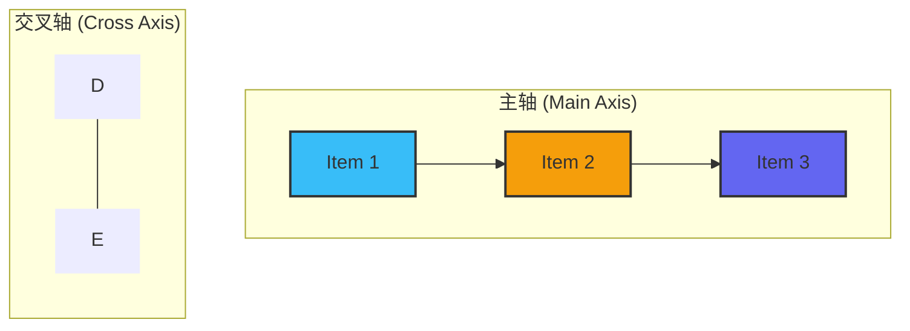
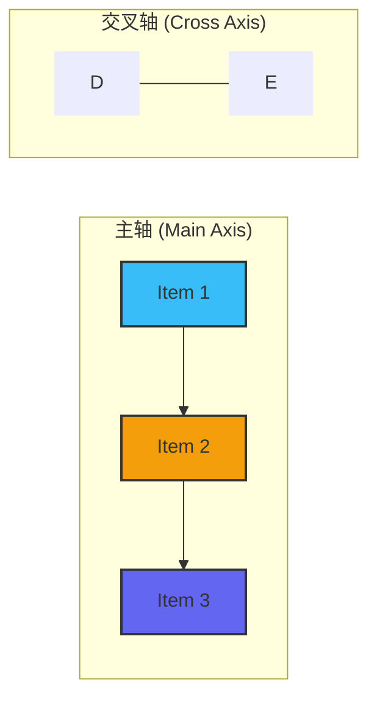

好的，总建筑师。作为您的世界级技术教育者和 Tailwind CSS 专家，我将依据您提供的教学设计图，将关于 Flexbox 的知识点，转化为一篇高质量、结构清晰的 Markdown 教程。

---

我们已经进入了 Tailwind CSS 布局的激动人心的世界。在第三章中，我们将首先掌握构建现代 Web 界面的基石——布局系统。而这一切，都从最强大、最常用的一维布局解决方案 Flexbox 开始。

## 3.1 一维布局：Flexbox

Flexbox，即弹性盒子布局模型，是 CSS 中用于在单个维度（行或列）上对项目进行对齐和分布的强大工具。在 Tailwind CSS 中，你无需编写一行原生 CSS，即可通过一系列直观的工具类，完全驾驭 Flexbox 的强大能力。

### 🎯 核心目标 (Core Goal)

本节课程的核心目标是：**熟练使用 Flexbox 系列工具类来构建灵活、响应式的一维布局。** 你将学会如何精确控制子元素在单行或单列中的对齐方式、排列顺序和空间分布，为构建从简单按钮组到复杂导航栏等各类组件打下坚实基础。

### 🔑 核心语法与参数 (Core Syntax & Parameters)

要启用 Flexbox 布局，你首先需要在父元素（容器）上应用 `flex` 类。随后，通过在同一个父元素上添加其他工具类，来控制其所有直接子元素的布局行为。

| 功能分类         | 核心工具类                                    | 对应 CSS 属性               | 描述                                                           |
| ------------------ | --------------------------------------------- | --------------------------- | -------------------------------------------------------------- |
| **容器**           | `flex`                                        | `display: flex;`            | 将一个元素声明为 Flexbox 容器                                  |
| **主轴方向**       | `flex-row` / `flex-row-reverse`               | `flex-direction`            | 子元素水平排列（默认方向） / 水平反向排列                          |
|                    | `flex-col` / `flex-col-reverse`               | `flex-direction`            | 子元素垂直排列 / 垂直反向排列                                  |
| **主轴对齐**       | `justify-start` / `center` / `end` / `between` / `around` / `evenly` | `justify-content`           | 控制子元素在主轴上的对齐和分布方式                       |
| **交叉轴对齐**     | `items-start` / `center` / `end` / `baseline` / `stretch` | `align-items`               | 控制**所有**子元素在交叉轴上的对齐方式                                 |
| **单个子项对齐**   | `self-start` / `center` / `end` / `auto` / `stretch` | `align-self`                | **在单个子元素上使用**，覆盖父容器的 `items-*` 设置              |
| **换行**           | `flex-wrap` / `flex-wrap-reverse` / `flex-nowrap` | `flex-wrap`                 | 控制当子元素空间不足时是否换行（默认不换行）                   |
| **间距**           | `gap-{size}` / `gap-x-{size}` / `gap-y-{size}` | `gap`, `column-gap`, `row-gap` | 在 Flexbox 子元素之间创建统一的间距，是现代布局的首选方案 |

### 💻 基础用法 (Basic Usage)

让我们从一个最简单的例子开始。假设我们有三个盒子，希望它们能水平居中排列。

**第一步：创建 HTML 结构**
我们先创建一个父容器 `<div>` 和三个子项目 `<div>`。

```html
<!-- 初始状态：块级元素，垂直堆叠 -->
<div class="m-4 p-4 bg-slate-100 rounded-lg">
  <div class="w-16 h-16 bg-sky-500 rounded-lg">1</div>
  <div class="w-16 h-16 bg-amber-500 rounded-lg">2</div>
  <div class="w-16 h-16 bg-indigo-500 rounded-lg">3</div>
</div>
```

**第二步：应用 `flex` 声明为 Flex 容器**
在父容器上添加 `flex` 类，子元素会立即变为水平排列。

```html
<!-- 添加 flex -->
<div class="m-4 p-4 bg-slate-100 rounded-lg flex">
  <div class="w-16 h-16 bg-sky-500 flex items-center justify-center text-white font-bold rounded-lg">1</div>
  <div class="w-16 h-16 bg-amber-500 flex items-center justify-center text-white font-bold rounded-lg">2</div>
  <div class="w-16 h-16 bg-indigo-500 flex items-center justify-center text-white font-bold rounded-lg">3</div>
</div>
```
> **注意**：子元素上添加的 `flex items-center justify-center ...` 类是为了将内部的数字“1, 2, 3”居中，属于盒子内部的样式，与我们正在演示的父容器 Flexbox 布局无关。

**第三步：控制对齐和间距**
现在，让我们使用 `justify-*`、`items-*` 和 `gap-*` 来精确控制它们的位置。

```html
<!-- 添加 justify-center, items-center 和 gap-4 -->
<div class="h-48 m-4 p-4 bg-slate-100 rounded-lg flex justify-center items-center gap-4">
  <div class="w-16 h-16 bg-sky-500 flex items-center justify-center text-white font-bold rounded-lg">1</div>
  <div class="w-16 h-16 bg-amber-500 flex items-center justify-center text-white font-bold rounded-lg">2</div>
  <div class="w-16 h-16 bg-indigo-500 flex items-center justify-center text-white font-bold rounded-lg">3</div>
</div>
```
在这个最终版本中：
- `flex`: 启用 Flexbox 布局。
- `h-48`: 为父容器设置一个固定高度，这样 `items-center` 的垂直居中效果才能被观察到。
- `justify-center`: 沿主轴（水平方向）将所有子元素作为一个整体居中。
- `items-center`: 沿交叉轴（垂直方向）将每个子元素居中。
- `gap-4`: 在子元素之间创建 `1rem` (16px) 的间距。

### 🧠 深度解析 (In-depth Analysis)

要真正掌握 Flexbox，理解其**双轴（Main Axis 和 Cross Axis）**概念至关重要。

- **主轴 (Main Axis)**: Flex 子元素排列的主要方向。
- **交叉轴 (Cross Axis)**: 与主轴垂直的方向。

`flex-direction` 工具类（如 `flex-row` 和 `flex-col`）决定了哪个是主轴，哪个是交叉轴。

- `flex-row` (默认): 主轴是水平的，交叉轴是垂直的。
- `flex-col`: 主轴是垂直的，交叉轴是水平的。

`justify-*` 类总是沿着**主轴**工作，而 `items-*` 类总是沿着**交叉轴**工作。

#### **可视化轴向变化**

让我们用 Mermaid 图来清晰地展示这一点：

**当使用 `flex-row` 时:**


> 在 `flex-row` 模式下，`justify-center` 会在水平方向上居中元素，`items-center` 会在垂直方向上居中。

**当使用 `flex-col` 时:**


> 在 `flex-col` 模式下，主轴和交叉轴互换。因此，`justify-center` 会在**垂直方向**上居中元素，而 `items-center` 会在**水平方向**上居中。理解这种轴的动态转换是精通 Flexbox 的关键。

### ⚠️ 常见陷阱与最佳实践 (Common Pitfalls & Best Practices)

1.  **陷阱：对子元素应用 `flex`**
    一个最常见的错误是试图在子元素上应用 `justify-*` 或 `items-*` 来控制它们的布局。请牢记：**Flexbox 布局工具类（如 `justify-*`, `items-*`, `gap-*`）几乎总是应用在父容器上**，用来管理其内部的子元素。

2.  **陷阱：`justify-between` 在换行布局中的“最后一行”问题**
    当使用 `flex-wrap` 和 `justify-between` 时，如果最后一行没有被完全填满，剩余的元素会被拉伸以占据整个宽度，导致出现不美观的大间距。
    - **解决方案**：对于这种情况，通常 Grid 布局是更好的选择。如果必须使用 Flexbox，可以添加空的“幽灵”元素来填充最后一行，但这是一种 hacky 的方法。

3.  **最佳实践：优先使用 `gap` 而不是 `margin`**
    在 Flexbox 出现早期，我们通过给子元素添加 `margin` 来创建间距。这种方式繁琐且容易出错（例如，需要处理第一个或最后一个元素的边距）。现在，请**始终优先使用 `gap-*` 工具类**。它语法简洁，能完美处理元素间的间距，无需任何额外调整。

4.  **最佳实践：明确一维 vs. 二维**
    Flexbox 是为**一维布局**而生的。当你发现你需要同时严格控制行和列的对齐时（例如一个棋盘或日历），这通常是一个信号：你应该使用 **Grid 布局**了。明确使用场景，能让你的布局代码更清晰、更健壮。

### 🚀 实战演练 (Practical Exercise)

**案例：构建一个响应式的网站导航栏 (Case Study: Navigation Bar)**

导航栏是 Flexbox 的一个经典应用场景。我们需要 logo 在左侧，导航链接在右侧，并且在垂直方向上居中。

```html
<nav class="bg-gray-800 text-white p-4">
  <div class="container mx-auto flex justify-between items-center">
    <!-- Logo on the left -->
    <a href="#" class="text-xl font-bold">MyLogo</a>

    <!-- Navigation Links on the right -->
    <div class="hidden md:flex items-center gap-8">
      <a href="#" class="hover:text-sky-400">Home</a>
      <a href="#" class="hover:text-sky-400">About</a>
      <a href="#" class="hover:text-sky-400">Services</a>
      <a href="#" class="hover:text-sky-400">Contact</a>
    </div>

    <!-- Mobile Menu Button (hidden on medium screens and up) -->
    <button class="md:hidden">
      <svg xmlns="http://www.w3.org/2000/svg" class="h-6 w-6" fill="none" viewBox="0 0 24 24" stroke="currentColor">
        <path stroke-linecap="round" stroke-linejoin="round" stroke-width="2" d="M4 6h16M4 12h16m-7 6h7" />
      </svg>
    </button>
  </div>
</nav>
```

**代码解析:**
- `container mx-auto`: 这是一个常见的容器类，用于页面内容居中。
- `flex justify-between items-center`: 这是实现导航栏布局的核心。
    - `flex`: 将 `div.container` 声明为 Flex 容器。
    - `justify-between`: **沿主轴（水平）**将子元素（Logo 和导航链接组）推向两端，中间留出最大空间。
    - `items-center`: **沿交叉轴（垂直）**将所有子元素居中对齐，确保 Logo 和链接在垂直方向上完美对齐。
- `hidden md:flex items-center gap-8`:
    - `md:flex`: 导航链接在移动端（小于 `md` 断点）默认是 `hidden` 的，在 `md` 及以上屏幕尺寸时，才以 `flex` 容器的形式显示。
    - `gap-8`: 在导航链接之间创建了 `2rem` 的间距。

> **关于响应式**：这个例子展示了如何在大屏幕上显示导航链接，并在小屏幕上显示一个汉堡菜单按钮。请注意，点击按钮展开移动菜单的交互功能通常需要使用 JavaScript 来切换类（例如，移除 `hidden`），这超出了本节 Flexbox 布局的范畴。

这个例子完美展示了如何利用 Flexbox 轻松构建出专业、响应式的组件。

### 💡 总结 (Summary)

Flexbox 是 Tailwind CSS 中进行一维布局的瑞士军刀。通过本节的学习，我们掌握了其核心思想和用法：

- **核心开关**: `flex` 类是启动所有魔法的钥匙，必须应用在父容器上。
- **双轴系统**: 牢记主轴和交叉轴的概念，以及它们如何随 `flex-row`/`flex-col` 而变化。
- **主轴控制**: 使用 `justify-*` 工具类来管理元素在主轴上的分布。
- **交叉轴控制**: 使用 `items-*` 工具类来管理元素在交叉轴上的对齐。
- **现代间距**: 优先使用 `gap-*` 来处理元素间距，告别复杂的 `margin` 计算。

你现在已经具备了使用 Tailwind CSS 创建强大一维布局的能力。在接下来的课程中，我们将探索二维布局的王者——Grid 系统，它将与 Flexbox 互为补充，让你能够应对任何复杂的页面布局挑战。