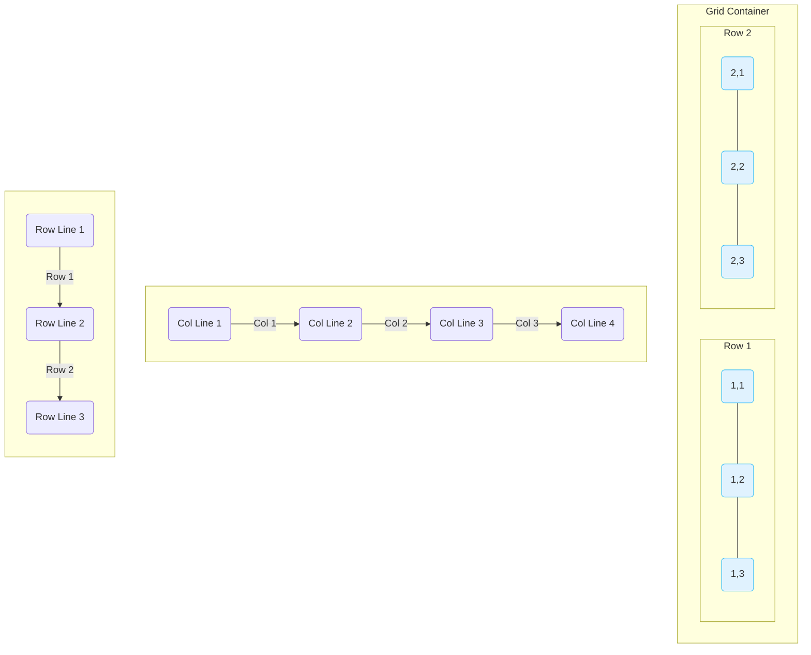

好的，总建筑师。我们已经成功征服了一维布局的王者 Flexbox。现在，是时候进入一个全新的维度，迎接页面布局的终极力量——Grid 系统了。

---

如果说 Flexbox 是一位精于排列一队士兵的将军，那么 Grid 就是一位能指挥整个方阵、实现像素级精确部署的战略家。当你需要同时控制水平和垂直两个维度的对齐与分布时，Grid 便是你的不二之选。

## 3.2 二维布局：Grid

Grid 布局，即网格布局模型，是 CSS 中最强大的布局系统，专为解决二维布局问题而设计。它允许你将页面划分为行和列，并将元素精确地放置在这些行列交叉形成的网格单元中。在 Tailwind CSS 中，这一切都通过一组同样直观的工具类得以实现。

### 🎯 核心目标 (Core Goal)

本节课程的核心目标是：**掌握 Grid 工具类来创建复杂的二维网格布局，实现基于网格线的精确元素放置。** 你将学会如何构建从响应式卡片布局、相册画廊到完整的应用程序主界面等任何需要同时控制行和列的复杂结构。

### 🔑 核心语法与参数 (Core Syntax & Parameters)

与 Flexbox 类似，你需要先在父元素（容器）上应用 `grid` 类来启用 Grid 布局。然后，通过一系列工具类来定义网格的结构和子元素的行为。

| 功能分类 | 核心工具类 | 对应 CSS 属性 | 描述 |
| --- | --- | --- | --- |
| **容器** | `grid` | `display: grid;` | 将一个元素声明为 Grid 容器 |
| **定义列** | `grid-cols-{number}` | `grid-template-columns` | 定义网格的列数。例如 `grid-cols-3` 创建一个三列网格。 |
| **定义行** | `grid-rows-{number}` | `grid-template-rows` | 定义网格的行数。例如 `grid-rows-2` 创建一个两行网格。 |
| **网格间距** | `gap-{size}` / `gap-x-{size}` / `gap-y-{size}` | `gap`, `column-gap`, `row-gap` | 在网格的行与列之间创建统一的间距。 |
| **跨越列/行** | `col-span-{number}` / `row-span-{number}` | `grid-column`, `grid-row` | 让一个子元素跨越多列或多行。例如 `col-span-2` 占据两列。 |
| **元素放置** | `col-start-{line}` / `col-end-{line}` | `grid-column-start`, `grid-column-end` | 指定一个子元素从哪条网格线开始或结束。 |
| | `row-start-{line}` / `row-end-{line}` | `grid-row-start`, `grid-row-end` | 指定一个子元素从哪条行线开始或结束。 |

### 💻 基础用法 (Basic Usage)

让我们创建一个简单的 3x2 卡片布局来感受 Grid 的威力。

**第一步：创建 HTML 结构**
我们准备一个容器和六个子项目。

```html
<div class="m-4 p-4 bg-slate-100 rounded-lg">
  <div class="h-24 bg-sky-500 rounded-lg flex items-center justify-center text-white font-bold">1</div>
  <div class="h-24 bg-amber-500 rounded-lg flex items-center justify-center text-white font-bold">2</div>
  <div class="h-24 bg-indigo-500 rounded-lg flex items-center justify-center text-white font-bold">3</div>
  <div class="h-24 bg-rose-500 rounded-lg flex items-center justify-center text-white font-bold">4</div>
  <div class="h-24 bg-emerald-500 rounded-lg flex items-center justify-center text-white font-bold">5</div>
  <div class="h-24 bg-fuchsia-500 rounded-lg flex items-center justify-center text-white font-bold">6</div>
</div>
```

**第二步：应用 `grid` 并定义列和间距**
在父容器上添加 `grid`，使用 `grid-cols-3` 定义三列，并用 `gap-4` 添加间距。

```html
<div class="m-4 p-4 bg-slate-100 rounded-lg grid grid-cols-3 gap-4">
  <div class="h-24 bg-sky-500 rounded-lg flex items-center justify-center text-white font-bold">1</div>
  <div class="h-24 bg-amber-500 rounded-lg flex items-center justify-center text-white font-bold">2</div>
  <div class="h-24 bg-indigo-500 rounded-lg flex items-center justify-center text-white font-bold">3</div>
  <div class="h-24 bg-rose-500 rounded-lg flex items-center justify-center text-white font-bold">4</div>
  <div class="h-24 bg-emerald-500 rounded-lg flex items-center justify-center text-white font-bold">5</div>
  <div class="h-24 bg-fuchsia-500 rounded-lg flex items-center justify-center text-white font-bold">6</div>
</div>
```
> ✨ 仅仅通过 `grid grid-cols-3 gap-4` 三个类，我们就得到了一个完美的、间距均匀的三列网格布局。子元素会自动流入网格单元，无需任何额外设置。

**第三步：使用 `col-span` 让元素跨列**
现在，假设我们希望第一个元素占据两列的宽度。只需在第一个子元素上添加 `col-span-2`。

```html
<div class="m-4 p-4 bg-slate-100 rounded-lg grid grid-cols-3 gap-4">
  <div class="h-24 bg-sky-500 rounded-lg flex items-center justify-center text-white font-bold col-span-2">1</div>
  <!-- <div class="h-24 bg-amber-500 ...">2</div> -->  <!-- 后续元素自动换行 -->
  <div class="h-24 bg-indigo-500 rounded-lg flex items-center justify-center text-white font-bold">3</div>
  <div class="h-24 bg-rose-500 rounded-lg flex items-center justify-center text-white font-bold">4</div>
  <div class="h-24 bg-emerald-500 rounded-lg flex items-center justify-center text-white font-bold">5</div>
  <div class="h-24 bg-fuchsia-500 rounded-lg flex items-center justify-center text-white font-bold">6</div>
</div>
```
> 注意看，当第一个元素占据两列后，第二个元素（原本的 amber 盒子）由于空间不足，被自动推到了下一行。这就是 Grid 强大的自动布局能力。

### 🧠 深度解析 (In-depth Analysis)

要从“会用”到“精通”Grid，你需要理解两个核心概念：**Grid 与 Flexbox 的对比**，以及**网格线 (Grid Lines)**。

#### **比较：Flexbox vs. Grid**

这是开发者最常问的问题之一：我应该用 Flexbox 还是 Grid？

| 特性 | Flexbox (一维) | Grid (二维) |
| --- | --- | --- |
| **设计理念** | **内容优先 (Content-first)**：让内容决定布局。容器尺寸适应内容。 | **布局优先 (Layout-first)**：先定义好网格结构，再把内容放进去。 |
| **维度控制** | 单一维度：一次只能控制 **行** 或 **列**。 | 双重维度：可以同时控制 **行** 和 **列**。 |
| **适用场景** | 组件级布局：导航栏、按钮组、卡片内的元素对齐。 | 页面级布局：整体页面结构、仪表盘、相册、日历。 |
| **核心优势** | 灵活性、内容自适应性强。 | 结构性、对齐性强，能创建复杂的非对称布局。 |

> **一句话总结**：用 Flexbox 排列一条线上的元素，用 Grid 构建整个棋盘。

#### **核心概念：网格线 (Grid Lines)**

Grid 最强大的地方在于它允许你基于“网格线”来放置元素，这也是 `col-start-*` 和 `row-start-*` 工具类的原理。

一个 N 列的网格有 N+1 条垂直网格线。一个 M 行的网格有 M+1 条水平网格线。

让我们用 Mermaid 图来可视化一个 `grid-cols-3 grid-rows-2` 的网格：



- **列线 (Column Lines)**: 从左到右依次为 1, 2, 3, 4。
- **行线 (Row Lines)**: 从上到下依次为 1, 2, 3。

现在，`col-span-2` 就很容易理解了：它占据了 2 个列轨道。而 `col-start-2 col-end-4` 的意思是：这个元素从**第 2 条**垂直网格线开始，到**第 4 条**垂直网格线结束，其效果等同于 `col-span-2` 但位置不同。理解了网格线，你就解锁了 Grid 布局的全部潜力。

### ⚠️ 常见陷阱与最佳实践 (Common Pitfalls & Best Practices)

1.  **陷阱：过度使用显式放置**
    不要为网格中的每个元素都指定 `col-start` 和 `row-start`。Grid 强大的自动放置算法在大多数情况下已经足够好。只有当你需要创建非对称布局或覆盖特定单元格时，才使用显式放置。

2.  **陷阱：在子元素上定义网格结构**
    与 Flexbox 一样，**`grid-cols-*`, `grid-rows-*`, `gap-*` 这些定义网格结构的类，必须应用在父容器上**。而 `col-span-*`, `row-span-*`, `col-start-*` 这些决定子元素行为的类，则应用在子元素上。

3.  **最佳实践：响应式列数**
    Grid 与 Tailwind 的响应式修饰符是天作之合。通过 `grid-cols-1 sm:grid-cols-2 lg:grid-cols-4` 可以轻松实现移动端单列、平板双列、桌面四列的响应式布局，这是现代 Web 开发的必备技巧。

4.  **最佳实践：Grid 和 Flexbox 协同工作**
    最强大的布局模式往往是两者的结合。**用 Grid 构建宏观的页面结构，用 Flexbox 处理微观的单元格内部对齐。**
    例如：用 Grid 划分出一个卡片区域，然后在每个卡片（Grid item）内部，使用 `flex` 来对齐卡片的标题、图标和文本。

### 🚀 实战演练 (Practical Exercise)

**案例：构建一个动态的、响应式的图片画廊 (Case Study: Dynamic Image Gallery)**

这个画廊在不同屏幕尺寸下有不同的列数，并且其中一张“焦点图”会占据更大的空间。

```html
<div class="p-4 bg-gray-900 min-h-screen">
  <div class="grid grid-cols-2 md:grid-cols-4 gap-4">
    <!-- Item 1 -->
    <div class="grid gap-4">
      <div>
        
      </div>
      <div>
        
      </div>
    </div>
    <!-- Item 2 -->
    <div class="grid gap-4">
      <div>
        
      </div>
      <div>
        
      </div>
    </div>
    <!-- Item 3: The featured item -->
    <div class="grid gap-4 md:col-span-2 md:row-span-2">
      <div class="h-full">
         
      </div>
    </div>
    <!-- Item 4 -->
     <div class="grid gap-4">
      <div>
        
      </div>
      <div>
        
      </div>
    </div>
  </div>
</div>
```

**代码解析:**
- `grid grid-cols-2 md:grid-cols-4 gap-4`: 这是布局的核心。默认是两列，在中等屏幕（`md`）及以上变为四列。
- `md:col-span-2 md:row-span-2`: 这是实现动态效果的关键。在 `md` 屏幕上，第三个项目会横跨两列、纵跨两行，成为一个引人注目的焦点图，而其他元素会自动环绕它进行布局。
- 内部也使用了 `grid` 来堆叠图片，展示了 Grid 嵌套的能力。

这个例子生动地展示了如何仅用几个 Tailwind 工具类，就构建出以往需要复杂 CSS 才能实现的动态、非对称且响应式的布局。

### 💡 总结 (Summary)

Grid 是 Tailwind CSS 中用于二维布局的终极武器。掌握了它，你就能从容应对任何复杂的页面结构挑战。

- **核心开关**: `grid` 类是启用网格布局的入口，必须应用在父容器上。
- **结构定义**: 在容器上使用 `grid-cols-*` 和 `grid-rows-*` 来搭建网格的骨架。
- **子项控制**: 在子元素上使用 `col-span-*`/`row-span-*` 来控制其尺寸，或使用 `col-start-*` 等进行精确放置。
- **网格线思维**: 理解网格线的概念是精通 Grid 布局、实现像素级精确控制的关键。
- **强强联合**: 不要将 Grid 和 Flexbox 视为竞争对手，而应将它们视为最佳拍档，协同使用以发挥最大效能。

至此，你已经掌握了 Tailwind CSS 中两大布局支柱：一维的 Flexbox 和二维的 Grid。有了这两大利器，你已经准备好去构建任何你所能想象到的现代 Web 界面了。