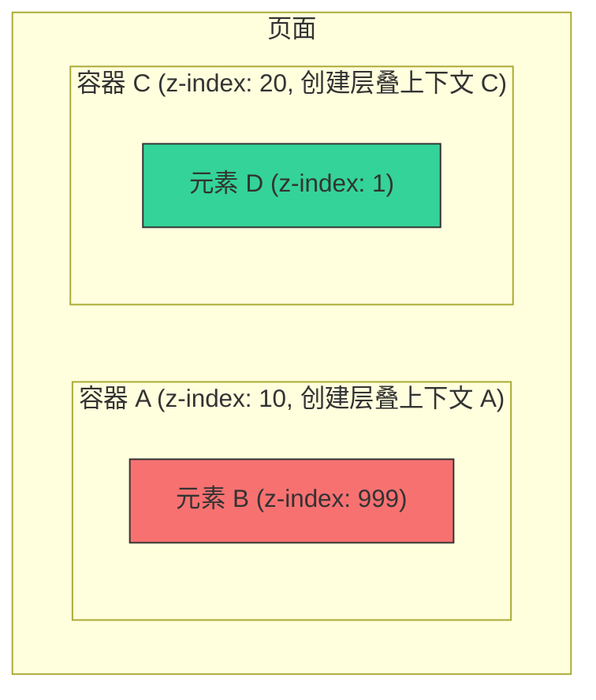

好的，总建筑师。我们已经全面掌握了控制文档流的一维布局 Flexbox 和二维布局 Grid。现在，我们将学习一项全新的、同样至关重要的技能：如何让元素**脱离**常规的文档流，实现像素级的精确定位和立体的层叠效果。

---

当我们使用 Flexbox 和 Grid 时，元素们如同遵守交通规则的车辆，有序地在预设的车道（行或列）上前行。但有时，我们需要一架“直升机”，能够无视这些规则，悬停在页面的任意位置。这便是定位（Positioning）的魔力所在。它赋予我们打破常规布局、创建浮动提示、模态框、下拉菜单等复杂 UI 组件的能力。

## 3.3 定位与层叠

本节将深入探讨 CSS 的 `position` 属性及其在 Tailwind CSS 中的实现。你将学会如何将元素从其自然位置“提起”，并精确地放置在父容器或整个视口中的任何地方。同时，我们还将掌握 `z-index`，它就像控制元素在 Z 轴（朝向用户的屏幕）上的高度，决定了谁在上面，谁在下面。

### 🎯 核心目标 (Core Goal)

本节课程的核心目标是：**理解并熟练运用定位（`relative`, `absolute`, `fixed`, `sticky`）和层叠（`z-index`）工具类，以实现对元素精确位置和堆叠顺序的完全控制。** 学完本节，你将能够构建出如通知角标、模态对话框、粘性导航栏和下拉菜单等需要脱离文档流的常见 UI 组件。

### 🔑 核心语法与参数 (Core Syntax & Parameters)

定位和层叠的核心在于 `position` 和 `z-index` 属性。Tailwind 为它们提供了简洁直观的工具类。

| 功能分类 | 核心工具类 | 对应 CSS 属性 | 描述 |
| --- | --- | --- | --- |
| **定位类型** | `static` | `position: static;` | 默认值。元素遵循正常的文档流，`top`/`right` 等属性无效。 |
| | `relative` | `position: relative;` | 元素仍在文档流中占据空间，但可以相对于其**原始位置**进行偏移。**常用于为 `absolute` 子元素创建定位上下文。** |
| | `absolute` | `position: absolute;` | 元素**脱离文档流**，相对于其**最近的已定位祖先元素**进行定位。 |
| | `fixed` | `position: fixed;` | 元素**脱离文档流**，相对于**浏览器视口**进行定位，滚动页面时位置不变。 |
| | `sticky` | `position: sticky;` | 混合模式。在滚动到特定位置前表现为 `relative`，之后表现为 `fixed`。 |
| **位置控制** | `top-{size}` / `right-{size}` / `bottom-{size}` / `left-{size}` | `top`, `right`, `bottom`, `left` | 设置定位元素各边的偏移量。例如 `top-0`, `left-4`。 |
| **快捷定位** | `inset-{size}` | `top`, `right`, `bottom`, `left` | 同时设置所有四个方向的偏移量。`inset-0` 等价于 `top-0 right-0 bottom-0 left-0`。 |
| | `inset-x-{size}` | `left`, `right` | 同时设置水平方向（`left` 和 `right`）的偏移量。 |
| | `inset-y-{size}` | `top`, `bottom` | 同时设置垂直方向（`top` 和 `bottom`）的偏移量。 |
| **层级控制** | `z-{index}` | `z-index` | 设置已定位元素的堆叠顺序。数值越大，越靠上。例如 `z-0`, `z-10`, `z-50`。 |

### 💻 基础用法 (Basic Usage)

最经典、最常见的用法是“父相子绝”：父元素使用 `relative` 定位，子元素使用 `absolute` 定位。让我们用这个组合来为一个图标按钮添加一个通知角标。

**第一步：创建 HTML 结构**
我们创建一个容器 `div`，里面放一个按钮和作为角标的 `span`。

```html
<div class="m-8">
  <button class="bg-sky-500 text-white p-3 rounded-full">
    <!-- Bell Icon SVG -->
    <svg xmlns="http://www.w3.org/2000/svg" class="h-6 w-6" fill="none" viewBox="0 0 24 24" stroke="currentColor" stroke-width="2">
      <path stroke-linecap="round" stroke-linejoin="round" d="M15 17h5l-1.405-1.405A2.032 2.032 0 0118 14.158V11a6.002 6.002 0 00-4-5.659V5a2 2 0 10-4 0v.341C7.67 6.165 6 8.388 6 11v3.159c0 .538-.214 1.055-.595 1.436L4 17h5m6 0v1a3 3 0 11-6 0v-1m6 0H9" />
    </svg>
    <!-- Notification Badge -->
    <span class="bg-red-500 text-white text-xs font-bold rounded-full h-5 w-5 flex items-center justify-center">
      3
    </span>
  </button>
</div>
```
> 目前，角标 `span` 只是一个普通的行内元素，紧跟在 SVG 图标后面，位置完全不对。

**第二步：创建定位上下文**
为了能精确控制角标的位置，我们需要在它们的共同父元素（这里是 `button`）上创建一个“定位上下文”。只需添加 `relative` 类即可。

```html
<button class="relative bg-sky-500 text-white p-3 rounded-full">
  ...
</button>
```
> 外观上没有任何变化，但这个 `button` 现在成为了其内部 `absolute` 定位元素的“锚点”。

**第三步：绝对定位子元素**
现在，为角标 `span` 添加 `absolute` 类，并用 `top-*` 和 `right-*` 类将它定位到按钮的右上角。

```html
<button class="relative bg-sky-500 text-white p-3 rounded-full">
  <!-- Bell Icon SVG -->
  <svg ...></svg>
  
  <!-- Notification Badge -->
  <span class="absolute top-0 right-0 bg-red-500 text-white text-xs font-bold rounded-full h-5 w-5 flex items-center justify-center">
    3
  </span>
</button>
```
> ✨ 魔法发生了！角标脱离了文档流，并被精确地放置在了父按钮的右上角。如果想让它稍微往外偏移一点，可以使用负值，例如 `top-[-4px] right-[-4px]` 或通过 `transform` 和 `translate` 来实现更精细的调整。

### 🧠 深度解析 (In-depth Analysis)

要真正驾驭定位，必须理解两个核心概念：**定位上下文（Positioning Context）** 和 **层叠上下文（Stacking Context）**。

#### **1. 定位上下文：`absolute` 在哪里“着陆”？**

一个 `absolute` 定位的元素会沿着其祖先链向上查找，直到找到第一个设置了 `position` 属性为 `relative`, `absolute`, `fixed`, 或 `sticky` 的祖先元素，并相对于该祖先进行定位。

- 如果找到了，它的定位（`top`, `right` 等）就以那个祖先的内边距（padding edge）为基准。
- 如果没有找到任何已定位的祖先，它最终会相对于初始包含块（通常是 `<body>` 或视口）进行定位。

这就是为什么“父相（`relative`）子绝（`absolute`）”模式如此普遍，因为它能确保子元素的定位范围被限制在父元素内部，而不会意外地跑到页面的其他地方去。

#### **2. 层叠上下文：`z-index` 的隐形规则**

你可能认为 `z-index` 只是一个简单的数字，谁大谁就在上面。但在复杂的布局中，事情并非如此。`z-index` 的行为被一个叫做 **层叠上下文（Stacking Context）** 的东西所支配。

一个元素在以下情况下会创建一个新的层叠上下文：
- `position` 值为 `relative`, `absolute`, `fixed`, `sticky` 且 `z-index` 不是 `auto`。
- `opacity` 值小于 1。
- 设置了 `transform`, `filter`, `perspective` 等属性。

**核心规则：** 在同一个层叠上下文内，子元素的 `z-index` 值才有意义，可以互相比较。一旦一个元素创建了新的层叠上下文，它的所有子元素（即使 `z-index` 设置得再高）在 Z 轴上也不可能“逃逸”出去，超越这个父级上下文。

让我们用 Mermaid 图来可视化这个概念：


> 尽管元素 B 的 `z-index` (999) 远大于元素 D 的 `z-index` (1)，但由于它的父容器 A 的 `z-index` (10) 小于容器 C 的 `z-index` (20)，所以最终**容器 C 整体（包括其所有子元素）会显示在容器 A 的上方**。元素 B 被“困”在了它的父级层叠上下文中。

### ⚠️ 常见陷阱与最佳实践 (Common Pitfalls & Best Practices)

1.  **陷阱：`absolute` 元素未按预期定位**
    这是最常见的问题。99% 的情况下，是因为你忘记了给它的父元素或预期的“锚点”元素添加 `relative` 类。始终记住，要先用 `relative` 创建一个“停机坪”，`absolute` 飞机才能准确降落。

2.  **陷阱：`z-index` 失效**
    如果你发现设置的 `z-index` 不起作用，请检查以下两点：
    - 该元素是否设置了 `position` 属性（`relative`, `absolute` 等）？`z-index` 只对定位元素生效。
    - 该元素的父级或祖先元素是否创建了一个新的、`z-index` 较低的层叠上下文（例如，父级有 `opacity` 或 `transform` 属性）？这可能会“困住”你的元素。

3.  **最佳实践：使用 `inset-0` 创建覆盖层**
    当你需要创建一个与父容器大小完全相同的覆盖层（如模态框的背景遮罩）时，不要手动写 `top-0 right-0 bottom-0 left-0`，直接使用 `inset-0` 类，代码更简洁、意图更明确。

4.  **最佳实践：谨慎使用 `fixed` 定位**
    `fixed` 定位非常强大，但也容易引发问题，因为它会脱离文档流并可能遮挡页面内容。通常只用于全局元素，如网站页眉、页脚、模态框或“回到顶部”按钮。确保为被遮挡的内容留出足够的空间（例如，给 `body` 添加 `padding-top`）。

5.  **最佳实践：理解 `sticky` 的限制**
    `sticky` 定位非常适合创建滚动时固定的侧边栏或表头。但请注意，`sticky` 元素只能在其直接父元素的滚动区域内保持“粘性”。如果其父元素没有足够的高度来滚动，或者父元素设置了 `overflow: hidden`，`sticky` 将不会生效。

### 🚀 实战演练 (Practical Exercise)

**案例：构建一个纯 CSS 驱动的下拉菜单 (Case Study: Dropdown Menu)**

下拉菜单是 `relative`, `absolute` 和 `z-index` 协同工作的完美范例。

```html
<div class="relative inline-block text-left m-8 group">
  <!-- Trigger Button -->
  <div>
    <button type="button" class="inline-flex justify-center w-full rounded-md border border-gray-300 shadow-sm px-4 py-2 bg-white text-sm font-medium text-gray-700 hover:bg-gray-50 focus:outline-none focus:ring-2 focus:ring-offset-2 focus:ring-offset-gray-100 focus:ring-indigo-500">
      Options
      <svg class="-mr-1 ml-2 h-5 w-5" xmlns="http://www.w3.org/2000/svg" viewBox="0 0 20 20" fill="currentColor" aria-hidden="true">
        <path fill-rule="evenodd" d="M5.293 7.293a1 1 0 011.414 0L10 10.586l3.293-3.293a1 1 0 111.414 1.414l-4 4a1 1 0 01-1.414 0l-4-4a1 1 0 010-1.414z" clip-rule="evenodd" />
      </svg>
    </button>
  </div>

  <!-- Dropdown Panel -->
  <div class="origin-top-right absolute right-0 mt-2 w-56 rounded-md shadow-lg bg-white ring-1 ring-black ring-opacity-5 focus:outline-none 
              hidden group-hover:block z-10">
    <div class="py-1" role="menu" aria-orientation="vertical" aria-labelledby="menu-button">
      <a href="#" class="text-gray-700 block px-4 py-2 text-sm hover:bg-gray-100" role="menuitem">Account settings</a>
      <a href="#" class="text-gray-700 block px-4 py-2 text-sm hover:bg-gray-100" role="menuitem">Support</a>
      <a href="#" class="text-gray-700 block px-4 py-2 text-sm hover:bg-gray-100" role="menuitem">License</a>
    </div>
  </div>
</div>
```

**代码解析:**
- `relative group`: 在最外层的容器上，我们设置 `relative` 来创建定位上下文，并添加 `group` 类，以便利用 `group-hover` 状态来控制下拉菜单的显示。
- `absolute right-0 mt-2`: 这是下拉菜单面板的核心定位。`absolute` 使其脱离文档流，`right-0` 将其右边缘与父容器的右边缘对齐，`mt-2` 则在它和按钮之间创建了一点垂直间距。
- `hidden group-hover:block`: 这是交互的关键。默认情况下，下拉菜单是 `hidden` 的。当鼠标悬停在父级 `group` 元素上时，`group-hover:block` 会生效，使下拉菜单显示出来。
- `z-10`: 我们为下拉菜单设置了 `z-10`，确保它能显示在页面上其他内容（如下拉菜单后面的文本或图片）的上方。

这个例子综合运用了本节所有核心知识点，构建了一个功能齐全且常见的 UI 组件。

### 💡 总结 (Summary)

定位与层叠是 Tailwind CSS 布局工具箱中锋利的解剖刀，让你能够进行外科手术式的精确布局。

- **核心关系**: “父相子绝”（父 `relative`，子 `absolute`）是构建绝大多数局部定位 UI 的基础模式。
- **定位上下文**: 元素的定位始终是相对于其最近的“已定位”祖先。没有它，`absolute` 元素就会“漂移”到页面的未知角落。
- **脱离文档流**: `absolute` 和 `fixed` 会将元素从正常的布局流中移除，后续元素会无视它的存在，填补它留下的空间。
- **层叠上下文**: `z-index` 的效力被层叠上下文所限制。理解其创建规则是解决复杂层叠问题的关键。
- **按需选用**: `relative` 用于创建上下文和微调；`absolute` 用于父容器内的精确定位；`fixed` 用于全局视口定位；`sticky` 用于智能滚动固定。

掌握了 Flexbox、Grid 和 Positioning，你就拥有了构建任何现代 Web 布局所需的全部核心能力。现在，你可以自信地将任何设计稿转化为像素完美的、响应式的 Web 界面。