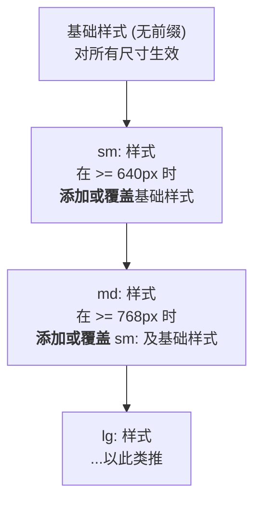

好的，总建筑师。

作为您的世界级技术教育者和 Tailwind CSS 专家，我将严格遵循您提供的“教学设计图”，将关于“响应式设计：移动优先”的知识点，转化为一篇结构清晰、深度与广度兼备的 Markdown 教程。

---

# 第四章：响应式与交互性
## 4.1 响应式设计：移动优先

欢迎来到 Tailwind CSS 响应式设计的世界！在现代 Web 开发中，用户可能通过手机、平板、笔记本或超大桌面显示器访问你的网站。如何确保在所有设备上都提供卓越的体验？答案就是响应式设计，而 Tailwind 的核心理念是“移动优先”。

### 🎯 核心目标 (Core Goal)

本节课的核心目标是：**精通使用 Tailwind CSS 的断点前缀（如 `sm:`, `md:`, `lg:`），以“移动优先”的策略，构建能够完美适配不同屏幕尺寸的现代化、响应式用户界面。**

### 🔑 核心语法与参数 (Core Syntax & Parameters)

Tailwind 通过一组易于记忆的断点前缀，将任意工具类（utility class）转化为响应式工具类。

**核心语法**

```
{breakpoint}:{utility}
```

- **`{breakpoint}`**: 屏幕尺寸的断点前缀，代表“当屏幕宽度大于或等于此断点值时”。
- **`{utility}`**: 任何一个标准的 Tailwind 工具类，例如 `flex`, `p-4`, `text-xl` 等。

**默认断点**

Tailwind 内置了一套经过精心设计的默认断点，它们覆盖了绝大多数常见的设备尺寸。

| 断点前缀 | 最小宽度 (min-width) | 对应设备（参考） |
| :--- | :--- | :--- |
| `sm` | 640px | 小型平板、大屏手机（横屏） |
| `md` | 768px | 平板电脑 |
| `lg` | 1024px | 笔记本电脑、小型台式机 |
| `xl` | 1280px | 标准台式机 |
| `2xl` | 1536px | 大型台式机 |

例如，`lg:text-center` 的意思是：“在屏幕宽度 **大于或等于 1024px** 时，应用 `text-center` 样式。”

### 💻 基础用法 (Basic Usage)

让我们通过一个常见的卡片（Card）组件来理解“移动优先”的工作流程。

**设计需求：**
- 在小屏幕（手机）上，图片在上，文字在下，垂直排列。
- 在中等屏幕（`md` 及以上）上，图片在左，文字在右，水平排列。

**实现代码：**

```html
<div class="max-w-md mx-auto bg-white rounded-xl shadow-md overflow-hidden md:max-w-2xl">
  <div class="md:flex">
    <!-- 图片部分 -->
    <div class="md:shrink-0">
      
    </div>
    <!-- 内容部分 -->
    <div class="p-8">
      <div class="uppercase tracking-wide text-sm text-indigo-500 font-semibold">Case study</div>
      <a href="#" class="block mt-1 text-lg leading-tight font-medium text-black hover:underline">Finding customers for your new business</a>
      <p class="mt-2 text-slate-500">Getting a new business off the ground is a lot of work. Here are five ideas you can use to find your first customers.</p>
    </div>
  </div>
</div>
```

**代码解析：**

1.  **移动优先 (无前缀)**: 我们首先编写默认样式，也就是在最小屏幕上的样式。
    - `<div class="md:flex">`: 在小屏幕上，这只是一个普通的 `<div>`，其子元素（图片和内容）默认是块级元素，因此垂直排列。
    - ``: 图片宽度占满容器，高度固定。

2.  **中等屏幕 (`md:`)**: 接着，我们添加 `md:` 前缀来定义在中等屏幕及以上尺寸的样式。
    - `md:flex`: 当屏幕宽度达到 768px 时，容器变为 flex 布局，子元素开始水平排列。
    - `md:max-w-2xl`: 容器的最大宽度也相应增大。
    - `md:h-full md:w-48`: 图片的宽度变为固定的 `48` 单位，高度占满父容器。

这就是移动优先的精髓：**先为最小的屏幕编写基础样式，然后逐级向上，为更大的屏幕添加“变化”的样式。**

### 🧠 深度解析 (In-depth Analysis)

**1. "移动优先"为何是核心理念？**

传统的响应式开发（桌面优先）通常从大屏幕开始，然后使用 `max-width` 媒体查询去“减小”或“调整”样式以适应小屏幕。这种方式常常导致 CSS 越来越复杂，需要写很多覆盖样式的代码。

Tailwind 的“移动优先”基于 `min-width` 媒体查询，这是一种**加法**逻辑。


这种加法模式让样式更简洁、更可预测，并且天然地强制你首先关注移动端这个最重要的用户群体的体验。

**2. 自定义断点**

虽然默认断点已经非常优秀，但在某些项目中，你可能需要根据设计稿调整或添加新的断点。这在 `tailwind.config.js` 文件中非常容易实现。

```javascript
// tailwind.config.js
module.exports = {
  theme: {
    screens: {
      'sm': '640px',
      // => @media (min-width: 640px) { ... }

      'md': '768px',
      // => @media (min-width: 768px) { ... }

      'lg': '1024px',
      // => @media (min-width: 1024px) { ... }

      'xl': '1280px',
      // => @media (min-width: 1280px) { ... }

      '2xl': '1536px',
      // => @media (min-width: 1536px) { ... }

      // 你也可以添加自定义断点
      'tablet': '900px',
      // 现在你可以使用 tablet:flex 这样的类了
    },
    extend: {
      // 如果你想保留默认断点并只添加新的，请在这里配置
    }
  }
}
```

### ⚠️ 常见陷阱与最佳实践 (Common Pitfalls & Best Practices)

#### 陷阱一：错误的断点顺序

开发者有时会忘记 CSS 的级联规则，写出类似 `lg:p-4 md:p-8` 的代码。

- **错误原因**: 由于 Tailwind 的 CSS 是基于 `min-width` 生成的，`md:` 的媒体查询会比 `lg:` 的媒体查询先定义。根据 CSS 规则，后定义的样式会覆盖先定义的样式。因此，在 `lg` 屏幕上，`md:p-8` 依然生效，`lg:p-4` 将被覆盖。
- **正确做法**: 始终按从小到大的断点顺序思考和应用样式。如果你想在 `md` 是 `p-8`，在 `lg` 是 `p-4`，应该这样写：`p-2 md:p-8 lg:p-4` (假设 `p-2` 是移动端样式)。

#### 陷阱二：为每个断点都定义样式

- **错误原因**: 过度设计，为每一个断点都指定一个值，例如 `text-sm sm:text-base md:text-lg lg:text-xl`。这会使代码变得冗长且难以维护。
- **最佳实践**: 只在样式**需要改变**的断点处进行定义。如果文本大小在 `sm` 和 `md` 屏幕上都是 `text-base`，你只需要写 `sm:text-base` 即可，它会自动延续到 `md` 断点，直到被更大的断点（如 `lg:text-xl`）覆盖。

#### 最佳实践清单
1.  **始终从无前缀的类开始**，完成移动端的基础布局和样式。
2.  **从小到大添加断点**，逐步增强你的设计。
3.  **只在必要时使用断点**。如果一个组件在所有屏幕上看起来都很好，就不要添加任何响应式前缀。
4.  **组合使用响应式前缀**。你可以将响应式前缀应用到任何工具类上，包括布局、颜色、字体、边距等，以实现复杂丰富的响应式效果。

### 🚀 实战演练 (Practical Exercise)

**任务：** 创建一个响应式的产品展示网格。

**需求：**
1.  在手机上，每行显示 **1** 个产品。
2.  在 `sm` 屏幕（>=640px）上，每行显示 **2** 个产品。
3.  在 `lg` 屏幕（>=1024px）上，每行显示 **4** 个产品。

**初始代码 (HTML 结构)：**

```html
<div class="container mx-auto p-4">
  <!-- 在这里添加你的网格容器 class -->
  <div class="grid gap-4">

    <!-- 产品卡片 1 -->
    <div class="bg-gray-200 p-6 rounded-lg">Product 1</div>
    <!-- 产品卡片 2 -->
    <div class="bg-gray-200 p-6 rounded-lg">Product 2</div>
    <!-- 产品卡片 3 -->
    <div class="bg-gray-200 p-6 rounded-lg">Product 3</div>
    <!-- 产品卡片 4 -->
    <div class="bg-gray-200 p-6 rounded-lg">Product 4</div>
    <!-- ...可以复制更多卡片来测试 -->

  </div>
</div>
```

**请你思考如何修改 `<div class="grid gap-4">` 这一行来实现上述需求。**

---
**答案与解析：**

你只需要在网格容器上添加响应式的列数工具类即可。

**最终实现：**
```html
<div class="container mx-auto p-4">
  <div class="grid grid-cols-1 sm:grid-cols-2 lg:grid-cols-4 gap-4">

    <!-- 产品卡片 1 -->
    <div class="bg-gray-200 p-6 rounded-lg">Product 1</div>
    <!-- 产品卡片 2 -->
    <div class="bg-gray-200 p-6 rounded-lg">Product 2</div>
    <!-- 产品卡片 3 -->
    <div class="bg-gray-200 p-6 rounded-lg">Product 3</div>
    <!-- 产品卡片 4 -->
    <div class="bg-gray-200 p-6 rounded-lg">Product 4</div>

  </div>
</div>
```

**解析：**
- `grid-cols-1`: 这是移动优先的基础样式，默认每行 1 列。
- `sm:grid-cols-2`: 当屏幕宽度达到 `sm` 断点 (640px) 时，网格变为每行 2 列。
- `lg:grid-cols-4`: 当屏幕宽度达到 `lg` 断点 (1024px) 时，网格变为每行 4 列。注意，在 `md` 尺寸（768px-1023px）下，由于没有 `md:` 的定义，`sm:grid-cols-2` 的样式会继续生效，这也是我们期望的效果。

### 💡 总结 (Summary)

在本节中，我们深入学习了 Tailwind CSS 的响应式设计核心。现在，你应该已经牢固掌握了：

-   **移动优先理念**：始终先为小屏幕设计，再逐步增强大屏幕的体验。
-   **断点前缀语法**：使用 `breakpoint:utility` 的模式来应用响应式样式。
-   **默认断点**: 熟悉 `sm`, `md`, `lg`, `xl`, `2xl` 这套强大的默认断点。
-   **加法逻辑**: Tailwind 的响应式是基于 `min-width` 的，样式逐级添加和覆盖，使得逻辑清晰。
-   **实践应用**: 能够通过组合响应式工具类，构建出灵活、健壮的布局。

掌握了响应式设计，你就掌握了现代 Web 布局的基石。在接下来的章节中，我们将学习如何处理伪类、暗黑模式等交互性更强的状态。