## 4.2 状态修饰符：Hover, Focus 等

承接上一节关于响应式布局的知识，本节将深入探讨如何让界面“活”起来，响应用户的行为。当用户将鼠标悬停在按钮上，或用键盘聚焦到一个输入框时，界面应该给予即时的、清晰的视觉反馈。这就是状态修饰符的用武之地。

### 🎯 核心目标 (Core Goal)

本节课的核心目标是：**熟练运用 Tailwind 的状态修饰符（如 `hover:`, `focus:`, `active:` 等），为用户的交互行为（鼠标悬停、表单聚焦、元素激活等）添加动态样式，并掌握使用 `group-*` 和 `peer-*` 修饰符处理复杂组件的联动状态。**

### 🔑 核心语法与参数 (Core Syntax & Parameters)

状态修饰符的语法与我们上一节学习的响应式断点前缀惊人地一致，这体现了 Tailwind 设计理念的统一性。

**核心语法**

```
{state}:{utility}
```

-   **`{state}`**: 伪类（pseudo-class）或状态的前缀，代表“当元素处于此状态时”。
-   **`{utility}`**: 任何一个标准的 Tailwind 工具类，例如 `bg-blue-600`, `scale-110`, `underline` 等。

**常用状态修饰符**

| 修饰符 | 触发条件 | 常见应用场景 |
| :--- | :--- | :--- |
| `hover` | 鼠标指针悬停在元素上 | 按钮、链接、卡片的悬停效果 |
| `focus` | 元素获得键盘焦点（例如通过 Tab 键或点击） | 输入框、按钮、链接的聚焦指示 |
| `active` | 元素被激活（例如鼠标按下时） | 按钮的点击瞬间反馈 |
| `disabled` | 元素处于禁用状态（通常是表单元素） | 禁用的按钮或输入框 |
| `focus-within`| 元素本身或其**任意后代**元素获得焦点 | 高亮整个表单组 |
| `visited` | 链接已被浏览器访问过 | 改变已访问链接的颜色 |

### 💻 基础用法 (Basic Usage)

让我们从一个最常见的组件——按钮（Button）——开始，看看如何通过状态修饰符赋予它生命。

**设计需求：**
-   默认状态为蓝色背景。
-   鼠标悬停 (`hover`) 时，背景色变深。
-   键盘聚焦 (`focus`) 时，显示一个清晰的轮廓环（ring）。
-   点击瞬间 (`active`) 时，按钮轻微下沉。
-   禁用 (`disabled`) 时，按钮变为灰色，且鼠标指针变为“禁止”图标。

**实现代码：**

```html
<!-- 可交互的按钮 -->
<button class="
  bg-blue-500 text-white font-bold py-2 px-4 rounded
  transition duration-150 ease-in-out
  hover:bg-blue-700
  focus:outline-none focus:ring-2 focus:ring-blue-500 focus:ring-opacity-50
  active:bg-blue-800 active:scale-95
">
  Click me
</button>

<!-- 禁用的按钮 -->
<button disabled class="
  bg-gray-400 text-white font-bold py-2 px-4 rounded
  cursor-not-allowed
">
  Disabled
</button>
```

**代码解析：**

1.  **基础样式**: `bg-blue-500`, `text-white`, `rounded` 等定义了按钮的默认外观。
2.  **`hover:`**: `hover:bg-blue-700` 表示当鼠标悬停时，背景色从 `bg-blue-500` 变为 `bg-blue-700`。
3.  **`focus:`**: `focus:ring-2` 等类为按钮添加了视觉焦点指示器，这对键盘用户和可访问性至关重要。`focus:outline-none` 通常用来移除浏览器默认的、有时不太美观的轮廓，然后用更可控的 `ring` 来替代。
4.  **`active:`**: `active:bg-blue-800` 和 `active:scale-95` 提供了即时的点击反馈，让用户感觉按钮被“按下”了。
5.  **过渡效果**: `transition` 类让上述所有状态变化都变得平滑，而不是生硬地瞬间切换。
6.  **`disabled`**: 对于禁用的按钮，我们直接应用了表示禁用状态的样式，并用 `cursor-not-allowed` 提供了明确的视觉提示。

### 🧠 深度解析 (In-depth Analysis)

基础用法解决了单个元素的交互，但现代 UI 组件通常更复杂：一个元素的状态需要影响另一个元素。Tailwind 提供了 `group` 和 `peer` 这两个强大的工具来解决这个问题。

**1. 父子状态联动: `group` 与 `group-hover`**

当你需要根据父元素的状态来改变子元素的样式时，使用 `group`。

**案例：** 一个产品卡片，当鼠标悬停在整个卡片上时，卡片内的“购买”按钮才从隐藏变为显示。

```html
<div class="group relative max-w-sm rounded overflow-hidden shadow-lg bg-white">
  <!-- 图片 -->
  
  
  <!-- 描述文字 -->
  <div class="px-6 py-4">
    <div class="font-bold text-xl mb-2">Fancy Product</div>
    <p class="text-gray-700 text-base">
      This is a great product you should definitely buy.
    </p>
  </div>

  <!-- 叠加层和按钮 (默认隐藏) -->
  <div class="absolute inset-0 bg-black bg-opacity-50 flex items-center justify-center 
             opacity-0 group-hover:opacity-100 transition-opacity duration-300">
    <button class="bg-white text-black font-bold py-2 px-4 rounded">
      Add to Cart
    </button>
  </div>
</div>
```

**解析：**
-   我们在最外层的父 `div` 上添加了 `group` 类。这就像给这个“群组”起了一个名字。
-   在需要被控制的子元素（叠加层 `div`）上，我们使用了 `group-hover:opacity-100`。
-   它的含义是：“当名为 `group` 的父元素被 `hover` 时，将我（这个子元素）的 `opacity` 设置为 `100`。”
-   默认情况下，叠加层是 `opacity-0`（完全透明），实现了悬停显示的效果。

**2. 兄弟状态联动: `peer` 与 `peer-focus`**

当你需要根据一个兄弟元素的状态来改变另一个兄弟元素的样式时，使用 `peer`。

**案例：** 一个输入框，当它被聚焦时，它前面的标签（label）文本颜色会改变。

```html
<div class="relative">
  <input 
    type="text" 
    id="username" 
    class="peer w-full px-3 py-2 border border-gray-300 rounded-md 
           focus:outline-none focus:ring-2 focus:ring-indigo-500 focus:border-transparent" 
    placeholder=" " <!-- 注意这个空格占位符 -->
  />
  <label 
    for="username" 
    class="absolute left-3 -top-2.5 bg-white px-1 text-sm text-gray-500
           transition-all duration-200
           peer-placeholder-shown:top-2 peer-placeholder-shown:text-base
           peer-focus:-top-2.5 peer-focus:text-sm peer-focus:text-indigo-600"
  >
    Username
  </label>
</div>
```
**解析：**
-   我们在 `input` 元素上添加了 `peer` 类。这把它标记为了一个“同伴”元素。
-   在它相邻的兄弟元素 `label` 上，我们使用了 `peer-focus:text-indigo-600`。
-   它的含义是：“当我的同伴（`peer`）被 `focus` 时，将我（这个 `label`）的文本颜色设置为 `indigo-600`。”
-   这个例子还巧妙地利用了 `peer-placeholder-shown` 实现了经典的“浮动标签”效果。`peer-placeholder-shown` 状态只有在 `input` 含有 `placeholder` 属性且输入框内容为空时才会触发。因此，`placeholder=" "` 是一个常用技巧，它确保了在用户尚未输入时，标签保持在输入框内部的初始位置。

```mermaid
graph TD
    subgraph "Group (父子关系)"
        A["<div class='group'>...</div> (父)"] -->|Hover| B["<button class='group-hover:block'> (子)"]
    end
    subgraph "Peer (兄弟关系)"
        C["<label class='peer-focus:text-blue-500'> (兄弟1)"]
        D["<input class='peer'> (兄弟2)"]
        D -->|Focus| C
    end
```



### ⚠️ 常见陷阱与最佳实践 (Common Pitfalls & Best Practices)

#### 陷阱一：滥用 `!important` 覆盖状态样式
-   **错误原因**: 当默认样式和状态样式冲突时，初学者可能会求助于 `!important`（在 Tailwind 中是 `!bg-red-500`）。这会破坏 CSS 的级联规则，导致后期维护困难。
-   **正确做法**: Tailwind 的工具类已经有了正确的顺序和特异性。确保你的状态修饰符是用来覆盖基础类的，例如 `bg-blue-500 hover:bg-red-500`，而不是反过来。

#### 陷阱二：忽略键盘用户的可访问性（Accessibility）
-   **错误做法**: 只提供 `hover` 状态，而忘记了 `focus` 状态。`hover` 只对鼠标用户有效，键盘用户依赖 `focus` 状态来确定当前的操作位置。
-   **最佳实践**: **始终将 `hover` 和 `focus` 状态一起考虑**。通常，它们可以共享相同的样式，以提供一致的体验。

```html
<!-- 好习惯: hover 和 focus 状态一致 -->
<a href="#" class="... hover:underline focus:underline focus:outline-none focus:ring-2 ...">
  Link
</a>
```

#### 最佳实践清单
1.  **保持交互反馈的即时性**: 使用 `transition` 类来让状态变化更平滑，但 `duration` 不宜过长（通常 150-300ms 最佳），以免让用户感觉迟钝。
2.  **组合状态与响应式**: 状态修饰符可以和响应式前缀完美结合。例如，`md:hover:scale-110` 表示“在中等屏幕及以上，当鼠标悬停时，元素放大 1.1 倍”。
3.  **利用 `aria-*` 属性**: 对于“当前页面”导航链接这类非 CSS 伪类的状态，可以使用 Tailwind 的 `aria-*` 修饰符，如 `aria-[current=page]:font-bold`。这比自定义 `.active` 类更具优势，因为它直接与 WAI-ARIA 规范关联，能够向辅助技术（如屏幕阅读器）清晰地传达元素的语义状态（例如“这是当前页面”）。而自定义的 `.active` 类通常只提供视觉反馈，需要额外 JavaScript 确保其与实际的 ARIA 状态同步，因此 `aria-*` 修饰符能更可靠地保障组件的可访问性。

### 🚀 实战演练 (Practical Exercise)

**任务：** 创建一个带下拉菜单的导航项。

**需求：**
1.  导航项是一个链接，包含文字和一个向下的小箭头图标。
2.  默认情况下，下拉菜单是隐藏的。
3.  当鼠标悬停在整个导航项上时（`group`），下拉菜单出现，并且小箭头图标旋转180度。

**初始代码 (HTML 结构)：**

```html
<div class="relative inline-block text-left">
  <!-- 在这里添加你的 group 类 -->
  <div>
    <!-- 导航链接 -->
    <a href="#" class="inline-flex justify-center w-full rounded-md border border-gray-300 shadow-sm px-4 py-2 bg-white text-sm font-medium text-gray-700 hover:bg-gray-50 focus:outline-none focus:ring-2 focus:ring-offset-2 focus:ring-indigo-500">
      Options
      <!-- Heroicon name: solid/chevron-down -->
      <svg class="-mr-1 ml-2 h-5 w-5" xmlns="http://www.w3.org/2000/svg" viewBox="0 0 20 20" fill="currentColor" aria-hidden="true">
        <path fill-rule="evenodd" d="M5.293 7.293a1 1 0 011.414 0L10 10.586l3.293-3.293a1 1 0 111.414 1.414l-4 4a1 1 0 01-1.414 0l-4-4a1 1 0 010-1.414z" clip-rule="evenodd" />
      </svg>
    </a>
  </div>

  <!-- 
    下拉菜单, 默认应该是隐藏的
    在 group hover 时应该显示出来
  -->
  <div class="origin-top-right absolute right-0 mt-2 w-56 rounded-md shadow-lg bg-white ring-1 ring-black ring-opacity-5">
    <div class="py-1" role="menu" aria-orientation="vertical" aria-labelledby="options-menu">
      <a href="#" class="block px-4 py-2 text-sm text-gray-700 hover:bg-gray-100" role="menuitem">Account settings</a>
      <a href="#" class="block px-4 py-2 text-sm text-gray-700 hover:bg-gray-100" role="menuitem">Support</a>
    </div>
  </div>
</div>
```
**请你思考如何添加 `group` 和 `group-hover` 等类来实现需求。**

---
**答案与解析：**

**最终实现：**
```html
<div class="relative inline-block text-left group"> <!-- 1. 在父容器上添加 group -->
  <div>
    <a href="#" class="...">
      Options
      <!-- 3. 在图标上添加 group-hover 旋转效果 -->
      <svg class="-mr-1 ml-2 h-5 w-5 transform group-hover:rotate-180 transition-transform duration-200" ...>
        ...
      </svg>
    </a>
  </div>

  <!-- 2. 在下拉菜单上添加 group-hover 显示效果 (默认隐藏) -->
  <div class="origin-top-right absolute right-0 mt-2 w-56 rounded-md shadow-lg bg-white ring-1 ring-black ring-opacity-5
             opacity-0 invisible group-hover:opacity-100 group-hover:visible transition-all duration-200">
    ...
  </div>
</div>
```

**解析：**
1.  我们在最外层的 `div` 上添加了 `group`，使其成为状态的“源头”。
2.  对下拉菜单，我们设置了 `opacity-0 invisible` 作为默认状态，并使用 `group-hover:opacity-100 group-hover:visible` 让它在父元素悬停时出现。使用 `invisible` 可以防止用户在菜单隐藏时意外交互。
3.  对箭头 SVG 图标，我们添加了 `group-hover:rotate-180`，并配合 `transition-transform`，实现了平滑的旋转动画，给用户清晰的视觉反馈。

### 💡 总结 (Summary)

在本节中，我们掌握了为 UI 注入活力的关键技术——状态修饰符。现在，你应该已经能够：

-   **应用基础状态修饰符**：熟练使用 `hover:`, `focus:`, `active:`, `disabled:` 来响应基本的用户交互。
-   **理解状态联动**：通过 `group-*` 实现父元素状态对子元素的控制，通过 `peer-*` 实现兄弟元素间的状态通信。
-   **编写可访问的样式**：认识到为 `focus` 状态提供清晰样式的重要性，确保应用对所有用户都友好。
-   **组合原子类**: 将状态修饰符与响应式前缀、过渡工具类等结合，创造出丰富、动态且专业的交互效果。

掌握了响应式和交互性这两大支柱，你已经具备了用 Tailwind CSS 构建几乎任何现代、动态 Web 界面的能力。接下来，我们将继续探索 Tailwind 的更多高级功能。