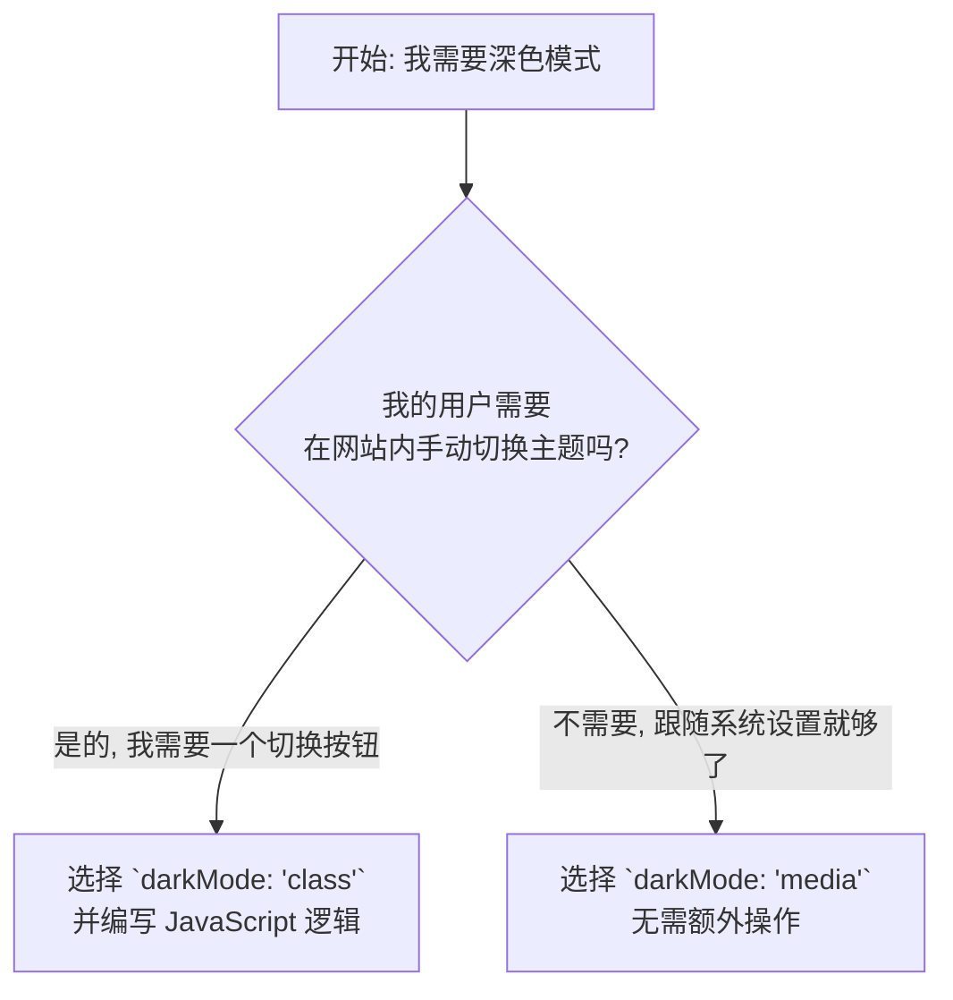

在前两节课程中，我们学习了如何响应不同屏幕尺寸（响应式断点）和用户行为（状态修饰符）。本节将探讨如何响应用户的*环境偏好*，具体来说，就是实现深色模式（Dark Mode）。深色模式不仅是当下的设计趋势，更是提升用户体验、减轻眼部疲劳的关键功能。本教程将详细介绍如何使用 Tailwind CSS 优雅地为您的网站添加功能完善的深色模式。

---

## 4.3 深色模式

继响应式断点（`md:`）和状态修饰符（`hover:`）之后，你将发现 Tailwind 的 `dark:` 修饰符遵循着完全相同、高度一致的设计哲学。这使得为你的网站添加一个功能完善、体验优秀的全站深色模式变得前所未有的简单和直观。

### 🎯 核心目标 (Core Goal)

本节课的核心目标是：**精通使用 `dark:` 修饰符为任何元素应用深色模式下的特定样式，深入理解并能灵活选择 `media` 和 `class` 两种配置策略，并最终能够亲手实现一个带持久化功能的主题切换器。**

### 🔑 核心语法与参数 (Core Syntax & Parameters)

`dark:` 修饰符是一个变体（variant），可以像我们之前学过的任何前缀一样，应用在任意工具类之前。

**核心语法**

```
dark:{utility}
```

-   **`dark:`**: 深色模式修饰符，代表“当深色模式被激活时”。
-   **`{utility}`**: 任何一个标准的 Tailwind 工具类，例如 `bg-gray-800`, `text-white`, `border-gray-600` 等。

例如，`dark:bg-slate-900` 的意思是：“在深色模式下，应用 `bg-slate-900` 这个背景色。”

**配置 (Configuration)**

要启用 `dark:` 修饰符，你需要在 `tailwind.config.js` 文件中进行配置。Tailwind 提供了两种核心策略：

```javascript
// tailwind.config.js
module.exports = {
  // 策略一: 'media' (默认)
  // 自动跟随操作系统的颜色偏好设置
  darkMode: 'media', 

  // 策略二: 'class'
  // 通过在 HTML 根元素上添加 'dark' 类来手动控制
  // darkMode: 'class',

  // ... other configs
}
```

我们将在深度解析部分详细探讨这两种策略的优劣和适用场景。

### 💻 基础用法 (Basic Usage)

让我们通过一个简单的个人资料卡片（Profile Card）来感受 `dark:` 修饰符的威力。

**设计需求：**
-   在浅色模式下，卡片是白色背景，深灰色文字。
-   在深色模式下，卡片是深灰色背景，浅灰色文字。

**实现代码：**

```html
<div class="max-w-sm mx-auto p-8 rounded-xl shadow-lg
           bg-white 
           dark:bg-slate-800">
  <div class="flex items-center space-x-4">
    
    <div>
      <div class="text-xl font-medium 
                 text-black 
                 dark:text-white">
        Evelyn Rose
      </div>
      <p class="text-slate-500 
               dark:text-slate-400">
        Product Designer
      </p>
    </div>
  </div>
</div>
```

**代码解析：**

1.  **卡片背景**:
    -   `bg-white`: 默认（浅色模式）背景为白色。
    -   `dark:bg-slate-800`: 当深色模式激活时，背景色会切换为 `slate-800`。

2.  **主标题文字**:
    -   `text-black`: 默认文字颜色为黑色。
    -   `dark:text-white`: 深色模式下，文字颜色变为白色，以保证对比度。

3.  **副标题文字**:
    -   `text-slate-500`: 默认使用柔和的灰色。
    -   `dark:text-slate-400`: 深色模式下，使用一个更亮的灰色，使其在深色背景上清晰可读。

就这么简单！你不需要写任何额外的 CSS 媒体查询或复杂的选择器。只需在需要改变的样式前加上 `dark:` 前缀即可。

### 🧠 深度解析 (In-depth Analysis)

现在，让我们深入探讨 `darkMode` 配置的两种策略，以及如何实现一个手动切换器。

**1. 配置策略对比：`media` vs `class`**

| 特性 | `darkMode: 'media'` | `darkMode: 'class'` |
| :--- | :--- | :--- |
| **工作原理** | 基于 CSS `prefers-color-scheme` 媒体查询。 | 基于 `<html>` 元素上是否存在 `.dark` 类。 |
| **触发方式** | 自动响应用户的操作系统（OS）设置。 | 手动通过 JavaScript 添加或移除 `.dark` 类。 |
| **优点** | ✅ **无需 JavaScript**：配置简单，即刻生效。 <br> ✅ **尊重用户系统偏好**。 | ✅ **完全控制**：允许用户覆盖系统设置。 <br> ✅ **可构建主题切换器** (亮/暗/系统)。 |
| **缺点** | ❌ **不提供应用内切换**：用户无法在网站内独立于系统设置来切换主题。 | ❌ **需要 JavaScript**：必须编写脚本来管理类。 <br> ❌ **可能 FOUC** (无样式内容闪烁)，需妥善处理。 |
| **生成 CSS** | `@media (prefers-color-scheme: dark) { ... }` | `.dark .dark\:... { ... }` |

**决策流程图**



**2. 实现主题切换器（使用 `class` 策略）**

如果你选择了 `class` 策略，你就需要一小段 JavaScript 来控制主题的切换和持久化。

**第一步：配置 `tailwind.config.js`**

```javascript
// tailwind.config.js
module.exports = {
  darkMode: 'class',
  // ...
}
```

**第二步：创建切换按钮 (HTML)**

```html
<button id="theme-toggle" class="p-2 rounded-full bg-gray-200 dark:bg-gray-700">
  <!-- 这里可以放一个月亮/太阳图标 -->
  Toggle Theme
</button>
```

**第三步：编写切换逻辑 (JavaScript)**

这段脚本至关重要，它负责读取用户偏好、应用主题，并响应点击事件。

```javascript
// 建议将此脚本放在 <head> 中以避免 FOUC
const toggleButton = document.getElementById('theme-toggle');
const htmlEl = document.documentElement;

// 1. 页面加载时，立即应用已保存的主题或系统偏好
if (localStorage.getItem('theme') === 'dark' || 
   (!('theme' in localStorage) && window.matchMedia('(prefers-color-scheme: dark)').matches)) {
  htmlEl.classList.add('dark');
} else {
  htmlEl.classList.remove('dark');
}

// 2. 监听按钮点击事件
toggleButton.addEventListener('click', function() {
  // 切换 'dark' 类
  htmlEl.classList.toggle('dark');
  
  // 3. 将新的主题偏好保存到 localStorage
  if (htmlEl.classList.contains('dark')) {
    localStorage.setItem('theme', 'dark');
  } else {
    localStorage.setItem('theme', 'light');
  }
});
```

这段代码实现了：
1.  **加载时初始化**：检查 `localStorage` 中是否有用户先前的选择。如果没有，则根据用户的系统偏好（`prefers-color-scheme`）进行设置，有效避免了主题闪烁。
2.  **点击切换**：在 `<html>` 标签上添加或移除 `.dark` 类，实现视觉上的主题切换。
3.  **状态持久化**：将用户的选择（`light` 或 `dark`）保存在 `localStorage` 中。一旦用户手动切换过，该选择将覆盖系统偏好，并在下次访问时被记住。

*请注意：此实现是一个“亮/暗”双模式切换器。它不包含一个让用户选择“跟随系统”的三态选项。*

### ⚠️ 常见陷阱与最佳实践 (Common Pitfalls & Best Practices)

#### 陷阱一：主题闪烁 (FOUC - Flash of Unstyled Content)
-   **问题**: 如果你将主题切换脚本放在 `<body>` 的末尾，页面会先以默认的浅色主题渲染，然后脚本执行，再切换到深色主题，导致一次明显的闪烁。
-   **最佳实践**: 始终将**用于初始化主题的脚本**放在 `<head>` 标签内，并尽可能靠前。这样它会在浏览器渲染任何可见内容之前执行，确保从第一帧开始就应用正确的主题。

#### 陷阱二：颜色设计过于简单
-   **问题**: 认为深色模式就是把 `bg-white` 换成 `bg-black`，`text-black` 换成 `text-white`。纯黑背景和纯白文字的对比度过高，长时间阅读反而会更累。
-   **最佳实践**: 使用**柔和的深色调**作为背景（如 `slate-800`, `gray-900`），并使用**灰白色调**作为文字（如 `slate-200`, `gray-300`）。这能显著提升阅读舒适度。Tailwind 的默认调色板非常适合这种微调。

#### 陷阱三：忽略边框和分割线
-   **问题**: 在浅色模式下很清晰的浅灰色边框（如 `border-gray-200`），在深色模式下可能会变得过于明亮刺眼，或者完全看不见。
-   **最佳实践**: 明确为边框和分割线也定义深色模式的颜色。例如：`border-gray-200 dark:border-gray-700`。

#### 最佳实践清单
1.  **组合使用修饰符**: `dark:` 可以和其他修饰符链式使用，顺序通常是：`响应式:dark:状态:工具类`。例如：`md:dark:hover:bg-sky-500`。
2.  **利用 `currentColor`**: 对于 SVG 图标，设置 `fill="currentColor"`。这样，图标的颜色会自动继承父元素的 `text-` 颜色，无需为图标单独设置 `dark:` 颜色。
3.  **考虑图片亮度**: 在深色模式下，过于明亮的图片可能会很突兀。你可以使用 `dark:opacity-80` 或 `dark:brightness-90` 等滤镜工具类来稍微调暗图片，使整体视觉更和谐。

### 🚀 实战演练 (Practical Exercise)

**任务：** 将一个基础的文章页面组件改造为支持深色模式。

**需求：**
1.  页面背景、卡片背景需要适配深色模式。
2.  文章标题、正文、元信息（作者、日期）的颜色需要适配。
3.  文章内的链接颜色也需要适配。

**初始代码 (HTML 结构)：**

（注：以下示例使用了 `prose` 类来格式化文章内容，它由官方的 `@tailwindcss/typography` 插件提供。即使不使用该插件，本节课的核心概念也完全适用。）

```html
<body class="bg-gray-100 font-sans">
  <div class="container mx-auto p-4 md:p-8">
    <article class="max-w-3xl mx-auto bg-white rounded-lg shadow-md p-6 md:p-10">
      
      <h1 class="text-4xl font-bold text-gray-900">
        Mastering Dark Mode in Tailwind CSS
      </h1>
      
      <p class="mt-2 text-sm text-gray-500">
        By Alex Doe on <time datetime="2023-10-27">October 27, 2023</time>
      </p>

      <div class="mt-6 prose max-w-none text-gray-800">
        <p>Dark mode is not just a trend; it's a crucial feature for user comfort. With Tailwind CSS, implementing it is a breeze. You can learn more at the <a href="#" class="text-blue-600 underline">official documentation</a>.</p>
        <p>This exercise will guide you through the process of converting a simple light-themed component into a fully functional, theme-aware one.</p>
      </div>

    </article>
  </div>
</body>
```

**请你思考如何为上述元素添加 `dark:` 修饰符来实现需求。**

---
**答案与解析：**

**最终实现：**
```html
<body class="bg-gray-100 dark:bg-black font-sans transition-colors duration-300">
  <div class="container mx-auto p-4 md:p-8">
    <article class="max-w-3xl mx-auto bg-white dark:bg-gray-800 rounded-lg shadow-md p-6 md:p-10">
      
      <h1 class="text-4xl font-bold text-gray-900 dark:text-gray-100">
        Mastering Dark Mode in Tailwind CSS
      </h1>
      
      <p class="mt-2 text-sm text-gray-500 dark:text-gray-400">
        By Alex Doe on <time datetime="2023-10-27">October 27, 2023</time>
      </p>

      <div class="mt-6 prose max-w-none text-gray-800 dark:text-gray-300">
        <p>Dark mode is not just a trend; it's a crucial feature for user comfort. With Tailwind CSS, implementing it is a breeze. You can learn more at the <a href="#" class="text-blue-600 dark:text-blue-400 underline">official documentation</a>.</p>
        <p>This exercise will guide you through the process of converting a simple light-themed component into a fully functional, theme-aware one.</p>
      </div>

    </article>
  </div>
</body>
```

**解析：**
-   **`body`**: 从 `bg-gray-100` 变为 `dark:bg-black`，为整个页面设置了深色背景。额外添加的 `transition-colors` 和 `duration-300` 是一个推荐的优化，可以提供平滑的颜色切换动画，显著提升用户体验，但这并非任务的强制要求。
-   **`article`**: 卡片背景从 `bg-white` 变为 `dark:bg-gray-800`，这是一个比纯黑更柔和的背景。
-   **`h1`**: 标题颜色从 `text-gray-900` 变为 `dark:text-gray-100`，保证高对比度。
-   **`p` (元信息)**: 次要文字从 `text-gray-500` 变为 `dark:text-gray-400`，维持了视觉上的次要层级。
-   **`div` (正文)**: 正文容器的文字从 `text-gray-800` 变为 `dark:text-gray-300`。（注意：如果使用了 `@tailwindcss/typography` 插件，可能需要配置其深色模式变体，但为简单起见，此处直接在容器上设置颜色）。
-   **`a` (链接)**: 链接颜色从 `text-blue-600` 变为 `dark:text-blue-400`，在深色背景下依然醒目且可读。

### 💡 总结 (Summary)

在本节中，我们为我们的技能库添加了实现深色模式这一强大功能。现在，你应该已经完全掌握了：

-   **`dark:` 修饰符的核心用法**: 能够像使用 `hover:` 或 `md:` 一样，自然地为任何元素添加深色模式下的样式。
-   **两种配置策略**: 清楚 `media`（自动）和 `class`（手动）策略的差异，并能根据项目需求做出正确选择。
-   **实现主题切换**: 如果选择 `class` 策略，你现在有能力编写 JavaScript 代码来实现一个功能完整、带状态持久化的主题切换器。
-   **设计最佳实践**: 你已经超越了简单的颜色反转，懂得如何通过选择柔和的色调、处理边框和图片来创造一个真正舒适的深色模式体验。

至此，我们已经完成了第四章“响应式与交互性”的所有核心内容。你已经具备了构建能够响应屏幕、响应用户行为、响应环境偏好的全方位动态界面的能力，这是成为一名现代前端开发者的关键一步。