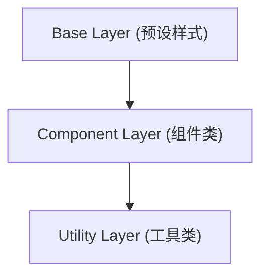

好的，总建筑师。我们已经精通了如何通过 `tailwind.config.js` 文件来锻造我们独一无二的设计系统。现在，让我们更进一步，学习如何将这些设计令牌和 Tailwind 的强大功能直接注入到我们的 CSS 文件中，实现更高层次的抽象和代码复用。

---

### 🎯 核心目标 (Core Goal)

本节课程的核心目标是让你熟练掌握在 CSS 文件中使用 Tailwind 的核心指令（Directives），尤其是 `@apply`。学完本节，你将能够将一组重复的工具类**抽取**并**组合**成一个可复用的、语义化的 CSS 类，同时学会使用 `@layer` 来组织你的样式，确保它们与 Tailwind 的系统和谐共存，从而在保持开发效率的同时，写出更整洁、更易于维护的 HTML 和 CSS。

### 🔑 核心语法与参数 (Core Syntax & Parameters)

在你的主 CSS 文件（例如 `src/input.css`）中，Tailwind 提供了几个以 `@` 开头的特殊“指令”，它们在构建时会被 Tailwind 引擎处理。

1.  **`@tailwind <layer>`**:
    *   **作用**: 这是注入 Tailwind 核心样式的入口。
    *   **参数**:
        *   `base`: 注入 Tailwind 的基础样式和预设（类似于 Normalize.css）。
        *   `components`: 注入 Tailwind 的组件类（如 `container`）。
        *   `utilities`: 注入所有 Tailwind 的功能性工具类。
    *   **语法**:
        ```css
        @tailwind base;
        @tailwind components;
        @tailwind utilities;
        ```
        > **注意**: 你必须在你的主 CSS 文件中包含这三条指令，这样 Tailwind 才能将对应的基础样式、组件和工具类注入到你的项目中。缺少它们，Tailwind 将无法按预期生成样式，导致你的 Tailwind 类无法生效。

2.  **`@layer <layer_name> { ... }`**:
    *   **作用**: 允许你将自己的自定义样式注册到 Tailwind 的某个特定“层”中。这对于控制样式的优先级和确保自定义样式能被 JIT 引擎正确处理至关重要。
    *   **参数**:
        *   `base`: 用于定义基础 HTML 元素的样式，如 `h1`, `p`, `a`。
        *   `components`: 用于定义组件级别的类，如 `.card`, `.btn`。这是使用 `@apply` 的理想场所。
        *   `utilities`: 用于定义新的、可复用的小工具类。
    *   **语法**:
        ```css
        @layer components {
          /* 你自定义的组件类写在这里 */
          .btn-blue {
            /* ... */
          }
        }
        ```

3.  **`@apply <utilities>`**:
    *   **作用**: 这是本节的明星。它允许你将任意数量的 Tailwind 工具类“应用”到一个自定义的 CSS 规则中。
    *   **参数**: 一串空格分隔的 Tailwind 工具类名。
    *   **语法**:
        ```css
        .btn {
          @apply font-bold py-2 px-4 rounded;
        }
        ```
        构建后，`.btn` 会包含 `font-bold`, `py-2`, `px-4`, 和 `rounded` 对应的所有 CSS 属性。

4.  **`theme(key)`**:
    *   **作用**: 一个 CSS 函数，用于直接访问你在 `tailwind.config.js` 中 `theme` 对象里定义的值（设计令牌）。
    *   **参数**: 一个用点表示法（dot notation）的字符串，指向 `theme` 对象中的某个键。
    *   **语法**:
        ```css
        .custom-rule {
          background-color: theme('colors.primary');
          padding: theme('spacing.4.5');
          box-shadow: theme('boxShadow.lg');
        }
        ```

### 💻 基础用法 (Basic Usage)

想象一下，你在项目中多处使用同一种样式的按钮。HTML 可能会变得冗长：

```html
<!-- 版本 1: 纯工具类 -->
<button class="bg-blue-500 hover:bg-blue-700 text-white font-bold py-2 px-4 rounded">
  主要按钮
</button>

<button class="bg-blue-500 hover:bg-blue-700 text-white font-bold py-2 px-4 rounded">
  另一个按钮
</button>
```

这段代码重复性很高，维护起来很麻烦。现在，让我们用 `@apply` 来抽取这个模式。

**第 1 步：在你的 CSS 文件中定义组件类**

在你的主 CSS 文件（如 `src/input.css`）中，使用 `@layer` 和 `@apply`：

```css
/* src/input.css */

@tailwind base;
@tailwind components;
@tailwind utilities;

@layer components {
  .btn {
    @apply font-bold py-2 px-4 rounded;
  }
  .btn-primary {
    @apply bg-blue-500 text-white hover:bg-blue-700;
  }
  .btn-secondary {
    @apply bg-gray-500 text-white hover:bg-gray-700;
  }
}
```

**第 2 步：清理你的 HTML**

现在，你的 HTML 变得极其简洁和语义化：

```html
<!-- 版本 2: 使用 @apply 后的组件类 -->
<button class="btn btn-primary">
  主要按钮
</button>

<button class="btn btn-secondary">
  另一个按钮
</button>
```

**使用 `theme()` 函数**

假设你在 `tailwind.config.js` 中定义了一个品牌色：

```javascript
// tailwind.config.js
theme: {
  extend: {
    colors: {
      'brand-purple': '#7C3AED',
    },
  },
}
```

你可以直接在 CSS 中通过 `theme()` 使用它。这在处理需要 Tailwind 设计令牌但没有直接工具类对应的 CSS 属性（如 `background-image` 中的渐变色）时特别有用。

```css
@layer components {
  .special-gradient-text {
    /* 使用 theme() 函数获取颜色值来创建复杂样式 */
    background-image: linear-gradient(to right, theme('colors.brand-purple'), theme('colors.pink.500'));
    -webkit-background-clip: text;
    background-clip: text;
    color: transparent;
  }
}
```

### 🧠 深度解析 (In-depth Analysis)

#### `@apply` vs. 传统组件框架 (如 Bootstrap)

你可能会觉得这很像 Bootstrap 或其他框架的组件类。它们有相似之处，但本质区别在于**所有权**和**灵活性**。

*   **传统框架**: 你使用的是预先设计好的组件（如 `.btn`, `.card`）。它们的样式是固定的，定制起来很麻烦，常常需要写很多覆盖性 CSS。
*   **Tailwind + `@apply`**: 你是组件的**创造者**。`.btn` 类里的每一个样式都源于你自己的设计系统（`tailwind.config.js`）。你可以用任何你想要的工具类来组合，拥有 100% 的控制权。

#### `@apply` vs. UI 框架组件 (如 React/Vue)

这是一个更现代的比较。什么时候该用 `@apply`，什么时候该创建一个 `<Button>` 组件？

*   **`@apply`**: 适用于**纯粹的样式抽象**。当你发现一组 CSS 类在多个不相关的 HTML 元素（`<a>`, `<button>`, `<div>`）上重复出现时，`@apply` 是一个很好的选择。它只关心外观。
*   **UI 框架组件 (`<Button>`)**: 适用于**行为、结构和样式的封装**。当一个组件不仅有样式，还有自己的状态（`disabled`, `loading`）、事件处理（`onClick`）和固定的 HTML 结构（如带有一个 icon）时，应该创建框架组件。

**最佳组合**: 它们可以协同工作！你的 React/Vue 组件内部可以使用 `@apply` 生成的类。

```jsx
// React 组件
function Button({ children, kind = 'primary' }) {
  const kindClasses = {
    primary: 'btn-primary',
    secondary: 'btn-secondary',
  };
  
  // 组件内部使用 @apply 生成的类
  return (
    <button className={`btn ${kindClasses[kind]}`}>
      {children}
    </button>
  );
}
```

#### `@layer` 的重要性：CSS 层叠与优先级

为什么要把自定义类放在 `@layer components` 中？因为 Tailwind 的 CSS 是按特定顺序生成的，这决定了哪个类的优先级更高。



*   **Base Layer**: 优先级最低。
*   **Component Layer**: 中等优先级。
*   **Utility Layer**: 优先级最高。

这意味着，一个工具类（如 `mt-8`）**总是可以覆盖**一个组件类（如 `.btn`）中定义的 `margin`。

```html
<!-- `mt-8` 的优先级高于 .btn-primary 内部的任何 margin/padding 设置，因为它在 Utility Layer -->
<button class="btn btn-primary mt-8">按钮</button>
```

将你的组件放在 `@layer components` 中，可以确保你的抽象行为符合预期，并且仍然允许你用工具类进行一次性的微调。

### ⚠️ 常见陷阱与最佳实践 (Common Pitfalls & Best Practices)

#### 陷阱 1：过度使用 `@apply`
*   **问题**: 新手很容易爱上 `@apply`，然后开始把所有东西都抽象成组件类，最终又回到了写传统 CSS 的老路，失去了 utility-first 的灵活性。
*   **解决方案**: **只对真正重复的、可识别的 UI 模式使用 `@apply`**。如果一个样式组合只出现了一两次，直接在 HTML 中使用工具类通常是更好、更直接的选择。问问自己：“这是一个将在应用中反复出现的设计模式吗？”如果是，就用 `@apply`。

#### 陷阱 2：在 `@apply` 中使用带重要修饰符的类
*   **问题**: 在 `@apply` 中使用 `!important` 修饰符（例如 `@apply !p-4`）可能会导致意想不到的样式覆盖问题，并且使其难以调试。
*   **解决方案**: 尽量避免在 `@apply` 中使用 `!important`。Tailwind 的层级和工具类的原子性设计已经解决了大部分优先级问题。如果确实需要提高优先级，可以考虑使用 CSS 的原生 `!important`，但要谨慎。

#### 最佳实践 1：为你的组件类添加基础样式和变体
将一个组件的基础结构和不同变体（颜色、大小等）分开，可以获得最大的灵活性。

```css
@layer components {
  /* 基础 .btn 样式 */
  .btn {
    @apply inline-block text-center px-6 py-3 rounded-lg shadow-md transition-transform duration-200 transform hover:-translate-y-1 focus:outline-none focus:ring-2 focus:ring-offset-2;
  }

  /* 颜色变体 */
  .btn-indigo {
    @apply bg-indigo-600 text-white hover:bg-indigo-700 focus:ring-indigo-500;
  }
  .btn-outline-gray {
    @apply bg-transparent text-gray-700 border border-gray-300 hover:bg-gray-100 focus:ring-gray-500;
  }
  
  /* 尺寸变体 */
  .btn-sm {
    @apply px-4 py-2 text-sm;
  }
}
```
**应用**: `<button class="btn btn-indigo btn-sm">小按钮</button>`

#### 最佳实践 2：结合 CSS 伪类和响应式变体
`@apply` 可以完美地与 Tailwind 的所有变体（如 `hover:`, `focus:`, `lg:`）一起工作。

```css
@layer components {
  .card {
    @apply bg-white rounded-lg shadow-md p-4 transition-all duration-300;
    
    /* 响应式变体 */
    @apply md:p-6 lg:p-8;

    /* 伪类变体 */
    @apply hover:shadow-xl hover:scale-105;
  }
}
```

### 🚀 实战演练 (Practical Exercise)

**任务**: 创建一个可复用的“警告框 (Alert)”组件，它能够表示成功、警告和错误三种状态。

**第 1 步：分析 HTML 中的重复模式**

假设我们有以下未优化的 HTML：

```html
<!-- 成功警告框 -->
<div class="bg-green-100 border-l-4 border-green-500 text-green-700 p-4 rounded-md shadow" role="alert">
  <p class="font-bold">成功!</p>
  <p>你的操作已成功完成。</p>
</div>

<!-- 错误警告框 -->
<div class="bg-red-100 border-l-4 border-red-500 text-red-700 p-4 rounded-md shadow" role="alert">
  <p class="font-bold">错误!</p>
  <p>发生了一个未知错误。</p>
</div>
```
我们可以看到，`p-4 rounded-md shadow` 和 `border-l-4` 是共享的基础样式，而颜色是变化的。

**第 2 步：使用 `@apply` 进行抽取**

在你的 CSS 文件中添加以下代码：

```css
/* src/input.css */
@tailwind base;
@tailwind components;
@tailwind utilities;

@layer components {
  /* 1. 抽取基础 alert 样式 */
  .alert {
    @apply p-4 border-l-4 rounded-md shadow;
  }
  .alert-title {
    @apply font-bold;
  }

  /* 2. 创建不同状态的变体 */
  .alert-success {
    @apply bg-green-100 border-green-500 text-green-700;
  }
  .alert-warning {
    @apply bg-yellow-100 border-yellow-500 text-yellow-700;
  }
  .alert-danger {
    @apply bg-red-100 border-red-500 text-red-700;
  }
}
```

**第 3 步：重构 HTML**

现在，你的 HTML 变得干净、语义化且易于维护：

```html
<!-- 成功警告框 -->
<div class="alert alert-success" role="alert">
  <p class="alert-title">成功!</p>
  <p>你的操作已成功完成。</p>
</div>

<!-- 警告警告框 -->
<div class="alert alert-warning" role="alert">
  <p class="alert-title">警告!</p>
  <p>请检查你的输入信息。</p>
</div>

<!-- 错误警告框 -->
<div class="alert alert-danger" role="alert">
  <p class="alert-title">错误!</p>
  <p>发生了一个未知错误。</p>
</div>
```
你成功地创建了一个可复用、可扩展的组件，而没有写一行传统的 CSS 属性！

### 💡 总结 (Summary)

`@apply` 及其相关的指令是连接 utility-first 理念与传统组件化 CSS 的桥梁。它不是要取代工具类，而是为我们提供了一个强大的抽象工具。

在本节中，我们掌握了：
*   **核心指令**: ` @tailwind` 用于基础设置，`@layer` 用于组织和控制优先级，`@apply` 用于组合工具类，`theme()` 用于访问设计令牌。
*   **何时使用 `@apply`**: 当你识别出项目中反复出现的 UI 模式时，是时候使用 `@apply` 来创建可复用的组件类了。
*   **最佳实践**: 始终将自定义组件放在 `@layer components` 中，保持组件的小型化和可组合性，并充分利用 Tailwind 的变体系统。
*   **清晰的边界**: 理解了 `@apply` 和 UI 框架组件的适用场景，知道何时选择哪种抽象方式。

熟练运用 `@apply`，你将能在大型项目中保持 HTML 的整洁，同时确保所有样式都严格遵循你在 `tailwind.config.js` 中定义的设计系统，实现真正的“代码即设计”。