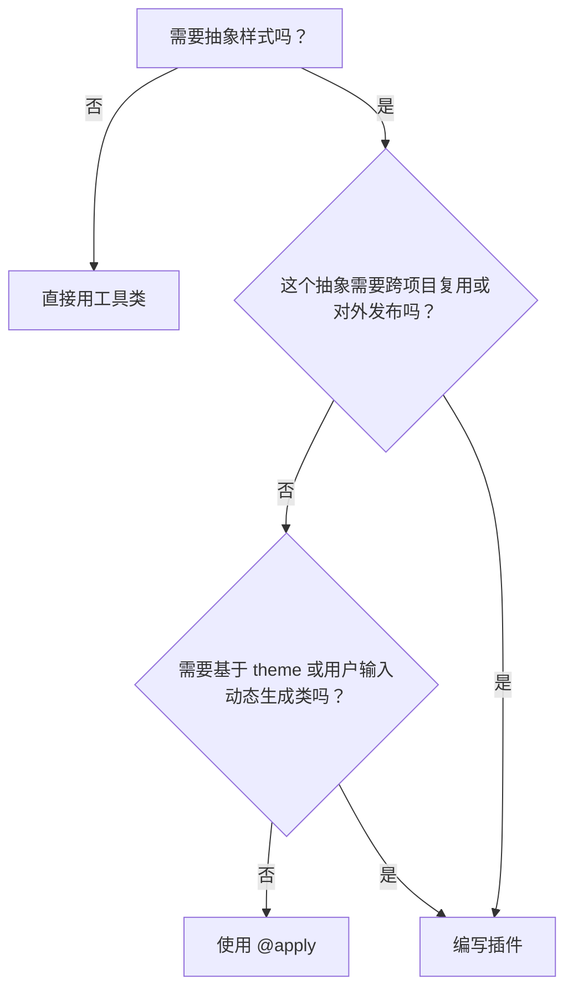

我们已经精通了如何通过配置文件定制设计系统，以及如何使用 `@apply` 在 CSS 中创建可复用的组件类。然而，当我们的需求超越了简单的样式组合，需要创造全新的功能、可配置的工具类，甚至是可跨项目分享的逻辑时，我们就需要掌握 Tailwind CSS 的终极扩展武器——编写插件。

---

### 🎯 核心目标 (Core Goal)

本节课程旨在让你从根本上理解并掌握扩展 Tailwind CSS 框架的能力。学完本节，你将能够跳出“使用者”的身份，成为框架的“共建者”，通过编写插件来创造全新的、与项目设计系统无缝集成的功能。这包括将复杂的 UI 模式封装为可配置、可分发的模块，以及从底层注入全局样式，从而实现对开发工具的完全掌控，将 Tailwind 的潜力发挥到极致。

### 🔑 核心语法与参数 (Core Syntax & Parameters)

Tailwind 插件本质上是一个 JavaScript 函数，它被添加到 `tailwind.config.js` 的 `plugins` 数组中。在构建时，Tailwind 会执行这个函数，并向其传递一组功能强大的辅助工具，让你能够“钩入” Tailwind 的构建过程。

```javascript
// tailwind.config.js
const plugin = require('tailwindcss/plugin');

module.exports = {
  // ...
  plugins: [
    // 1. 注册你的插件
    plugin(function({ addUtilities, addComponents, addBase, theme, e }) {
      // 2. 在这里使用辅助函数来扩展 Tailwind
    })
  ],
}
```

**核心辅助函数 (Plugin Helpers):**

*   **`addUtilities(utilities, options)`**:
    *   **作用**: 注册新的、原子化的工具类。这是最常用的插件功能。
    *   **参数**:
        *   `utilities`: 一个 CSS-in-JS 格式的对象，键是 CSS 类名（如 `.text-shadow`），值是包含 CSS 属性的对象。
        *   `options` (可选): 一个配置对象，可以指定要为这些工具类生成哪些变体（如 `['responsive', 'hover']`）。

*   **`addComponents(components)`**:
    *   **作用**: 注册更复杂的、多层次的组件类。功能上类似于在 CSS 中使用 `@apply`，但更适合封装和分发。
    *   **参数**: `components`: 一个 CSS-in-JS 格式的对象，用于定义组件类。

*   **`addBase(styles)`**:
    *   **作用**: 向 Tailwind 的 `base` 层注入全局基础样式。非常适合用来设置全局字体、修复特定元素的默认样式或添加像 `::selection` 这样的全局伪元素样式。
    *   **参数**: `styles`: 一个 CSS-in-JS 格式的对象，键是 CSS 选择器（如 `h1`, `body`），值是样式对象。

*   **`e(className)`**:
    *   **作用**: 转义(escape)类名，确保在动态生成类名时，包含特殊字符（如 `/`）的选择器能够被 CSS 正确解析。
    *   **参数**: `className`: 需要被转义的字符串。例如 `e('w-1/2')` 会返回 `w-1\/2`。

*   **`withOptions(pluginFunction, configFunction)`**:
    *   **作用**: 一个高阶函数，用于创建**可配置**的插件。它允许你的插件接收用户传入的选项。
    *   **语法**:
        ```javascript
        // my-plugin.js
        const plugin = require('tailwindcss/plugin');

        module.exports = plugin.withOptions(
          function (options = {}) { // 接收用户选项
            return function({ addUtilities }) {
              // ... 使用 options ...
            };
          },
          function (options = {}) { // (可选) 提供可合并到 Tailwind 配置中的对象
            return {
              theme: {
                // 比如，让插件为用户的主题添加一些默认值
              }
            }
          }
        )
        ```

### 💻 基础用法 (Basic Usage)

让我们通过三个独立的例子来实践这些核心函数。

#### 1. 使用 `addUtilities` 添加文本阴影工具类

假设我们需要一组 `text-shadow` 工具类，而 Tailwind 默认不提供。

**第 1 步: 创建插件逻辑**

```javascript
// tailwind.config.js
const plugin = require('tailwindcss/plugin');

const textShadowPlugin = plugin(function({ addUtilities, theme, e }) {
  const values = theme('textShadow'); // 假设我们在 theme 中定义了 textShadow

  const utilities = Object.entries(values).map(([key, value]) => {
    return {
      [`.${e(`text-shadow-${key}`)}`]: {
        textShadow: value,
      }
    }
  });

  addUtilities(utilities, ['responsive', 'hover']);
});
```

**第 2 步: 在配置中注册并使用**

```javascript
// tailwind.config.js
module.exports = {
  theme: {
    extend: {
      textShadow: { // 为插件提供数据
        sm: '0 1px 2px var(--tw-shadow-color, rgba(0,0,0,0.5))',
        DEFAULT: '0 2px 4px var(--tw-shadow-color, rgba(0,0,0,0.5))',
        lg: '0 8px 16px var(--tw-shadow-color, rgba(0,0,0,0.5))',
      },
    }
  },
  plugins: [
    textShadowPlugin, // 注册插件
  ],
}
```

**应用:** 现在你可以在 HTML 中像使用原生类一样使用它了，并且支持响应式和悬停状态。
```html
<h1 class="text-4xl font-bold text-shadow-lg hover:text-shadow-sm shadow-cyan-500/50">
  Hello Plugin
</h1>
```

#### 2. 使用 `addComponents` 创建卡片组件

我们可以将之前用 `@apply` 创建的组件逻辑，封装成一个更正式、可复用的插件。

```javascript
// tailwind.config.js
const plugin = require('tailwindcss/plugin');

const cardPlugin = plugin(function({ addComponents, theme }) {
  addComponents({
    '.card': {
      backgroundColor: theme('colors.white'),
      borderRadius: theme('borderRadius.lg'),
      padding: theme('spacing.6'),
      boxShadow: theme('boxShadow.xl'),
      '&:hover': { // 支持伪类
        boxShadow: theme('boxShadow.2xl'),
      }
    },
    '.card-title': {
      fontSize: theme('fontSize.2xl'),
      fontWeight: theme('fontWeight.bold'),
    }
  })
});

module.exports = {
  // ...
  plugins: [cardPlugin],
}
```
**应用:** HTML 结构变得非常清晰。
```html
<div class="card">
  <h2 class="card-title">My Plugin-driven Card</h2>
  <p class="mt-2">This component is now part of the framework.</p>
</div>
```

#### 3. 使用 `addBase` 添加全局选择样式

让我们为整个网站定义一个自定义的文本选中高亮颜色。

```javascript
// tailwind.config.js
const plugin = require('tailwindcss/plugin');

const selectionPlugin = plugin(function({ addBase, theme }) {
  addBase({
    '::selection': {
      backgroundColor: theme('colors.indigo.500'),
      color: theme('colors.white')
    }
  })
});

module.exports = {
  // ...
  plugins: [selectionPlugin],
}
```
**应用:** 无需在 HTML 中添加任何类。现在，网站上所有可选择的文本在被选中时都会显示为靛蓝色背景和白色文字。

### 🧠 深度解析 (In-depth Analysis)

#### 插件 vs. `@apply`：选择正确的抽象工具

这是一个关键的决策点。它们都能实现样式封装，但适用场景截然不同。

| 特性 | `@apply` in CSS | 插件 (Plugin) |
| :--- | :--- | :--- |
| **作用域** | **项目级**：定义在你的项目 CSS 文件中。 | **框架级**：扩展 Tailwind 引擎，可跨项目复用。 |
| **分发性** | 不可分发。 | **可分发**：可以发布为独立的 npm 包。 |
| **配置性** | 不可配置。样式是硬编码的。 | **高度可配置**：通过 `withOptions` 接收用户配置。 |
| **动态性** | 静态组合。 | **动态生成**：可以基于 `theme` 或用户选项循环生成大量工具类。 |
| **适用场景** | 快速抽象项目中重复的、简单的 UI 模式。 | 创建可复用的设计系统组件、添加新功能、构建可共享的 UI 库。 |

**决策流程图:**

简单来说，`@apply` 是你项目中的“战术性”武器，而插件则是你工具箱里的“战略性”武器。

#### `withOptions`：打造专业级插件的钥匙

`withOptions` 是区分业余插件和专业插件的关键。它将你的插件从一个硬编码的脚本，变成一个灵活、可适应用户需求的工具。

思考一下官方的 `@tailwindcss/typography` 插件。它允许你这样配置：
```javascript
// tailwind.config.js
plugins: [
  require('@tailwindcss/typography')({
    // 这就是 `withOptions` 提供的能力
    className: 'prose', 
  }),
]
```
没有 `withOptions`，这种程度的自定义是不可能的。当你编写插件时，如果发现任何可能需要用户修改的值（如类名前缀、默认颜色、尺寸等），都应该通过 `withOptions` 暴露出来。

### ⚠️ 常见陷阱与最佳实践 (Common Pitfalls & Best Practices)

#### 陷阱 1：在插件中硬编码设计令牌

*   **问题**: 在插件代码中直接写入颜色值（`'#3b82f6'`）或间距值（`'1rem'`）。这违背了 Tailwind 的核心思想，使得插件无法适应用户自定义的主题。
*   **解决方案**: **永远使用 `theme()` 辅助函数**来从用户的 `tailwind.config.js` 中读取值。例如，用 `theme('colors.blue.500')` 代替 `'#3b82f6'`。这能确保你的插件与用户的设计系统无缝集成。

#### 陷阱 2：忘记转义类名中的特殊字符

*   **问题**: 当你动态生成类名时，可能会包含 `/` 或 `.` 等特殊字符（如 `w-1/2`）。如果直接将它们用作 CSS 选择器，浏览器会解析错误。
*   **解决方案**: **始终使用 `e()` (escape) 辅助函数**来包裹动态生成的类名部分。例如，`[`.${e(`w-${key}`)}`]`，其中 `key` 可能是 `1/2`。`e()` 会智能地将其转换为 CSS 安全的格式，如 `w-1\/2`。

#### 最佳实践 1：为你的工具类提供一个命名空间

*   **原因**: 为了避免你的插件与 Tailwind 未来可能添加的核心工具类或社区中其他插件发生命名冲突。
*   **做法**: 为你的工具类或组件添加一个独特的前缀。例如，与其创建 `.gradient`，不如创建 `.bg-gradient-brand` 或 `.brand-gradient`。

#### 最佳实践 2：保持插件的单一职责原则

*   **原因**: 一个插件应该做好一件事。一个既添加表单样式、又添加排版工具、还创建卡片组件的“万能”插件，会变得难以维护和理解。
*   **做法**: 将不同的功能拆分成独立的、可组合的插件。例如，一个 `@tailwindcss/forms` 插件，一个 `@tailwindcss/typography` 插件。

### 🚀 实战演练 (Case Study)

**任务**: 创建一个灵活的、可配置的 "skew" 变换工具类插件。Tailwind 有 `skew-x` 和 `skew-y`，但让我们创建一个可以同时倾斜两个轴的工具。

**要求**:
1.  插件应能添加如 `.skew-15-30` 这样的类，表示 `transform: skew(15deg, 30deg)`。
2.  插件应是可配置的，允许用户在 `theme` 中定义他们自己的倾斜值。

**第 1 步: 编写 `skew-plugin.js` 文件**

```javascript
// skew-plugin.js
const plugin = require('tailwindcss/plugin');

module.exports = plugin(function({ addUtilities, theme, e }) {
  const skewValues = theme('skew') || {}; // 从 theme 中读取 skew 配置，提供默认空对象

  const utilities = Object.entries(skewValues).reduce((acc, [key, value]) => {
    // 确保值是包含 x 和 y 的有效对象，增强插件的健壮性
    if (typeof value === 'object' && value.x && value.y) {
      acc[`.${e(`skew-${key}`)}`] = {
        transform: `skew(${value.x}, ${value.y})`,
      };
    }
    return acc;
  }, {});
  
  addUtilities(utilities, ['responsive', 'hover']); // 添加变体
});
```

**第 2 步: 在 `tailwind.config.js` 中配置和使用插件**

```javascript
// tailwind.config.js
module.exports = {
  content: ['./src/**/*.{html,js}'],
  theme: {
    extend: {
      // 为我们的新插件定义设计令牌
      skew: {
        '15-30': { x: '15deg', y: '30deg' },
        'dramatic': { x: '-25deg', y: '10deg' },
      },
    }
  },
  plugins: [
    require('./skew-plugin.js'), // 引入本地插件
  ],
}
```

**第 3 步: 在 HTML 中应用**

```html
<div class="flex space-x-8 p-10">
  <div class="
    w-48 h-48 bg-violet-500 text-white flex items-center justify-center 
    transition-transform duration-300 
    hover:skew-15-30">
    Hover Me!
  </div>
  <div class="
    w-48 h-48 bg-emerald-500 text-white flex items-center justify-center 
    skew-dramatic">
    Static Skew
  </div>
</div>
```
现在，你拥有了一个完全由自己设计、与项目主题集成、并支持响应式和悬停变体的全新 Tailwind 功能！

### 💡 总结 (Summary)

编写插件是将你从 Tailwind 的“使用者”提升为“共建者”的关键一步。它赋予了你定义框架行为的终极权力。

在本节中，我们掌握了：
*   **插件基础结构**: 插件是一个接收辅助函数的 JS 函数，在 `plugins` 数组中注册。
*   **三大核心功能**: 使用 `addUtilities` 添加原子类，`addComponents` 封装组件，`addBase` 注入全局样式。
*   **专业插件的标志**: 通过 `withOptions` 创建可配置的插件，并通过 `theme()` 和 `e()` 辅助函数与 Tailwind 的生态系统紧密集成。
*   **清晰的定位**: 明确了何时使用简单的 `@apply` 进行项目级抽象，何时投资编写功能更强大的插件进行框架级扩展。

掌握了插件开发，你就解锁了 Tailwind CSS 的全部潜力。你不再受限于框架提供的功能，而是可以根据任何项目需求，自由地塑造和扩展你的开发工具，构建出真正强大且独一无二的设计系统。
