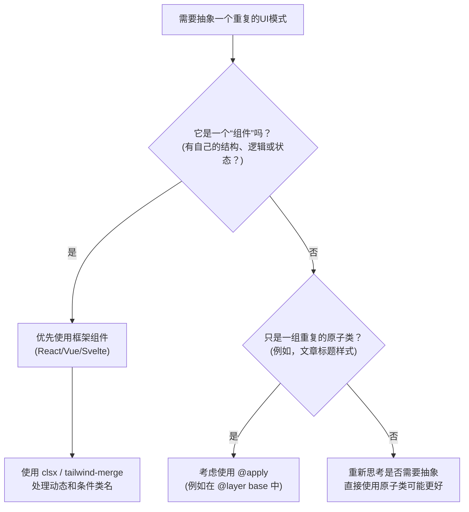

好的，总建筑师。我将依据您提供的“教学设计图”，以一位世界级技术教育者和 Tailwind CSS 专家的身份，为您打造一篇高质量的 Markdown 教程。

---

# 第六章：高级应用与工作流
## 6.1 组件抽象模式

在我们使用 Tailwind CSS 构建复杂项目的过程中，会不可避免地遇到重复的 UI 模式。如何优雅、高效地管理和抽象这些模式，是衡量我们工程能力的关键。本节课，我们将深入探讨 Tailwind CSS 中的两种主流组件抽象策略，并为你指明在不同场景下的最佳路径。

### 🎯 核心目标 (Core Goal)

本节的核心目标是让你掌握在 Tailwind 项目中管理和抽象重复 UI 模式的最佳实践。你将学会清晰地辨别何时使用 CSS 层面的 `@apply` 指令，何时应该依赖 JavaScript 框架（如 React/Vue/Svelte）的组件化能力，从而做出最高效、最易于维护的架构决策。

### 🔑 核心语法与参数 (Core Syntax & Parameters)

在组件抽象的讨论中，我们主要会接触到一个核心的 Tailwind CSS 指令：

*   **`@apply`**
    *   **作用**: 在你的自定义 CSS 类中，直接“应用”一个或多个 Tailwind 的原子类。这允许你将一组常用的工具类组合成一个新的、语义化的 CSS 类。
    *   **语法**:
        ```css
        .your-custom-class {
          @apply utility-class-1 utility-class-2 ...;
        }
        ```
    *   **示例**:
        ```css
        .btn-primary {
          @apply bg-blue-500 text-white font-bold py-2 px-4 rounded;
        }
        ```
        这样，你就可以在 HTML 中使用 `<button class="btn-primary">` 来代替那一长串的原子类。

除了 `@apply`，在处理动态类名时，我们还会用到一些社区流行的辅助库，它们虽然不是 Tailwind 的核心部分，但在实践中至关重要：

*   **`clsx` (或 `classnames`)**: 一个小巧的 JavaScript 工具库，用于根据条件动态地组合 class 字符串。
*   **`tailwind-merge`**: 一个用于智能合并 Tailwind 类的函数，可以解决因类名顺序导致的样式冲突问题（例如，`p-2 p-4` 会被正确解析为 `p-4`）。

### 💻 基础用法 (Basic Usage)

假设我们在项目中需要反复使用一个特定样式的按钮。这是一个典型的需要抽象的场景。

**场景：一个蓝色的主操作按钮**

HTML 结构（未抽象前）：
```html
<!-- 按钮 1 -->
<button class="bg-blue-500 hover:bg-blue-700 text-white font-bold py-2 px-4 rounded">
  确认
</button>

<!-- 按钮 2 (在另一个页面) -->
<button class="bg-blue-500 hover:bg-blue-700 text-white font-bold py-2 px-4 rounded">
  提交
</button>
```
可以看到，这一长串 `class` 在多处重复，既不美观也难以维护。下面我们用两种主流方式来抽象它。

**方法一：使用 `@apply` 抽取组件类**

在你的主 CSS 文件中（例如 `src/input.css`）：
```css
/* input.css */
@tailwind base;
@tailwind components;
@tailwind utilities;

@layer components {
  .btn-primary {
    @apply bg-blue-500 hover:bg-blue-700 text-white font-bold py-2 px-4 rounded;
  }
}
```
> **提示**：将自定义组件类放在 `@layer components` 中是推荐的做法，这有助于 Tailwind 更好地管理样式层级和覆盖顺序。

现在，你的 HTML 可以变得非常简洁：
```html
<button class="btn-primary">确认</button>
<button class="btn-primary">提交</button>
```

**方法二：结合框架组件 (以 React 为例)**

创建一个可复用的组件文件，例如 `Button.jsx`：
```jsx
// src/components/Button.jsx
export function Button({ children, className = '' }) {
  const baseClasses = 'bg-blue-500 hover:bg-blue-700 text-white font-bold py-2 px-4 rounded';
  
  // 使用模板字符串简单拼接
  const finalClasses = `${baseClasses} ${className}`;

  return (
    <button className={finalClasses}>
      {children}
    </button>
  );
}
```
在你的应用中使用它：
```jsx
// src/App.jsx
import { Button } from './components/Button';

function App() {
  return (
    <div>
      <Button>确认</Button>
      <Button>提交</Button>
      {/* 甚至可以轻松扩展 */}
      <Button className="mt-4">带边距的提交</Button>
    </div>
  );
}
```
这两种方法都实现了代码的复用，但它们的适用场景和深层影响却大相径庭。

### 🧠 深度解析 (In-depth Analysis)

让我们进行一次深入的比较，来理解这两种模式的本质区别和优劣。

| 特性 | `@apply` | 框架组件 (React/Vue/Svelte) |
| :--- | :--- | :--- |
| **抽象层级** | **CSS 层**。创建新的 CSS 类。 | **模板/逻辑层**。封装 HTML 结构、样式和行为。 |
| **动态性** | **非常弱**。无法根据 props/state 动态改变内部的原子类。任何变体都需要预先定义新的 CSS 类（如 `.btn-secondary`）。 | **非常强**。可以轻松地根据组件的 props 或内部 state 动态添加、删除或修改类名。 |
| **可组合性** | **有限**。只能在 CSS 层面组合，灵活性差。 | **极高**。可以通过 props 传递 `className`，使用 `clsx` 等工具库轻松实现复杂的条件样式组合。 |
| **维护性** | **中等**。当样式变体增多时，CSS 文件会变得臃肿，并且你需要在 CSS 和 HTML 之间来回切换上下文。 | **高**。样式、结构和逻辑都内聚在同一个组件文件中，维护和理解都更加直观。 |
| **“单一数据源”** | **违背**。样式的“真理”分散在 CSS 文件和 HTML 模板中。 | **遵循**。组件的外观和行为完全由其接收的 props 和内部 state 决定，逻辑清晰。 |

**深度剖析：处理条件类名**

这是区分两种模式优劣的最佳试金石。假设我们需要一个 `disabled` 状态的按钮。

**使用 `@apply` 的尝试：**
你必须在 CSS 中预先定义好所有状态：
```css
/* input.css */
.btn-primary {
  @apply bg-blue-500 hover:bg-blue-700 text-white font-bold py-2 px-4 rounded;
}

.btn-primary:disabled {
  @apply bg-slate-400 cursor-not-allowed;
}
```
这对于简单的伪类（如 `:hover`, `:disabled`）是可行的。但如果禁用状态是由一个 JavaScript 变量 `isDisabled` 控制的，`@apply` 就无能为力了。

**使用框架组件的解决方案：**
在组件中处理逻辑变得轻而易举。这里我们引入 `clsx` 和 `tailwind-merge` 来进行专业处理。

```jsx
// src/components/Button.jsx
import { clsx } from 'clsx';
import { twMerge } from 'tailwind-merge';

export function Button({ children, className = '', isDisabled = false, variant = 'primary' }) {
  const baseClasses = 'font-bold py-2 px-4 rounded';
  
  const variantClasses = {
    primary: 'bg-blue-500 hover:bg-blue-700 text-white',
    secondary: 'bg-gray-500 hover:bg-gray-700 text-white',
  };

  // 使用 twMerge 和 clsx 组合类名
  const finalClasses = twMerge(clsx(
    baseClasses,
    variantClasses[variant],
    {
      'bg-slate-400 cursor-not-allowed': isDisabled,
    },
    className
  ));

  return (
    <button className={finalClasses} disabled={isDisabled}>
      {children}
    </button>
  );
}
```
在这个版本中，我们的组件不仅能处理 `isDisabled` 状态，还能处理不同的 `variant`（变体），并且允许外部传入额外的 `className`。`twMerge` 确保了如果外部传入 `bg-red-500`，它会正确地覆盖掉组件内部的 `bg-blue-500`。这是 `@apply` 无法企及的灵活性和健壮性。

### ⚠️ 常见陷阱与最佳实践 (Common Pitfalls & Best Practices)

1.  **陷阱：滥用 `@apply` 创建“组件”**
    *   **描述**：新手很容易将 `@apply` 视为传统 CSS 的回归，用它来为每一个小的 UI 单元创建类名，比如 `.card`, `.input`, `.modal`。这被称为“过早抽象”，它会让你失去 Tailwind 原子类带来的灵活性，并创造出一个难以维护的、自定义的 CSS 框架。
    *   **后果**：你失去了直接在 HTML 中快速修改样式的能力，每次调整都需要去修改 CSS 文件，违背了 Tailwind 的核心理念。

2.  **最佳实践：优先使用框架组件进行抽象**
    *   对于任何包含逻辑、状态、或需要通过 props 接收数据来改变外观的 UI 单元，**永远**优先选择框架组件（如 React/Vue 组件）进行封装。这是最主流、最强大、最符合 Tailwind 设计哲学的方式。

3.  **最佳实践：`@apply` 的合理使用场景**
    *   `@apply` 并非一无是处，它在一些特定场景下非常有用。
    *   **场景A：抽象非组件化的、重复的文本样式。** 比如文章内容中的标题、段落样式。
        ```css
        @layer base {
          h1 {
            @apply text-2xl font-bold mb-4;
          }
          p {
            @apply mb-2 leading-relaxed;
          }
        }
        ```
    *   **场景B：创建极少数、全局一致且无动态逻辑的简单元素。** 比如一个全局统一的分割线样式 `.divider`。

4.  **最佳实践：始终搭配 `clsx` 和 `tailwind-merge`**
    *   在构建可复用的框架组件时，请将 `clsx` 和 `tailwind-merge` 加入你的工具箱。它们能极大地简化条件类名的处理，并避免样式冲突。

### 🚀 实战演练 (Practical Exercise)

**任务：** 创建一个高度可复用的 `Card` 组件。

**需求：**
1.  `Card` 组件包含一个可选的图片、一个标题、一段描述和一个页脚区域。
2.  可以通过 `isFeatured` prop 来控制卡片是否为“精选”状态，精选状态下卡片有不同的边框和背景色。
3.  允许外部通过 `className` prop 传入额外的样式来微调布局（如 `margin`）。

**解决方案 (以 React 和 `clsx`/`tailwind-merge` 为例):**

```jsx
// src/components/Card.jsx
import { clsx } from 'clsx';
import { twMerge } from 'tailwind-merge';

export function Card({ imageUrl, title, description, footerContent, isFeatured = false, className = '' }) {
  
  const cardClasses = twMerge(clsx(
    'bg-white rounded-lg shadow-md overflow-hidden transition-all duration-300',
    {
      'border-2 border-yellow-400 scale-105 bg-yellow-50': isFeatured,
      'hover:shadow-xl': !isFeatured
    },
    className // 允许外部样式覆盖
  ));

  return (
    <div className={cardClasses}>
      {imageUrl && }
      
      <div className="p-6">
        <h3 className="text-xl font-bold text-gray-800 mb-2">{title}</h3>
        <p className="text-gray-600">{description}</p>
      </div>
      
      {footerContent && (
        <div className="px-6 py-4 bg-gray-50 border-t border-gray-200">
          {footerContent}
        </div>
      )}
    </div>
  );
}

// 如何使用:
// src/App.jsx
import { Card } from './components/Card';

function App() {
  return (
    <div className="p-10 grid grid-cols-1 md:grid-cols-3 gap-8">
      <Card
        title="标准卡片"
        description="这是一个标准的卡片组件，用于展示基本信息。"
        footerContent={<button className="text-blue-500">了解更多</button>}
      />
      
      <Card
        isFeatured={true}
        title="精选卡片"
        imageUrl="https://via.placeholder.com/400x200"
        description="这是一个精选卡片，它通过 isFeatured prop 获得了特殊的样式。"
        footerContent={<button className="text-yellow-600 font-bold">立即购买</button>}
      />
      
      <Card
        className="mt-8" // 测试外部 className
        title="自定义边距卡片"
        description="这个卡片通过外部传入的 className 增加了一个上边距。"
      />
    </div>
  );
}
```
这个练习完美地展示了框架组件模式的威力：内聚的逻辑、强大的动态性和无缝的可扩展性。

### 💡 总结 (Summary)

今天，我们深入探讨了 Tailwind CSS 中两种核心的组件抽象模式。关键的决策点在于**抽象的动态性**和**复杂性**。

-   **框架组件 (React/Vue)** 是处理 UI 抽象的**首选和王道**。它能完美处理动态 props、状态和复杂的逻辑，保持代码的内聚性和可维护性。
-   **`@apply`** 是一个有用的工具，但应该被**谨慎使用**。它最适合用于抽象简单的、静态的、非交互性的样式集合，比如文章排版或全局基础元素。

为了帮助你快速决策，可以参考下面的流程图：



掌握了何时以及如何进行抽象，你就能在享受 Tailwind CSS 带来的开发效率的同时，构建出可扩展、易于维护的大型应用程序。