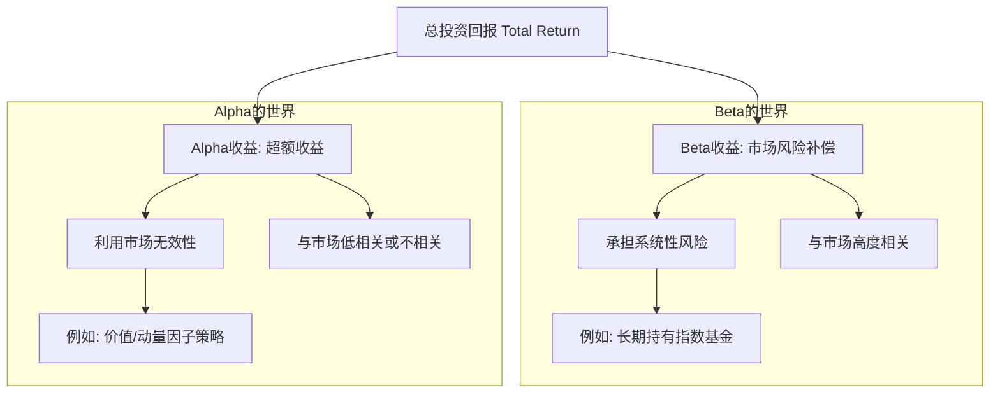

### 1.1 根本问题：投资回报的来源是什么？

在踏上量化投资的征途之前，我们必须首先回答这个根本问题。市场上每天都有成千上万的交易者，有人盆满钵满，有人黯然离场。这背后仅仅是运气使然吗？或者，市场中存在着某些可以被理解和利用的根本规律，使得一部分人能够系统性地获得回报？

答案是后者。从最顶层的视角来看，所有投资回报的来源都可以被分解为两个核心基石：**Beta (β) 收益** 和 **Alpha (α) 收益**。

理解这两个概念，是建立整个量化投资世界观的第一块基石。我们可以用一个简单的比喻来理解它们：

*   **Beta (β)**：如同水涨船高。你把船（资金）放入大海（市场），随着潮汐（经济增长）的涨落，你的船也会自然地随之起伏。这是你**承担了整个市场系统性风险**而获得的基础补偿。
*   **Alpha (α)**：则是你拥有更快的船或更好的航海技术。在同一片大海里，无论潮汐如何，你总能比别人跑得更快、更远。这是你**利用市场某些无效性**，通过自己的智慧和策略，跑赢市场平均水平而获得的超额收益。

接下来，我们将深入剖析这两个回报的来源。

---

#### 1.1.1 Beta (β)：承担系统性风险的补偿

Beta 收益，通常被称为“市场风险溢价”（Market Risk Premium），是投资者因承担了无法通过分散投资来消除的风险（即“系统性风险”）而应得的补偿。

什么是系统性风险？想象一下，无论你买了多少只不同的股票，如果宏观经济发生衰退、全球爆发金融危机或央行大幅加息，绝大多数股票都可能同时下跌。这种波及整个市场的、“躲不掉”的风险就是系统性风险。

**核心观点**：长期来看，资本市场会奖励那些愿意承担这种不确定性、为经济发展提供资本的投资者。

**一个典型的 Beta 投资策略：**
最纯粹的 Beta 投资就是购买并持有一个广泛的市场指数基金，例如跟踪标普500指数的基金（SPY）或跟踪沪深300指数的基金。

*   **操作**：你不需要做任何复杂的分析或择时，只需买入并持有。
*   **收益来源**：你的收益将紧密跟随市场的整体表现。如果整体经济向好，企业盈利增长，市场上涨，你就会获得正回报。反之，你也将承担市场下跌的损失。
*   **本质**：你赚的不是“比别人更聪明”的钱，而是“有勇气、有耐心参与市场”的钱。

量化投资并不排斥 Beta，事实上，许多量化策略（如风险平价、Smart Beta）正是围绕如何更聪明、更高效地获取 Beta 收益来构建的。

#### 1.1.2 Alpha (α)：利用市场无效性的获利

如果说 Beta 是市场给所有参与者的“保底”奖励，那么 Alpha 就是高手过招的“竞技场”。Alpha 收益来源于市场的“无效性”或“非理性”。

经典的金融理论——有效市场假说（Efficient Market Hypothesis）认为，在任何时间点，资产价格已经完全反映了所有已知信息。如果市场是完全有效的，那么任何人都不可能持续地跑赢市场，也就是说，Alpha 将为零。

然而，现实世界并非如此完美。市场的无效性主要源于：

1.  **行为偏差（Behavioral Biases）**：投资者是人，会恐惧、会贪婪、会过度自信、会反应迟钝。这些集体性的非理性行为会导致资产价格偏离其内在价值。
2.  **结构性限制（Structural Impediments）**：大型基金的交易规则限制、信息传播的不对称性、交易成本等因素，也会造成某些套利机会。
3.  **信息优势（Informational Advantages）**：通过更深刻的研究、更强大的数据处理能力，发掘出尚未被市场充分定价的信息。

**核心观点**：Alpha 是通过构建一个与市场（Beta）无关的策略，利用上述市场无效性来捕获的超额收益。

**案例研究：经典的价值投资策略**

*   **市场无效性**：投资者往往对发布了坏消息的公司过度悲观（行为偏差），导致其股价跌破了其实际内在价值。
*   **Alpha 策略**：
    1.  **筛选**：通过量化模型，系统性地在全市场扫描那些市盈率（P/E）低、市净率（P/B）低，但现金流依然稳健的公司。
    2.  **构建投资组合**：买入一揽子被低估的“价值股”，同时可能做空一揽子被高估的“成长股”（市场中性策略）。
    3.  **获利**：当市场情绪回归理性，这些价值股的价格向其内在价值修复时，该策略就能获得与市场涨跌（Beta）关联度很低的正收益。这份收益就是 Alpha。

量化投资的绝大部分精力，都投入在如何系统性、纪律性地发掘并利用这些形形色色的市场无效性，以创造稳定的 Alpha。

#### 1.1.3 投资回报的分解

现在，我们可以将任何一项投资的最终回报（Total Return）进行一个清晰的分解。这个思想是现代投资组合理论的核心。

用一个简化的公式来直观理解这个分解。任何投资的总回报，可以近似看作由三个部分构成：

*   **无风险收益 (Risk-Free Rate)**：如国债利率，是资金的时间价值。它是进行任何投资都应获得的最基础回报。
*   **Beta收益**：即我们前面讨论的，承担市场风险带来的回报。
*   **Alpha收益**：即我们前面讨论的，依赖于策略优越性的超额回报。

将它们组合起来，就是：

**总回报 ≈ 无风险收益 + Beta收益 + Alpha收益**

在量化投资中，评估一个策略的优劣，关键不仅仅是看它赚了多少钱，而是要看它的回报中有多少是真正的 Alpha。如果一个策略号称年化20%，但其中18%都来自于当年牛市的 Beta，那么它本质上只是一个跟随市场的策略，并没有体现出过人的“超额”能力。

---

### **本节总结**

这一节，我们建立了量化投资最根本的世界观：投资回报并非混沌的随机结果，而是可以被清晰解构的。

*   **两大基石**：任何投资回报都可以分解为 **Beta** 和 **Alpha**。
*   **Beta (β)**：是对**承担系统性风险**的补偿。它是被动的、源于市场的、水涨船高的收益。
*   **Alpha (α)**：是**利用市场无效性**所获得的超额收益。它是主动的、源于策略的、跑赢对手的收益。
*   **量化投资的目标**：量化投资的核心任务之一，就是运用科学和工程的方法，清晰地分离 Alpha 和 Beta，并致力于创造稳定、可持续的 Alpha，或更高效地获取 Beta。

理解了这个框架，你就拥有了一张“地图”，可以清晰地知道后续我们将要学习的各种量化模型和策略，分别是在这个世界的哪个角落进行探索。