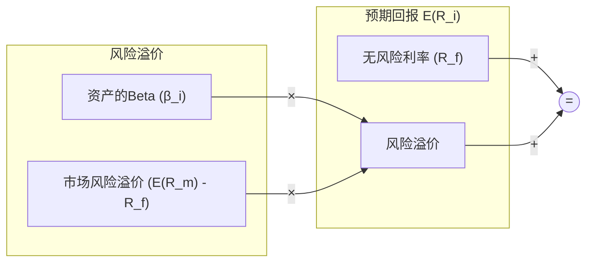

好的，这是紧接上一节内容的续写：

***

### 1.2 市场的“引力”：资本资产定价模型 (CAPM) 与 Beta

在上一节中，我们从宏观视角将投资回报拆解为 Beta 和 Alpha。我们知道了 Beta 来自于承担市场的系统性风险。但这引出了一个更具体、更量化的问题：**承担多少风险，就应该获得多少回报？**

如果说股票A的风险是股票B的两倍，那么A的“公允”回报率是否也应该是B的两倍呢？这种关系是线性的吗？为了精确回答这个问题，我们需要一个数学模型来描述风险与回报之间的关系。

这便是金融史上第一个，也是最重要的资产定价模型——**资本资产定价模型（Capital Asset Pricing Model, CAPM）**——登场的时刻。CAPM 的核心思想极为优美和直观：**任何一项资产的预期回报，都应该由两部分组成：无风险的回报，以及对其所承担的系统性风险的补偿。**

---

#### 1.2.1 CAPM：为风险定价

CAPM 提供了一个简洁的公式，来计算一项资产 *i* 的“公允”或预期回报率 `E(R_i)`：

将其写成数学公式：

**E(Ri) = Rf + βi * (E(Rm) - Rf)**

让我们来逐一拆解这个公式的组成部分：

*   **E(Ri)**：资产 *i* 的预期回报率 (Expected Return)。这是我们试图计算的目标——在给定的风险水平下，我们应该期望获得多少回报。
*   **Rf**：无风险利率 (Risk-Free Rate)。这可以理解为投资的“基础回报”，是你将资金投入一个绝对安全的资产（如短期国债）所能获得的回报。它是对资金的时间价值以及你放弃资金流动性、让渡资金使用权的基本补偿。
*   **E(Rm)**：市场的预期回报率 (Expected Market Return)。代表整个市场的平均回报水平，例如沪深300指数或标普500指数的长期年化回报率。
*   **(E(Rm) - Rf)**：市场风险溢价 (Market Risk Premium)。这是整个市场为了补偿投资者承担系统性风险而提供的“额外奖励”。它回答了：“平均而言，参与股市比存银行能多赚多少？”
*   **βi**：资产 *i* 的 Beta 值。这是整个模型的核心变量，也是我们本节的焦点。

---

#### 1.2.2 Beta 的物理学类比：响应质量与引力

在1.1节中，我们将 Beta 比作“水涨船高”。现在，让我们用一个更深刻的物理学类比来理解它：**如果说整个市场是一个巨大的引力场（比如太阳），那么 Beta 就像是单个资产（行星）对该引力场的“响应质量”或敏感度。**

这个“响应质量”决定了该资产在多大程度上被市场整体的“引力”所牵引和影响。

*   **β = 1：标准质量**
    *   **物理类比**：一个与地球质量完全相同的行星。
    *   **金融含义**：该资产的系统性风险与市场整体风险水平一致。如果市场上涨10%，它也倾向于上涨10%；市场下跌5%，它也倾向于下跌5%。最典型的例子就是市场指数基金（如 SPY）。
    *   它的预期回报就等于市场的平均回报。

*   **β > 1：大质量**
    *   **物理类比**：一个比地球质量大得多的行星，如木星。它对太阳引力的反应更“剧烈”。
    *   **金融含义**：该资产的波动性大于市场，具有“进攻性”。例如，一只 β 值为1.5 的高科技股，当市场上涨10%时，它可能上涨15%；而当市场下跌10%时，它也可能下跌15%。这类资产通常是周期性强的行业，如科技、券商、可选消费等。
    *   因为它放大了市场的波动（承担了更大的系统性风险），CAPM 认为它理应获得比市场平均水平更高的预期回报。

*   **0 < β < 1：小质量**
    *   **物理类比**：一个小行星或月球，质量远小于地球。它虽然也受引力影响，但轨道相对更“稳定”。
    *   **金融含义**：该资产的波动性小于市场，具有“防御性”。例如，一只 β 值为0.6 的公用事业股，当市场上涨10%时，它可能只上涨6%。在市场下跌时，它的跌幅通常也更小。这类资产多为生活必需品行业，如电力、水务、基础消费品。
    *   因为它减弱了市场的波动（承担了更小的系统性风险），它的预期回报也理应低于市场平均水平。

*   **β = 0：零质量**
    *   **物理类比**：一艘不受引力影响的宇宙飞船。
    *   **金融含义**：该资产的回报与市场波动完全无关。理论上，这就是无风险资产（如国债）。

*   **β < 0：负质量（反物质）**
    *   **物理类比**：一个拥有“反引力”的奇异物质。
    *   **金融含义**：该资产的走势与市场呈负相关。市场上涨时它下跌，市场下跌时它上涨。典型的例子是某些做空市场的ETF或恐慌指数VIX。这类资产在投资组合中常被用作对冲工具。

#### 1.2.3 案例比较：不同Beta下的“公允”回报

让我们通过一个具体的计算案例，来感受 Beta 是如何为风险定价的。

假设当前市场环境如下：
*   无风险利率 (Rf) = 3%
*   市场预期回报率 (E(Rm)) = 10%
*   因此，市场风险溢价 = 10% - 3% = 7%

现在，我们有三家不同类型的公司：

| 公司名称 | 业务类型 | Beta (β) | 计算“公允”预期回报 E(Ri) | 结论 |
| :--- | :--- | :--- | :--- | :--- |
| **未来科技 (TechFuture)** | 高增长人工智能初创公司 | 1.8 | 3% + 1.8 * (10% - 3%) = **15.6%** | 投资者需获得远高于市场的回报，才能补偿其承担的巨大波动风险。 |
| **稳定电力 (StablePower)** | 区域性电力供应商 | 0.5 | 3% + 0.5 * (10% - 3%) = **6.5%** | 由于业务稳定、风险低，投资者对其回报的期望也相对较低。 |
| **大盘指数基金 (MarketETF)** | 跟踪沪深300指数 | 1.0 | 3% + 1.0 * (10% - 3%) = **10.0%** | 其风险与市场一致，因此其预期回报也与市场一致。 |

这个表格清晰地展示了 CAPM 的核心逻辑：**没有无缘无故的高回报，所有“公允”的回报都源于对所承担的、以 Beta 度量的系统性风险的补偿。**

---

### **本节总结**

这一节，我们将上一节对 Beta 的定性理解，升级为了一个定量的定价框架。

*   **核心模型**：资本资产定价模型 (CAPM) 是描述风险与“公允”回报之间关系的基石。它告诉我们一项资产应该值多少回报。
*   **核心概念：Beta (β)**：Beta 不再仅仅是“水涨船高”，它是一个精确的数值，衡量资产相对于市场波动的敏感度，如同物理学中对引力场的“响应质量”。
*   **风险定价**：CAPM 的公式 `E(R_i) = R_f + β_i * (E(R_m) - R_f)` 明确指出，预期回报由无风险利率和经过 Beta 调整后的市场风险溢价共同决定。
*   **Beta 的意义**：越高的 Beta 意味着越大的系统性风险敞口，因此市场会要求越高的预期回报作为补偿。

理解了 CAPM 和 Beta，我们就掌握了衡量和定价“市场风险”这把尺子。更重要的是，这也为我们下一步精确定义和寻找 Alpha 提供了基准：**真正的 Alpha，就是你实际获得的回报中，超越了由 CAPM 所计算出的“公允”回报的那一部分。**