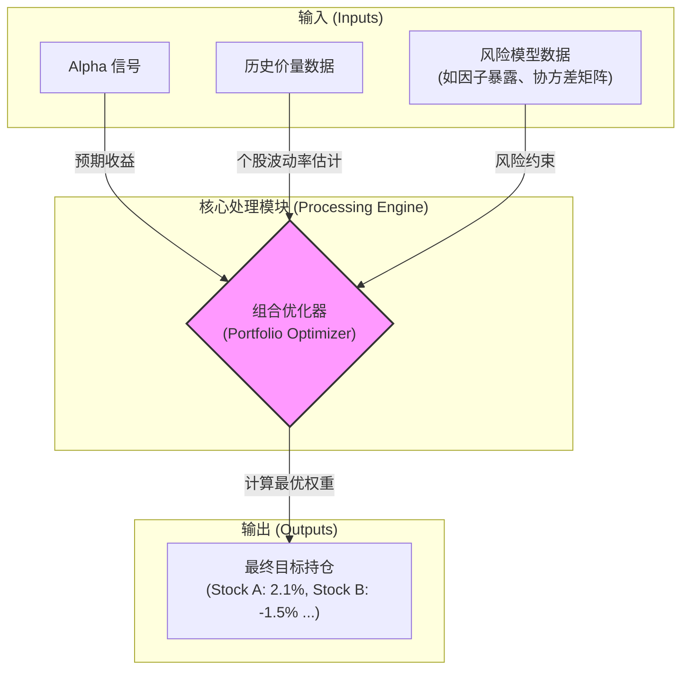

在上一节，我们通过严谨的回测，筛选出了一批在历史数据中表现优异、经受住了重重考验的 Alpha 信号。回测报告上那条漂亮的净值曲线，似乎在宣告我们已经找到了通往稳定盈利的康庄大道。

然而，这往往是新手量化研究员最容易产生误解的地方。一份优秀的回测报告，仅仅证明了我们的**预测能力**——我们的信号确实能在统计上区分未来可能上涨和下跌的股票。但这与**实现盈利**之间，还隔着一道至关重要、却常常被忽视的鸿沟。

这道鸿沟就是：**如何将预测信号转化为实际的、可交易的投资组合？**

一个好的信号告诉你“哪些股票值得买”，但它并没有回答一系列决定成败的关键问题：
*   **买多少？**（How much to bet?）
*   **持有多少只股票？**（How diversified?）
*   **如何控制整个组合的风险？**（How to manage risk?）

回答这些问题的过程，就是我们量化流程的第四步：**组合构建 (Portfolio Construction) 与风险管理 (Risk Management)**。

### 2.4.1 从“打分”到“下注”：头寸规模的重要性 (Bet Sizing)

我们的 Alpha 信号，本质上是在给股票池里的每一只股票“打分”。分数高的，是我们看好的；分数低的，是我们看空的。最简单、最朴素的交易方式，可能是“等权重”买入得分最高的那一部分股票。

但这真的是最优解吗？请看下面的对比：

| 股票 | Alpha 信号分 | 股票特性 | 等权重配置 | 存在的问题 |
| :--- | :--- | :--- | :--- | :--- |
| **A 公司** | 95 | 一只高波动的小盘科技股 | 10% | 这10%的资金可能会在一天内产生5%的剧烈波动。 |
| **B 公司** | 92 | 一只低波动的蓝筹银行股 | 10% | 这10%的资金可能波动非常平缓，对组合贡献有限。 |

显然，虽然两只股票的信号分都很高，但它们的风险属性截然不同。给予它们相同的权重，意味着我们**在风险上**对高波动的 A 公司下了重注。我们的投资组合，其最终的风险和收益，将不成比例地被少数几只高风险股票所主导。

这就引出了组合构建中的核心概念——**头寸规模（Position Sizing）**，也常被称为“赌注大小”（Bet Sizing）。它指的是如何为每一个交易决策分配恰当的资金比例。一个理性的量化系统，其分配资金的依据，绝不仅仅是信号的强弱。

**常见的头寸规模管理方法：**

*   **信号强度加权 (Signal-Weighted)**：
    *   **逻辑**：信号越强，信心越足，分配的头寸也越大。
    *   **优点**：直观，最大化地利用了 Alpha 信号的信息。
    *   **缺点**：完全忽略了风险，可能在最强的信号上过度集中，而这个信号对应的股票可能是高风险的。

*   **风险平价加权 (Risk-Parity / Inverse-Volatility Weighted)**：
    *   **逻辑**：给每只股票分配相同的“风险预算”。高风险（高波动率）的股票分配较小的头寸，低风险（低波动率）的股票分配较大的头寸，使得每只股票对组合总风险的贡献度趋于一致。
    *   **优点**：能有效控制组合的整体波动，避免被少数高风险股票绑架。
    *   **缺点**：可能忽略了信号的强度，给一些信号一般但波动率极低的股票分配了过大的权重。

*   **综合优化方法 (Combined Optimization)**：
    *   **逻辑**：这是专业机构更常用的方法，目标是在最大化预期收益（由 Alpha 信号驱动）的同时，将组合的风险（如波动率、回撤）控制在某个阈值之下。
    *   **公式思想**：`头寸权重 ∝ (Alpha 信号强度 / 预期风险)`
        *这里的“预期风险”通常指该股票对**组合总风险的边际贡献**（Marginal Risk Contribution），而非其自身的独立波动率。*
    *   **实现**：通常通过数学规划求解器（Optimizer）来找到满足一系列约束条件（如下文提到的风险约束）下的最优权重解。

### 2.4.2 不仅仅是 Alpha：管理看不见的风险

即便我们为每只股票设定了合理的头寸，一个看似分散的投资组合，也可能潜藏着巨大的、同质化的风险。风险管理的目标，就是识别并主动控制这些可能摧毁整个策略的“隐形杀手”。

下面是量化投资中必须严格管理的几类核心风险：

#### 1. 风格因子风险 (Style Factor Risk)

你的 Alpha 信号可能并非“纯粹”的。它可能在不经意间，与市场上某些广为人知的**风险因子（或称风格因子）**产生了高度的相关性。

*   **案例**：你开发了一个基于“研发投入占比”的选股因子。回测表现优异。但你可能没有意识到，高研发投入的公司大多是科技股，也大多是“成长股”（高市盈率、高增长预期）。你的策略看似在赚“研发”的钱，实际上可能只是在市场“成长风格”占优的年份里随波逐流。
*   **风险**：一旦市场风格切换，例如进入“价值风格”主导的阶段，你的策略可能会经历与你的 Alpha 逻辑无关的、剧烈且持久的回撤。
*   **管理方法**：**因子中性化 (Factor Neutralization)**。在构建组合时，通过优化算法，主动约束组合在某些不想要的风险因子上的敞口为零（或一个很小的范围）。例如，你可以要求最终的投资组合，在“市值因子”、“价值因子”、“动量因子”上的整体暴露为中性。这样，你的策略收益就更能归因于你独创的 Alpha，而非市场的“贝塔”或“风格贝塔”。

#### 2. 行业与个股集中度风险 (Sector & Stock Concentration Risk)

*   **风险**：一个纯粹由信号驱动的组合，可能会在某个阶段过度集中于某个行业或少数几只股票。例如，当某个行业（如2021年的新能源）景气度极高时，你的各类 Alpha 信号可能都会指向该行业的股票。
*   **后果**：一旦该行业出现“黑天鹅”事件或政策转向，整个投资组合将遭受重创。
*   **管理方法**：在组合构建中加入**硬性约束 (Hard Constraints)**。
    *   **个股层面**：任何单只股票的权重不得超过 `X%`（例如 5%）。
    *   **行业层面**：任何单个行业的总权重不得超过 `Y%`（例如 20%），或者相对于基准指数的超配/低配比例不得超过 `Z%`。

### 2.4.3 流程图：从信号到最终持仓的全景

我们可以用一个流程图来清晰地展示这一转化过程。

这个流程清晰地展示了，最终的持仓决策 (`F`) 并非由 Alpha 信号 (`A`) 单独决定，而是由一个综合了**预期收益、预期风险**和**一系列风险约束**的优化器 (`D`) 计算得出的复杂结果。

---

### 常见误区：将回测净值与实盘表现划等号

许多初学者会直接将 Alpha 因子按照信号强度排序，然后等权重构建组合进行回测。这种方法被称为**“因子回测”或“信号回测”**。

*   **因子回测的目的**：快速、纯粹地检验 Alpha 信号本身的有效性。
*   **组合回测的目的**：模拟一个**真正可投资的、考虑了各种现实约束和成本的**策略的最终表现。

一份漂亮的因子回测报告，是策略成功的必要非充分条件。只有当这个信号被纳入一个考虑了交易成本、头寸管理和严格风险控制的**组合回测**框架后，其结果才更接近于实盘的真实预期。

***

### 本节要点

*   **信号不等于持仓**：一个有效的 Alpha 信号是必要起点，但要将预测转化为盈利，必须通过组合构建回答“买多少”，并通过风险管理解决“如何规避风险”。
*   **头寸规模是关键**：合理的头寸规模管理（Bet Sizing）是平衡收益与风险的核心。简单地等权重分配，往往会带来意想不到的风险集中。
*   **风险管理是生命线**：主动管理和约束组合在风格因子、行业和个股上的集中度，是确保策略长期稳健运行的保障。这个过程通常通过**因子中性化**和**设置硬性约束**来实现。
*   **从信号到持仓是一个优化过程**：最终的投资组合，是一个在多重约束下，寻求风险调整后收益最大化的优化结果。

至此，一个量化策略已经完成了从创意构思、数据处理、回测验证到组合构建的完整“实验室”研发流程。它已经准备好面对真实世界的考验了。下一步，我们将探讨策略生命周期中的最后，也是与真实市场交互最紧密的环节：**执行与交易**。