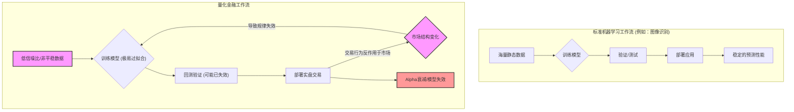

### 3.3 现代视角：机器学习的角色与挑战

在我们已经探讨了基于经典统计学和经济学理论的量化策略后，一个自然而然的问题浮现在我们眼前：在人工智能浪潮席卷各行各业的今天，更为强大的机器学习（Machine Learning, ML）模型，能否成为量化投资的“终极答案”？

本节课的目标，正是要澄清机器学习在量化投资中的真实定位，并剖析为何将其他领域的成功经验直接“复制粘贴”到金融市场，往往会遭遇惨痛的失败。

#### 一、机器学习：量化投资的“新式武器”？

传统的量化模型，如线性回归，通常擅长捕捉变量之间的**线性关系**。例如，我们可能会假设一家公司的市盈率（P/E）与其未来的股票回报呈线性负相关。然而，真实的市场远比这复杂。各种金融变量之间的关系往往是**非线性的、动态变化的，并且充满了复杂的交互效应**。这些复杂的、非线性规律正是传统方法难以捕捉的，而机器学习模型在此领域表现出强大潜力。

机器学习，尤其是深度学习等复杂模型，其核心优势在于：

*   **强大的非线性建模能力**：它能从高维度数据中自动学习和发现复杂的、非线性的模式，而无需我们预先设定一个固定的数学公式。
*   **特征交互的自动捕捉**：一个因子在不同市场环境下（如高波动 vs. 低波动）的作用可能截然相反。机器学习模型能够捕捉到这种“如果A发生，那么B因子才有效”的条件性关系。
*   **处理另类数据的潜力**：无论是社交媒体的文本情绪、卫星图像中的港口货物吞吐量，还是供应链的关联图谱，机器学习都为我们从这些非结构化数据中提取alpha信号提供了可能。

因此，我们应该将机器学习视为一个**极其强大的非线性模式发现工具**，它能够帮助我们在传统模型难以企及的复杂数据空间中寻找潜在的投资信号。它不是一个能预测未来的“水晶球”，而更像是一台“超级显微镜”，让我们能观察到市场的微观结构和隐藏规律。

#### 二、金融数据的“阿喀琉斯之踵”：为何直接套用会失败？

许多初学者会犯一个致命的错误：他们将在图像识别、自然语言处理等领域大获成功的模型（如深度神经网络、梯度提升树）直接应用于金融时间序列预测，并期望获得同样惊艳的效果。结果往往是，模型在历史数据上回测表现完美，一旦投入实盘，便亏损得一塌糊涂。

> **⚠️ 常见错误警告**
>
> **误区**：认为金融预测问题与其他机器学习问题（如猫狗图片分类）本质上是一样的，即寻找一个从输入（特征）到输出（标签）的稳定映射关系。
>
> **真相**：金融数据具有三大特殊属性，彻底颠覆了传统机器学习的诸多基础假设，导致了“回测靓丽，实盘垂泪”的现象。

这三大特殊属性是：

1.  **极低的信噪比（Low Signal-to-Noise Ratio）**
    金融市场的价格波动，绝大部分是随机的、无意义的“噪音”，而真正能够预测未来方向的“信号”则极其微弱。强大的机器学习模型很容易在训练中“用力过猛”，将噪音当成信号来学习，从而导致严重的**过拟合（Overfitting）**。它完美地解释了历史数据中的每一个随机扰动，却失去了对未来的泛化能力。

2.  **非平稳性（Non-Stationarity）**
    这是最核心的挑战。传统机器学习任务大多假设数据是**独立同分布（i.i.d.）**的，即数据的统计特性（如均值、方差）不随时间改变。但在金融市场，规则本身在不断变化。驱动市场的经济周期、监管政策、技术革新、投资者行为模式都在演变。一个在2010-2020年有效的模式，可能因为算法交易的普及而在2021年之后完全失效。模型学到的规律，其“保质期”是有限的。

3.  **反身性与策略拥挤（Reflexivity & Crowding）**
    金融市场不是一个被动观测的自然系统。当一个预测模型被大规模应用时，基于该模型产生的交易行为本身就会反过来影响市场价格，从而可能使最初发现的规律“自我摧毁”。这就像一个天气预报说某地明天会下雨，大家纷纷带伞，但这并不会影响天是否真的下雨。但在市场中，如果一个模型预测某股票会上涨，大量买入行为会立刻推高股价，提前兑现甚至过度消耗未来的涨幅，导致模型失效。

为了更直观地理解这一点，我们可以对比一下标准机器学习流程与量化金融应用的差异。

如上图所示，量化金融工作流中存在一个致命的反馈循环：交易行为本身会改变市场，进而使模型赖以生存的规律失效。

#### 三、正确的姿态：如何驾驭机器学习这匹“烈马”？

既然直接套用行不通，我们是否应该放弃机器学习？当然不。正确的做法是，像一位经验丰富的骑手一样，用金融领域的专业知识和特有技术来驾驭这匹“烈马”。

1.  **从数据到特征，而非从数据到模型**：将重心放在**特征工程（Feature Engineering）**上。基于你对市场的理解，创造出信噪比更高、更稳健的输入特征，而不是把原始的价格、成交量数据直接扔给模型。好的特征远比复杂的模型重要。

2.  **拥抱经济学直觉**：不要完全相信一个“黑箱”模型给出的结果。对于模型发现的每一个模式，都应反思其背后是否有合理的经济或行为金融学解释。这能帮助你区分是真实的规律还是数据挖掘的巧合。

3.  **采用更严格的回测与验证方法**：必须使用为金融时间序列量身定制的验证技术，例如**前向展开交叉验证（Walk-Forward Cross-Validation）**、**组合交叉验证（Combinatorial Cross-Validation）**，并严格控制回测中的各种偏差（如前视偏差、幸存者偏差）。与标准机器学习任务中常用的随机K折交叉验证不同，金融时间序列的验证必须严格遵循时间顺序，以防止未来信息泄露（Data Leakage）并评估模型在未见证市场条件下的泛化能力。

4.  **追求模型的简洁性（奥卡姆剃刀）**：在多个模型表现相近时，永远选择最简单、最容易解释的那一个。复杂的模型虽然回测分数可能略高，但过拟合的风险也呈指数级增长。

5.  **关注风险管理与组合构建**：即使你拥有一个不错的信号，也不应将其视为全部。机器学习应作为信号生成的一环，最终还需要将其整合到严格的风险管理和组合优化框架中。

#### 四、要点回顾

本节课，我们明确了机器学习在现代量化投资中的定位，并深入探讨了其面临的独特挑战。

*   **角色定位**：机器学习是一个强大的**非线性模式发现工具**，用于处理复杂数据和挖掘传统模型无法捕捉的信号，但它不是万能的水晶球。
*   **核心挑战**：金融数据具有**低信噪比**、**非平稳性**和**市场反身性**三大特性，这使得直接套用标准机器学习方法极易导致过拟合和实盘失败。
*   **正确路径**：成功的关键在于将机器学习技术与深厚的金融领域知识相结合，重视**特征工程**、**经济学逻辑**、**严格的验证方法**和**风险控制**。

掌握了这些，你才能真正将机器学习从一个潜在的“陷阱”转变为你策略武库中的一把“利器”。