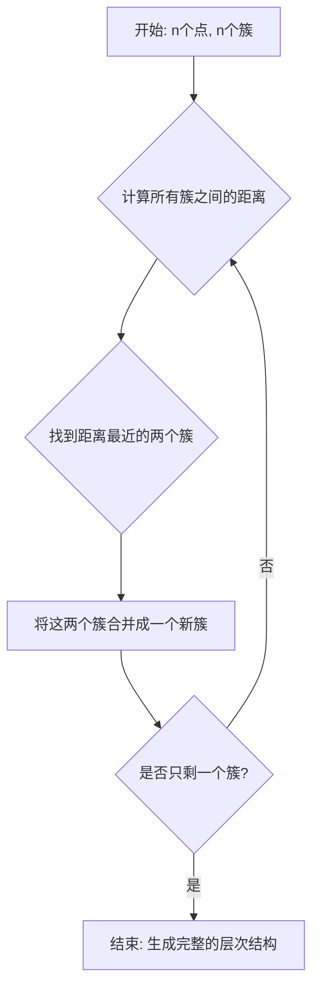

好的，作为一位致力于启发与教育的作家，我将为您呈现这一章节的内容。我们将一同探索层次聚类的精妙之处，从数据的个体出发，见证它们如何凝聚成一个庞大的家族，并学会解读这个家族的“族谱”。

---

### 2.3 工具二 (层次式)：凝聚与分裂的艺术

在上一节中，我们探讨了像K-Means这样的“划分式”聚类方法，它们如同一个果断的组织者，在开始工作前就必须决定要将数据分成几个小组（K值）。这种方法高效、直观，但在许多现实场景中，我们面临一个更根本的问题：我们并不知道数据中到底隐藏着多少个自然的群体。更进一步，我们可能不仅想知道“谁和谁属于一组”，更想了解“这些组之间是如何相互关联的”。

这就引出了我们今天要探讨的第二大类聚类工具——**层次聚类 (Hierarchical Clustering)**。想象一下，你不是在给一群人分配座位，而是在为他们绘制一幅详尽的家族谱系图。你不会一开始就说：“这里有五个大家族。”相反，你会从最亲近的血缘关系开始——兄弟姐妹、父母子女——然后逐渐向上追溯，将小家庭合并为更大的宗族，最终汇合成一个共同的祖先。层次聚类正是采用了这种思想，它不提供一个单一的聚类答案，而是揭示了数据在所有尺度下的完整层次结构。

这种方法主要分为两种路径：
1.  **凝聚式 (Agglomerative)**：自底向上 (Bottom-up)。从每个数据点都是一个独立的簇开始，一步步合并最相似的簇。这是我们今天将要深入探讨的主角。
2.  **分裂式 (Divisive)**：自顶向下 (Top-down)。从所有数据点都在一个巨大的簇开始，一步步分裂最不相似的部分。

让我们从凝聚式的艺术开始，踏上这场从个体到家族的凝聚之旅。

#### **核心工作原理** - 从个体到家族的凝聚之旅

凝聚式层次聚类（Agglomerative Clustering）的算法流程优美而直观，它完美地模拟了社会或生物群体的形成过程。

**问题背景：** K-Means等方法需要预先设定簇的数量`k`，这在探索性分析中往往是一个难题。如果`k`设定错误，可能会完全扭曲我们对数据结构的认知。此外，这些方法给出的“扁平”聚类结果，无法展示簇与簇之间的亲疏远近关系。例如，狮子和老虎可能被分在“猫科动物”这个簇，狗和狼在“犬科动物”这个簇，但一个扁平的聚类结果无法告诉我们，“猫科动物”这个簇和“犬科动物”这个簇在更高的层面上都属于“食肉目”。

**解决方案：** 凝聚式聚类通过一个迭代合并的过程，构建了一个可以回答上述问题的树状结构。其核心步骤如下：

1.  **初始化 (Initialization)**：将每一个数据点都视为一个独立的簇。如果有 `n` 个数据点，那么我们就有 `n` 个簇。
2.  **迭代合并 (Iterative Merging)**：
    a. 在所有现存的簇中，计算两两之间的“距离”或“不相似度”。
    b. 找到距离最近（最相似）的两个簇。
    c. 将这两个簇合并成一个新的簇。
3.  **循环 (Loop)**：重复步骤2，直到所有的点都被合并到唯一一个簇中。

这个过程就像一场持续不断的联姻与合并。最初，每个人都是独立的个体；接着，最情投意合的两人组成了一个小家庭；然后，关系最紧密的两个家庭通过联姻或其他方式联合起来，形成一个更大的家族……这个过程不断持续，直到所有人都归属于一个最终的、共同的“人类”大家族。

我们可以用一个流程图来清晰地展示这个过程：

这个算法的优雅之处在于，它没有强迫我们在任何一步做出最终决定。相反，它记录了每一次合并的历史——谁和谁合并了，以及他们在什么“相似度”水平上合并的。这份完整的合并记录，就是我们接下来要探讨的核心产出——树状图。

#### **关键技术组件** - 定义“亲近”的四种视角

你可能已经注意到了一个关键问题：在上面的第二步中，我们说要“计算所有簇之间的距离”。当一个簇里只有一个点时，这很简单。但当一个簇包含了多个点时，我们如何定义两个簇之间的距离呢？这就像在问：“‘张家’和‘李家’这两个家族，哪个和‘王家’更亲近？” 答案取决于你如何定义“亲近”。

这个问题引出了层次聚类的核心技术组件——**链接标准 (Linkage Criteria)**。不同的链接标准，如同戴上了不同视角的眼镜，会让我们看到不同的簇结构，并最终影响聚类的结果。以下是四种最主要的链接标准：

##### 1. 单链接 (Single Linkage) - 乐观的社交家

*   **定义**：两个簇之间的距离，由各自簇中**距离最近**的两个点之间的距离来决定。
*   **类比**：这就像一个“最弱关系”原则。只要A家族里的任何一个人和B家族里的任何一个人是好朋友，我们就认为这两个家族关系很近。它是一种非常乐观的连接方式，寻找的是簇之间最微弱的联系。
*   **影响**：这种方法善于发现和连接非椭球状、细长延伸的簇。但它的缺点也同样明显：对噪声和异常值极其敏感。一个“社交达人”般的噪声点，就可能像一座桥梁一样，错误地将两个本应相距遥远的簇连接在一起，形成所谓的“链式效应”(Chaining Effect)。

##### 2. 全链接 (Complete Linkage) - 谨慎的保守派

*   **定义**：两个簇之间的距离，由各自簇中**距离最远**的两个点之间的距离来决定。
*   **类比**：这是一种“最强关系”原则。只有当A家族里最不爱社交的成员，和B家族里最孤僻的成员，彼此之间都还算得上“近邻”时，我们才认为这两个家族关系紧密。这是一种非常严格和保守的策略。
*   **影响**：全链接倾向于生成结构紧凑、近似球形的簇。它对噪声不那么敏感，因为单个异常点之间的远距离不会轻易满足合并条件。但它的问题在于，如果一个大的、自然的簇内部本身比较分散，它可能会被错误地“打断”。

##### 3. 平均链接 (Average Linkage) - 公正的仲裁者

*   **定义**：两个簇之间的距离，是两个簇中所有数据点两两配对距离的**平均值**。
*   **类比**：这就像是对两个家族进行全面的民意调查。我们计算张家每个人到李家每个人的“关系距离”的平均分，用这个平均分来代表两个家族的整体亲近度。它考虑了所有成员的意见，力求公平。
*   **影响**：平均链接是单链接和全链接之间的一种折中。它不像单链接那样容易受到异常值的影响，也不像全链接那样极端保守。因此，它通常能产生比较合理、鲁棒性较好的聚类结果。

##### 4. Ward's Method - 追求内部和谐的团队建设者

*   **定义**：Ward方法不再直接使用点之间的距离，而是基于一个更复杂的概念：方差。它会尝试合并这样一对簇：这次合并所导致的**簇内总方差增加量最小**。
*   **类比**：想象你是一位公司经理，正在进行团队重组。你的目标不是简单地把“看起来相似”的人放在一起，而是要组建一个新团队，使得这个新团队的“内部矛盾”（即方差）尽可能小。Ward方法在每一步都做出最优的“团队建设”决策，确保每一次合并都是为了最大化新簇的“凝聚力”。
*   **影响**：Ward方法是目前最流行和最常用的链接标准之一。它倾向于产生大小相对均匀、呈球形的紧凑簇。在许多应用中，它的表现都非常出色，因为它直接优化了聚类的目标之一——最小化簇内差异。

**对比总结**

为了更直观地理解它们的差异，我们可以用一个表格来总结：

| 链接标准 | 核心思想 (如何定义簇间距离) | 生活类比 | 倾向产生的簇形状 | 优点/缺点 |
| :--- | :--- | :--- | :--- | :--- |
| **单链接 (Single)** | 两簇中**最近**两点间的距离 | 乐观的社交家 (Friend of a friend) | 细长、链状、不规则形状 | 对非球形数据友好；对噪声敏感 |
| **全链接 (Complete)** | 两簇中**最远**两点间的距离 | 谨慎的保守派 (All members must be close) | 紧凑、球形 | 对噪声鲁棒；可能切断大簇 |
| **平均链接 (Average)** | 两簇间所有点对距离的**平均值** | 公正的仲裁者 (Average social distance) | 介于单链接和全链接之间 | 表现均衡，鲁棒性好 |
| **Ward's Method** | 使合并后簇内**总方差增加最小** | 团队建设者 (Minimize internal conflict) | 大小均匀的紧凑球形簇 | 效果通常很好，是常用默认选项 |

选择哪种链接标准，并没有一个放之四海而皆准的答案，它取决于你的数据特性和你对“簇”的定义。理解这些标准背后的逻辑，是有效运用层次聚类的关键。

#### **核心产出：树状图 (Dendrogram)** - 解读数据家族的族谱

凝聚式聚类的整个过程，都被记录在一张被称为**树状图 (Dendrogram)** 的图表中。这张图就是我们之前提到的“数据家族的族谱”，是层次聚类的精髓所在。

**如何解读树状图？**

1.  **叶子节点 (Leaves)**：图的最底端是每个独立的数据点，它们是这个家族的最初个体。
2.  **树枝与合并点 (Branches & Merges)**：向上的树枝代表了合并过程。每当两条树枝汇合，就代表着它们所代表的簇被合并了。
3.  **高度 (Height)**：**这是最关键的维度**。纵轴代表了合并发生时的“距离”或“不相似度”。合并点的高度越高，说明被合并的两个簇之间的差异越大，合并发生得越晚。反之，高度很低的合并点意味着两个簇非常相似。

想象一下，你正看着一棵倒着生长的树。树根在最上方，代表最终包含所有点的那个唯一的簇。树叶在最下方，代表每个数据点。从叶子向上看，你能追溯每一次合并的历史。

**如何从树状图中获得聚类结果？**

树状图本身并不给出一个固定的聚类数量，但它提供了一种优雅的方式来选择聚类数量。方法就是——**“横切一刀”**。

你可以在树状图的任意高度画一条水平线。这条水平线与树枝的交点数量，就是你得到的簇的数量。

*   **切在较低的位置**：水平线会与许多垂直的树枝相交，这意味着你得到了很多个簇。这些簇内部的成员都非常相似（因为它们在很低的距离阈值下就被合并了）。
*   **切在较高的位置**：水平线只会与少数几条主干树枝相交，这意味着你得到了较少的簇。这些簇的规模更大，内部成员的差异性也更大。

**“最佳”切割点在哪里？** 通常，我们会寻找树状图中垂直线最长的区域进行切割。一段长长的、未被任何横线（合并点）打断的垂直线，意味着在这个距离区间内没有发生任何合并。这暗示着，这个高度的上下两层代表了数据结构中一个显著的“质变”，是一个自然的分割点。这让我们从必须“猜测”`k`的困境中解脱出来，转而通过可视化来“发现”最自然的`k`。

#### **优势与局限性** - 凝聚艺术的双刃剑

##### 优势

1.  **无需预先指定簇数**：这是相对于K-Means等方法最显著的优点。通过分析树状图，我们可以根据数据的内在结构来决定最合适的簇数量。
2.  **提供丰富的层次结构信息**：它不仅告诉你数据点属于哪个簇，还揭示了簇与簇之间的嵌套关系和亲疏远近，这在很多领域（如生物学）本身就是极具价值的洞见。
3.  **结果可视化**：树状图提供了一个直观、易于理解的聚类过程和结果的可视化。

##### 局限性

1.  **计算复杂度高**：传统的凝聚式聚类算法的计算复杂度至少是 O(n² log n)，甚至 O(n³)，其中n是数据点的数量。这使得它在处理大规模数据集时变得非常缓慢，甚至不可行。
2.  **合并决策不可撤销（贪心算法）**：一旦两个簇被合并，这个决定就再也无法更改。如果在早期步骤中发生了一次“错误”的合并（例如，由于噪声点的干扰），这个错误的影响会一直传递到最后，可能导致最终的聚类结果并非全局最优。
3.  **对距离度量和链接标准敏感**：最终的聚类结果高度依赖于你选择的距离计算方式（如欧氏距离、曼哈顿距离）和链接标准。不同的选择可能产生截然不同的树状图。

#### **典型应用场景** - 从基因到社交网络

层次聚类的独特优势使其在特定领域大放异彩：

*   **生物信息学**：这是层次聚类的“杀手级应用”。在基因表达数据分析中，研究人员使用它来对基因或样本进行聚类，从而发现具有相似功能模式的基因群，或将病人分为不同的亚型。构建物种的“系统发育树”（Phylogenetic Tree）来展示进化关系，其思想与层次聚类如出一辙。
*   **社会网络分析**：用于识别社交网络中的社群或小团体。从个人之间的紧密联系开始，逐步合并，可以发现从好友圈、部门团队到整个公司或社区的层次化社群结构。
*   **市场细分**：企业可以利用层次聚类来理解客户群体之间的关系。例如，可能会发现“年轻高消费群体”和“中年高消费群体”在更高的层次上可以合并为“高价值客户群”。

---

#### **总结与展望**

今天，我们深入探索了凝聚式层次聚类这门“凝聚的艺术”。我们了解到，它通过一个自底向上的迭代合并过程，将数据的“家族谱系”——树状图——完整地呈现在我们面前。我们对比了四种核心的**链接标准**（单链接、全链接、平均链接、Ward's），它们如同四副不同的眼镜，让我们从不同视角审视簇间的“亲近度”。最后，我们学会了如何解读**树状图**，并通过“水平切割”来获得任意数量的聚类，同时也认识到了它在计算复杂度和决策不可撤销性上的局限。

层次聚类教会我们，有时候，最有价值的答案不是一个单一的数字或分组，而是一幅描绘了所有可能关系的完整地图。它将选择权交还给我们，让我们基于对整个结构图的理解来做出判断。

这不禁引出一个更深层次的问题：我们通过树状图逃离了预设`k`值的“暴政”，但又陷入了选择“切割高度”的新困境。那么，这个选择是纯粹主观的吗？还是存在某种客观标准来指导我们找到“最佳”的切割点？或者，我们是否应该彻底放弃“切割”这种行为，而去寻找一种能够直接从这棵“关系之树”中提取意义的方法？

带着这些思考，我们将继续在无监督学习的世界中前行，探索更多理解数据内在结构的强大工具。而我们刚刚了解的这种自底向上的凝聚思想，也自然会引出它的对立面——如果我们从全局出发，进行自顶向下的分裂，又会看到一幅怎样的景象呢？这便是分裂式聚类的故事了。