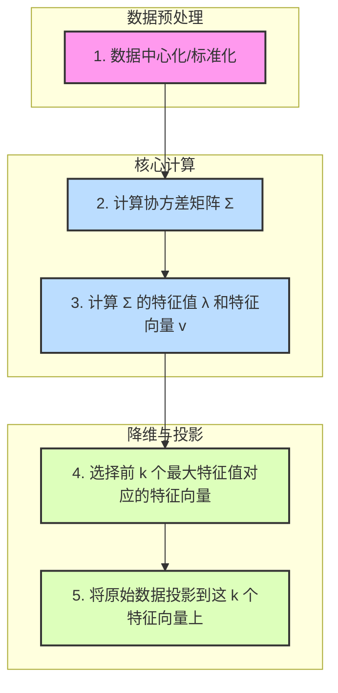

好的，我们已经深刻理解了高维数据带来的“诅咒”，现在，让我们正式踏上破解诅咒的征程。我们将从最经典、最强大，也是理解后续所有降维技术基石的算法——主成分分析（PCA）开始。

***

## 3.2 线性降维的核心机制：主成分分析 (PCA)

在上一节的结尾，我们提出了一个问题：一个拥有上千个特征的人脸图像数据集，其内在的、真正的维度是多少？常识告诉我们，并非像素的任意组合都能构成一张人脸。所有可能的人脸图像，都遵循着某种内在的结构和规律，它们很可能栖息在一个远比原始像素空间维度低得多的“人脸空间”里。

主成分分析（Principal Component Analysis, PCA），正是为了发现并描述这种“内在空间”而诞生的。它诞生于20世纪初，由卡尔·皮尔逊（Karl Pearson）首次提出，并在数十年后由哈罗德·霍特林（Harold Hotelling）发展完善。它的出现，并非为了解决今天的“大数据”问题，而是源于一个更根本的统计学难题：**在一组相互关联的变量中，如何找到一种最佳的方式来总结和可视化它们？如何用最少的几个“新变量”来捕捉原始数据中绝大部分的变异信息？**

PCA的回答，优雅而强大：**通过一个坐标系的旋转，找到数据分布最主要的“伸展方向”。** 这些方向，就是**主成分（Principal Components）**。

### 核心思想：寻找最佳投影，一体两面的视角

想象一下，你是一位雕塑家，面前有一块三维的大理石，里面嵌着一团星云状的钻石颗粒（我们的数据点）。你的任务是为这件艺术品制作一张二维的宣传照。你应该从哪个角度拍摄，才能最大程度地展现这团钻石星云的形状和分布呢？

你可能会本能地转动这块大理石，直到找到一个视角，使得照片上的钻石颗粒看起来**最分散、最伸展**。如果你从一个糟糕的角度拍摄（例如，正对着星云最薄的一面），所有的钻石都会挤在一条线上，其内部的结构和变化就完全丢失了。

这个寻找最佳拍摄角度的过程，就是PCA的核心直觉。它试图回答：**如何将高维数据投影到一个低维子空间（比如从3D到2D照片），同时最大程度地保留原始数据的信息？**

“信息”这个词有些抽象，PCA用两个等价的、更数学化的视角来精确定义它：

#### 视角一：最大化投影方差 (Maximizing Projected Variance)

这正是我们雕塑家类比的直接体现。数据的**方差**（Variance）衡量了数据的离散程度或“分散”程度。方差越大，意味着数据在该方向上展现出的差异性越多，包含的“信息”也就越丰富。

PCA的目标是：
1.  找到第一个**主成分（PC1）**，它是一个方向（一个单位向量），当所有数据点都投影到这个方向上时，投影点的方差是最大的。这相当于找到了星云最主要的“伸展轴”。
2.  接着，在所有与PC1正交（垂直）的方向中，找到第二个**主成分（PC2）**，使得数据投影到PC2上的方差次大。这相当于找到了星云第二主要的伸展方向。
3.  以此类推，继续寻找与已找到的所有主成分都正交的、方差次大的方向，直到找到与原始数据维度相同数量的主成分。

通过这个过程，PCA构建了一个全新的坐标系。这个坐标系的基轴（PC1, PC2, ...）不再是原始的x, y, z轴，而是最能体现数据变化模式的“主轴”。更重要的是，这些主轴是按重要性（解释的方差量）排序的。这给了我们一个巨大的优势：我们可以只选择前 `k` 个最重要的主成分，忽略掉那些方差很小、几乎没什么信息量的尾部成分，从而在信息损失最小的情况下，实现降维。

#### 视角二：最小化重构误差 (Minimizing Reconstruction Error)

现在，让我们换一个角度。假设我们已经将三维的钻石星云投影到了一张二维的照片上。现在，我们只看这张照片，尝试反向推断出原始三维星云的样貌。这个过程称为**重构（Reconstruction）**。

由于降维过程中丢失了第三个维度的信息，我们的重构必然是不完美的。原始的三维数据点和我们根据二维投影重构出的三维点之间，会存在一个**重构误差**（通常是它们之间欧氏距离的平方和）。

PCA的另一个核心思想是：**找到一个低维子空间，使得将原始数据投影于此再重构回去时，这个重构误差最小。**

这听起来和最大化方差截然不同，但实际上它们是完全等价的。这背后是一个优美的几何事实，可以类比于勾股定理。在一个数据点与它的投影点、以及数据中心点构成的直角三角形中：
- 原始数据点到中心的总距离（总方差）的平方是斜边。
- 投影点到中心的距离（投影方差）的平方是一条直角边。
- 原始点到投影点的距离（重构误差）的平方是另一条直角边。

**总方差² = 投影方差² + 重构误差²**

因为总方差是固定的，所以，**最大化投影方差，就等价于最小化重构误差**。这两个视角，如同一个硬币的两面，从不同角度描述了PCA寻找最优线性子空间的本质。

### 关键技术组件：PCA的数学引擎

要实现上述目标，PCA依赖于两个核心的数学工具：**协方差矩阵** 和它的 **特征值与特征向量**。

#### 1. 协方差矩阵 (Covariance Matrix)：数据的关系图谱

在寻找数据的主要“伸展方向”之前，我们首先需要一种方法来量化数据在不同维度上的分布情况以及维度之间的相互关系。这就是协方差矩阵的使命。

假设我们有 `m` 个样本，每个样本有 `n` 个特征。数据可以表示为一个 `m x n` 的矩阵 `X`。
- **方差（Variance）**：衡量单个特征（一列）内部数据的离散程度。`Var(X_i) = E[(X_i - μ_i)²]`
- **协方差（Covariance）**：衡量两个不同特征（两列）之间的线性关系。`Cov(X_i, X_j) = E[(X_i - μ_i)(X_j - μ_j)]`
    - 如果 `Cov > 0`，表示两个特征倾向于同向变化（一个增加，另一个也倾向于增加）。
    - 如果 `Cov < 0`，表示两个特征倾向于反向变化。
    - 如果 `Cov ≈ 0`，表示两个特征之间没有明显的线性关系。

**协方差矩阵 `Σ`** 是一个 `n x n` 的对称矩阵，其中第 `(i, j)` 个元素就是第 `i` 个特征和第 `j` 个特征的协方差。
- **对角线元素**：`Σ_ii` 是第 `i` 个特征自身的方差。
- **非对角线元素**：`Σ_ij` 是第 `i` 和第 `j` 个特征的协方差。

**协方差矩阵就像是数据特征之间关系的一张“地图”**。它告诉我们数据云在哪个方向上本身就很“胖”（高方差），以及它在哪些方向上是“倾斜”的（高协方差）。PCA的目标，本质上就是对这张地图进行分析，找到其中最主要的“山脉走向”。

#### 2. 特征值与特征向量 (Eigenvalues & Eigenvectors)：揭示变换的本质

协方差矩阵本身定义了一个**线性变换**。想象它作用于空间中的任意一个向量，会将其进行旋转和拉伸。而**特征向量**，就是这个变换中那些非常特殊的方向：当一个向量位于特征向量的方向上时，协方差矩阵对它的变换**只有拉伸，没有旋转**。**特征值**则代表了这个拉伸的比例。

数学上表示为：`Σv = λv`
- `Σ` 是协方差矩阵。
- `v` 是特征向量（一个方向）。
- `λ` 是特征值（一个标量）。

这个等式的美妙之处在于，它将一个复杂的矩阵变换问题，简化成了一个简单的标量乘法。

**在PCA的语境下，协方差矩阵的特征向量和特征值有着至关重要的物理意义：**
- **特征向量 (Eigenvectors)**：它们就是我们梦寐以求的**主成分方向**！它们指向了数据方差最大的那些正交方向。
- **特征值 (Eigenvalues)**：它们量化了在对应特征向量方向上，数据的**方差大小**。

因此，**特征值最大的那个特征向量，就是第一主成分（PC1）**。第二大的特征值对应的特征向量，就是第二主成分（PC2），以此类推。特征值的大小，直接代表了每个主成分的“重要性”或“解释力”。

### 算法步骤：一步步构建PCA

现在，我们可以将上述理论串联成一个清晰的算法流程。



1.  **数据中心化/标准化 (Data Centering/Standardization)**
    - **中心化**：将每个特征减去其均值。这一步至关重要，因为它确保了我们计算的是数据围绕其中心的散布情况，而非其在空间中的绝对位置。
    - **标准化**：除了减去均值，还要除以其标准差。如果不同特征的度量单位和范围差异巨大（例如，一个是身高（cm），另一个是收入（元）），标准化可以防止范围大的特征在方差计算中占据主导地位。**这是PCA应用中一个极其重要的实践步骤。**

2.  **计算协方差矩阵 (Compute Covariance Matrix)**
    对中心化/标准化后的数据矩阵 `X'`，计算其协方差矩阵 `Σ = (1/(m-1)) * (X')^T * X'`。

3.  **计算特征值和特征向量 (Eigen-decomposition)**
    对协方差矩阵 `Σ` 进行特征分解，得到一组特征值 `λ_1, λ_2, ..., λ_n` 和对应的特征向量 `v_1, v_2, ..., v_n`。

4.  **选择主成分 (Select Principal Components)**
    将特征值从大到小排序：`λ_1 ≥ λ_2 ≥ ... ≥ λ_n`。选择前 `k` 个最大的特征值所对应的特征向量 `v_1, v_2, ..., v_k`。
    - 如何选择 `k`？一个常用方法是计算**累计解释方差比率（Cumulative Explained Variance Ratio）**。第 `i` 个主成分的解释方差比率为 `λ_i / (Σλ_j)`。我们可以选择 `k` 使得累计比率达到一个阈值，比如95%或99%。

5.  **数据投影 (Project Data)**
    将选出的 `k` 个特征向量作为列，组成一个 `n x k` 的投影矩阵 `W`。将原始的、中心化后的数据 `X'` 与这个投影矩阵相乘，得到降维后的新数据 `Z = X' * W`。这个新的 `m x k` 矩阵 `Z` 就是我们最终得到的低维数据表示。

### 代码示例：用`scikit-learn`实践PCA

理论是灰色的，而生命之树常青。让我们用Python代码来直观感受PCA的威力。

```python
import numpy as np
import matplotlib.pyplot as plt
from sklearn.preprocessing import StandardScaler
from sklearn.decomposition import PCA

# 1. 创建一个相关的二维数据集
np.random.seed(42)
# 数据沿 (1, 0.8) 方向分布
X = np.dot(np.random.randn(200, 2), np.array([[1, 0.8], [0.8, 1]])) + np.array([5, 3])

# 2. 数据标准化
scaler = StandardScaler()
X_scaled = scaler.fit_transform(X)

# 3. 应用PCA
# 我们希望降到1维
pca = PCA(n_components=1)
X_pca = pca.fit_transform(X_scaled)

# 4. 分析结果
print("原始数据维度:", X_scaled.shape)
print("降维后数据维度:", X_pca.shape)
print("\n主成分 (特征向量):", pca.components_)
print("主成分解释的方差量 (特征值):", pca.explained_variance_)
print("主成分解释的方差比率:", pca.explained_variance_ratio_)

# 5. 可视化
plt.figure(figsize=(10, 6))
plt.scatter(X_scaled[:, 0], X_scaled[:, 1], alpha=0.7, label='Original Scaled Data')

# 绘制主成分方向
for length, vector in zip(pca.explained_variance_, pca.components_):
    v = vector * 3 * np.sqrt(length)
    plt.plot([0, v[0]], [0, v[1]], '-k', lw=3, label=f'Principal Component 1 (Explains {pca.explained_variance_ratio_[0]:.2%} variance)')

plt.title("PCA on 2D Correlated Data")
plt.xlabel("Feature 1 (Standardized)")
plt.ylabel("Feature 2 (Standardized)")
plt.axis('equal')
plt.legend()
plt.grid(True)
plt.show()

# 重构数据并查看重构误差
X_reconstructed = pca.inverse_transform(X_pca)
reconstruction_error = np.mean(np.sum((X_scaled - X_reconstructed)**2, axis=1))
print(f"\nMean Squared Reconstruction Error: {reconstruction_error:.4f}")
```
这段代码清晰地展示了PCA如何找到数据方差最大的方向（图中黑色的粗线），并将所有数据点投影到这个方向上，从而将二维数据压缩成了一维。输出的解释方差比率（通常接近95%以上）告诉我们，这个一维表示保留了原始数据绝大部分的变异信息。

### 优势与局限性：何时使用PCA？

PCA虽然强大，但并非万能灵药。了解其适用范围至关重要。

| 优势 (Strengths) | 局限性 (Limitations) |
| :--- | :--- |
| **无参数化**：除了需要选择降维后的维度 `k`，PCA本身没有需要手动调整的超参数。 | **线性假设**：PCA只能发现数据中的线性结构。如果数据分布在一个弯曲的流形上（如S形曲线），PCA会失效，无法正确揭示其内在的低维结构。 |
| **结果可解释**：每个主成分的“重要性”由其解释的方差比率明确量化，我们可以清楚地知道保留了多少信息。 | **对数据缩放敏感**：如前所述，如果不对特征进行标准化，数量级大的特征将主导PCA的结果。**预处理是必须的**。 |
| **计算高效**：现代PCA的实现通常基于奇异值分解（SVD），对于大型数据集计算效率很高。 | **可解释性可能变差**：每个主成分是所有原始特征的线性组合。当特征数量很多时，很难给一个主成分一个直观的物理命名或解释（例如，PC1 = 0.7*身高 - 0.3*体重 + 0.6*年龄... 这是什么？）。 |
| **消除多重共线性**：通过将相关的原始特征转换为一组正交（不相关）的主成分，PCA可以有效解决回归模型中的多重共线性问题。 | **信息损失**：降维必然导致信息损失。如果丢弃的主成分中包含了对特定任务（如分类）有用的判别信息，模型性能可能会下降。 |


### 典型应用场景

1.  **人脸识别 (Eigenfaces)**：这是PCA最著名的应用之一。一张人脸图片可以被看作一个高维向量（每个像素是一个维度）。通过对大量人脸图片数据集运行PCA，得到的主成分被称为“特征脸”（Eigenfaces）。它们看起来像模糊的、幽灵般的人脸，代表了人脸变化的主要模式。任何一张新的人脸都可以被近似表示为这些特征脸的线性组合，从而实现高效的人脸识别和压缩。

2.  **数据预处理**：在将数据送入监督学习模型（如SVM、逻辑回归）之前，使用PCA进行降维可以：
    *   减少特征数量，加速模型训练。
    *   通过保留主要方差方向，起到一定的去噪效果。
    *   解决多重共线性问题，增强模型的稳定性。

3.  **多重共线性问题的解决**：在经济学和金融学中，许多变量（如利率、通货膨胀率、GDP增长率）高度相关。在建立计量经济模型时，这种多重共线性会使模型参数的估计变得非常不稳定。使用PCA可以将这些相关的经济指标转换为一组不相关的“经济因子”，从而构建更稳健的模型。

### 总结与前瞻

在本节中，我们深入剖析了线性降维的王者——主成分分析（PCA）。我们理解了它的核心思想源于从“最大化投影方差”和“最小化重构误差”这两个等价的视角来寻找数据的最优低维表示。我们揭示了其背后的数学引擎——协方差矩阵与特征分解，并梳理了从数据标准化到最终投影的完整算法流程。

PCA为我们提供了一种优雅而强大的方法，来审视和简化复杂的数据。它就像一副特殊的“眼镜”，能帮助我们滤除数据中的冗余和噪声，只看到其最核心的结构骨架。

然而，PCA的这副眼镜，其镜片是“平”的。它假设数据的内在结构是线性的，可以用直线、平面或超平面来近似。这引出了一个深刻的问题：**如果数据的内在结构是弯曲的、非线性的呢？**

想象一条蜿蜒盘旋的瑞士卷蛋糕。它的内在维度是二维的（可以展开成一张矩形面皮），但它被嵌入在三维空间中。如果我们用PCA强行给它拍照，无论从哪个角度，我们都无法得到一张能完美展现其二维面皮结构的照片。我们会得到一条扭曲的线，丢失了大量的邻里关系信息。

那么，我们是否有办法打造一副“曲面”的镜片，能够“看穿”这种非线性的结构，将这条瑞士卷优美地“展开”，恢复其内在的二维形态呢？

这个挑战，将我们引向降维领域的另一片广阔天地——**非线性降维与流形学习**。在下一节中，我们将探索这些更先进的技术，学习如何处理那些PCA无法驾驭的、隐藏在数据中的复杂几何之美。