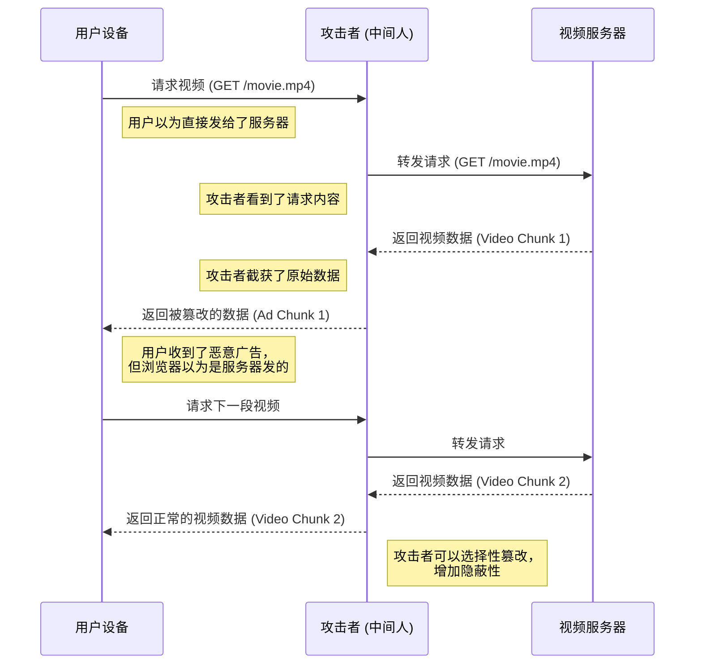
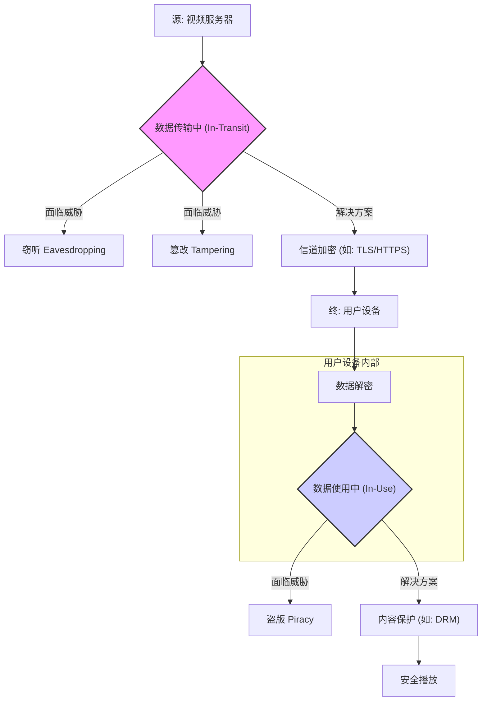

好的，请看这篇专为您的课程精心撰写的开篇内容。我将化身为那位擅长将复杂概念娓娓道来的教育家与作家，带领读者踏上Web媒体加密世界的探索之旅。

***

# 第一章：奠定基石 · 为什么Web媒体需要加密？

## 1.1 根本问题：在开放的互联网上传输媒体面临哪些核心风险？

欢迎来到Web媒体加密的世界。

在我们深入探讨那些精妙的加密算法、复杂的密钥交换协议以及坚固的数字版权管理（DRM）系统之前，我们必须先回答一个最根本，也最常被忽略的问题：我们为什么需要做这些？

想象一下，在一个慵懒的周末午后，你舒适地窝在沙发里，打开你最喜欢的流媒体服务，点播了一部期待已久的大片。高清的画面、逼真的音效，一切都显得那么天衣无缝、理所当然。数据从遥远的服务器，穿越千山万水，精准无误地呈现在你的屏幕上。这个过程看起来是如此的私密与安全，仿佛有一条专属的、隐形的管道，只为你一人服务。

但真相是，这条管道并非为你独享，它更像是一条熙熙攘攘、任何人都可以驻足观看的公共街道。你点播的电影，连同你的观看习惯、账户信息，都像是一张张没有封口的明信片，在这条街道上被无数的“邮递员”——路由器、交换机、互联网服务提供商（ISP）——传递着。

在这一章，我们将撕开这层温情脉脉的面纱，直面一个残酷但必要的事实：**在默认情况下，互联网是一个极度不安全的“黑暗森林”。** 我们将通过几个具体的威胁场景，来理解为什么将未加密的媒体内容暴露在这片森林中，无异于将一块鲜肉扔进狼群。我们的目标，是为你建立起一个坚实的认知基石：**信道加密并非一种“可选”的增强功能，而是保障Web媒体服务得以成立的“必要”前提。**

### 核心威胁1：窃听 (Eavesdropping) - 你的数字明信片正在被全世界阅读

让我们从最直观、最容易理解的风险开始：**窃听**。

**问题背景：互联网的“明信片”本质**

在加密技术普及之前，互联网协议的设计初衷是“信任”。早期科学家们在象牙塔里构建网络时，他们设想的是一个开放、协作的学术环境，而非今天这个充满了商业利益与恶意攻击者的复杂生态。因此，像HTTP（超文本传输协议）、FTP（文件传输协议）这些元老级的协议，其设计默认就是“裸奔”的——所有传输的数据都是明文的。

这就引出了我们的第一个核心类比：**未经加密的数据传输，就像寄送一张明信片。**

一张明信片，从你手中寄出，到最终抵达收件人，中间会经过无数双手：邮筒、分拣中心、运输车辆、不同城市的邮局、最终的派送员……每一个环节的经手人，只要愿意，都可以轻易地阅读上面的全部内容。他们知道你是谁，收件人是谁，以及你们之间通信的每一个字。

互联网上的数据包（Data Packets）正是如此。当你通过一个未加密的`http://`链接观看视频时，构成视频画面的数据流被分割成无数个小数据包，沿着互联网的物理链路（光纤、铜缆、无线电波）进行接力赛。每一个数据包都携带着源地址（服务器IP）、目标地址（你的IP）以及一小块视频内容。它们途经的每一个网络节点——你家里的路由器、小区的交换机、城市的ISP、跨国骨干网的路由器——理论上都可以“拆开”这个数据包，一窥究竟。

**Case Study: 公共Wi-Fi下的“咖啡馆陷阱”**

这个场景或许你再熟悉不过：你在一家咖啡馆，连接上免费的公共Wi-Fi，一边品尝拿铁，一边用笔记本电脑观看在线视频。这看起来惬意而安全，但你可能已经身处一个精心布置的“数字陷阱”之中。

一个稍有技术的攻击者，同样连接着这个Wi-Fi，可以将他的网卡设置为“混杂模式”（Promiscuous Mode）。在这种模式下，网卡会贪婪地接收所有在同一局域网内广播的数据包，而不仅仅是发给它自己的。如果你的视频流量没有加密，那么：

1.  **视频内容被窥探**：攻击者可以使用像Wireshark这样的网络嗅探工具，捕获你和视频服务器之间的所有数据包。虽然将这些零散的数据包重组成完整的视频流需要一些技术，但这并非不可能。他可以确切地知道你在看什么，甚至能截取到视频的片段。
2.  **元数据与用户信息泄露**：比视频内容本身更危险的，是伴随流量而来的元数据和用户信息。攻击者可以轻易看到你请求的视频URL，这暴露了你的观看偏好。如果该网站的登录机制也不安全，你的用户名、甚至明文密码，都可能在登录请求中被一并捕获。攻击者还能截获你的Cookie——那个小小的、记录了你登录状态的文本文件。一旦Cookie被盗，攻击者就可以冒充你的身份，直接登录你的账户，进行各种恶意操作。

在这个“咖啡馆陷阱”里，攻击者就像一个坐在你邻座，却拥有透视眼的人。他不仅能看到你屏幕上的内容，还能翻阅你的钱包，查看你的身份证件。而这一切的根源，仅仅是因为数据在从Wi-Fi热点到你设备的这“最后一公里”上，是以明信片的方式传递的。

窃听，是互联网上最古老、最普遍、也是最基础的威胁。它是一种**被动攻击**，攻击者像一个潜伏的间谍，只听、只看，不作任何修改。然而，这种看似无害的窥探，其破坏力足以侵犯个人隐私、窃取商业机密、盗用用户账户，为更进一步的攻击铺平道路。

---

### 核心威胁2：篡改 (Tampering) - 不仅仅是被偷看，信件内容竟被调包

如果说窃听还只是让你的“明信片”被动地暴露，那么**篡改**则是一种更高级、更具破坏性的**主动攻击**。攻击者不再满足于仅仅做一个旁观者，他要亲自下场，成为数据传输路径上的“恶意邮差”。

这种攻击最经典的实现方式，就是**中间人攻击（Man-in-the-Middle, MitM）**。

**问题背景：信任链的断裂**

在正常的网络通信中，你和服务器之间建立了一条信任的路径。你相信你发送的请求会原封不动地到达服务器，也相信服务器返回的响应会原封不动地到达你这里。中间人攻击的核心，就是**摧毁这条信任链**。攻击者将自己巧妙地插入到你和服务器之间，让你和服务器都误以为对方就是自己正在与之通信的“正主”。

让我们升级一下“邮局”的类比：

> 你以为你是在和官方邮局通信。但实际上，一个骗子在你家和邮局之间，设立了一个一模一样的“假邮局”。你把信交给这个假邮局，骗子拆开信，阅读内容（窃听），然后可能会修改信中的文字，或者塞入一张诈骗广告，再重新封好，模仿你的笔迹，送到真正的邮局。同样，真邮局的回信也会先被送到这个假邮局，骗子再次拆开、篡改，然后再送到你手上。在整个过程中，你和真邮局都对这个“中间人”的存在毫不知情。

中间人攻击正是这个“假邮局”的数字版本。

**Case Study: “免费电影”背后的恶意广告注入**

想象一下，你还是在那个咖啡馆里，试图访问一个提供免费电影的网站（假设它使用未加密的HTTP）。此时，发动中间人攻击的黑客，会通过ARP欺骗等技术，让你的设备和咖啡馆的路由器都相信，对方的“网络地址”就是黑客自己的设备。于是，一条本应是`你 <--> 路由器 <--> 互联网`的链路，变成了`你 <--> 黑客 <--> 路由器 <--> 互联网`。

现在，所有的数据流都必须经过黑客的电脑。他能做什么呢？

1.  **读取所有数据**：这是基础操作，等同于窃听。
2.  **修改数据流**：这是中间人攻击的精髓。当视频网站的服务器将正常的视频数据发送回来时，数据先到达黑客的电脑。黑客可以：
    *   **注入恶意广告**：在视频播放前，或在播放过程中，用他自己的广告内容替换掉正常的视频片段。这些广告可能指向钓鱼网站，或诱导你下载恶意软件。
    *   **替换视频内容**：他可以将你点播的喜剧片，替换成一段宣传某种极端思想的视频，或者干脆替换成一个显示“你的电脑已中毒”并要求付款的假警告。
    *   **植入挖矿脚本**：在承载视频播放的网页HTML代码中，神不知鬼不觉地插入一小段JavaScript代码。这段代码会在你的浏览器后台疯狂运行，利用你的电脑CPU资源为黑客挖掘加密货币，导致你的设备变得异常卡顿、耗电。

下面的Mermaid图清晰地展示了这个被劫持的数据流：

篡改的威胁等级远超窃听。它不再仅仅是隐私泄露，而是直接的内容欺诈、财产损失和系统安全威胁。如果传输的是金融数据，可能导致资金被盗；如果传输的是软件更新，可能导致整个系统被植入后门。对于Web媒体而言，它意味着平台方失去了对自己内容的控制权，用户的观影体验和账户安全也荡然无存。

---

### 核心威胁3：盗版 (Piracy) - 信件安全送达后，内容被肆意复制

到目前为止，我们讨论的“窃听”和“篡改”都发生在数据**传输过程中**。现在，让我们假设我们已经通过某种强大的加密手段（例如后续章节会详述的HTTPS）解决了这两个问题。我们的“明信片”已经被放进了坚不可摧的“加密信封”里，中间人既无法偷看，也无法篡改。

信件安全地、完好无损地送到了收件人手中。那么，是不是就万事大吉了呢？

这里，我们遇到了第三个，也是对于媒体行业而言最为致命的威胁之一：**盗版**。

**问题界定：传输安全 vs. 内容安全**

理解盗版，关键在于区分两个概念：**传输过程中的窃听**与**内容到达客户端后的非法复制**。

*   **窃听**，是在“邮路上”偷看信件内容。如果信封足够坚固（信道加密），这个问题就能被解决。
*   **盗版**，是收件人收到信件后，把它拿到复印店，复印了一万份，然后公开出售。这与邮路的安全性无关，而是发生在信件被合法接收**之后**。

在Web媒体的场景下，无论传输过程多么安全，视频数据流最终必须在用户的设备上（浏览器或App中）被**解密**，然后送入显卡进行渲染，最终才能播放出来。就在解密完成到渲染播放的这短暂瞬间，原始的、未受保护的音视频内容，就以比特流的形式存在于你电脑的内存之中。

对于专业的盗版者而言，这便是他们的“黄金窗口”。他们可以通过以下手段捕获内容：

*   **屏幕录制**：最简单粗暴的方式，但对于高清内容，质量会有损失。
*   **内存抓取**：更高级的攻击者会编写程序，直接从内存中定位并抓取解密后的视频帧数据。
*   **劫持图形驱动**：通过hook或注入等方式，在数据被送往显卡之前就将其截获。
*   **破解解密模块**：直接逆向分析播放器或浏览器的解密模块，找到解密后的数据出口。

一旦原始内容被获取，它就可以被重新编码、打包，然后发布到盗版网站、社交网络或P2P网络上，对内容版权方造成毁灭性的经济打击。一部耗资数亿美元制作的电影，可能在上线几分钟内，高清版本就出现在了盗版网站上。

因此，盗版这个威胁告诉我们一个至关重要的道理：**仅仅保护数据的传输通道是不够的。** 这为我们后续引入DRM（数字版权管理）埋下了伏笔。DRM技术的目标，正是在于解决这个“内容送达后”的安全问题，它试图将保护延伸到用户的设备内部，确保即使内容被成功解密，也无法被轻易地复制和分发。

---

### 建立威胁模型：为我们的战场绘制地图

通过以上三个核心威胁的剖析，我们可以构建一个清晰的Web媒体安全威胁模型。这个模型将整个数据生命周期划分为两个关键阶段，并指明了每个阶段所面临的主要敌人。

这就像为一场战役绘制地图，我们必须清楚地标示出哪些是陆地战，哪些是海上战，才能配置相应的兵种。

**阶段一：数据传输中 (Data in Transit)**

这个阶段涵盖了数据从服务器离开，到安全抵达用户设备为止的整个旅程。这片战场是广阔而开放的公共互联网。

*   **核心挑战**：保护数据在公共网络上传输时的机密性（不被窃听）和完整性（不被篡改）。
*   **主要威胁**：
    *   **窃听 (Eavesdropping)**
    *   **篡改 (Tampering / Man-in-the-Middle)**
*   **解决方案**：**信道加密 (Channel Encryption)**。我们的主要武器是像TLS/SSL这样的安全协议，也就是我们熟知的HTTPS中的“S”（Secure）。它为我们的数据套上了一层坚固的“数字装甲”，确保在运输途中，无人能窥探或染指。

**阶段二：数据使用中 (Data in Use)**

这个阶段始于数据在用户设备上被解密，终于其被消费（播放）的时刻。战场缩小到了用户设备的内部环境，如内存、CPU、显卡。

*   **核心挑战**：防止解密后的原始内容被非法复制、录制或分发。
*   **主要威胁**：
    *   **盗版 (Piracy)**
*   **解决方案**：**内容保护/数字版权管理 (Content Protection / DRM)**。这里的武器库更为复杂，包括加密媒体扩展（EME）、可信执行环境（TEE）等技术。它们的目标是在用户的设备上建立一个“安全保险箱”，让内容只能在授权的环境下播放，而无法被轻易“拷贝”出来。

我们可以用下面的模型来总结：

这个威胁模型为我们整个课程的学习规划了清晰的路线图。我们将像一位将军，依次攻克这两个战场：
1.  **首先**，我们将集中火力解决“数据传输中”的问题。我们将深入学习TLS/HTTPS协议，理解它是如何利用密码学的力量，来抵御窃听和中间人攻击，从而建立起一条安全的传输管道。
2.  **然后**，在我们确保了内容能够安全送达之后，再进军“数据使用中”的战场，探索DRM这个复杂而迷人的领域，学习如何保护内容“最后一公里”的安全。

### 总结与前瞻

在这一节中，我们共同揭示了看似平静的Web媒体传输背后潜藏的三大核心风险：

*   **窃听 (Eavesdropping)**：如同在公共场合阅读你的明信片，它侵犯隐私，泄露信息。
*   **篡改 (Tampering)**：中间人攻击，如同恶意邮差调换你的信件，它造成欺诈，危害系统安全。
*   **盗版 (Piracy)**：内容送达后的非法复制，如同将你的私人信件复印万份出售，它直接冲击着整个内容产业的根基。

我们还建立了一个两阶段的威胁模型——**“传输中”安全**与**“使用中”安全**，明确了不同风险发生的阶段以及它们各自对应的解决方案。

现在，我们不再是那个对网络世界抱有天真幻想的用户了。我们已经清楚地认识到，在开放的互联网上，安全并非与生俱来，而是需要我们主动、精心去构建的。我们已经理解了“为什么”需要加密。

那么，下一个自然而然的问题就是：“如何”做到？

我们如何铸造那把能锁住“数字明信片”的锁？如何建立那个能甄别“恶意邮差”的验证机制？又是怎样的数学魔法，能让一段信息在公开的信道中传递，却只有指定的收件人才能解读其意？

这便是我们下一章将要探索的奇妙世界——密码学的基础，以及它在构建现代安全网络通信（HTTPS）中的核心应用。我们已经绘制好了战场地图，现在，是时候去锻造我们的第一件武器了。准备好了吗？