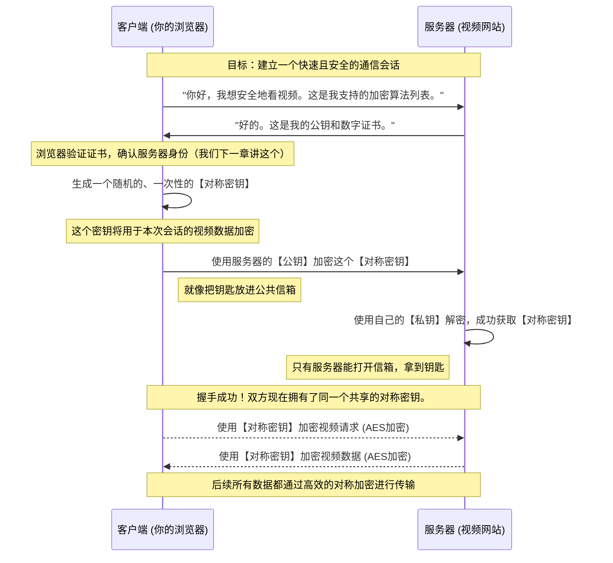

好的，我将化身为那位世界级的教育家与作家，接续已完成的内容，为您精心撰写第二小节。我将确保叙事流畅，类比精准，逻辑严密，并以启发性的方式，将密码学的两大基石——对称与非对称加密，以及哈希函数——清晰而深刻地呈现给读者。

***

## 1.2 核心思想：密码学的两大基石

我们在上一节的探索中，为Web媒体传输这片广袤的战场绘制了一幅清晰的地图。我们识别出了潜伏在暗处的敌人——窃听、篡改与盗版，并明确了我们的首要任务：为“数据传输中”这条危机四伏的路径，构建起坚不可摧的防御工事。我们提出的解决方案是“信道加密”，那层能将脆弱的“数字明信片”包裹起来的“数字装甲”。

现在，是时候深入兵工厂，亲手锻造这套装甲的核心部件了。我们提出的问题是：“如何做到？” 如何将清晰可读的信息，转化为一串除了预定接收者外无人能懂的乱码？这个“转化”与“复原”的过程，正是**密码学（Cryptography）**——这门古老而又在数字时代焕发新生的科学——所要回答的核心命题。

密码学的世界浩瀚如星海，但支撑起现代互联网安全大厦的，主要有两大基石。它们就像建筑中的承重墙，以截然不同的设计哲学，共同撑起了我们今天所依赖的数字信任体系。它们分别是：**对称加密**与**非对称加密**。同时，我们还需要一位公正无私的“数字公证员”——**哈希函数**，来确保我们的信息在传递过程中没有被动手脚。

让我们逐一揭开它们神秘的面纱。

---

### 对称加密 (Symmetric Encryption)：共享秘密的古老艺术

对称加密是密码学中最古老、最直观的思想。它的核心逻辑，简单到可以用我们童年时玩的“密码纸”游戏来理解。

**类比：一把钥匙的保险箱**

> 想象一下，你和一位挚友爱丽丝需要通过一个不可靠的邮政系统传递一个极其珍贵的保险箱。这个保险箱有一个特点：它使用一把独特的、构造复杂的钥匙。用这把钥匙顺时针转动，保险箱就会上锁；逆时针转动，保险箱就会打开。**上锁和开锁，用的是同一把钥匙。**
>
> 这就是对称加密的精髓。
>
> *   **保险箱**：就是你要传输的数据（视频流、网页内容等）。
> *   **上锁的过程**：就是**加密（Encryption）**，将原始数据（明文，Plaintext）变成一堆毫无意义的乱码（密文，Ciphertext）。
> *   **开锁的过程**：就是**解密（Decryption）**，将密文恢复成原始数据。
> *   **那把独一无二的钥匙**：就是**对称密钥（Symmetric Key）**。

在这个模型里，只要你和爱丽丝都拥有这把相同的钥匙，并且没有其他人能得到它，你们之间的通信就是绝对安全的。即使邮递员（网络中的中间人）拿到了这个保险箱，没有钥匙，他也只能面对一个坚固的铁疙瘩，无从下手。

**问题背景：效率至上的需求**

对称加密算法的设计目标非常纯粹：**快**。它们的内部操作通常是基于一系列高效的位运算，如替换（Substitution）和置换（Permutation），这些操作对于现代计算机的CPU来说，简直是小菜一碟。这就好比我们那个保险箱的锁芯，虽然精密，但其机械结构非常高效，转动钥匙几乎不费吹灰之力。

这种对速度的极致追求，使其成为处理大批量数据加密的理想选择。想象一下，一部4K超高清电影，每秒钟都包含着数百万比特的数据。我们需要一个能够实时、流畅地完成加密和解密任务的“锁匠”，而不能因为“上锁”和“开锁”的过程太慢，导致视频播放卡顿。对称加密正是为此而生的“加密工作马（Workhorse）”。

**核心挑战：“鸡生蛋，蛋生鸡”的密钥分发问题**

对称加密的优点是显而易见的：简单、快速。但它的阿喀琉斯之踵也同样致命，这个问题甚至在密码学中拥有一个专门的术语：**密钥分发问题（Key Distribution Problem）**。

回到我们的保险箱类比。你和爱丽丝需要共享同一把钥匙。问题来了：**你该如何安全地把这第一把钥匙交给远方的爱丽z丝呢？**

*   **邮寄钥匙？** 这不行。我们之所以要用保险箱，就是因为邮政系统不安全。把钥匙用一个普通的信封寄过去，无异于把家门钥匙贴在大门上，任何人都能轻易拿到。
*   **当面交付？** 在古代，这确实是唯一的办法。国王会派遣最信任的信使，穿越千山万水，亲手将密码本或密钥交给前线的将军。但在全球化的互联网上，你不可能为了看一部电影，先和Netflix的服务器管理员见个面，交换一下密钥。

这就是一个经典的“鸡生蛋，蛋生鸡”的困境：**为了安全地传输数据，你需要一个安全的信道；但为了建立一个安全的信道，你需要先安全地传输密钥。** 在互联网这个默认不安全的“黑暗森林”里，这个问题在很长一段时间内，似乎是无解的。

**典型算法：AES (Advanced Encryption Standard)**

尽管存在密钥分发的难题，对称加密本身作为一种加密技术是极其成熟和强大的。当今世界的黄金标准是**AES**。它在2001年由美国国家标准与技术研究院（NIST）选定，用以取代老旧的DES标准。AES以其极高的安全性、卓越的性能和对多种硬件平台的良好支持，成为了全球范围内保护政府、商业和个人数据的首选对称加密算法。你在使用的Wi-Fi（WPA2/3）、压缩文件（如7-Zip）以及我们后续将深入探讨的HTTPS中，都有AES在幕后默默地高速运转。

**小结：对称加密**
*   **核心思想**：“一把钥匙开锁关锁”。
*   **优点**：加密解密速度极快，适合对海量数据进行加密。
*   **核心挑战**：密钥分发问题。如何在不安全的信道上，安全地让通信双方共享同一个密钥？
*   **定位**：加密世界的“主力战车”，负责正面战场的大规模数据冲锋。

---

### 非对称加密 (Asymmetric Encryption)：一场源于数学的认知革命

对称加密的密钥分发困境，像一座大山，阻碍了安全通信在开放网络中的普及。直到20世纪70年代，三位天才的密码学家——惠特菲尔德·迪菲（Whitfield Diffie）、马丁·赫尔曼（Martin Hellman）和拉尔夫·默克尔（Ralph Merkle）——提出了一个颠覆性的构想，彻底改变了游戏规则。他们的思想，后来由罗纳德·李维斯特（Ron Rivest）、阿迪·萨莫尔（Adi Shamir）和伦纳德·阿德曼（Leonard Adleman）三人以RSA算法的形式完美实现，从而开启了现代密码学的新纪元。

**类比：只进不出的“公共信箱”**

> 想象一下，你不再使用那个需要共享钥匙的保险箱了。取而代之，你为自己设计了一个非常特别的信箱，并把它放在了公共广场上。这个信箱有两个特点：
>
> 1.  **一个开放的投信口**：任何人——你的朋友、家人，甚至是陌生人——都可以往这个投信口里塞信件。这个投信口的设计非常精巧，信件一旦投进去，就会立刻掉入内部的锁定区域，任何人都无法从投信口再把信掏出来。这个**公开的、任何人都能使用的投信口**，我们称之为**公钥（Public Key）**。
> 2.  **一把私有的取信钥匙**：这个信箱只有一个取信门，而打开这个门的钥匙，**全世界只有一把，而且只由你一人保管**。你绝不会把这把钥匙给任何人。这把**私密的、唯你独有的钥匙**，我们称之为**私钥（Private Key）**。
>
> 现在，远方的爱丽丝想给你寄一封绝密的信。她需要做什么？
>
> *   她不需要你预先把任何秘密的东西给她。她只需要去公共广场，找到你的那个带有开放投信口（公钥）的信箱。
> *   她把信写好，塞进投信口。信件落入，安全锁定。
> *   之后，即使是最厉害的小偷（中间人），也只能对着这个信箱干瞪眼。他既没有取信的钥匙，也无法从那个“只进不出”的投信口里把信弄出来。
> *   只有当你——信箱唯一的主人——带着你的私钥前来，才能打开信箱，阅读爱丽丝的信件。

这个“公共信箱”模型，就是**非对称加密**的完美写照。它石破天惊地解决了密钥分发问题。你不再需要一个安全的信道来传输密钥了，恰恰相反，你可以（也应该）把你的公钥（投信口）广而告之，发到网上，印在报纸上，让全世界都知道。你希望越多的人知道你的公钥越好，因为这样他们才能给你发送加密信息。而你唯一需要保护的，就是那把从不离身的私钥。

**问题-解决方案-影响**

*   **问题**：如何在不安全的公共信道上，启动一次安全的通信，特别是如何交换密钥？
*   **在此之前的主流观点**：安全通信必须以一个预先共享的秘密为前提（对称加密的逻辑）。
*   **解决方案（非对称加密的革命性思想）**：将“密钥”拆分为“公钥”和“私钥”这一对。公钥负责加密，可以公开；私钥负责解密，必须保密。加密和解密使用不同的密钥，故名“非对称”。
*   **关键性影响**：它使得两个素未谋面、没有任何预共享秘密的实体（比如你的浏览器和谷歌服务器），能够在完全公开、可能被监听的网络上，建立起一条安全的通信链路。这是整个现代电子商务、在线银行和安全互联网的基石。

**核心原理：数学上的“单向飞船”**

你可能会好奇，这对神奇的钥匙是如何被制造出来的？这背后是深刻的数学原理，特别是所谓的**“陷门单向函数”（Trapdoor One-way Function）**。

这就像一艘单向飞船：
*   **正向飞行（加密）**：从A点飞到B点非常容易，计算上很快捷。这对应于使用公钥进行加密。
*   **逆向飞行（解密）**：从B点飞回A点，在不知道“秘密航线”（陷门信息，即私钥）的情况下，是计算上不可行的（computationally infeasible）。可能需要用上全世界所有的计算机算上数百年甚至更久。但如果你拥有“秘密航线”（私钥），这个返航过程又会变得非常简单。

例如，经典的RSA算法，其安全性就建立在“大数分解”这个数学难题上。给你两个巨大的素数p和q，计算它们的乘积n=p*q非常容易（正向飞行）。但如果只告诉你n，让你找出p和q，则是一个极其困难的问题（逆向飞行）。在这个体系中，n就构成了公钥的一部分，而p和q则是构造私钥的关键“秘密航线”。

**优点与缺点**

*   **优点**：完美地解决了密钥分发问题。它还带来了一个“副产品”——**数字签名**。用私钥加密（签名）一段信息，任何人都可以用你的公钥来解密（验证）。如果能成功解密，就证明这段信息确实是你发出的（因为只有你有私钥），且未被篡改。这解决了身份认证和不可否认性的问题。
*   **缺点**：**慢**。非对称加密涉及大量复杂的数学运算（如模幂运算），相比对称加密那些简单的位操作，它的计算成本要高出几个数量级。让它来加密整部电影？你的电脑可能会不堪重负，直接罢工。它就像那个银行金库的巨型密码锁，安全是安全，但每次开和关都得摇半天。

**典型算法：RSA, ECC**

*   **RSA**: 最早也是最著名的公钥加密算法，至今仍在广泛使用。
*   **ECC (Elliptic Curve Cryptography)**: 椭圆曲线密码学。是近年来崛起的新星。在提供同等级别安全性的前提下，ECC所需的密钥长度要短得多，计算效率也更高。因此，在计算资源和带宽受限的移动设备和物联网设备上，ECC正变得越来越流行。

**小结：非对称加密**
*   **核心思想**：“公钥加密，私钥解密”。公钥公开，私钥私有。
*   **优点**：解决了密钥分发问题，并能用于数字签名。
*   **缺点**：速度非常慢，不适合加密大块数据。
*   **定位**：加密世界的“外交官”，负责在通信建立之初，进行安全地“握手”和“谈判”。

---

### 哈希函数 (Hash Functions)：数据的“数字指纹”

有了对称加密这辆“主力战车”和非对称加密这位“外交官”，我们似乎已经解决了数据的机密性问题。但回顾一下第一节的威胁模型，我们还有一个敌人叫“篡改”。我们如何确保收到的信息，就是对方发出的原版信息，在传输途中没有被“恶意邮差”掉包或修改哪怕一个比特？

这时，我们需要一位绝对公正、一丝不苟的“数字公证员”——**哈希函数**。

**类比：一台神奇的“分子料理机”**

> 想象你有一台非常神奇的分子料理机。你把任何食材——无论是一粒米，还是一整头牛——放进去，它总能瞬间生成一道固定大小、外观独特的“分子料理”（比如一个边长5厘米的蓝色立方体）。
>
> 这台料理机有几个不可思议的特性：
>
> 1.  **单向性 (One-way)**：你可以把食材变成“分子料理”，但绝不可能把“分子料理”还原成原来的食材。过程不可逆。
> 2.  **抗碰撞性 (Collision Resistance)**：你几乎不可能找到两种不同的食材，能做出外观一模一样的“分子料理”。每种食材组合都有其独一无二的“成品”。
> 3.  **雪崩效应 (Avalanche Effect)**：哪怕你只是在食材里多加了一粒盐，最终生成的“分子料理”在颜色、纹理上会与原来的版本发生翻天覆地的变化，完全看不出是近亲。
> 4.  **确定性 (Deterministic)**：只要是完全相同的食材，无论你操作多少次，做出的“分子料理”永远是同一个样子。

这个“分子料理机”就是哈希函数。它接收任意长度的输入数据（明文），输出一个固定长度的、看起来随机的字符串，这个字符串被称为**哈希值（Hash Value）**或**摘要（Digest）**。它就像是原始数据的“数字指纹”。

**应用：校验数据完整性**

哈希函数如何对抗篡改？过程非常简单：

1.  发送方（比如视频服务器）在发送数据（一个视频切片）之前，先把这个数据通过哈希函数（比如SHA-256）计算一遍，得到一个哈希值（比如 `A1B2C3...`）。
2.  服务器将**原始数据**和这个**哈希值**一同发送给你。
3.  你的浏览器收到数据后，不对附带的哈希值做任何处理。而是用**同样的哈希函数（SHA-256）**，去计算自己收到的那份数据的哈希值。
4.  **对比结果**：
    *   如果浏览器自己计算出的哈希值，与服务器发来的一模一样，都是 `A1B2C3...`，那就证明数据在传输过程中**完好无损，未被篡改**。
    *   如果计算出的哈希值不同，哪怕只有一位不一样，也说明数据肯定被中间人动过手脚了。浏览器会立刻丢弃这份数据，并可能发出安全警告。

因为“雪崩效应”，攻击者即使只修改了视频数据中的一个像素点，最终的哈希值也会面目全非，从而轻易地被检测出来。而因为“抗碰撞性”，攻击者也无法伪造一份内容不同但哈希值相同的数据来替代原始数据。

**典型算法：SHA-256 (Secure Hash Algorithm 256-bit)**

这是目前最常用和最安全的哈希算法之一，被广泛应用于数字签名、区块链（比特币就用了它）等众多领域。它能为任何输入数据生成一个256位的（即64个十六进制字符）的独一无二的“指纹”。

---

### 终极合体：引出混合加密方案

现在，我们的武器库已经集齐了三件神器：

| 特性 | **对称加密 (Symmetric)** | **非对称加密 (Asymmetric)** | **哈希函数 (Hash)** |
| :--- | :--- | :--- | :--- |
| **核心机制** | 单一共享密钥 | 公钥/私钥对 | 单向数学函数 |
| **速度** | 极快 | 非常慢 | 极快 |
| **主要优点** | 高效，适合批量数据 | 解决密钥分发，可用于数字签名 | 校验数据完整性，生成数字指纹 |
| **核心挑战** | 密钥分发问题 | 计算开销大 | （理论上的）碰撞攻击 |
| **形象比喻** | 一把钥匙的保险箱 | 公共信箱与私人钥匙 | 分子料理机/数字指纹 |
| **典型算法** | AES, ChaCha20 | RSA, ECC | SHA-256, SHA-3 |
| **战场定位** | **主力战车** (数据传输) | **外交官** (密钥协商/身份认证) | **公证员** (数据完整性校验) |

审视这张表格，一个绝妙的作战计划呼之欲出。我们面临的困境是：
*   我们想用**对称加密**来传输视频，因为它快。
*   但我们无法安全地协商对称加密所需要的**共享密钥**。
*   **非对称加密**可以安全地“协商”事情，但它太慢了，不能用来传视频。

答案显而易见：**为什么不用慢的、安全的非对称加密，来保护快的、高效的对称加密的“启动过程”呢？**

这就是**混合加密方案（Hybrid Encryption Scheme）**的核心思想，也是支撑整个HTTPS（TLS协议）的基石。

它的工作流程大致如下，让我们通过一个简化的Mermaid图来预览一下：

这个流程优雅地结合了所有人的优点：
1.  **非对称加密**被用在“刀刃上”——只在最初的握手阶段，用于安全地协商出一个一次性的对称密钥。这个过程虽然慢，但只进行一次，传输的数据量也极小（只有一个密钥），完全可以接受。
2.  一旦双方都有了这个共享的“会话密钥”，就立刻切换到**对称加密**。后续所有海量的视频数据，都由高性能的AES等算法进行加解密，保证了流畅的观看体验。
3.  在整个通信的每一条消息中，都会附带一个由**哈希函数**生成的校验码（MAC），以确保没有任何数据被篡改。

我们用“外交官”启动了对话并交换了暗号，然后让“主力战车”上场，同时由“公证员”全程监督。三者协同作战，天衣无缝。

### 总结与前瞻

在这一节，我们深入探索了构建Web安全的三个核心密码学工具：
*   **对称加密**：速度飞快的“加密主力”，但受困于密钥分发。
*   **非对称加密**：解决了密钥分发的革命性“外交工具”，但性能是其短板。
*   **哈希函数**：确保数据完整性的“数字指纹”和“公证员”。

我们发现，没有哪一种工具是万能的。真正的力量在于将它们结合，形成**混合加密方案**，取长补短，协同工作。这正是现代安全协议如TLS的精髓所在。

然而，我们刚才的流程图中，有一个细节被我们暂时“跳过”了，但它却至关重要。当服务器把它的公钥发给浏览器时，浏览器如何能百分之百地确定，这个公钥真的属于它声称的那个网站（比如 `youtube.com`），而不是一个正在实施中间人攻击的黑客伪造的呢？

黑客完全可以截获你们的通信，然后把**他自己的公钥**发给你，冒充是视频网站。如果你用了黑客的公钥加密了对称密钥，那么这个密钥就会被黑客截获，你后续所有的“加密”通信，在黑客面前都将是透明的。

这个问题，引出了我们构建安全信道的下一个核心议题：**信任**。我们如何在一个本身不可信的网络环境中，建立起可信的身份认证？谁来为这些公钥的真实性“盖章”作保？

这，便是我们要探索的**数字证书（Digital Certificates）**和**公钥基础设施（PKI）**的世界。我们已经准备好了锁和钥匙，现在，是时候学习如何验证门牌号的真伪了。