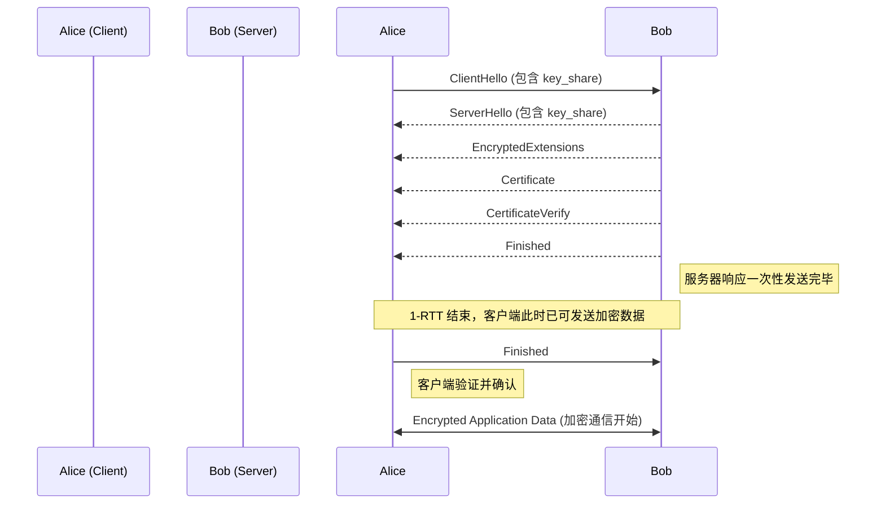

好的，我们已经理解了构建一个可信通信信道所必须满足的三大宏伟目标。现在，让我们卷起袖子，从蓝图走向施工现场，去亲眼见证这三个目标是如何在一次精妙绝伦的“密码学之舞”中被完美实现的。

***

## 2.2 拆解关键机制：TLS 1.3 握手全过程

在前一节中，我们确立了构建安全隧道的三个核心支柱：保密性、完整性和认证。这就像我们明确了要建造一座既能防窃听、又能防篡改、并且能确保我们只与指定盟友对接的坚固堡垒。然而，知道“建什么”与知道“如何建”之间，还隔着一道鸿沟。

**TLS 握手 (TLS Handshake)** 正是跨越这道鸿沟的桥梁。它是在任何加密数据开始传输之前，客户端和服务器之间进行的一系列自动化、结构化的“对话”。这不仅仅是一次简单的问候，它更像是一场在几百毫秒内完成的、高度机密的特工接头与密钥交换仪式。在这场仪式中，双方必须：

1.  **亮明身份并互相验证** (认证)。
2.  **就加密方式达成共识** (协商加密套件)。
3.  **安全地生成一把只有他们两人知道的“会话密钥”** (密钥交换)。

这场“舞蹈”有多个版本，而我们将聚焦于当前最先进、最高效的版本——**TLS 1.3**。相较于其前辈（如TLS 1.2），TLS 1.3进行了一次革命性的简化，将原本需要两次网络往返（2-RTT）才能完成的**密钥协商和服务器认证过程**，优化到了一次网络往返（1-RTT），使得客户端在收到服务器响应后即可发送加密数据。这在分秒必争的Web世界里，是性能上的巨大飞跃。

为了直观地理解这个过程，让我们想象一个现代版的隐秘信使交接故事。爱丽丝（客户端，你的浏览器）需要与远在另一座城市的鲍勃（服务器，如 `google.com`）建立一条安全的通信线路。他们之间的通信必须通过一个充满潜在窃听者和冒名顶者的公共邮政系统（互联网）。

### 宏观视角：TLS 1.3 握手流程图

在我们深入每一个舞步的细节之前，先来看一下整个舞蹈的编排。这张图将是我们接下来探索的路线图。

现在，让我们戴上密码学家的放大镜，一步步拆解这支优雅而高效的舞蹈。

---

### 步骤1: 序曲 · 客户端的“试探”与“提议” (ClientHello)

**问题背景**：爱丽丝准备联系鲍勃，但她对鲍勃一无所知。她不知道鲍勃支持哪些加密算法，也不知道鲍勃是不是真的鲍勃。直接发送敏感信息无疑是自寻死路。她需要发起一次对话，这次对话的首要任务是“投石问路”，摸清对方的底细，并提出自己的合作方案。

**解决方案**：爱丽丝发出的第一封信，就是`ClientHello`。这封信是**明文**的，因为此时双方还没有任何加密手段。但这没关系，因为它不包含任何**需要加密保护的敏感信息**，主要是一份公开的“技术规格与提议清单”，其中包含了客户端的密钥共享公钥。

让我们打开爱丽丝的这封`ClientHello`信件，看看里面装了什么：

1.  **支持的协议版本 (Supported Versions)**：爱丽丝会说：“你好，我能理解的最高级协议是 TLS 1.3。我也懂 TLS 1.2，以防你比较老旧。” 这确保了向后兼容性。
2.  **客户端随机数 (Client Random)**：这是一个由爱丽丝的浏览器生成的32字节的、密码学安全的随机数。
    *   **类比**：这就像爱丽丝在信的开头写下了一个当天独一无二、无法预测的“接头暗号”或“每日诗句”。例如：“长河落日圆”。这个随机数有两个至关重要的作用：
        *   **防止重放攻击 (Replay Attack)**：确保每次握手都是全新的。即使一个攻击者录制了这次完整的握手过程，他也无法在明天“重放”它来冒充爱丽丝，因为明天的服务器会期待一个全新的随机数。
        *   **密钥生成的一部分**：这个随机数将作为最终“会话密钥”的生成材料之一，确保密钥的随机性和唯一性。
3.  **支持的加密套件列表 (Cipher Suites)**：这是`ClientHello`的核心部分之一。爱丽丝会附上一份清单，按她偏爱的顺序列出她支持的所有“加密方案组合”。
    *   **类比**：这就像爱丽丝在信中说：“关于我们未来的加密通信，我这里有几套方案供你选择：
        1.  方案A（首选）：我们用`AES-256-GCM`算法进行数据加密，用`SHA-384`算法进行完整性校验。
        2.  方案B（备选）：我们用`ChaCha20-Poly1305`算法加密，用`SHA-256`校验。
        ..."
    *   在TLS 1.3中，加密套件的定义被大大简化了，它只定义了对称加密和完整性校验的算法。密钥交换算法则被分拆到了下面的扩展中。
4.  **一系列扩展 (Extensions)**：这是TLS 1.3实现“1-RTT”性能飞跃的魔法所在。其中最关键的是：
    *   **`supported_groups`**：爱丽丝列出她支持的密钥交换算法，通常是椭圆曲线算法，如 `x25519` 或 `P-256`。
    *   **`key_share` (关键的优化!)**：这是TLS 1.3的“**乐观主义**”体现。爱丽丝不仅仅是告诉鲍勃她支持哪些密钥交换算法，她还会**猜测**鲍勃最可能选择哪一个（比如最流行、最安全的 `x25519`），然后**提前生成好自己这边的密钥对（一个私钥，一个公钥），并将公钥直接附在信里**。
        *   **类比**：这相当于爱丽丝在第一次联系鲍勃时，不仅问“我们用哪种型号的保险箱？”，而是直接说：“我猜你肯定用的是最流行的‘金龟’牌保险箱。这是我为‘金龟’牌保险箱配的钥匙的一半，你如果也用这款，就可以直接用你那一半跟我合并，我们马上就能生成完整的钥匙了！”

**影响**：`ClientHello`的发送，标志着握手过程的开始。通过“乐观”地发送`key_share`，爱丽丝将一个潜在的来回通信（先问支持什么，再发送密钥材料）压缩到了一次发送中。她把选择权和下一步所需的所有信息，都一次性地交给了鲍勃。

---

### 步骤2: 回应与摊牌 · 服务器的“决定”与“自证” (Server Flight)

**问题背景**：鲍勃收到了爱丽丝的`ClientHello`信件。他现在需要做出决定，并向爱丽丝证明自己的身份，同时提供生成会话密钥所需的另一半材料。在TLS 1.3中，鲍勃的回应是雷厉风行的：他会将所有需要回复的信息打包成一个“航班 (Flight)”，一次性全部发回给爱丽丝。

**解决方案**：鲍勃的回信包含了多个部分，其中一些是加密的，一些是明文的。这怎么可能呢？因为一旦鲍勃收到爱丽丝的`key_share`，并且他恰好也支持那个算法，他就可以**立即**计算出第一个共享密钥！这个密钥被称为**握手密钥 (Handshake Secret)**，专门用来加密握手过程中（除`ClientHello`和`ServerHello`外）的敏感消息。

让我们逐一拆解鲍勃发回的这个“大礼包”：

1.  **`ServerHello`**：这是对`ClientHello`的直接回应，同样是明文的。
    *   **内容**：鲍勃会说：“同意！我们就用TLS 1.3。这是我的选择：加密套件用`AES-256-GCM`。另外，这是我的32字节随机数‘大漠孤烟直’。”
    *   **`key_share`**：鲍勃会从爱丽丝的`supported_groups`列表中选择一个自己也支持的算法，然后附上自己这边生成的公钥。因为爱丽丝已经“乐观”地发送了她那边的公钥，鲍勃现在手头就有了双方的公钥。利用椭圆曲线迪菲-赫尔曼密钥交换算法 (ECDHE)，鲍勃可以**立即计算出共享的秘密**，并从中派生出用于加密后续握手消息的密钥。

    > **关键时刻**: 此时此刻，鲍勃已经能够计算出一个临时的、用于保护握手剩余部分的加密密钥了。这是一个巨大的进步。从这里开始，通信的保密性屏障开始升起。

2.  **`EncryptedExtensions`**：这是一些额外的、双方协商好的参数。因为握手密钥已经生成，所以这部分以及之后的所有服务器消息都是**加密**的。这能防止网络中间的窃听者看到双方协商了哪些细节，例如支持的特定应用层协议（如HTTP/2）。

3.  **`Certificate`**：这是握手的核心——**认证**环节。
    *   **类比**：鲍勃从怀中掏出他的“数字身份证”——由权威机构（CA）签发的数字证书，并递给爱丽丝。这张证书上清清楚楚地写着：“兹证明，持有此公钥者，即为 `google.com` 的合法所有者。”
    *   **内容**：证书本身包含了服务器的公钥、域名信息、有效期，以及最重要的——CA的数字签名。

4.  **`CertificateVerify`**：如果说证书是身份证，那么这一步就是“活体检测”。
    *   **问题**：一个攻击者马洛里可能会偷到鲍勃的证书（证书是公开的），然后冒充鲍勃。爱丽丝如何确认对面持有证书的人，同时也持有与证书中公钥配对的那个**私钥**呢？
    *   **解决方案**：鲍勃会把从`ClientHello`开始到目前为止的所有握手消息，进行一次哈希计算，然后用他的**私钥**对这个哈希值进行签名。
    *   **类比**：这相当于鲍勃当着爱丽丝的面，用一个只有他自己拥有的、无法伪造的私人印章，在一份记录了他们刚才所有对话的“会议纪要”上盖了章。爱丽舍可以通过公开的途径（CA）验证这个印章的真伪。如果验证通过，就证明了对面的人不仅有鲍勃的身份证，而且就是鲍勃本人。这个动作，彻底粉碎了中间人攻击的可能。

5.  **`Finished`**：这是服务器发送的最后一条握手消息。
    *   **内容**：鲍勃使用已经派生出的握手密钥，计算出一个基于全部握手消息的消息认证码 (MAC)。
    *   **作用**：这是一个强有力的“握手成功”信号。它向爱丽丝证明了两件事：第一，鲍勃成功地计算出了与爱丽丝一样的握手密钥（否则他算不出正确的MAC）；第二，整个握手过程的消息没有被任何人篡改过。

**影响**：服务器的这个“消息航班”一次性地完成了协议协商、密钥材料交换、身份认证和初步的完整性校验。信息密度极高，效率无与伦比。

---

### 步骤3 & 4: 终章 · 客户端验证、密钥派生与加密通信启航

**问题背景**：爱丽丝收到了鲍勃发来的“大礼包”。现在，轮到她进行最后的验证，并完成会话密钥的生成，为加密通信铺平最后的道路。

**解决方案**：爱丽丝会按部就班地拆解这个礼包：

1.  **验证`Certificate` (验证身份证)**：
    *   爱丽丝的浏览器会检查鲍勃的证书。它会查看自己内置的“受信任的CA列表”，找到签发该证书的CA。
    *   使用CA的公钥，解开证书上的数字签名，确认证书的真实性。
    *   检查证书上的域名是否与自己正在访问的域名一致。
    *   检查证书是否在有效期内。
    *   这一系列检查，构建起了信任的链条。如果全部通过，爱丽丝就相信了对方确实是 `google.com`。

2.  **验证`CertificateVerify` (活体检测)**：
    *   爱丽丝使用证书中的**服务器公钥**，去解开`CertificateVerify`消息中的签名。
    *   她自己也对至今为止的所有握手消息计算一遍哈希值。
    *   如果解开的签名内容与她自己计算的哈希值完全一致，她就100%确定，与她通信的服务器，真实地拥有与证书公钥配对的私钥。至此，**认证**目标完美达成。

3.  **密钥派生**：
    *   此时，爱丽丝拥有了生成最终会话密钥所需的所有材料：她自己的密钥对、鲍勃的公钥、客户端随机数、服务器随机数。
    *   她使用与鲍勃完全相同的密钥派生函数 (HKDF - HMAC-based Key Derivation Function)，从共享秘密和两个随机数中，派生出一整套用于后续通信的密钥：
        *   一个用于客户端到服务器的加密密钥。
        *   一个用于服务器到客户端的加密密钥。
        *   对应的两个用于完整性校验的密钥。
    *   这确保了通信双方拥有了完全对称的密钥，但这些密钥从未在网络上明文传输过。**保密性**的基石就此奠定。

4.  **发送`Finished`**：
    *   爱丽丝也计算自己的`Finished`消息（一个基于完整握手记录的MAC），并用新生成的会话密钥加密后发送给鲍勃。这既是向鲍勃确认自己已准备就绪，也是让鲍勃验证自己。

5.  **加密通信开始 (Application Data)**：
    *   一旦鲍勃收到并验证了爱丽丝的`Finished`消息，整个TLS 1.3握手过程就宣告结束。这条安全隧道已经完全建成。
    *   接下来，爱丽丝和鲍勃就可以开始通过这条隧道，传输真正的应用数据了（例如，HTTP请求和响应、WebRTC的媒体流等）。所有这些数据，都会被会话密钥加密，并附上MAC以保证**完整性**。

> ### 常见误区警示：TLS 1.3 与 1.2 在密钥交换上的根本不同
> 
> **common_mistake_warning**
> 
> 许多刚接触TLS 1.3的开发者，会习惯性地用TLS 1.2的思维去理解它。一个最大的误区在于“预主密钥 (Pre-Master Secret)”的概念。
> 
> - **在 TLS 1.2 中**：客户端验证完服务器证书后，会自己生成一个随机数，称为“预主密钥”。然后，它会用服务器证书里的**公钥**对这个预主密钥进行**加密**，再发送给服务器。这个过程依赖于RSA加密，并且是独立的一个网络来回。双方再用这个预主密钥和两个随机数生成主密钥，最后派生出会话密钥。
> 
> - **在 TLS 1.3 中**：**完全抛弃了“预主密钥”和基于RSA的密钥交换方式**。取而代之的是强制使用基于(EC)DHE的密钥交换。共享秘密是通过双方交换`key_share`（公钥）并各自计算得出的，而不是由一方生成再加密发送给另一方。这种改变带来了两个巨大的好处：
>     1.  **性能提升**：将密钥交换和参数协商合并在第一轮消息中，实现了1-RTT。
>     2.  **前向安全性 (Forward Secrecy)**：即使服务器的长期私钥（用于证书签名的那个）在未来某天泄露了，攻击者也无法解密过去被截获的通信数据。因为每次会话的密钥都是由临时的、用后即焚的(EC)DHE密钥对生成的，与服务器的长期私钥无关。而在TLS 1.2的RSA密钥交换模式下，一旦私钥泄露，所有历史通信都将被解密。

---

### 总结与展望

我们刚刚共同走过了一次现代互联网上最重要、也最频繁的密码学仪式。让我们回顾一下TLS 1.3握手这支精妙舞蹈的成就：

-   **高效**：通过乐观的密钥交换，将整个复杂的协商和认证过程压缩到了仅仅**一次网络往返**。
-   **安全**：强制性的前向安全性，确保了即使未来发生灾难性的密钥泄露，我们过去的通信依然安全。
-   **全面**：在这一舞步中，我们无缝地编织了三大安全目标：
    1.  **认证**：通过`Certificate`和`CertificateVerify`，我们确信了对方的身份。
    2.  **保密性**：通过(EC)DHE密钥交换，我们安全地协商出了一个从未在网络上传输过的共享密钥。
    3.  **完整性**：通过双方交换`Finished`消息，我们验证了整个握手过程本身是完整且未经篡改的。

现在，这条由密码学砖石砌成的安全隧道已经稳固地建立起来。客户端和服务器可以在其中自由、私密地交换任何信息，无论是敏感的银行交易，还是高清的视频流。

然而，一个现实的问题浮现在我们眼前：每一次建立连接，都要跳一遍这支虽然高效但仍有开销的“舞蹈”吗？如果我刚刚关闭了与一个网站的连接，半秒钟后又想再次访问它，难道我们这对“老朋友”还要像初次见面的陌生人一样，重新走一遍完整的认证和密钥交换流程吗？

这引出了TLS协议中另一个关于性能优化的迷人话题：**会话恢复 (Session Resumption)**。TLS 1.3如何利用“票证 (Tickets)”机制，让老客户能够以近乎瞬时（0-RTT）的方式“跳过”大部分握手环节，直接进入加密通信？这便是我们下一节将要探索的，通往极致性能的捷径。