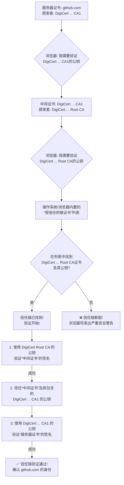

## 2.3 信任的根基：证书颁发机构 (CA) 与信任链

在上一节的“密码学之舞”中，我们目睹了TLS 1.3握手的高效与精妙。其中，服务器（鲍勃）向客户端（爱丽丝）出示`Certificate`（数字证书）的环节，是整个认证过程的核心。爱丽丝的浏览器对这份证书进行了一系列检查，然后满意地点了点头，亮起了地址栏的安全锁。

这一刻看似寻常，却蕴含着现代互联网运作中最深刻的哲学问题之一：**信任是如何在两个素未谋面的数字实体之间凭空产生的？**

爱丽丝的浏览器凭什么相信鲍勃发来的那份文件就真的是`google.com`的“数字身份证”，而不是某个天才骗子马洛里伪造的精美赝品？如果这份信任的建立过程本身就不可靠，那么我们耗费巨大心力构建的保密性和完整性大厦，都将瞬间崩塌。

这一节，我们将深入到整个TLS安全体系的基岩之下，去探寻那块支撑起一切的、名为“信任”的奠基石。我们将解构数字证书的内在构造，并揭示浏览器是如何通过一个遍布全球、层层授权的信任体系，来做出“相信”或“不信”这个至关重要的判断。

---

### 核心内容一：什么是数字证书？网站的“数字护照”

**1. 问题背景：数字世界的身份难题**

想象一下，在一个没有政府、没有警察、任何人都可以声称自己是任何人的“数字西部”，你要如何证明你就是你？你创建一个网站，域名是`mybank.com`。你如何向成千上万的访问者证明，你就是`mybank.com`的唯一合法运营者，而不是一个搭建了钓鱼网站、企图窃取他们密码的罪犯？

你可以简单地在网站上放一张图片，写着“我是官方网站”。但这毫无意义，因为任何骗子都能复制这张图片。你需要的是一种无法被伪造、无法被冒用，且其真实性能被任何陌生人独立验证的身份凭证。

现实世界中，我们早就解决了这个问题。当你出国时，你出示的不是一张自己打印的、写着“我是本国公民”的纸条，而是一本由国家政府颁发的**护照**。这本护照之所以被全世界的海关官员信任，不是因为你的照片拍得有多逼真，而是因为它具备几个关键要素：

-   **权威签发机构**：它是由一个公认的权威实体（你的国家政府）签发的。
-   **标准化格式**：它遵循国际标准，包含了你的姓名、国籍、照片等关键信息。
-   **防伪技术**：它使用了水印、特殊油墨、芯片等复杂技术，使其极难伪造。
-   **可验证性**：海关官员拥有识别这些防伪特征，甚至联网查询其有效性的能力。

**2. 解决方案：X.509 数字证书**

数字证书，特别是遵循 **X.509 标准**的证书，就是网站在数字世界里的“护照”。它不是一个简单的文本文件，而是一个结构化、标准化的数据容器，其核心使命就是**将一个公钥与一个特定的身份（比如一个域名）进行可信的绑定**。

让我们打开一本“数字护照”，看看里面都记录了些什么关键信息：

-   **主题 (Subject)**：这本“护照”是颁发给谁的。对于网站证书，这里最重要的信息就是**通用名称 (Common Name, CN)** 或 **主题备用名称 (Subject Alternative Name, SAN)**，其中包含了该证书适用的域名，例如 `www.example.com` 或 `*.example.com`。浏览器会严格校验这个字段是否与你正在访问的地址匹配。
-   **颁发者 (Issuer)**：这本“护照”是由哪个权威机构签发的。例如，`DigiCert`、`Let's Encrypt` 或 `GlobalSign`。这个字段指明了为该证书信誉背书的“政府”。
-   **有效期 (Validity Period)**：包含了“生效日期 (Not Before)”和“失效日期 (Not After)”。任何“过期”或“尚未生效”的护照都会被视为无效。
-   **公钥 (Public Key)**：这是证书最重要的“资产”。它记录了属于“主题”的那个公钥。在TLS握手中，服务器正是用与此公钥配对的私钥来完成`CertificateVerify`签名，从而证明自己是这个公钥的合法持有者。
-   **序列号 (Serial Number)**：由颁发机构指定的、在此机构内唯一的证书编号，如同护照号码，主要用于管理和吊销。
-   **签名算法 (Signature Algorithm)**：颁发者使用哪种算法来为这张证书签名的。
-   **数字签名 (Digital Signature)**：**这是整本“护照”的灵魂，是其无法被伪造的根本原因。**

这个“数字签名”是如何制作和验证的呢？这正是密码学的魅力所在：

1.  **制作签名（由CA完成）**：
    a. 证书颁发机构 (CA) 会将证书中除签名外的所有信息（主题、公钥、有效期等）打包在一起。
    b. CA 使用一个哈希函数（如 SHA-256）对这包数据进行运算，生成一个简短、唯一的“摘要”（像是指纹）。
    c. CA 使用它自己**私有的、绝不外泄的签名私钥**，对这个“摘要”进行加密或签名运算。
    d. 这个经过运算的摘要，就是附加在证书末尾的“数字签名”。

2.  **验证签名（由你的浏览器完成）**：
    a. 你的浏览器收到证书后，会把证书的数字签名部分先单独拿出来。
    b. 它使用证书中声明的同一个哈希函数，对证书的其余部分也计算出一个“摘要 A”。
    c. 浏览器需要获取签发该证书的CA的**公钥**（后文将解释如何安全地获取）。
    d. 浏览器使用CA的公钥，对证书的“数字签名”和之前计算出的“摘要 A”进行密码学验证。
    e. **如果验证成功，则代表“摘要 A”与签名匹配。** 这从数学上证明了，该签名确实是由对应的CA私钥针对原始证书内容生成的。

**3. 关键影响：信任的转移**

这个验证过程的逻辑是无懈可击的。因为只有CA的私钥才能制作出能被其公钥成功验证的签名，所以只要签名验证通过，浏览器就能百分之百确定：

-   这份证书的内容（包括域名和与之绑定的公钥）自签发以来，**一字未改**（完整性）。
-   这份证书确实是由它所声称的那个CA**亲笔签发**的（认证）。

至此，一个关键的转变发生了：**我们对一个陌生网站的信任问题，被巧妙地转化为了对证书颁发机构 (CA) 的信任问题。** 我不需要直接信任`mybank.com`，我只需要信任签发它证书的那个CA。只要我相信这个CA是诚实和严谨的，那么我就能相信由它担保的一切。

但这又引出了下一个更深层次的问题：我们有成百上千个CA，我的浏览器又凭什么去信任它们呢？

---

### 核心内容二：信任链 (Chain of Trust) - 构建全球信任体系

**1. 问题背景：信任的锚点在哪里？**

如果`mybank.com`的证书是由“Intermediate CA X”签发的，我需要信任“Intermediate CA X”。但“Intermediate CA X”本身也是一个数字实体，它的身份也需要被证明。它的证书可能是由“Root CA Y”签发的。那我又为什么要信任“Root CA Y”呢？这个问题如果无限追问下去，就会陷入一个“谁来监督监督者”的死循环。信任，必须有一个终极的、无需再被证明的起点。这个起点，我们称之为**信任锚 (Trust Anchor)**。

**2. 解决方案：预置的根证书与信任链**

这个问题的解决方案，既是技术上的，也是社会工程学上的。这个全球信任体系是这样构建的：

-   **根证书颁发机构 (Root CA)**：
    *   在整个体系的顶端，存在着一小群被全球广泛认可的、信誉卓著的组织，它们就是 Root CA。例如 DigiCert, Comodo, GlobalSign 等。
    *   成为 Root CA 的门槛极高，需要通过严格的第三方审计（如 WebTrust），满足一系列苛刻的安全、运营和财务标准。
    *   Root CA 的证书非常特殊：**它们是自我签名的 (Self-Signed)**。也就是说，它的“颁发者”和“主题”是同一个。它自己为自己担保，它就是信任的终极源头。
    *   **关键一步**：这些 Root CA 的公钥（包含在它们的自签名证书里），被**预先内置**到你的操作系统（Windows, macOS, Linux）或浏览器（Firefox）中。当你安装系统或浏览器时，一个“受信任的根证书颁发机构”列表就已经存在于你的设备里了。这就是信任的锚点！

-   **中间证书颁发机构 (Intermediate CA)**：
    *   出于安全考虑，Root CA 极少直接为最终的网站签发证书。它们的私钥被看得比生命还重要，通常存储在离线的、物理隔离的硬件安全模块 (HSM) 中。
    *   Root CA 会授权一些下级的 CA，即 Intermediate CA，去代为处理日常的证书签发业务。
    *   Root CA 会用自己的私钥，为这些 Intermediate CA 签发证书。这意味着，Root CA 用自己的终极信誉，为它的“下属”们进行了背书。

现在，当你的浏览器收到一个网站的证书时，一场精彩的“信任溯源”之旅就开始了。

**图解信任链的验证路径**

让我们用 `github.com` 的例子来描绘这个过程。当你的浏览器连接 `https://github.com` 时，它收到的通常不是一张证书，而是一个**证书链 (Certificate Chain)**，它可能看起来像这样：

1.  **服务器证书 (Server/Leaf Certificate)**:
    *   **主题**: `github.com`
    *   **颁发者**: `DigiCert TLS RSA SHA256 2020 CA1` (一个中间CA)

2.  **中间证书 (Intermediate Certificate)**:
    *   **主题**: `DigiCert TLS RSA SHA256 2020 CA1`
    *   **颁发者**: `DigiCert High Assurance EV Root CA` (一个根CA)

浏览器会像一个严谨的侦探，从链的底端开始，逐级向上验证：

**3. 关键影响：可扩展的、分层级的全球信任网络**

信任链机制的建立，是整个互联网安全能够商业化和全球化的基石。

-   **问题**：如何在一个去中心化的互联网上，建立一个中心化的、可管理的信任体系，并让全球数十亿设备都能自动接入？
-   **解决方案**：通过在操作系统和浏览器中预置一小部分根证书作为信任锚，并建立一个从根到中间再到叶子证书的、可追溯的签名链条。
-   **影响**：它创造了一个可扩展的、分层级的公钥基础设施 (Public Key Infrastructure, PKI)。任何网站，无论大小，都可以向这个体系中的某个成员申请身份认证，并最终将自己的信任关系链接到那个被数十亿设备共同信任的“根”上。这就是为什么你可以在地球的任何一个角落，安全地访问一个位于地球另一端的、你从未听说过的电商网站。

---

### 核心内容三：证书吊销 (Certificate Revocation) - 信任的“紧急刹车”

**1. 问题背景：当信任被打破**

护照有有效期，但如果在有效期内，护照丢失或被盗了呢？政府需要一个机制来宣布这本护照立即作废，即使它表面上看起来一切正常。

同样，数字证书也面临着严峻的挑战。如果一个网站的私钥因为服务器被黑而泄露，那么攻击者就可以利用这个私钥和与之配对的、仍然在有效期内的证书，去搭建一个完美的假冒网站，进行中间人攻击。证书的有效期通常是几个月甚至一年，我们不能等它自然过期。我们需要一个“紧急刹车”系统，来即时地吊销一个已被破坏的证书。

**2. 解决方案：CRL 与 OCSP**

为了解决这个问题，人们先后设计了两种主要的机制：

**A. 证书吊销列表 (Certificate Revocation List, CRL)**

-   **工作原理**：CA 会维护一个不断更新的列表，上面记录了所有已被吊销、但尚未过期的证书序列号。这个列表本身也由CA签名，以防篡改。浏览器在验证证书时，需要下载并检查这份CRL，确保正在验证的证书不在“黑名单”上。
-   **类比**：这就像是在海关的墙上贴了一张巨大的公告，上面写满了所有已作废的护照号码。海关官员在检查你的护照时，需要先在这张长长的列表上扫一遍。
-   **问题与影响**：
    *   **臃肿与延迟**：随着吊销的证书越来越多，CRL文件会变得异常庞大，下载耗时且消耗流量。而且，CA定期才发布一次新的CRL，在两次发布之间存在一个“窗口期”，这使得吊销不够实时。
    *   **失败模式的困境**：如果因为网络问题，浏览器无法下载到最新的CRL，它该怎么办？是选择“硬失败”（中断连接，影响可用性）还是“软失败”（放行连接，牺牲安全性）？这是一个两难的抉择。

**B. 在线证书状态协议 (Online Certificate Status Protocol, OCSP)**

-   **工作原理**：为了克服CRL的缺点，OCSP被设计出来。它提供了一种更轻量级的、实时的查询方式。浏览器不再需要下载整个“黑名单”，而是直接向CA的一个专门的OCSP服务器发送一个查询请求：“请问，序列号为 XYZ 的这张证书，现在状态还好吗？” OCSP服务器会回复一个经过CA签名的、包含“良好 (Good)”、“已吊销 (Revoked)”或“未知 (Unknown)”状态的响应。
-   **类比**：这相当于海关官员不再去看墙上的大公告，而是打一个专线电话到护照管理中心，直接报出护照号码进行查询。
-   **问题与影响**：
    *   **性能瓶颈**：这在TLS握手过程中增加了一次额外的网络请求，可能会拖慢页面加载速度。如果OCSP服务器响应缓慢或宕机，同样会影响网站的可用性。
    *   **隐私泄露**：浏览器每访问一个HTTPS网站，就要向该网站证书的CA去查询一次。这等于向CA暴露了用户的完整浏览历史。

为了解决OCSP的这些问题，一种名为 **OCSP Stapling (OCSP装订)** 的优化方案应运而生。它让**网站服务器**自己去定期向CA查询其证书的OCSP状态，并将这个带有时间戳和CA签名的有效响应，“装订”在自己的证书旁边，在TLS握手时一并发送给浏览器。这样，浏览器就无需自己再去查询，既解决了性能问题，也保护了用户隐私。

---

### 案例分析：解剖地址栏“安全锁”背后的信任风暴

现在，让我们把所有知识点串联起来，看看当你访问一个像 `https://github.com` 这样的网站时，你的浏览器在背后都做了些什么，最终才心甘情愿地为你显示出那把令人安心的“小锁”。

1.  **连接与握手**：你的浏览器与 GitHub 服务器发起TLS 1.3握手。服务器在其`Server Flight`中，发回了它的证书链和OCSP Stapling响应。
2.  **信任链验证**：
    *   浏览器开始检查链的末端——GitHub的服务器证书。它看到该证书由 `DigiCert TLS RSA SHA256 2020 CA1` 签发。
    *   浏览器向上查找，发现服务器也提供了`DigiCert TLS RSA SHA256 2020 CA1`的中间证书。它看到这个中间证书是由 `DigiCert High Assurance EV Root CA` 签发的。
    *   浏览器到达了链的顶端。它在自己内置的“受信任的根证书颁发机构”列表中，查找 `DigiCert High Assurance EV Root CA`。
    *   **找到了！** 信任的锚点已经确立。
    *   浏览器开始向下验证。它使用内置的根证书公钥，验证了中间证书的签名。验证通过！现在，它完全信任这个中间CA及其公钥。
    *   接着，它使用刚刚确认的中间CA的公钥，验证了GitHub服务器证书的签名。验证再次通过！
3.  **证书内容校验**：
    *   浏览器检查服务器证书的“主题备用名称 (SAN)”字段，确认其中包含了 `github.com` 和 `www.github.com`。这与用户访问的地址匹配。
    *   浏览器检查证书的有效期，确认当前时间在“生效日期”和“失效日期”之间。
4.  **吊销状态检查**：
    *   浏览器检查服务器“装订”过来的OCSP响应。它验证该响应确实是由合法的OCSP服务器签发的，并且时间戳在有效期内。响应状态为“良好 (Good)”。
5.  **最终裁决**：
    *   所有检查——信任链、域名、有效期、吊销状态——全部通过。浏览器最终做出判断：与我对接的这个服务器，确确实实就是`github.com`的合法所有者。

至此，地址栏亮起安全锁，TLS握手的`CertificateVerify`步骤也得以顺利进行，加密通信的隧道才真正铺开。如果上述任何一个环节失败，你看到的将是那个令人生畏的、红色或黄色的安全警告页面，它在用最激烈的方式告诉你：“信任的根基，动摇了！”

---

### 总结与展望

在这一节中，我们深入了互联网信任体系的心脏。我们理解了：

-   **数字证书**是网站的“数字护照”，它通过**CA的数字签名**，将一个公钥和一个身份绑定在一起，解决了数字世界的身份证明难题。
-   **信任链**是一种精妙的、可追溯的授权机制。它通过在操作系统/浏览器中**预置根证书**作为信任锚，使得对任何网站的信任，最终都能追溯到一个全球公认的源头。
-   **证书吊销**机制（如CRL和OCSP）是信任体系的“安全阀”和“紧急刹车”，它确保了当一个证书的私钥泄露后，我们能够及时废除对它的信任。

我们建立了一个看似天衣无缝的全球信任网络。但这个网络也引发了新的、更深层次的思考：

我们将整个互联网的信任，都寄托在了这一小撮商业公司（Root CA）身上。**这种高度中心化的信任模型，是否本身就构成了一个巨大的风险点？** 如果一个根CA被黑客攻破，或者更糟，一个CA本身就心怀不轨，开始恶意签发证书，它是否就能以“上帝”之名，在互联网上畅通无阻地进行中间人攻击？

历史已经给出了肯定的答案（例如DigiNotar事件）。那么，社区又是如何通过技术手段，如“证书透明度 (Certificate Transparency)”等机制，来对这些“信任的源头”进行反向监督和制衡的呢？这便是我们探索信任体系时，将要面对的下一个激动人心的议题。